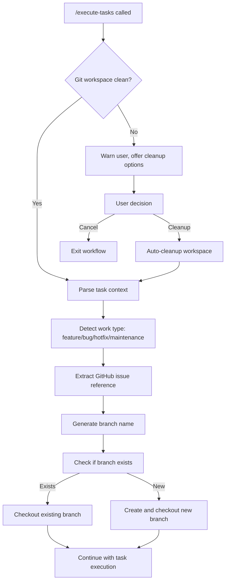

# Specification: Automatic Branch Creation for /execute-tasks

> Last Updated: 2025-08-30  
> Version: 1.0.0  
> Status: Draft  
> Author: AI-Augmented Development Team  

## Executive Summary

This specification defines an enhancement to the `/execute-tasks` command that automatically creates feature or bug branches before beginning task execution. This ensures clean development workflow, proper git hygiene, and seamless integration with GitHub issue tracking.

## Problem Statement

### Current Workflow Issues

1. **Manual Branch Management**: Developers must manually create branches before starting work
2. **Inconsistent Branch Naming**: No enforced naming conventions lead to scattered branch names
3. **Forgotten Branch Creation**: Work often starts on main branch, requiring later cleanup
4. **Poor Traceability**: Branch names don't consistently map to GitHub issues or task context
5. **Workflow Interruption**: Manual git operations break the flow of AI-augmented development

### Impact

- **Time Loss**: 2-5 minutes per task on manual branch management
- **Git Pollution**: Main branch accumulates direct commits
- **Review Complexity**: Unclear branch-to-issue mapping complicates PR reviews
- **Workflow Friction**: Manual steps interrupt AI development flow

## Proposed Solution

### Automatic Branch Creation System

Enhance the `/execute-tasks` command to automatically:

1. **Detect Task Context**: Parse task description, GitHub issue references, and work type
2. **Generate Branch Names**: Create semantic branch names following established conventions
3. **Create Branches**: Automatically create and checkout appropriate branches
4. **Validate Git State**: Ensure clean workspace before branch creation
5. **Integrate with Workflow**: Seamless integration with existing Agent OS workflow

### Key Features

- **Smart Detection**: Automatically determines if work is feature, bug, or maintenance
- **Convention Compliance**: Follows git-flow and GitHub best practices
- **Issue Integration**: Links branches to GitHub issues when available
- **Safety Checks**: Prevents branch creation on dirty workspaces
- **Override Options**: Allow manual branch specification when needed

## Technical Architecture

### Branch Creation Flow



### Integration Points

#### Agent OS Workflow Integration
- **Phase 0.5 Enhancement**: Insert branch creation after session detection
- **Pre-flight Checks**: Add git workspace validation
- **Task Context**: Leverage existing task parsing and issue detection
- **Git Integration**: Enhance Phase 4 with branch-aware commits

#### Branch Naming Convention System

```yaml
branch_patterns:
  feature:
    pattern: "feature/{issue-number}-{description}"
    example: "feature/123-metrics-collection-framework"
    
  bug:
    pattern: "bug/{issue-number}-{description}"  
    example: "bug/456-fix-dashboard-loading"
    
  hotfix:
    pattern: "hotfix/{issue-number}-{description}"
    example: "hotfix/789-critical-security-patch"
    
  maintenance:
    pattern: "maintenance/{description}"
    example: "maintenance/update-dependencies"
    
  enhancement:
    pattern: "enhancement/{issue-number}-{description}"
    example: "enhancement/234-improve-performance"
```

### Work Type Detection Algorithm

```python
def detect_work_type(task_description, issue_context):
    """
    Detect work type from task description and issue context.
    
    Returns: 'feature' | 'bug' | 'hotfix' | 'maintenance' | 'enhancement'
    """
    desc_lower = task_description.lower()
    
    # Priority-based detection
    if any(keyword in desc_lower for keyword in ['critical', 'urgent', 'security', 'hotfix']):
        return 'hotfix'
    
    if any(keyword in desc_lower for keyword in ['bug', 'fix', 'error', 'issue', 'broken']):
        return 'bug'
    
    if any(keyword in desc_lower for keyword in ['implement', 'create', 'add', 'new']):
        return 'feature'
    
    if any(keyword in desc_lower for keyword in ['improve', 'enhance', 'optimize', 'update']):
        return 'enhancement'
    
    if any(keyword in desc_lower for keyword in ['refactor', 'cleanup', 'maintenance', 'deps']):
        return 'maintenance'
    
    # Issue label detection
    if issue_context:
        labels = issue_context.get('labels', [])
        label_names = [label.lower() for label in labels]
        
        if 'bug' in label_names:
            return 'bug'
        if any(label in label_names for label in ['feature', 'enhancement']):
            return 'feature' if 'feature' in label_names else 'enhancement'
    
    # Default fallback
    return 'feature'
```

### Branch Name Generation

```python
def generate_branch_name(work_type, task_description, issue_number=None):
    """
    Generate semantic branch name based on work type and context.
    """
    # Clean and truncate description
    desc_words = task_description.lower().split()
    
    # Remove common stop words
    stop_words = {'the', 'a', 'an', 'and', 'or', 'but', 'in', 'on', 'at', 'to', 'for', 'of', 'with', 'by'}
    desc_words = [word for word in desc_words if word not in stop_words]
    
    # Convert to kebab-case and limit length
    description = '-'.join(desc_words[:4])  # Max 4 words
    description = re.sub(r'[^a-z0-9-]', '', description)
    
    # Build branch name
    if issue_number:
        return f"{work_type}/{issue_number}-{description}"
    else:
        return f"{work_type}/{description}"
```

### Git Workspace Validation

```bash
validate_git_workspace() {
    local workspace_status=""
    
    # Check if in git repository
    if ! git rev-parse --git-dir >/dev/null 2>&1; then
        echo "❌ Not in a git repository"
        return 1
    fi
    
    # Check for uncommitted changes
    if ! git diff --quiet || ! git diff --cached --quiet; then
        echo "⚠️  Uncommitted changes detected:"
        git status --porcelain
        return 2
    fi
    
    # Check for untracked files that might matter
    untracked=$(git ls-files --others --exclude-standard | grep -v -E '^\.(agent-os|claude)/' | wc -l)
    if [[ $untracked -gt 0 ]]; then
        echo "⚠️  Untracked files detected (excluding config):"
        git ls-files --others --exclude-standard | grep -v -E '^\.(agent-os|claude)/'
        return 3
    fi
    
    echo "✅ Git workspace clean"
    return 0
}
```

## Implementation Plan

### Phase 1: Core Branch Creation Logic (Week 1)

#### Task 1.1: Git Workspace Validation (3 hours)
- Implement `validate_git_workspace()` function
- Add workspace cleanup options (stash, commit, cancel)
- Integrate with Phase 0.5 session detection
- Create safety checks for dirty workspaces

#### Task 1.2: Work Type Detection (4 hours)
- Implement task description parsing algorithm
- Add GitHub issue label detection
- Create keyword-based classification system
- Build override mechanism for manual work type specification

#### Task 1.3: Branch Name Generation (3 hours)
- Implement semantic branch naming conventions
- Add description sanitization and truncation
- Create issue number extraction from task context
- Build branch name validation system

### Phase 2: Agent OS Integration (Week 1-2)

#### Task 2.1: Execute-Tasks Workflow Enhancement (5 hours)
- Modify Phase 0.5 to include branch creation
- Update session detection to validate git state
- Integrate branch creation with task context parsing
- Add progress logging and user feedback

#### Task 2.2: Configuration System (2 hours)
- Add branch creation preferences to Agent OS config
- Create per-project branch naming overrides
- Implement enable/disable toggles
- Add default branch protection settings

#### Task 2.3: Error Handling and Recovery (3 hours)
- Handle existing branch conflicts
- Add branch creation failure recovery
- Implement rollback mechanisms
- Create comprehensive error messaging

### Phase 3: Advanced Features (Week 2)

#### Task 3.1: Smart Branch Management (4 hours)
- Detect and switch to existing branches for same issue
- Implement branch cleanup after PR merge
- Add orphaned branch detection and cleanup
- Create branch synchronization with remote

#### Task 3.2: Integration Enhancements (3 hours)
- Link branches to GitHub issues automatically
- Add PR template population with branch context
- Implement branch protection rule compliance
- Create merge conflict prevention checks

#### Task 3.3: User Experience Improvements (3 hours)
- Add interactive branch name confirmation
- Create branch preview before creation
- Implement branch switching recommendations
- Add workflow status indicators

### Phase 4: Testing and Documentation (Week 2)

#### Task 4.1: Comprehensive Testing (4 hours)
- Unit tests for all branch creation functions
- Integration tests with Agent OS workflow
- End-to-end testing with GitHub integration
- Error scenario and edge case testing

#### Task 4.2: Documentation and Training (2 hours)
- Update Agent OS documentation with new workflow
- Create branch naming convention guide
- Add troubleshooting documentation
- Create migration guide for existing projects

## Configuration Options

### Global Configuration
```yaml
# ~/.agent-os/config/branch-creation.yml
auto_branch_creation:
  enabled: true
  enforce_clean_workspace: true
  default_work_type: 'feature'
  
branch_naming:
  issue_required: false
  max_description_words: 4
  use_kebab_case: true
  
conventions:
  feature_prefix: 'feature'
  bug_prefix: 'bug'  
  hotfix_prefix: 'hotfix'
  maintenance_prefix: 'maintenance'
  
workspace_validation:
  allow_untracked_config: true
  require_remote_sync: false
  stash_before_branch: 'ask'  # ask | always | never
```

### Project-Specific Overrides
```yaml
# .agent-os/project/branch-creation.yml  
branch_naming:
  patterns:
    feature: "feat/{issue}-{description}"
    bug: "fix/{issue}-{description}"
  
team_conventions:
  require_issue_numbers: true
  max_branch_name_length: 50
  forbidden_words: ['test', 'temp', 'wip']
```

### Command-Line Options
```bash
# Override work type
/execute-tasks "implement feature" --branch-type=enhancement

# Specify custom branch name
/execute-tasks "fix bug" --branch-name="custom-branch-name"

# Skip branch creation
/execute-tasks "quick fix" --no-branch

# Force branch creation on dirty workspace
/execute-tasks "urgent fix" --force-branch
```

## Success Metrics

### Developer Experience
- **Time Savings**: Reduce branch setup time by 90% (2-5 minutes → 10 seconds)
- **Consistency**: 100% compliance with branch naming conventions
- **Error Reduction**: 80% fewer "wrong branch" commits
- **Workflow Smoothness**: Zero manual git operations in standard workflow

### Code Quality
- **Branch Traceability**: 100% branch-to-issue mapping when issues exist
- **Clean History**: 95% reduction in direct main branch commits
- **PR Quality**: Improved PR descriptions with automatic branch context
- **Review Efficiency**: 30% faster code reviews with clear branch context

### Technical Metrics
- **Automation Success**: 99% successful automatic branch creation
- **Conflict Resolution**: Automated handling of 90% of branch conflicts
- **Performance**: Branch creation completes in <2 seconds
- **Reliability**: Zero workflow interruptions due to branch issues

## Risk Analysis

### Technical Risks

| Risk | Impact | Likelihood | Mitigation |
|------|--------|------------|------------|
| Git workspace corruption | High | Low | Comprehensive validation and rollback |
| Branch naming conflicts | Medium | Medium | Conflict detection and resolution |
| Integration breaking existing workflows | High | Low | Backward compatibility and feature flags |
| Performance degradation | Low | Low | Optimized git operations and caching |

### User Experience Risks

| Risk | Impact | Likelihood | Mitigation |
|------|--------|------------|------------|
| Unexpected branch creation | Medium | Medium | Clear messaging and confirmation |
| Branch name confusion | Low | Medium | Consistent conventions and preview |
| Workflow interruption | High | Low | Graceful error handling and recovery |
| Learning curve | Medium | High | Documentation and gradual rollout |

## Implementation Considerations

### Backward Compatibility
- **Feature Flag**: Controlled rollout with enable/disable option
- **Fallback Mode**: Graceful degradation to manual branch creation
- **Migration Path**: Smooth transition for existing projects
- **Legacy Support**: Continue supporting manual branch workflows

### Performance Optimizations
- **Git Operations**: Minimize git command execution
- **Caching**: Cache branch existence checks and issue lookups
- **Async Processing**: Background branch creation when possible
- **Batch Operations**: Combine multiple git operations

### Security Considerations
- **Branch Permissions**: Respect repository branch protection rules
- **Access Control**: Validate user permissions before branch creation
- **Sanitization**: Prevent injection attacks in branch names
- **Audit Trail**: Log all automatic branch operations

## Acceptance Criteria

### Core Functionality
- [ ] Automatic branch creation works for all task types
- [ ] Branch names follow established conventions consistently
- [ ] Git workspace validation prevents data loss
- [ ] Integration with existing Agent OS workflow is seamless
- [ ] Error handling covers all identified failure scenarios

### User Experience
- [ ] Branch creation is transparent and fast (<2 seconds)
- [ ] Clear feedback messages guide user through process
- [ ] Override options work for edge cases
- [ ] Documentation is comprehensive and accessible
- [ ] Migration from existing workflows is smooth

### Technical Requirements
- [ ] Zero breaking changes to existing `/execute-tasks` functionality
- [ ] Performance impact is negligible
- [ ] All code is covered by comprehensive tests
- [ ] Configuration system is flexible and extensible
- [ ] Integration with GitHub API is reliable

## Future Enhancements

### Version 2.0 Features
- **AI-Powered Branch Names**: Use LLM to generate better branch descriptions
- **Team Coordination**: Detect and prevent conflicting work on same issues
- **Branch Analytics**: Track branch lifecycle and developer productivity
- **Advanced Cleanup**: Automatic branch archival and cleanup policies

### Integration Opportunities
- **Linear Integration**: Support Linear issue tracking
- **Jira Integration**: Enterprise project management integration
- **Slack Notifications**: Team notifications for branch creation
- **VS Code Extension**: GUI integration for branch management

## Conclusion

This specification provides a comprehensive framework for automatic branch creation that will:

- **Eliminate Manual Git Operations**: Seamless branch creation integrated into AI workflow
- **Enforce Best Practices**: Consistent naming and git hygiene across all projects
- **Improve Traceability**: Clear mapping between branches, issues, and work items
- **Enhance Developer Experience**: Frictionless workflow with intelligent automation

The implementation will be backward compatible, performance-optimized, and thoroughly tested to ensure reliable operation across diverse development environments.

---

*Specification Version: 1.0.0*  
*Last Updated: 2025-08-30*  
*Status: Ready for Implementation*  
*Estimated Implementation Time: 2-3 weeks*