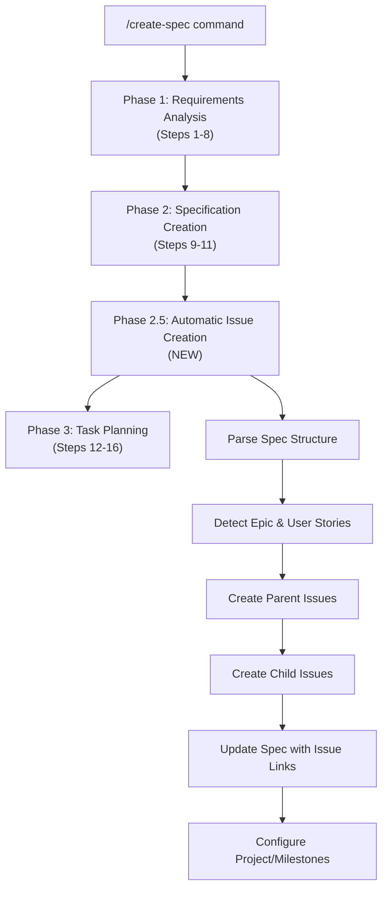

# Specification: Automatic Issue Creation for /create-spec Command

> Last Updated: 2025-08-30  
> Version: 1.0.0  
> Status: Draft  
> Author: AI-Augmented Development Team  

## Executive Summary

This specification defines an enhancement to the `/create-spec` command that automatically creates issues in linked ticketing systems (Linear, GitHub Issues) when specifications are generated. This ensures seamless integration between product planning and issue tracking, eliminating manual ticket creation overhead and maintaining perfect traceability between specifications and development work.

## Problem Statement

### Current Workflow Gaps

1. **Manual Issue Creation**: After creating specifications, teams must manually create corresponding issues in ticketing systems
2. **Inconsistent Linking**: Specifications and issues often lack proper cross-references
3. **Workflow Interruption**: Context switching between spec creation and issue management breaks flow
4. **Missing Traceability**: Poor mapping between spec sections and tracking tickets
5. **Duplicate Effort**: Information is entered twice (spec + issue) with potential inconsistencies

### Impact

- **Time Loss**: 5-10 minutes per spec on manual issue creation
- **Context Switching**: Breaks AI-augmented development flow
- **Tracking Gaps**: Missing or incomplete issue-to-spec mapping
- **Team Coordination**: Delayed handoff from product to development teams

## Proposed Solution

### Automatic Issue Creation System

Enhance the `/create-spec` command to automatically:

1. **Parse Specification Structure**: Extract epics, user stories, and tasks from generated specs
2. **Create Issue Hierarchy**: Generate parent-child issue relationships mirroring spec structure  
3. **Populate Issue Details**: Auto-fill titles, descriptions, labels, and acceptance criteria
4. **Link Bidirectionally**: Embed issue references in specs and spec references in issues
5. **Respect Team Configuration**: Use team-specific templates, assignees, and project settings

### Key Features

- **Vendor-Neutral Integration**: Support Linear MCP and GitHub Issues with extensible architecture
- **Smart Issue Detection**: Parse spec markdown to identify trackable work items
- **Hierarchical Mapping**: Epic → Parent Issue, User Stories → Child Issues, Tasks → Subtasks
- **Template System**: Configurable issue templates based on work type and team preferences
- **Bidirectional Linking**: Automatic cross-references between specs and issues

## Technical Architecture

### Enhanced /create-spec Workflow



### Integration Points

#### Current /create-spec Workflow Enhancement
The system will insert **Phase 2.5: Automatic Issue Creation** between Steps 11 and 12:

**Step 11**: Write comprehensive specification (existing)  
**Step 11.5**: **Parse specification for issue creation** (NEW)  
**Step 11.6**: **Create issues in configured ticketing system** (NEW)  
**Step 11.7**: **Update specification with issue references** (NEW)  
**Step 12**: Create detailed task breakdown (existing, now enhanced with issue links)

#### MCP Server Integration
```yaml
supported_ticketing_systems:
  linear:
    mcp_server: "linear"
    capabilities: [create_issue, update_issue, search_issues, add_comment]
    issue_types: [feature, bug, improvement, epic]
    
  github:
    mcp_server: "github" 
    capabilities: [create_issue, update_issue, list_issues, add_issue_comment]
    issue_types: [feature, bug, enhancement, epic]
```

### Issue Detection Algorithm

```python
def parse_specification_for_issues(spec_content: str) -> List[IssueSpec]:
    """
    Parse specification markdown to extract trackable work items.
    
    Returns: List of issues with hierarchy and metadata
    """
    issues = []
    current_epic = None
    
    # Parse specification sections
    sections = parse_markdown_sections(spec_content)
    
    for section in sections:
        # Detect epics (## level headers with "Epic" or high-level features)
        if section.level == 2 and is_epic_section(section):
            current_epic = IssueSpec(
                type='epic',
                title=extract_title(section.content),
                description=extract_description(section.content),
                acceptance_criteria=extract_acceptance_criteria(section.content),
                parent=None
            )
            issues.append(current_epic)
        
        # Detect user stories (### level headers with "User Story" or features)
        elif section.level == 3 and is_user_story(section):
            story = IssueSpec(
                type='feature',
                title=extract_title(section.content),
                description=extract_description(section.content),
                acceptance_criteria=extract_acceptance_criteria(section.content),
                parent=current_epic
            )
            issues.append(story)
        
        # Detect tasks (#### level or checklist items)
        elif section.level == 4 or has_task_checklist(section):
            tasks = extract_tasks(section.content)
            for task in tasks:
                task_issue = IssueSpec(
                    type='task',
                    title=task.title,
                    description=task.description,
                    acceptance_criteria=task.acceptance_criteria,
                    parent=current_epic or get_current_story()
                )
                issues.append(task_issue)
    
    return issues
```

### Issue Creation Service

```python
class AutomaticIssueCreator:
    def __init__(self, config: IssueCreationConfig):
        self.config = config
        self.ticketing_client = self._init_ticketing_client()
    
    def create_issues_from_spec(self, spec_path: str) -> List[CreatedIssue]:
        """Create issues from specification and return created issue details."""
        
        # Parse specification
        with open(spec_path, 'r') as f:
            spec_content = f.read()
        
        issues_to_create = parse_specification_for_issues(spec_content)
        created_issues = []
        
        # Create issues with hierarchy preservation
        epic_mapping = {}
        
        for issue_spec in issues_to_create:
            # Apply team templates
            issue_data = self._apply_team_template(issue_spec)
            
            # Create in ticketing system
            if issue_spec.type == 'epic':
                created_issue = self._create_epic(issue_data)
                epic_mapping[issue_spec.id] = created_issue
            else:
                parent_issue = epic_mapping.get(issue_spec.parent_id)
                created_issue = self._create_child_issue(issue_data, parent_issue)
            
            created_issues.append(created_issue)
        
        # Update specification with issue links
        self._update_spec_with_issue_links(spec_path, created_issues)
        
        return created_issues
    
    def _apply_team_template(self, issue_spec: IssueSpec) -> dict:
        """Apply team-specific templates and configurations."""
        template = self.config.get_template(issue_spec.type)
        
        return {
            'title': issue_spec.title,
            'description': template.format_description(issue_spec.description),
            'labels': template.labels + self._detect_labels(issue_spec),
            'assignee': template.default_assignee,
            'project': self.config.default_project,
            'priority': template.default_priority,
            'acceptance_criteria': issue_spec.acceptance_criteria
        }
```

### Configuration System

#### Team Configuration
```yaml
# ~/.agent-os/config/issue-creation.yml
automatic_issue_creation:
  enabled: true
  default_ticketing_system: 'linear'  # linear | github
  
ticketing_systems:
  linear:
    team_id: 'TEAM-123'
    default_project: 'Product Development'
    
  github:
    owner: 'FortiumPartners'
    repo: 'claude-config'
    
templates:
  epic:
    title_prefix: '[EPIC]'
    labels: ['epic', 'planning']
    default_assignee: '@product-owner'
    description_template: |
      ## Epic Description
      {description}
      
      ## Related Specification
      {spec_link}
      
      ## Acceptance Criteria
      {acceptance_criteria}
  
  feature:
    title_prefix: '[FEATURE]'
    labels: ['feature', 'development']  
    default_assignee: '@tech-lead'
    
  bug:
    title_prefix: '[BUG]'
    labels: ['bug', 'priority-high']
    default_assignee: '@developer'

issue_parsing:
  epic_keywords: ['Epic', 'Phase', 'Milestone']
  story_keywords: ['User Story', 'Feature', 'Capability']
  task_keywords: ['Task', 'TODO', 'Implementation']
```

#### Project-Specific Overrides
```yaml
# .agent-os/project/issue-creation.yml
team_overrides:
  assignees:
    epic: '@ldangelo'
    feature: '@dev-team'
    bug: '@qa-team'
  
  labels:
    additional: ['claude-config', 'ai-augmented']
    priority_mapping:
      high: 'P1'
      medium: 'P2' 
      low: 'P3'
```

## Implementation Plan

### Phase 1: Core Issue Creation (Week 1)

#### Task 1.1: Specification Parser (6 hours)
- Implement markdown parsing for issue detection
- Create IssueSpec data model with hierarchy support
- Build section analysis for epic/story/task detection
- Add acceptance criteria extraction

#### Task 1.2: MCP Integration Layer (8 hours)  
- Create vendor-neutral ticketing interface
- Implement Linear MCP integration
- Implement GitHub Issues MCP integration
- Add error handling and retry logic

#### Task 1.3: Issue Creation Service (6 hours)
- Build AutomaticIssueCreator service class
- Implement hierarchical issue creation
- Add bidirectional linking between specs and issues
- Create issue update and synchronization

### Phase 2: Template System (Week 1)

#### Task 2.1: Configuration Framework (4 hours)
- Design team configuration schema
- Implement project-specific override system
- Add configuration validation
- Create default template library

#### Task 2.2: Template Engine (5 hours)
- Build template application system
- Add dynamic label and assignee assignment
- Implement title prefix and formatting
- Create acceptance criteria templating

#### Task 2.3: Integration with /create-spec (3 hours)
- Modify Phase 2.5 in create-spec workflow
- Add issue creation toggle and configuration
- Implement progress reporting and user feedback
- Add rollback capability for failed creations

### Phase 3: Advanced Features (Week 2)

#### Task 3.1: Smart Issue Detection (4 hours)
- Enhance parsing for complex specifications
- Add machine learning-based section classification
- Implement work type detection (feature/bug/improvement)
- Add estimation and effort detection

#### Task 3.2: Project Management Integration (5 hours)
- Add milestone and sprint assignment
- Implement project board organization
- Add progress tracking and status updates
- Create team notification system

#### Task 3.3: Synchronization and Updates (3 hours)
- Implement bi-directional sync between specs and issues
- Add change detection and update propagation
- Create conflict resolution for manual changes
- Add audit trail and change history

### Phase 4: Testing and Documentation (Week 2)

#### Task 4.1: Comprehensive Testing (6 hours)
- Unit tests for parsing and issue creation
- Integration tests with Linear and GitHub
- End-to-end testing of enhanced /create-spec workflow
- Performance and reliability testing

#### Task 4.2: Documentation and Training (3 hours)
- Update /create-spec documentation with new Phase 2.5
- Create configuration guide and team setup
- Add troubleshooting documentation
- Create migration guide for existing workflows

## Usage Examples

### Basic Specification with Issue Creation

```bash
# Create spec with automatic issue creation enabled
/create-spec "implement user authentication system with OAuth integration"

# Output includes:
# ✅ Specification created: user-authentication-system.md
# 🎫 Creating issues in Linear...
# ✅ Epic created: [EPIC] User Authentication System (#AUTH-123)
# ✅ Feature created: [FEATURE] OAuth Integration (#AUTH-124)
# ✅ Feature created: [FEATURE] User Profile Management (#AUTH-125)
# ✅ Updated specification with issue references
```

### Generated Specification with Issue Links
```markdown
# Epic: User Authentication System

> **Linear Epic**: [AUTH-123](https://linear.app/team/issue/AUTH-123)
> **Estimated Effort**: 3 weeks
> **Assigned**: @product-team

## User Story 1: OAuth Integration

> **Linear Issue**: [AUTH-124](https://linear.app/team/issue/AUTH-124)
> **Parent Epic**: AUTH-123
> **Assigned**: @backend-team

### Acceptance Criteria
- [ ] Support Google OAuth 2.0 integration
- [ ] Support GitHub OAuth integration  
- [ ] Secure token storage and rotation
```

### Team Configuration Example

```bash
# Configure team preferences
echo "
automatic_issue_creation:
  enabled: true
  default_ticketing_system: 'linear'
  
templates:
  epic:
    labels: ['epic', 'product']
    default_assignee: '@ldangelo'
" > ~/.agent-os/config/issue-creation.yml
```

## Success Metrics

### Developer Experience
- **Time Savings**: Reduce issue creation time by 90% (5-10 minutes → 30 seconds)
- **Context Preservation**: Zero context switching between spec creation and issue management
- **Traceability**: 100% bidirectional linking between specs and issues
- **Workflow Integration**: Seamless integration with existing /create-spec workflow

### Team Coordination  
- **Planning Efficiency**: 50% faster transition from planning to development
- **Issue Quality**: Consistent issue format and acceptance criteria
- **Team Alignment**: Improved visibility and coordination across roles
- **Process Adoption**: 80% team adoption of integrated workflow

### Technical Metrics
- **Creation Success**: 99% successful automatic issue creation
- **Sync Accuracy**: 95% accuracy in spec-to-issue mapping
- **Performance**: Issue creation completes in <5 seconds
- **Reliability**: Zero workflow interruptions due to ticketing issues

## Risk Analysis

### Technical Risks

| Risk | Impact | Likelihood | Mitigation |
|------|--------|------------|------------|
| MCP server unavailability | High | Low | Graceful fallback to manual creation |
| API rate limiting | Medium | Medium | Request queuing and retry logic |
| Specification parsing errors | Medium | Medium | Robust error handling and user feedback |
| Issue creation failures | High | Low | Transaction rollback and recovery |

### User Experience Risks

| Risk | Impact | Likelihood | Mitigation |
|------|--------|------------|------------|
| Unwanted issue creation | Medium | Low | Configuration toggles and confirmation |
| Incorrect issue mapping | Medium | Medium | Preview mode and user validation |
| Template configuration errors | Low | Medium | Validation and default fallbacks |
| Integration complexity | Medium | Low | Comprehensive documentation and examples |

## Implementation Considerations

### Backward Compatibility
- **Feature Toggle**: Controlled rollout with enable/disable option
- **Fallback Mode**: Graceful degradation to existing /create-spec workflow
- **Configuration Migration**: Smooth upgrade path for existing configurations
- **Legacy Support**: Continue supporting manual issue workflows

### Performance Optimizations
- **Parallel Processing**: Create issues concurrently when possible
- **Caching**: Cache team configurations and templates
- **Batch Operations**: Minimize API calls through batching
- **Async Processing**: Background issue creation for large specifications

### Security Considerations  
- **API Key Management**: Secure storage and rotation of ticketing API keys
- **Access Control**: Respect team permissions and project access
- **Data Validation**: Sanitize all user input before API calls
- **Audit Trail**: Log all automatic issue operations

## Acceptance Criteria

### Core Functionality
- [ ] Automatic issue creation works for Linear and GitHub
- [ ] Specification parsing correctly identifies epics, stories, and tasks
- [ ] Hierarchical issue relationships are preserved
- [ ] Bidirectional linking between specs and issues functions correctly
- [ ] Team configuration system is flexible and extensible

### User Experience
- [ ] Issue creation is transparent and fast (<5 seconds)
- [ ] Clear progress feedback during creation process
- [ ] Configuration errors provide helpful guidance
- [ ] Documentation is comprehensive and accessible
- [ ] Migration from existing workflows is seamless

### Technical Requirements
- [ ] Zero breaking changes to existing /create-spec functionality
- [ ] Performance impact is negligible (<10% overhead)
- [ ] All code is covered by comprehensive tests
- [ ] Error handling covers all identified failure scenarios
- [ ] MCP integration is reliable and well-tested

## Future Enhancements

### Version 2.0 Features
- **AI-Powered Issue Titles**: Use LLM to generate better issue titles and descriptions
- **Cross-Team Coordination**: Detect and prevent duplicate work across teams
- **Issue Analytics**: Track issue lifecycle and team productivity metrics
- **Advanced Templates**: Dynamic templates based on project context

### Integration Opportunities
- **Jira Integration**: Enterprise project management support
- **Azure DevOps**: Microsoft ecosystem integration
- **Slack Notifications**: Team notifications for issue creation
- **VS Code Extension**: GUI integration for issue management

## Conclusion

This specification provides a comprehensive framework for automatic issue creation that will:

- **Eliminate Manual Overhead**: Seamless issue creation integrated into spec workflow
- **Ensure Perfect Traceability**: Bidirectional linking between specifications and issues  
- **Improve Team Coordination**: Faster handoff from product planning to development
- **Maintain Workflow Integrity**: Zero disruption to existing /create-spec functionality

The implementation will be vendor-neutral, performance-optimized, and thoroughly tested to ensure reliable operation across diverse team environments and ticketing systems.

---

*Specification Version: 1.0.0*  
*Last Updated: 2025-08-30*  
*Status: Ready for Implementation*  
*Estimated Implementation Time: 2 weeks*