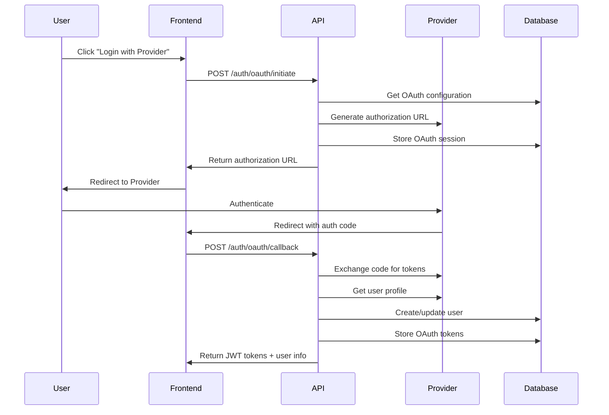

# OAuth 2.0 API Documentation

This document describes the OAuth 2.0 authentication API endpoints for the Fortium External Metrics Web Service.

## Overview

The service supports OAuth 2.0 authentication with the following providers:
- **Google Workspace** (OAuth 2.0 + OpenID Connect)
- **Microsoft Azure AD** (OAuth 2.0 + OpenID Connect)
- **Generic OIDC** (OpenID Connect providers like Okta, Auth0, etc.)

## Authentication Flow



## API Endpoints

### 1. Initiate OAuth Flow

**Endpoint:** `POST /api/auth/oauth/initiate`

Initiates the OAuth 2.0 authorization code flow.

#### Request Body

```json
{
  "provider": "google",
  "organization_slug": "company-name",
  "redirect_uri": "https://app.company.com/auth/callback" // Optional
}
```

#### Request Schema

```typescript
interface OAuthInitiateRequest {
  provider: 'google' | 'azure' | 'oidc';
  organization_slug: string;
  redirect_uri?: string; // Optional override
}
```

#### Response

```json
{
  "authorization_url": "https://accounts.google.com/o/oauth2/auth?client_id=...",
  "state": "secure-random-state",
  "provider": "google",
  "expires_in": 900,
  "timestamp": "2024-01-15T10:30:00Z"
}
```

#### Error Responses

- `400` - Validation failed
- `404` - Organization or provider not found
- `500` - Server error

### 2. Handle OAuth Callback

**Endpoint:** `POST /api/auth/oauth/callback`

Handles the OAuth callback and completes authentication.

#### Request Body

```json
{
  "code": "authorization_code_from_provider",
  "state": "secure-random-state",
  "provider": "google"
}
```

#### Response

```json
{
  "access_token": "jwt_access_token",
  "refresh_token": "jwt_refresh_token",
  "expires_in": 900,
  "token_type": "Bearer",
  "user": {
    "id": "user-uuid",
    "organization_id": "org-uuid",
    "email": "user@company.com",
    "name": "John Doe",
    "role": "developer",
    "oauth_provider": "google",
    "is_new_user": false
  },
  "timestamp": "2024-01-15T10:30:00Z"
}
```

#### Error Responses

- `400` - Invalid state or validation failed
- `401` - Authentication failed
- `500` - Server error

### 3. Configure OAuth Provider (Admin Only)

**Endpoint:** `POST /api/auth/oauth/config`

**Authentication:** Required (Admin/Owner role)

Configures an OAuth provider for the organization.

#### Request Body

```json
{
  "provider_name": "google",
  "provider_type": "oidc",
  "client_id": "your-client-id.apps.googleusercontent.com",
  "client_secret": "your-client-secret",
  "redirect_uri": "https://app.company.com/auth/callback",
  "scopes": ["openid", "email", "profile"],
  "additional_config": {
    "hosted_domain": "company.com"
  }
}
```

#### Provider-Specific Configurations

##### Google Workspace

```json
{
  "provider_name": "google",
  "provider_type": "oidc",
  "client_id": "123456789.apps.googleusercontent.com",
  "client_secret": "GOCSPX-abcdef...",
  "redirect_uri": "https://app.company.com/auth/oauth/google/callback",
  "scopes": ["openid", "email", "profile"],
  "additional_config": {
    "hosted_domain": "company.com", // Optional: restrict to G Suite domain
    "access_type": "offline",
    "include_granted_scopes": true
  }
}
```

##### Microsoft Azure AD

```json
{
  "provider_name": "azure",
  "provider_type": "oidc",
  "client_id": "12345678-1234-1234-1234-123456789012",
  "client_secret": "your-client-secret",
  "redirect_uri": "https://app.company.com/auth/oauth/azure/callback",
  "scopes": ["openid", "email", "profile", "User.Read"],
  "additional_config": {
    "tenant_id": "common", // or specific tenant ID
    "prompt": "select_account"
  }
}
```

##### Generic OIDC (e.g., Okta)

```json
{
  "provider_name": "okta",
  "provider_type": "oidc",
  "client_id": "your-okta-client-id",
  "client_secret": "your-okta-client-secret",
  "discovery_url": "https://dev-123456.okta.com/.well-known/openid_configuration",
  "redirect_uri": "https://app.company.com/auth/oauth/okta/callback",
  "scopes": ["openid", "email", "profile", "groups"],
  "additional_config": {
    "custom_claims_mapping": {
      "user_id": "sub",
      "email": "email",
      "name": "name"
    }
  }
}
```

#### Response

```json
{
  "config": {
    "id": "config-uuid",
    "provider_name": "google",
    "provider_type": "oidc",
    "client_id": "your-client-id",
    "redirect_uri": "https://app.company.com/auth/callback",
    "scopes": ["openid", "email", "profile"],
    "is_active": true,
    "created_at": "2024-01-15T10:30:00Z",
    "updated_at": "2024-01-15T10:30:00Z"
  },
  "test_result": {
    "success": true,
    "metadata": {
      "name": "Google",
      "display_name": "Google Workspace",
      "supports_refresh": true
    }
  },
  "timestamp": "2024-01-15T10:30:00Z"
}
```

### 4. List OAuth Providers

**Endpoint:** `GET /api/auth/oauth/providers/:organizationSlug`

Lists available OAuth providers for an organization.

#### Response

```json
{
  "providers": [
    {
      "provider_name": "google",
      "provider_type": "oidc",
      "is_active": true,
      "scopes": ["openid", "email", "profile"],
      "metadata": {
        "name": "Google",
        "display_name": "Google Workspace",
        "icon_url": "https://developers.google.com/identity/images/g-logo.png",
        "color": "#4285F4",
        "supports_refresh": true,
        "supports_revocation": true
      }
    }
  ],
  "timestamp": "2024-01-15T10:30:00Z"
}
```

### 5. Delete OAuth Configuration (Admin Only)

**Endpoint:** `DELETE /api/auth/oauth/config/:provider`

**Authentication:** Required (Admin/Owner role)

Deletes an OAuth provider configuration.

#### Response

```json
{
  "message": "OAuth provider configuration deleted successfully",
  "provider": "google",
  "timestamp": "2024-01-15T10:30:00Z"
}
```

## User Mapping and Provisioning

The service supports automatic user provisioning with configurable mapping rules.

### User Mapping Rules

Rules determine how OAuth users are mapped to internal roles and teams:

#### Rule Types

1. **email_domain** - Map by email domain
2. **group_membership** - Map by OAuth provider groups
3. **attribute_value** - Map by custom attribute values
4. **default** - Default fallback rule

#### Example Rules

```json
{
  "rule_type": "email_domain",
  "condition": {
    "domains": ["company.com", "partner.com"]
  },
  "target_role": "developer",
  "auto_create_user": true,
  "team_assignments": ["team-development"],
  "priority": 10
}
```

```json
{
  "rule_type": "group_membership",
  "condition": {
    "required_groups": ["admin", "managers"]
  },
  "target_role": "admin",
  "auto_create_user": true,
  "priority": 5
}
```

## Security Considerations

### PKCE (Proof Key for Code Exchange)

All OAuth flows use PKCE for enhanced security:
- Code verifiers are generated using cryptographically secure random values
- Code challenges use SHA256 hashing
- State parameters prevent CSRF attacks

### Token Security

- OAuth access tokens are encrypted before database storage
- Refresh tokens are encrypted and support rotation
- JWT tokens use secure signing algorithms
- Rate limiting prevents abuse

### Multi-tenant Isolation

- OAuth configurations are isolated per organization
- Row-level security (RLS) enforces data isolation
- Organization context is validated on all operations

## Error Handling

### Standard Error Format

```json
{
  "error": "Error description",
  "details": ["Validation error 1", "Validation error 2"],
  "timestamp": "2024-01-15T10:30:00Z"
}
```

### Common Error Codes

| Code | Description |
|------|-------------|
| 400 | Bad Request - Validation failed |
| 401 | Unauthorized - Authentication failed |
| 403 | Forbidden - Insufficient permissions |
| 404 | Not Found - Resource not found |
| 429 | Too Many Requests - Rate limited |
| 500 | Internal Server Error - Server error |

## Performance Specifications

All endpoints meet the following performance requirements:
- **Authentication response**: < 200ms for login/logout
- **SSO callback handling**: < 500ms end-to-end
- **Token validation**: < 10ms per request

## Rate Limiting

Authentication endpoints are rate limited:
- **Auth endpoints**: 5 requests per 15 minutes per IP+email
- **Refresh endpoints**: 10 requests per 15 minutes per IP
- **Config endpoints**: Standard API rate limits

## Webhook Integration

The service can optionally notify external systems of authentication events:

```json
{
  "event": "oauth_login_success",
  "user": {
    "id": "user-uuid",
    "email": "user@company.com",
    "provider": "google"
  },
  "organization_id": "org-uuid",
  "timestamp": "2024-01-15T10:30:00Z"
}
```

## Testing

### Unit Tests

Run OAuth unit tests:
```bash
npm run test:unit -- --testPathPattern=oauth
```

### Integration Tests

Run OAuth integration tests:
```bash
npm run test:integration -- --testPathPattern=oauth
```

### Manual Testing

Use the provided Postman collection or test with curl:

```bash
# Initiate OAuth flow
curl -X POST "http://localhost:3000/api/auth/oauth/initiate" \
  -H "Content-Type: application/json" \
  -d '{
    "provider": "google",
    "organization_slug": "test-org"
  }'
```

## Troubleshooting

### Common Issues

1. **"Provider not configured"**
   - Ensure OAuth configuration exists and is active
   - Check client ID and secret

2. **"Invalid or expired OAuth session"**
   - State parameter mismatch or session timeout
   - Check CSRF protection and session storage

3. **"User creation not allowed"**
   - No matching user mapping rule allows auto-creation
   - Configure appropriate mapping rules

### Debug Logging

Enable debug logging for OAuth operations:
```bash
DEBUG=oauth:* npm start
```

### Health Checks

Monitor OAuth provider connectivity:
```bash
curl "http://localhost:3000/api/health/oauth"
```