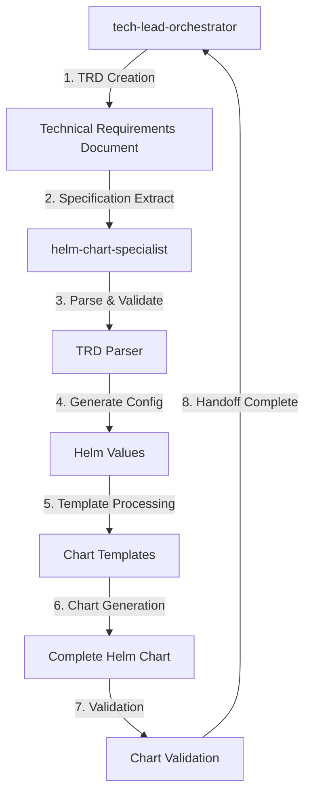

# Helm Chart Specialist - Tech Lead Orchestrator Handoff Protocol

## Overview

This document defines the integration protocol between the `tech-lead-orchestrator` and `helm-chart-specialist` agents. The protocol ensures seamless transfer of technical requirements and specifications for generating production-ready Helm charts.

## Protocol Version

- **Version**: 1.0.0
- **Last Updated**: 2025-01-09
- **Status**: Active

## Handoff Flow



## Integration Points

### 1. TRD Specification Format

The tech-lead-orchestrator provides TRD documents in the following format:

#### Required Sections

```markdown
# Technical Requirements Document (TRD)
## Project Name

**Version**: X.Y.Z  
**Date**: YYYY-MM-DD  
**Status**: Implementation Ready  

## Executive Summary
Brief project description, goals, and context.

## System Architecture
High-level component design and architecture patterns.

## Technical Components
Detailed component specifications including:
- Application type (web-application, api-service, microservice, etc.)
- Framework and language details
- Port configurations
- Health check endpoints

## Resource Requirements
Performance and scalability requirements:
- CPU and memory specifications
- Storage requirements
- Replica configurations
- Scaling parameters

## Security Requirements
Security specifications including:
- Authentication and authorization
- Network policies
- RBAC requirements
- Secret management
- TLS/SSL requirements

## Deployment Requirements
Deployment configuration:
- Environment specifications
- Service exposure (ClusterIP, LoadBalancer, Ingress)
- Deployment strategy (RollingUpdate, BlueGreen, Canary)
- Namespace and labeling

## Dependencies
Service dependencies and integrations:
- External services and APIs
- Database requirements
- Cache and queue systems
- Internal service dependencies

## Monitoring & Observability
Monitoring requirements:
- Metrics collection
- Health check configurations
- Alerting requirements
- Logging specifications

## Testing Strategy
Testing requirements and validation:
- Unit testing requirements
- Integration testing needs
- End-to-end testing specifications
- Performance testing requirements
```

#### Optional Sections

- **Compliance Requirements**: Regulatory and policy requirements
- **Performance Benchmarks**: Specific performance targets
- **Disaster Recovery**: Backup and recovery specifications
- **Migration Notes**: Existing system migration requirements

### 2. Handoff Data Structure

The helm-chart-specialist expects the following data structure from tech-lead-orchestrator:

```typescript
interface TRDHandoff {
  metadata: {
    project_name: string;
    version: string;
    description: string;
    environment: 'development' | 'staging' | 'production';
    namespace: string;
    generated_at: string;
  };
  
  application: {
    name: string;
    type: 'web-application' | 'api-service' | 'microservice' | 'backend' | 'frontend' | 'database';
    framework?: string;
    language?: string;
    port: number;
    health_endpoint: string;
    metrics_endpoint: string;
    startup_time: number;
    shutdown_time: number;
  };
  
  services: Array<{
    name: string;
    type: 'database' | 'cache' | 'queue' | 'external_api';
    port: number;
    required: boolean;
    chart?: string;
  }>;
  
  dependencies: {
    helm_dependencies: Array<{
      name: string;
      version: string;
      repository: string;
      condition?: string;
    }>;
    external_apis: Array<{
      name: string;
      type: string;
      required: boolean;
      auth_required: boolean;
    }>;
    internal_services: Array<{
      name: string;
      type: string;
      required: boolean;
    }>;
  };
  
  resources: {
    cpu: { requests: string; limits: string; };
    memory: { requests: string; limits: string; };
    storage: { enabled: boolean; size: string; class: string; };
    replicas: { min: number; max: number; default: number; };
  };
  
  security: {
    network_policies: boolean;
    rbac: boolean;
    service_account: boolean;
    security_context: {
      run_as_non_root: boolean;
      run_as_user: number;
      read_only_root_filesystem: boolean;
    };
    secrets: Array<{ name: string; type: string; }>;
    tls: { enabled: boolean; cert_manager: boolean; };
  };
  
  deployment: {
    strategy: 'RollingUpdate' | 'BlueGreen' | 'Canary';
    environment: string;
    namespace: string;
    ingress: {
      enabled: boolean;
      class: string;
      annotations: Record<string, string>;
    };
    service: {
      type: 'ClusterIP' | 'NodePort' | 'LoadBalancer';
      port: number;
    };
    autoscaling: {
      enabled: boolean;
      min_replicas: number;
      max_replicas: number;
      target_cpu: number;
    };
  };
  
  monitoring: {
    enabled: boolean;
    prometheus: boolean;
    grafana: boolean;
    alerts: boolean;
    metrics_endpoint: string;
    health_checks: {
      liveness: string;
      readiness: string;
      startup: string;
    };
  };
  
  testing: {
    enabled: boolean;
    unit_tests: boolean;
    integration_tests: boolean;
    e2e_tests: boolean;
    load_tests: boolean;
    security_tests: boolean;
    test_image: string;
  };
}
```

### 3. Handoff Methods

#### Method 1: File-Based Handoff (Primary)

1. **TRD File Creation**: tech-lead-orchestrator creates TRD file in `/docs/TRD/` directory
2. **Notification**: tech-lead-orchestrator signals helm-chart-specialist with file path
3. **Processing**: helm-chart-specialist parses TRD using TRD Parser
4. **Generation**: helm-chart-specialist generates Helm chart
5. **Validation**: Chart validation and testing
6. **Completion**: Handoff completion notification

#### Method 2: Direct Invocation (Secondary)

1. **Direct Call**: tech-lead-orchestrator directly invokes helm-chart-specialist
2. **Data Transfer**: TRD data passed as structured object
3. **Processing**: Immediate chart generation
4. **Return**: Generated chart returned to orchestrator

#### Method 3: Context Sharing (Advanced)

1. **Shared Context**: Both agents maintain shared context object
2. **Context Updates**: tech-lead-orchestrator updates context with TRD data
3. **Event Notification**: Context change events trigger chart generation
4. **Asynchronous Processing**: helm-chart-specialist processes updates asynchronously

## Shared Context Management

### Context Structure

```javascript
const sharedContext = {
  project: {
    id: 'project-uuid',
    name: 'project-name',
    version: '1.0.0',
    status: 'in-progress'
  },
  
  trd: {
    path: '/docs/TRD/project-trd.md',
    last_updated: '2025-01-09T10:00:00Z',
    parsed: false,
    specifications: null
  },
  
  chart: {
    generated: false,
    path: '/charts/generated/project-chart/',
    validated: false,
    errors: [],
    warnings: []
  },
  
  handoff: {
    initiated_at: '2025-01-09T09:30:00Z',
    completed_at: null,
    status: 'in-progress',
    phase: 'parsing',
    progress: 25
  }
};
```

### Context Operations

```javascript
// Update context
updateContext('trd.specifications', parsedTRD);

// Get context
const trdSpec = getContext('trd.specifications');

// Subscribe to context changes
subscribeToContext('chart.generated', onChartGenerated);

// Notify context changes
notifyContextChange('handoff.status', 'completed');
```

## Error Handling

### Error Categories

1. **TRD Parse Errors**: Invalid TRD format or missing required sections
2. **Specification Errors**: Invalid or incomplete specifications
3. **Template Errors**: Chart template generation failures
4. **Validation Errors**: Chart validation failures
5. **Integration Errors**: Communication or handoff failures

### Error Response Format

```json
{
  "error": {
    "code": "TRD_PARSE_ERROR",
    "message": "Failed to parse TRD: Missing required section 'System Architecture'",
    "details": {
      "file": "/docs/TRD/project-trd.md",
      "line": 0,
      "section": "system_architecture"
    },
    "timestamp": "2025-01-09T10:00:00Z",
    "recoverable": true,
    "suggestions": [
      "Add 'System Architecture' section to TRD",
      "Include application type specification",
      "Provide framework and language details"
    ]
  }
}
```

### Recovery Procedures

1. **Parse Errors**: Provide specific guidance for TRD corrections
2. **Specification Errors**: Suggest default values and best practices
3. **Template Errors**: Fallback to minimal chart templates
4. **Validation Errors**: Provide chart correction recommendations
5. **Integration Errors**: Retry with exponential backoff

## Quality Gates

### TRD Validation

- [ ] Required sections present
- [ ] Application specifications complete
- [ ] Resource requirements specified
- [ ] Security requirements defined
- [ ] Deployment configuration provided

### Chart Generation Validation

- [ ] Helm chart syntax valid
- [ ] Template rendering successful
- [ ] Values file complete
- [ ] Dependencies resolved
- [ ] Security standards met

### Integration Validation

- [ ] Handoff data complete
- [ ] Context synchronization successful
- [ ] Error handling functional
- [ ] Performance requirements met
- [ ] Documentation updated

## Performance Requirements

### Processing Time

- **TRD Parsing**: < 5 seconds for standard TRD files
- **Chart Generation**: < 30 seconds for standard applications
- **Template Processing**: < 10 seconds for template rendering
- **Validation**: < 15 seconds for comprehensive validation
- **Total Handoff Time**: < 60 seconds end-to-end

### Resource Usage

- **Memory**: < 256MB peak usage during processing
- **CPU**: < 500m sustained usage
- **Disk I/O**: Optimized for SSD storage
- **Network**: Minimal external calls for dependencies

## Security Considerations

### Data Protection

- TRD files may contain sensitive configuration data
- Implement secure temporary file handling
- Sanitize output to prevent information leakage
- Use secure communication channels for context sharing

### Access Control

- Validate agent authentication before handoff
- Implement role-based access for TRD data
- Audit all handoff operations
- Secure storage for generated charts

### Compliance

- Ensure generated charts meet security standards
- Implement compliance validation rules
- Generate audit trails for all operations
- Support regulatory requirements

## Monitoring and Observability

### Metrics Collection

```yaml
handoff_metrics:
  - handoff_duration_seconds
  - trd_parse_duration_seconds
  - chart_generation_duration_seconds
  - validation_duration_seconds
  - error_count_total
  - success_rate_percentage
```

### Logging Requirements

- Log all handoff operations with correlation IDs
- Include detailed error information for debugging
- Maintain performance metrics for optimization
- Generate audit logs for compliance

### Alerting

- Failed handoff operations
- Performance degradation
- Security violations
- Resource exhaustion

## Testing Strategy

### Unit Tests

- TRD parsing functionality
- Chart generation logic
- Template processing
- Validation rules
- Error handling

### Integration Tests

- End-to-end handoff flow
- Context management
- Error recovery
- Performance testing
- Security validation

### Test Data

Maintain comprehensive test TRD files covering:
- All application types
- Various configuration scenarios
- Edge cases and error conditions
- Performance stress tests
- Security validation cases

## Version Compatibility

### Supported Versions

- **tech-lead-orchestrator**: v2.0.0+
- **TRD Format**: v1.0.0+
- **Helm**: v3.0.0+
- **Kubernetes**: v1.20.0+

### Migration Strategy

- Backward compatibility for TRD format v1.x
- Graceful degradation for missing specifications
- Clear migration paths for protocol updates
- Versioned handoff interfaces

## Future Enhancements

### Planned Features

1. **Real-time Collaboration**: Live updates during TRD-to-chart conversion
2. **Advanced Templates**: AI-powered template generation
3. **Multi-Cloud Support**: Cloud-specific optimizations
4. **GitOps Integration**: Direct integration with GitOps workflows
5. **Visual Designer**: GUI for chart customization

### Experimental Features

1. **Machine Learning**: Pattern recognition for optimization
2. **Policy Engine**: Advanced policy enforcement
3. **Cost Optimization**: Resource usage optimization recommendations
4. **Dependency Analysis**: Automated dependency resolution

---

## Usage Examples

### Basic Handoff

```bash
# tech-lead-orchestrator creates TRD
echo "TRD created at: /docs/TRD/my-app-trd.md"

# helm-chart-specialist processes TRD
node charts/integration/trd-parser.js /docs/TRD/my-app-trd.md

# Generate Helm chart
helm-chart-specialist generate --trd /docs/TRD/my-app-trd.md --output /charts/my-app
```

### Programmatic Handoff

```javascript
const TRDParser = require('./charts/integration/trd-parser');
const parser = new TRDParser();

// Parse TRD
const trdSpec = await parser.parseTRD('/docs/TRD/my-app-trd.md');

// Generate Helm values
const helmValues = parser.generateHelmValues(trdSpec);

// Generate Chart.yaml
const chartYaml = parser.generateChartYaml(trdSpec);

console.log('Helm chart configuration generated successfully');
```

---

This handoff protocol ensures robust, secure, and efficient integration between the tech-lead-orchestrator and helm-chart-specialist agents, enabling automated generation of production-ready Helm charts from technical requirements.