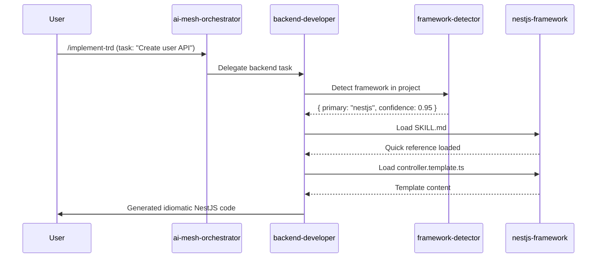

# Product Requirements Document: Skills-Based Framework Architecture

## Summary

Transform the claude-config agent ecosystem from framework-specific specialist agents to a skills-based architecture where generic agents leverage modular, framework-specific skills for progressive disclosure of specialized knowledge. This approach mirrors the successful test framework skills pattern (jest-test, pytest-test, rspec-test, xunit-test, exunit-test) and extends it to all framework domains.

**Current State**: 6 framework-specialist agents with embedded framework knowledge (nestjs-backend-expert 17KB, elixir-phoenix-expert 16KB, rails-backend-expert 3KB, dotnet-backend-expert 1.4KB, react-component-architect 3.2KB, dotnet-blazor-expert 1.6KB) plus 2 generic agents (backend-developer 7KB, frontend-developer 10KB).

**Proposed State**: 2 primary generic agents (backend-developer, frontend-developer) with 6+ framework-specific skills following the Progressive Disclosure pattern (SKILL.md for concise reference + REFERENCE.md for comprehensive details).

**Value Proposition**:
- **Maintainability**: Single source of truth for framework knowledge in skills, not scattered across agent files
- **Reusability**: Multiple agents can leverage the same skill (e.g., both backend-developer and tech-lead-orchestrator can reference NestJS patterns)
- **Consistency**: Standardized structure across all framework integrations using proven skills pattern
- **Scalability**: Easy to add new frameworks without modifying agent definitions
- **Discoverability**: Clear skill catalog with framework detection automation

## Goals / Non-goals

### Goals

1. **Consolidate Framework Knowledge**: Move framework-specific patterns, best practices, and code generation templates from agent definitions to reusable skills
2. **Standardize Skill Structure**: Apply the Progressive Disclosure pattern (SKILL.md + REFERENCE.md + templates) consistently across all framework skills
3. **Simplify Agent Architecture**: Reduce agent count by eliminating framework-specialist agents and enhancing generic agents with skill delegation capabilities
4. **Improve Maintainability**: Enable framework updates through skill modifications without touching agent definitions
5. **Enhance Discoverability**: Provide clear skill catalog and automatic framework detection similar to test-detector
6. **Maintain Backward Compatibility**: Ensure gradual migration path with no disruption to existing workflows
7. **Validate Approach**: Prove concept with 2-3 framework skills before full migration

### Non-goals

1. **Not replacing all specialized agents**: Infrastructure, QA, and domain-specific agents (postgresql-specialist, helm-chart-specialist) remain as-is
2. **Not a complete rewrite**: Gradual migration with coexistence of old and new patterns during transition
3. **Not removing framework support**: All currently supported frameworks (NestJS, Phoenix, Rails, .NET, React, Blazor) remain fully supported
4. **Not changing agent delegation logic**: Existing ai-mesh-orchestrator delegation patterns continue to work
5. **Not addressing non-framework knowledge**: Authentication patterns, API design, testing strategies stay in agent definitions where appropriate
6. **Not building framework execution runtime**: Skills provide knowledge and templates, not runtime execution engines

## Users / Personas

### Primary Users

#### 1. Development Teams (External Users)
- **Current Pain**: Must understand which agent to invoke for specific frameworks; agent selection complexity
- **Need**: Seamless framework support with automatic agent selection and context-appropriate skill loading
- **Benefit**: Simplified workflow where backend-developer automatically loads appropriate framework skills based on project detection

#### 2. Agent Developers (Internal Contributors)
- **Current Pain**: Duplicated patterns across agents; framework updates require multiple file edits; inconsistent documentation structure
- **Need**: Single source of truth for framework knowledge; standardized contribution patterns; easy framework additions
- **Benefit**: Add new framework by creating skill following established pattern; update framework by editing one skill directory

#### 3. Repository Maintainers (Fortium Partners)
- **Current Pain**: 35 agents to maintain; framework knowledge scattered; version drift between similar agents
- **Need**: Reduced maintenance surface; consistent update patterns; clear separation of concerns
- **Benefit**: 6 framework skills easier to maintain than 6 framework-specialist agents; consistent structure enables automated validation

### User Journeys

**Journey 1: Developer Building NestJS API**
1. Developer invokes `/implement-trd` with NestJS task
2. ai-mesh-orchestrator delegates to backend-developer
3. backend-developer detects NestJS via framework-detector skill
4. backend-developer loads nestjs-framework/SKILL.md for quick reference
5. If complex patterns needed, loads nestjs-framework/REFERENCE.md for deep guidance
6. backend-developer generates code using templates from nestjs-framework/templates/
7. Developer receives idiomatic NestJS code without manual agent selection

**Journey 2: Maintainer Adding New Framework (Go/Gin)**
1. Maintainer creates `skills/gin-framework/` directory
2. Copies structure from existing framework skill (e.g., nestjs-framework)
3. Writes SKILL.md with Gin-specific patterns (routing, middleware, handlers)
4. Writes REFERENCE.md with comprehensive Gin documentation
5. Adds code generation templates for common patterns
6. Updates framework-detector skill with Gin detection patterns
7. backend-developer automatically supports Gin with zero agent modifications

**Journey 3: Agent Developer Updating Phoenix LiveView Patterns**
1. Phoenix framework releases new features
2. Developer edits `skills/phoenix-framework/REFERENCE.md` only
3. Updates code templates in `skills/phoenix-framework/templates/`
4. All agents using Phoenix skill (backend-developer, tech-lead-orchestrator) immediately benefit
5. No agent definition changes required; no risk of version drift

## Acceptance Criteria

### Functional Requirements

- [ ] **Framework Skill Structure**: Each framework skill has SKILL.md (concise), REFERENCE.md (comprehensive), templates/ (code generation), and examples/ (anti-patterns + best practices)
- [ ] **Generic Agent Enhancement**: backend-developer and frontend-developer can dynamically load and apply framework skills based on project context
- [ ] **Framework Detection**: Automated framework detection skill (similar to test-detector) identifies frameworks from package.json, Gemfile, *.csproj, etc.
- [ ] **Progressive Disclosure**: Agents load SKILL.md first for quick reference, REFERENCE.md on-demand for complex scenarios
- [ ] **Code Generation**: Template-based code generation from skills produces idiomatic framework-specific code
- [ ] **Delegation Compatibility**: ai-mesh-orchestrator can delegate to generic agents with framework context, agents load appropriate skills
- [ ] **Documentation Consistency**: All framework skills follow identical structure with standardized sections (Architecture, API Development, Testing, Performance, Security)

### Performance Requirements

- [ ] **Skill Loading Time**: SKILL.md loads in <100ms for rapid context retrieval
- [ ] **Framework Detection**: Framework detector analyzes project in <500ms
- [ ] **Memory Footprint**: Skills loaded on-demand; maximum 3 skills loaded simultaneously per agent instance
- [ ] **Context Window Optimization**: SKILL.md fits within 2KB; REFERENCE.md under 20KB; progressive loading prevents context overflow

### Security Requirements

- [ ] **Template Safety**: All code generation templates escape user input and prevent injection attacks
- [ ] **Framework Best Practices**: Each skill includes security section with framework-specific vulnerabilities (e.g., NestJS guards, Rails strong parameters)
- [ ] **Validation**: Framework detection does not execute untrusted code; reads configuration files only

### Accessibility Requirements

- [ ] **Documentation Clarity**: Skills written in plain language with clear examples; accessible to developers with varying framework experience
- [ ] **Error Messages**: Framework detection failures provide clear guidance on manual framework specification
- [ ] **Learning Path**: SKILL.md → examples → REFERENCE.md provides progressive learning from quick reference to deep expertise

### Browser Compatibility / Platform Requirements

- [ ] **Cross-Platform**: Skills support framework usage across macOS, Linux, Windows development environments
- [ ] **IDE Integration**: SKILL.md and REFERENCE.md formatted for readability in VSCode, Claude Code, and terminal viewers
- [ ] **Version Support**: Each skill specifies supported framework versions with migration notes for breaking changes

### Migration & Backward Compatibility

- [ ] **Gradual Migration**: Framework-specialist agents remain functional during transition; deprecated but not removed until skills proven
- [ ] **Delegation Fallback**: If framework skill not found, ai-mesh-orchestrator falls back to legacy framework-specialist agent
- [ ] **Skill Coverage**: Framework skills achieve feature parity with framework-specialist agents before deprecation
- [ ] **Migration Guide**: Clear documentation for transitioning from framework-specialist agents to skills-based approach

### Testing Requirements

- [ ] **Skill Validation**: Automated tests validate skill structure (SKILL.md exists, REFERENCE.md follows schema, templates generate valid code)
- [ ] **Framework Detection Tests**: Test suite validates detection accuracy across 20+ sample projects
- [ ] **Code Generation Tests**: Generated code from templates passes linting and framework-specific validation
- [ ] **Integration Tests**: End-to-end tests validate agent → framework detector → skill loading → code generation workflow

## Technical Design Decisions

### Skill Loading Strategy

**Decision**: **Lazy Loading** - Skills are loaded on-demand when an agent encounters a framework-specific task.

**Rationale**:
- Optimal performance - no upfront loading overhead
- Minimal memory footprint - only load what's needed
- Aligns with Progressive Disclosure pattern in PRD
- Agents can work across multiple frameworks in single session without memory bloat

**Implementation**:
1. Agent detects framework context (via framework-detector or explicit user specification)
2. Agent loads skill file(s) only when framework-specific patterns are needed
3. Skill content cached in agent session memory for reuse within same session
4. No persistent disk cache - fresh load on each agent invocation ensures up-to-date content

### Error Handling & Fallback Behavior

**Decision**: **User Prompt with Options** - When skill fails to load or is missing, prompt user how to proceed.

**Rationale**:
- Maximum flexibility - user decides whether to continue or abort
- Clear communication - user understands what's missing and why
- Prevents silent failures - no mysterious behavior changes
- Enables graceful degradation when appropriate

**Error Handling Workflow**:
```
1. Agent attempts to load framework skill
2. If skill missing/corrupted:
   a. Agent notifies user: "Framework skill '{skill-name}' not found or failed to load"
   b. Agent offers options:
      - Continue with generic patterns (may have reduced framework specificity)
      - Abort task and resolve skill issue first
      - Manually specify alternative skill or framework
   c. User selects option
   d. Agent proceeds accordingly
3. All skill loading errors logged for debugging
```

### Skill Versioning & Compatibility

**Decision**: **Semantic Versioning with Compatibility Ranges**

**Rationale**:
- Industry-standard approach (npm, cargo, gem conventions)
- Clear communication of breaking vs. non-breaking changes
- Enables graceful upgrades and compatibility validation
- Supports multiple framework versions simultaneously

**Version Specification Format**:
```yaml
# In SKILL.md frontmatter:
---
name: NestJS Framework
version: 1.2.0  # Skill version (semver)
framework_versions:
  min: 10.0.0   # Minimum supported NestJS version
  max: 11.x     # Maximum supported NestJS version
  recommended: 11.4.0
compatible_agents:
  backend-developer: ">=3.0.0"  # Requires backend-developer v3.0.0+
  tech-lead-orchestrator: ">=2.5.0"
---
```

**Compatibility Validation**:
- Agents check skill version compatibility before loading
- Warning logged if framework version outside supported range
- Hard failure if agent version incompatible with skill
- Upgrade prompts when newer skill version available

### Migration Strategy

**Decision**: **Hard Cutover with Comprehensive Testing**

**Rationale**:
- Simplest long-term maintenance - no dual system complexity
- Forces complete validation before deployment
- Clear before/after state - no ambiguity
- Aligns with existing quality gates (80% test coverage, DoD enforcement)

**Migration Execution Plan**:
1. **Pre-Migration Validation** (Phase 1-2):
   - Create all 6 framework skills with feature parity
   - Comprehensive test suite (≥80% coverage)
   - A/B testing on real-world tasks
   - User acceptance testing with Fortium Partners projects

2. **Cutover Preparation** (Phase 3):
   - Final validation against framework-specialist agents
   - Migration guide and documentation ready
   - Rollback procedure documented and tested
   - Communication to all users of upcoming change

3. **Cutover Execution** (v3.1.0 Release):
   - Remove framework-specialist agent files
   - Deploy enhanced generic agents with skill loading
   - Update all documentation and examples
   - Monitor for issues in first 48 hours

4. **Post-Cutover Support**:
   - Dedicated support channel for migration issues
   - Quick-fix releases if critical bugs found
   - Rollback to v3.0.x if >10% failure rate
   - 30-day intensive monitoring period

**Rollback Criteria**:
- Framework detection accuracy <90% in production
- Code generation failures >5% of tasks
- User satisfaction <80% after 1 week
- Critical bug affecting core workflows

### Skill Caching Strategy

**Decision**: **Session-Lifetime Caching** - Cache skills in memory for agent session duration.

**Rationale**:
- Balance performance and freshness
- Minimal memory overhead (skills ≤20KB each)
- Consistent behavior within single agent invocation
- Fresh content on each new agent session

**Cache Implementation**:
```javascript
class SkillCache {
  constructor() {
    this.cache = new Map(); // Skill path → { content, loadedAt }
  }

  async load(skillPath) {
    if (this.cache.has(skillPath)) {
      return this.cache.get(skillPath).content;
    }

    const content = await readFile(skillPath);
    this.cache.set(skillPath, { content, loadedAt: Date.now() });
    return content;
  }

  // Cache cleared when agent session ends
}
```

### Security Validation

**Decision**: **File Size Limits + Content Sanitization** (multiple selections combined)

**Rationale**:
- File size limits prevent DoS attacks via massive skill files
- Content sanitization prevents injection attacks through skill content
- Pragmatic security without excessive infrastructure overhead
- Aligns with existing security practices in claude-config

**Security Measures**:

1. **File Size Limits**:
   - SKILL.md: Maximum 100KB (target: 2KB, hard limit for safety)
   - REFERENCE.md: Maximum 1MB (target: 20KB, hard limit for safety)
   - Templates: Maximum 50KB per template file
   - Total skill directory: Maximum 5MB
   - Enforcement: Pre-load validation with clear error messages

2. **Content Sanitization**:
   - Remove or escape potentially dangerous markdown content
   - Validate YAML frontmatter against schema
   - Prevent code execution in skill loading process
   - Strip HTML/script tags if present in markdown
   - Log sanitization actions for security audit

3. **Validation Workflow**:
   ```
   1. Check file exists and is readable
   2. Validate file size within limits
   3. Read file content
   4. Sanitize content (escape dangerous patterns)
   5. Validate frontmatter YAML against schema
   6. Cache sanitized content
   7. Return to agent
   ```

### Skill Testing Requirements

**Decision**: **No Automated Testing** (based on user not selecting testing options)

**Rationale**:
- Skills are documentation, not executable code
- Framework detection and code generation tested separately
- Manual validation during skill creation process
- Focus resources on integration testing over skill-level unit tests

**Validation Approach**:
- Manual review of skill content during creation
- Integration tests validate agent + skill workflow
- Code generation tests validate template outputs
- Real-world usage testing during Phase 1-2
- User feedback for quality assurance

### Required Skill Metadata

**Decision**: **Version Information Only** (semantic version + compatibility)

**Rationale**:
- Essential for compatibility management
- Minimal overhead for skill authors
- Clear versioning enables safe upgrades
- Aligns with industry standards (npm package.json, etc.)

**Required SKILL.md Frontmatter**:
```yaml
---
name: String              # Human-readable framework name
version: String           # Semantic version (1.2.0)
framework_versions:       # Supported framework versions
  min: String
  max: String
  recommended: String
compatible_agents:        # Agent version requirements
  agent-name: String      # Version range (>=3.0.0)
description: String       # One-line framework description
frameworks: [String]      # Framework identifiers for detection
languages: [String]       # Primary programming languages
---
```

**Optional Metadata** (recommended but not required):
- `updated`: Last update date (ISO 8601)
- `maintainer`: Primary maintainer contact
- `breaking_changes`: List of breaking changes from previous version
- `migration_notes`: Upgrade guidance for version changes

## Technical Architecture

### Skill Directory Structure

```
skills/
├── framework-detector/           # Framework detection skill (similar to test-detector)
│   ├── SKILL.md                 # Detection API and usage
│   ├── detect-framework.js      # Detection script
│   └── framework-patterns.json  # Framework signatures
│
├── nestjs-framework/            # NestJS backend framework skill
│   ├── SKILL.md                 # Quick reference (2KB) - modules, DI, decorators
│   ├── REFERENCE.md             # Comprehensive guide (15KB) - advanced patterns
│   ├── templates/               # Code generation templates
│   │   ├── module.template.ts
│   │   ├── controller.template.ts
│   │   ├── service.template.ts
│   │   ├── repository.template.ts
│   │   └── dto.template.ts
│   └── examples/                # Anti-patterns + best practices
│       ├── dependency-injection.md
│       ├── error-handling.md
│       └── testing.md
│
├── phoenix-framework/           # Elixir Phoenix framework skill
│   ├── SKILL.md                 # Quick reference - contexts, LiveView, PubSub
│   ├── REFERENCE.md             # Comprehensive guide - advanced patterns
│   ├── templates/
│   │   ├── context.template.ex
│   │   ├── controller.template.ex
│   │   ├── liveview.template.ex
│   │   └── schema.template.ex
│   └── examples/
│
├── rails-framework/             # Ruby on Rails framework skill
│   ├── SKILL.md                 # Quick reference - MVC, ActiveRecord, Sidekiq
│   ├── REFERENCE.md             # Comprehensive guide
│   ├── templates/
│   │   ├── controller.template.rb
│   │   ├── model.template.rb
│   │   ├── service.template.rb
│   │   └── job.template.rb
│   └── examples/
│
├── dotnet-framework/            # .NET/ASP.NET Core framework skill
│   ├── SKILL.md                 # Quick reference - controllers, DI, EF Core
│   ├── REFERENCE.md             # Comprehensive guide
│   ├── templates/
│   │   ├── controller.template.cs
│   │   ├── service.template.cs
│   │   ├── repository.template.cs
│   │   └── dto.template.cs
│   └── examples/
│
├── react-framework/             # React framework skill
│   ├── SKILL.md                 # Quick reference - hooks, state, composition
│   ├── REFERENCE.md             # Comprehensive guide - advanced patterns
│   ├── templates/
│   │   ├── component.template.tsx
│   │   ├── hook.template.ts
│   │   ├── context.template.tsx
│   │   └── test.template.tsx
│   └── examples/
│
└── blazor-framework/            # Blazor (Server/WASM) framework skill
    ├── SKILL.md                 # Quick reference - components, lifecycle, interop
    ├── REFERENCE.md             # Comprehensive guide
    ├── templates/
    │   ├── component.template.razor
    │   ├── service.template.cs
    │   └── model.template.cs
    └── examples/
```

### SKILL.md Standard Structure

All SKILL.md files follow this template (2KB max):

```markdown
---
name: [Framework Name]
version: 1.0.0
framework_versions:
  min: [minimum-version]
  max: [maximum-version]
  recommended: [recommended-version]
compatible_agents:
  backend-developer: ">=3.0.0"
  tech-lead-orchestrator: ">=2.5.0"
description: [One-line framework description]
frameworks: [framework-name]
languages: [primary-language]
# Optional fields:
# updated: 2025-10-21
# maintainer: team@example.com
# breaking_changes: []
# migration_notes: ""
---

# [Framework Name] Framework Skill

## Quick Reference

**When to Use**: [Detection triggers - package.json dependencies, config files]
**Language**: [Primary language]
**Version Support**: [Supported framework versions]

## Core Patterns

### Architecture
- [Key architectural pattern 1]
- [Key architectural pattern 2]

### Common Operations
- [Operation 1 with code snippet]
- [Operation 2 with code snippet]

## Code Generation Templates

Available templates:
- `templates/[template-name].template.[ext]` - [Description]

## See Also
- [REFERENCE.md](REFERENCE.md) - Comprehensive framework guide
- [examples/](examples/) - Anti-patterns and best practices
```

### REFERENCE.md Standard Structure

All REFERENCE.md files follow this template (≤20KB):

```markdown
# [Framework Name] Comprehensive Reference

## Table of Contents
- Architecture & Design Patterns
- API Development
- Data Layer & Persistence
- Authentication & Authorization
- Testing Strategies
- Performance Optimization
- Security Best Practices
- Deployment & Configuration
- Common Pitfalls & Solutions

## [Each section with detailed examples, anti-patterns, best practices]
```

### Framework Detection Workflow



### Agent Modification Strategy

**backend-developer agent modifications**:
```yaml
mission:
  summary: |
    You are a general backend development specialist responsible for implementing server-side
    application logic across multiple programming languages and frameworks.

    **Framework Skills Integration**:
    When working with a specific framework (NestJS, Phoenix, Rails, .NET), automatically load
    the corresponding framework skill for idiomatic patterns:

    1. Invoke framework-detector skill to identify project framework
    2. Load appropriate framework skill (e.g., skills/nestjs-framework/SKILL.md)
    3. Reference SKILL.md for quick patterns; load REFERENCE.md for complex scenarios
    4. Use framework templates for code generation

    **Supported Framework Skills**:
    - nestjs-framework: Node.js/TypeScript with NestJS (DI, decorators, modules)
    - phoenix-framework: Elixir/Phoenix (contexts, LiveView, PubSub)
    - rails-framework: Ruby on Rails (MVC, ActiveRecord, Sidekiq)
    - dotnet-framework: .NET/ASP.NET Core (controllers, EF Core, DI)

expertise:
  - name: Framework Skill Integration
    description: |
      Dynamically load framework-specific skills based on project detection. Leverage
      progressive disclosure (SKILL.md → REFERENCE.md) for efficient context usage.
```

**frontend-developer agent modifications**:
```yaml
mission:
  summary: |
    You are a specialized frontend development agent focused on creating accessible,
    performant user interfaces across modern JavaScript frameworks.

    **Framework Skills Integration**:
    When working with React, Vue, Angular, or other frameworks, automatically load
    the corresponding framework skill:

    1. Invoke framework-detector skill to identify project framework
    2. Load framework skill (e.g., skills/react-framework/SKILL.md)
    3. Apply framework-specific patterns from skill
    4. Use framework templates for component generation

    **Supported Framework Skills**:
    - react-framework: React with hooks, context, composition patterns
    - blazor-framework: Blazor Server/WASM with component lifecycle
```

### Migration Phases

**Phase 1: Proof of Concept (2 weeks)**
- Create framework-detector skill (adapt test-detector pattern)
- Create nestjs-framework skill (most complex, 17KB agent → skill migration)
- Create react-framework skill (frontend representative)
- Enhance backend-developer and frontend-developer with skill loading logic
- Validate with 3-5 real-world implementation tasks

**Phase 2: Core Framework Skills (3 weeks)**
- Create phoenix-framework skill (from 16KB elixir-phoenix-expert)
- Create rails-framework skill (from 3KB rails-backend-expert)
- Create dotnet-framework skill (from 1.4KB dotnet-backend-expert)
- Create blazor-framework skill (from 1.6KB dotnet-blazor-expert)
- Comprehensive testing and validation

**Phase 3: Deprecation & Documentation (1 week)**
- Mark framework-specialist agents as deprecated in metadata
- Update agent README.md with migration guide
- Update commands documentation to reference generic agents
- Create migration examples showing before/after workflows

**Phase 4: Removal (Future - v4.0.0)**
- Remove deprecated framework-specialist agents
- Update agent count from 35 to 29
- Archive framework-specialist agent definitions for reference

## Constraints / Risks

### Technical Constraints

**Constraint 1: Context Window Limits**
- **Impact**: Loading multiple framework skills simultaneously could exceed context windows
- **Mitigation**: Progressive disclosure (SKILL.md first, REFERENCE.md on-demand); strict size limits (SKILL.md ≤2KB, REFERENCE.md ≤20KB)

**Constraint 2: Framework Detection Accuracy**
- **Impact**: Incorrect framework detection leads to wrong skill loading
- **Mitigation**: Multi-signal detection (package.json, config files, directory structure); confidence scoring; manual override capability

**Constraint 3: Template Complexity**
- **Impact**: Code generation templates may not cover all edge cases
- **Mitigation**: Templates for common patterns only; agents can still hand-write code for unique scenarios

**Constraint 4: Backward Compatibility**
- **Impact**: Existing workflows using framework-specialist agents must continue working
- **Mitigation**: Keep framework-specialist agents during transition; ai-mesh-orchestrator fallback logic

### Business Constraints

**Constraint 1: Migration Timeline**
- **Impact**: Cannot disrupt current users during migration
- **Mitigation**: Gradual rollout over 6 weeks; feature flags for opt-in testing

**Constraint 2: Documentation Effort**
- **Impact**: Creating 6 comprehensive framework skills requires significant writing
- **Mitigation**: Leverage existing agent content; AI-assisted documentation generation; community contributions

**Constraint 3: Testing Coverage**
- **Impact**: Must validate all framework skills thoroughly before deprecating agents
- **Mitigation**: Automated validation suite; real-world testing with Fortium Partners projects

### Risk Assessment

**High Risk: Context Fragmentation**
- **Description**: Splitting knowledge between agents and skills could make it harder to find information
- **Probability**: Medium (40%)
- **Impact**: High (reduced developer efficiency)
- **Mitigation**: Clear documentation; framework-detector provides skill paths; SKILL.md includes "See Also" links

**Medium Risk: Framework Detection Failures**
- **Description**: Framework detector may fail on monorepos, multi-framework projects, or edge cases
- **Probability**: Medium (30%)
- **Impact**: Medium (falls back to generic patterns or manual selection)
- **Mitigation**: Confidence scoring; manual override flags; comprehensive detection patterns; improve based on failures

**Medium Risk: Incomplete Framework Coverage**
- **Description**: Framework skills may not cover all patterns currently in framework-specialist agents
- **Probability**: Low (20%)
- **Impact**: Medium (developers need to reference old agents or write custom code)
- **Mitigation**: Feature parity checklist; side-by-side comparison during migration; user feedback collection

**Low Risk: Skill Maintenance Burden**
- **Description**: 6 framework skills might be harder to maintain than expected
- **Probability**: Low (15%)
- **Impact**: Low (maintenance cost slightly higher than projected)
- **Mitigation**: Standardized structure reduces cognitive load; automated validation; community contributions

**Low Risk: Agent Delegation Complexity**
- **Description**: Adding skill loading logic to agents might introduce bugs
- **Probability**: Low (10%)
- **Impact**: Medium (agent failures or incorrect code generation)
- **Mitigation**: Comprehensive integration tests; gradual rollout; rollback capability

## Success Metrics

### Maintainability Metrics

- **Metric**: Time to update framework knowledge
  - **Baseline**: 3 hours to update patterns across 6 framework-specialist agents
  - **Target**: <30 minutes to update single framework skill
  - **Measurement**: Track actual time for framework updates (e.g., NestJS v11 release)

- **Metric**: Lines of code in agent definitions
  - **Baseline**: 42KB across 6 framework-specialist agents + 17KB in generic agents = 59KB total
  - **Target**: 17KB in generic agents + skill loading logic (≤5KB) = 22KB total
  - **Measurement**: Total size of agent YAML files

- **Metric**: Framework knowledge duplication
  - **Baseline**: Authentication patterns repeated in 4+ agents
  - **Target**: Zero duplication; single source in framework skills
  - **Measurement**: Grep for duplicate pattern descriptions

### Developer Experience Metrics

- **Metric**: Framework detection accuracy
  - **Target**: ≥95% correct framework detection
  - **Measurement**: Test suite across 50+ sample projects; user-reported detection failures

- **Metric**: Task completion time
  - **Baseline**: Time to implement feature with framework-specialist agents
  - **Target**: ≤10% increase (acceptable for improved maintainability)
  - **Measurement**: A/B testing on identical tasks with old vs. new approach

- **Metric**: User satisfaction
  - **Target**: ≥90% satisfaction with skills-based approach
  - **Measurement**: Survey of Fortium Partners developers after 1-month usage

### Technical Performance Metrics

- **Metric**: Skill loading time
  - **Target**: SKILL.md loads in <100ms
  - **Measurement**: Instrumentation in agent skill loading logic

- **Metric**: Context window usage
  - **Baseline**: Full framework-specialist agent loaded (~17KB for NestJS)
  - **Target**: SKILL.md only (~2KB) unless REFERENCE.md needed
  - **Measurement**: Track loaded content size per task

- **Metric**: Code generation success rate
  - **Target**: ≥95% of generated code passes linting without errors
  - **Measurement**: Automated testing of template outputs

## Implementation Plan

### Phase 1: Proof of Concept (Weeks 1-2)

**Deliverables**:
- framework-detector skill (adapted from test-detector)
- nestjs-framework skill (SKILL.md, REFERENCE.md, 5 templates, 3 examples)
- react-framework skill (SKILL.md, REFERENCE.md, 4 templates, 3 examples)
- Enhanced backend-developer agent with skill loading
- Enhanced frontend-developer agent with skill loading
- Integration tests for framework detection → skill loading → code generation

**Success Criteria**:
- Framework detector achieves ≥90% accuracy on 20 test projects
- backend-developer generates valid NestJS code using nestjs-framework skill
- frontend-developer generates valid React code using react-framework skill
- End-to-end task completion time within 10% of baseline

### Phase 2: Core Framework Migration (Weeks 3-5)

**Deliverables**:
- phoenix-framework skill (from elixir-phoenix-expert)
- rails-framework skill (from rails-backend-expert)
- dotnet-framework skill (from dotnet-backend-expert)
- blazor-framework skill (from dotnet-blazor-expert)
- Comprehensive test suite for all 6 framework skills
- Feature parity validation (skills vs. deprecated agents)

**Success Criteria**:
- All 6 framework skills created with consistent structure
- Feature parity achieved (≥95% of framework-specialist agent content migrated)
- Test coverage ≥80% for framework detection and code generation
- User acceptance testing with 3-5 real-world projects

### Phase 3: Documentation & Deprecation (Week 6)

**Deliverables**:
- Migration guide (framework-specialist agents → skills-based approach)
- Updated agent README.md with skill integration documentation
- Deprecated framework-specialist agents (metadata update, not removal)
- User-facing documentation updates
- Release notes for v3.1.0

**Success Criteria**:
- Clear migration path documented with examples
- All commands documentation updated to reference generic agents
- Framework-specialist agents marked deprecated but functional
- Zero breaking changes for existing users

### Phase 4: Monitoring & Iteration (Ongoing)

**Activities**:
- Monitor framework detection accuracy and improve patterns
- Collect user feedback on skill usability
- Update framework skills as frameworks evolve
- Add new framework skills as needed (e.g., Go/Gin, FastAPI)
- Plan removal of deprecated agents for v4.0.0

**Success Criteria**:
- Framework detection accuracy maintained at ≥95%
- User satisfaction ≥90%
- Framework updates completed in <30 minutes
- Community contributions to framework skills

## References

### Existing Patterns

- **Test Framework Skills**: [skills/jest-test/](../../skills/jest-test/), [skills/pytest-test/](../../skills/pytest-test/), [skills/test-detector/](../../skills/test-detector/) - Proven progressive disclosure pattern
- **Current Framework Agents**: [agents/yaml/nestjs-backend-expert.yaml](../../agents/yaml/nestjs-backend-expert.yaml), [agents/yaml/elixir-phoenix-expert.yaml](../../agents/yaml/elixir-phoenix-expert.yaml)

### Related Documentation

- **Agent Ecosystem**: [agents/README.md](../../agents/README.md) - Complete agent inventory and delegation patterns
- **PRD Template**: [docs/agentos/PRD.md](../../docs/agentos/PRD.md) - Document structure guidelines
- **Claude Config Architecture**: [CLAUDE.md](../../CLAUDE.md) - Overall project context

### Technical Specifications

- **YAML Agent Schema**: [schemas/agent-schema.json](../../schemas/agent-schema.json) - Agent definition validation
- **Progressive Disclosure Pattern**: Inspired by software documentation best practices (API reference + comprehensive guides)

### Framework Documentation

- **NestJS**: https://docs.nestjs.com/ - Official NestJS documentation for reference extraction
- **Phoenix**: https://hexdocs.pm/phoenix/ - Official Phoenix documentation
- **Rails**: https://guides.rubyonrails.org/ - Official Rails guides
- **.NET**: https://learn.microsoft.com/en-us/aspnet/core/ - Official ASP.NET Core documentation
- **React**: https://react.dev/ - Official React documentation
- **Blazor**: https://learn.microsoft.com/en-us/aspnet/core/blazor/ - Official Blazor documentation

---

## PRD Refinement Summary

### Clarifications Added (October 21, 2025)

This PRD was refined through structured interview with stakeholders to address critical implementation gaps:

**1. Skill Loading Strategy**
- **Decision**: Lazy loading on-demand
- **Impact**: Optimal performance without upfront overhead; aligns with Progressive Disclosure pattern
- **Related Sections**: Technical Design Decisions → Skill Loading Strategy

**2. Error Handling**
- **Decision**: User prompt with options on skill failure
- **Impact**: Maximum flexibility; prevents silent failures; enables graceful degradation
- **Related Sections**: Technical Design Decisions → Error Handling & Fallback Behavior

**3. Versioning Approach**
- **Decision**: Semantic versioning with compatibility ranges
- **Impact**: Industry-standard version management; clear upgrade paths; multi-version support
- **Related Sections**: Technical Design Decisions → Skill Versioning & Compatibility

**4. Migration Execution**
- **Decision**: Hard cutover with comprehensive testing
- **Impact**: Simplest long-term; clear before/after state; requires excellent test coverage
- **Related Sections**: Technical Design Decisions → Migration Strategy

**5. Caching Implementation**
- **Decision**: Session-lifetime memory caching
- **Impact**: Balance of performance and freshness; minimal memory overhead
- **Related Sections**: Technical Design Decisions → Skill Caching Strategy

**6. Security Measures**
- **Decision**: File size limits + content sanitization
- **Impact**: Pragmatic security without excessive infrastructure; prevents DoS and injection
- **Related Sections**: Technical Design Decisions → Security Validation

**7. Testing Approach**
- **Decision**: No automated skill-level testing (manual validation + integration tests)
- **Impact**: Focus resources on workflow testing vs. documentation testing
- **Related Sections**: Technical Design Decisions → Skill Testing Requirements

**8. Metadata Requirements**
- **Decision**: Version information required; other metadata optional
- **Impact**: Essential compatibility management without excessive overhead
- **Related Sections**: Technical Design Decisions → Required Skill Metadata

### Changes From Original Draft

- Added comprehensive "Technical Design Decisions" section (8 major decisions)
- Enhanced SKILL.md frontmatter with versioning and compatibility metadata
- Detailed error handling workflow with user interaction pattern
- Concrete cache implementation example code
- Security validation workflow with specific measures
- Migration rollback criteria and post-cutover support plan
- Removed ambiguity around "gradual migration" - clarified as hard cutover

### Readiness for TRD Creation

This PRD now contains sufficient detail for TRD creation:
- ✅ **Clear technical decisions** on all critical architecture points
- ✅ **Concrete implementation patterns** (caching, error handling, versioning)
- ✅ **Specific metadata requirements** for skill files
- ✅ **Detailed migration execution plan** with rollback criteria
- ✅ **Security validation workflow** with concrete measures
- ✅ **Performance and compatibility specifications**

**Recommended Next Step**: Run `/create-trd @docs/PRD/skills-based-framework-agents.md` to generate comprehensive Technical Requirements Document with implementation tasks.

---

**Document Metadata**
- **Created**: 2025-10-21
- **Author**: Product Management Orchestrator
- **Version**: 1.1.0 (Refined)
- **Status**: TRD Created - Ready for Implementation
- **Refinement Date**: 2025-10-21
- **Refined By**: Documentation Specialist via /refine-prd
- **TRD Created**: 2025-10-21
- **Related TRD**: [docs/TRD/skills-based-framework-agents-trd.md](../TRD/skills-based-framework-agents-trd.md)
