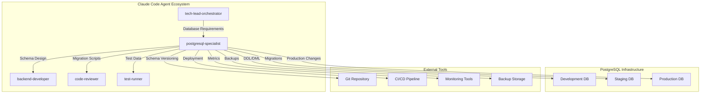

# PostgreSQL Specialist Agent - Product Requirements Document (PRD)

**Document Version**: 1.0  
**Created**: 2025-01-09  
**Status**: Draft  
**Owner**: Fortium AI-Augmented Development Team  

## Executive Summary

The PostgreSQL Specialist Agent is a specialized database management subagent designed to handle PostgreSQL administration, SQL optimization, and schema management with deep integration into the Claude Code agent ecosystem. This agent will serve as the authoritative expert for PostgreSQL-specific operations while coordinating seamlessly with the tech-lead-orchestrator for comprehensive database-driven application development workflows.

## Problem Statement

### Current Challenges

1. **Fragmented Database Operations**: Database design, optimization, and maintenance tasks are scattered across multiple generalist agents, leading to inconsistent approaches and suboptimal solutions
2. **Limited PostgreSQL Expertise**: General-purpose agents lack deep PostgreSQL-specific knowledge for advanced features like partitioning, advanced indexing strategies, and performance tuning
3. **Poor Schema Evolution**: Database migrations are often treated as afterthoughts, leading to deployment failures and data integrity issues
4. **Disconnected Workflows**: Database operations are not well-coordinated with application development, causing delays and integration problems
5. **Security Gaps**: Database security configurations often lack PostgreSQL-specific best practices for RBAC and row-level security
6. **Performance Blind Spots**: Query optimization and performance monitoring are reactive rather than proactive

### Business Impact

- **Development Velocity**: 25-40% of backend development time is spent on database-related tasks
- **Production Issues**: 30% of application performance problems stem from database optimization issues
- **Security Risks**: Inadequate database security practices expose applications to data breaches
- **Operational Overhead**: Manual database operations increase deployment risk and maintenance burden

## Product Vision

Create a PostgreSQL specialist agent that serves as the definitive database expert within the Claude Code ecosystem, enabling:

- **Accelerated Development**: Reduce database-related development time by 50%
- **Proactive Optimization**: Implement performance best practices from the design phase
- **Seamless Integration**: Coordinate database operations with application development workflows
- **Operational Excellence**: Ensure database reliability, security, and maintainability

## User Personas

### Primary Users

#### 1. Backend Developers
**Profile**: Application developers working with PostgreSQL-backed applications
**Goals**:
- Efficient database schema design aligned with application requirements
- Optimized queries and ORM integration
- Reliable database migrations and version control
- Performance troubleshooting and optimization

**Pain Points**:
- Limited PostgreSQL expertise for complex operations
- Time-consuming manual query optimization
- Migration failures in production environments
- Difficulty coordinating database changes with application deployments

#### 2. Database Administrators (DBAs)
**Profile**: Database professionals responsible for PostgreSQL infrastructure
**Goals**:
- Automated database maintenance and monitoring
- Consistent security and compliance implementation
- Efficient backup and disaster recovery planning
- Performance optimization and capacity planning

**Pain Points**:
- Manual repetitive administrative tasks
- Inconsistent database configurations across environments
- Reactive performance troubleshooting
- Complex multi-environment database management

#### 3. DevOps Engineers
**Profile**: Infrastructure professionals managing database deployments
**Goals**:
- Automated database deployment pipelines
- Consistent environment provisioning
- Reliable migration execution
- Integration with monitoring and alerting systems

**Pain Points**:
- Complex database deployment coordination
- Manual migration validation processes
- Environment configuration drift
- Limited database-specific deployment expertise

### Secondary Users

#### 4. Data Engineers
**Profile**: Professionals working with data pipelines and analytics
**Goals**:
- Efficient data modeling for analytics workloads
- Optimized ETL/ELT processes
- Data warehouse design and maintenance
- Performance optimization for analytical queries

**Pain Points**:
- Complex analytical query optimization
- Data pipeline reliability issues
- Inconsistent data modeling practices

## Goals and Non-Goals

### Goals

#### Core Functionality
- **G1**: Provide expert PostgreSQL database design and schema management capabilities
- **G2**: Implement comprehensive SQL query optimization and performance tuning
- **G3**: Manage database migrations with rollback capabilities and safety checks
- **G4**: Integrate seamlessly with tech-lead-orchestrator for coordinated development workflows
- **G5**: Implement PostgreSQL security best practices including RBAC and row-level security
- **G6**: Provide proactive performance monitoring and optimization recommendations
- **G7**: Support multi-environment database management (dev/staging/prod)
- **G8**: Enable automated backup, recovery, and disaster recovery planning

#### Integration and Workflow
- **G9**: Establish clear handoff protocols with tech-lead-orchestrator and backend-developer agents
- **G10**: Coordinate with deployment workflows for schema migrations
- **G11**: Integrate with monitoring and alerting systems for database health
- **G12**: Support version control workflows for database schema changes

#### Quality and Performance
- **G13**: Achieve 50% reduction in database-related development time
- **G14**: Implement proactive performance optimization reducing query response times by 30%
- **G15**: Ensure 99.9% migration success rate across environments
- **G16**: Maintain comprehensive documentation and knowledge sharing

### Non-Goals

#### Out of Scope
- **NG1**: Support for other database systems (MySQL, MongoDB, etc.)
- **NG2**: Business intelligence or data visualization capabilities
- **NG3**: Application-level caching strategies (handled by backend-developer agents)
- **NG4**: Infrastructure provisioning (handled by DevOps workflows)
- **NG5**: Real-time streaming data processing
- **NG6**: ETL tool selection and configuration (data engineering domain)

## Acceptance Criteria

### Functional Requirements

#### F1: Database Design and Schema Management
- [ ] **F1.1**: Generate optimized PostgreSQL schema designs from application requirements
- [ ] **F1.2**: Create and manage database tables, indexes, constraints, and relationships
- [ ] **F1.3**: Implement PostgreSQL-specific features (JSONB, arrays, custom types, etc.)
- [ ] **F1.4**: Design partitioning strategies for large tables
- [ ] **F1.5**: Create and manage database views, functions, and stored procedures
- [ ] **F1.6**: Implement database-level business rules and constraints
- [ ] **F1.7**: Design efficient indexing strategies for query patterns

#### F2: SQL Query Optimization and Performance Tuning
- [ ] **F2.1**: Analyze and optimize SQL query performance using EXPLAIN/EXPLAIN ANALYZE
- [ ] **F2.2**: Identify and recommend index optimizations for slow queries
- [ ] **F2.3**: Optimize PostgreSQL configuration parameters for specific workloads
- [ ] **F2.4**: Implement query caching and materialized view strategies
- [ ] **F2.5**: Provide query rewriting recommendations for better performance
- [ ] **F2.6**: Monitor and alert on performance degradation patterns
- [ ] **F2.7**: Generate performance reports and optimization recommendations

#### F3: Database Migration Management
- [ ] **F3.1**: Create forward and backward migration scripts with safety checks
- [ ] **F3.2**: Validate migration scripts against schema constraints
- [ ] **F3.3**: Execute migrations with rollback capabilities
- [ ] **F3.4**: Support zero-downtime migration strategies
- [ ] **F3.5**: Version control integration for migration tracking
- [ ] **F3.6**: Cross-environment migration validation and testing
- [ ] **F3.7**: Generate migration documentation and change logs

#### F4: Security and Access Control
- [ ] **F4.1**: Implement role-based access control (RBAC) policies
- [ ] **F4.2**: Configure row-level security (RLS) policies
- [ ] **F4.3**: Manage database user accounts and permissions
- [ ] **F4.4**: Implement secure connection configurations (SSL/TLS)
- [ ] **F4.5**: Audit and monitor database access patterns
- [ ] **F4.6**: Encrypt sensitive data columns using PostgreSQL encryption
- [ ] **F4.7**: Implement compliance requirements (GDPR, HIPAA, etc.)

#### F5: Backup and Recovery
- [ ] **F5.1**: Design and implement automated backup strategies
- [ ] **F5.2**: Create point-in-time recovery (PITR) configurations
- [ ] **F5.3**: Test backup integrity and restoration procedures
- [ ] **F5.4**: Implement cross-region backup replication
- [ ] **F5.5**: Create disaster recovery runbooks and procedures
- [ ] **F5.6**: Monitor backup success and alert on failures
- [ ] **F5.7**: Automate recovery testing and validation

### Non-Functional Requirements

#### NF1: Performance Requirements
- [ ] **NF1.1**: Database operations must complete within 5 seconds for typical schemas (≤100 tables)
- [ ] **NF1.2**: Query optimization analysis must complete within 10 seconds for complex queries
- [ ] **NF1.3**: Migration validation must complete within 2 minutes for schemas with ≤1000 tables
- [ ] **NF1.4**: Schema generation must handle databases with up to 10,000 tables efficiently

#### NF2: Reliability Requirements
- [ ] **NF2.1**: Migration success rate must be ≥99.9% across all environments
- [ ] **NF2.2**: Database operations must have comprehensive error handling and recovery
- [ ] **NF2.3**: All database modifications must be transactional with rollback capabilities
- [ ] **NF2.4**: Agent must maintain state consistency across multi-step operations

#### NF3: Security Requirements
- [ ] **NF3.1**: All database connections must use encrypted connections (SSL/TLS)
- [ ] **NF3.2**: Database credentials must be stored securely using environment variables or secret management
- [ ] **NF3.3**: All database operations must be logged for audit purposes
- [ ] **NF3.4**: Agent must validate SQL injection prevention in generated queries

#### NF4: Integration Requirements
- [ ] **NF4.1**: Seamless handoff protocols with tech-lead-orchestrator within 1 second
- [ ] **NF4.2**: Coordination with backend-developer agents for ORM integration
- [ ] **NF4.3**: Integration with CI/CD pipelines for automated migration deployment
- [ ] **NF4.4**: Support for multiple PostgreSQL versions (12, 13, 14, 15, 16)

## Technical Architecture

### System Context

### Component Architecture

#### Core Components

1. **Schema Manager**
   - Table and index design
   - Constraint management
   - Partitioning strategies
   - Custom type definitions

2. **Query Optimizer**
   - Query analysis engine
   - Performance profiling
   - Index recommendation system
   - Configuration tuning

3. **Migration Engine**
   - Migration script generation
   - Version control integration
   - Rollback management
   - Safety validation

4. **Security Manager**
   - RBAC policy engine
   - Row-level security configuration
   - Access control validation
   - Audit logging

5. **Performance Monitor**
   - Query performance tracking
   - Resource usage monitoring
   - Alert management
   - Optimization recommendations

6. **Backup Controller**
   - Backup strategy management
   - Recovery procedures
   - Testing automation
   - Disaster recovery planning

### Integration Points

#### With tech-lead-orchestrator
- **Handoff Protocol**: Receive application requirements and data modeling needs
- **Context Sharing**: Share database schema decisions and performance constraints
- **Task Coordination**: Coordinate database design with application architecture decisions
- **Quality Gates**: Validate database design against application requirements

#### With backend-developer Agents
- **ORM Integration**: Coordinate schema design with ORM requirements (Rails ActiveRecord, Django ORM, etc.)
- **API Design**: Ensure database schema supports efficient API endpoints
- **Performance Coordination**: Share query optimization insights for application code
- **Testing Integration**: Provide test data and schema setup for development

#### With CI/CD and Deployment
- **Migration Deployment**: Integrate migration execution into deployment pipelines
- **Environment Management**: Coordinate schema changes across development environments
- **Rollback Procedures**: Provide automated rollback capabilities for failed deployments
- **Health Checks**: Integrate database health checks into deployment validation

## Success Metrics

### Primary Metrics

#### Development Efficiency
- **Database Task Completion Time**: Reduce by 50% (baseline: measure current time for schema design, migration creation, optimization tasks)
- **Migration Success Rate**: Achieve ≥99.9% success rate across all environments
- **Schema Design Quality**: Zero schema-related production issues per sprint
- **Query Performance**: 30% improvement in average query response times

#### Integration Effectiveness
- **Handoff Efficiency**: Complete tech-lead-orchestrator handoffs within 1 second
- **Workflow Coordination**: 100% of database changes coordinated with application deployments
- **Documentation Coverage**: 100% of database operations documented automatically
- **Knowledge Sharing**: 90% of database decisions captured in accessible documentation

### Secondary Metrics

#### Quality and Reliability
- **Security Compliance**: 100% compliance with configured security policies
- **Backup Reliability**: 100% backup success rate with monthly recovery testing
- **Performance Monitoring**: 24/7 monitoring with ≤5 minute alert response time
- **Error Recovery**: 100% of failed operations recoverable through automated rollback

#### User Satisfaction
- **Developer Productivity**: 40% reduction in database-related development blockers
- **DBA Efficiency**: 60% reduction in manual administrative tasks
- **DevOps Integration**: 50% reduction in deployment-related database issues
- **Learning Curve**: New team members productive with database operations within 1 week

## Technical Requirements

### Core Tools and Dependencies

#### PostgreSQL Administration Tools
- **psql**: Interactive terminal for PostgreSQL
- **pg_dump/pg_restore**: Database backup and restore utilities
- **pg_stat_statements**: Query performance monitoring extension
- **pgbench**: Database benchmarking tool

#### Migration and Schema Management
- **Flyway/Liquibase**: Database migration tool integration
- **sqlfluff**: SQL linting and formatting
- **pgFormatter**: PostgreSQL-specific SQL formatting
- **Schema comparison tools**: pg_diff, apgdiff

#### Performance and Monitoring
- **pgBadger**: PostgreSQL log analyzer
- **pg_stat_statements**: Query statistics extension
- **PostgreSQL Explain Visualizer**: Query plan analysis
- **Connection pooling**: pgbouncer configuration management

#### Security and Compliance
- **pg_audit**: Audit logging extension
- **SSL certificate management**: Connection security
- **Row-level security**: Policy management tools
- **Encryption**: Database encryption utilities

### Development Environment

#### Required Tools Access
- **Database Connections**: Read/write access to development, staging, and production PostgreSQL instances
- **Version Control**: Git integration for schema versioning and migration management
- **CI/CD Integration**: Pipeline integration for automated deployment
- **Monitoring Systems**: Access to database monitoring and alerting platforms

#### Agent-Specific Tools
- **Read**: Database schema and configuration analysis
- **Write**: Migration script and configuration file generation
- **Edit**: Schema modification and optimization
- **Bash**: Database administration commands and script execution
- **Grep**: Log analysis and pattern matching for performance tuning

## Implementation Roadmap

### Phase 1: Foundation (Weeks 1-2)
- [ ] **P1.1**: Create agent framework with PostgreSQL connection management
- [ ] **P1.2**: Implement basic schema analysis and documentation capabilities
- [ ] **P1.3**: Develop integration protocols with tech-lead-orchestrator
- [ ] **P1.4**: Create basic migration generation functionality
- [ ] **P1.5**: Establish testing framework for agent validation

### Phase 2: Core Database Operations (Weeks 3-4)
- [ ] **P2.1**: Implement comprehensive schema design capabilities
- [ ] **P2.2**: Develop query analysis and optimization engine
- [ ] **P2.3**: Create migration management system with rollback support
- [ ] **P2.4**: Implement basic security configuration management
- [ ] **P2.5**: Develop performance monitoring and alerting

### Phase 3: Advanced Features (Weeks 5-6)
- [ ] **P3.1**: Implement advanced PostgreSQL features (partitioning, custom types)
- [ ] **P3.2**: Develop comprehensive security policy management
- [ ] **P3.3**: Create automated backup and recovery procedures
- [ ] **P3.4**: Implement multi-environment coordination
- [ ] **P3.5**: Develop integration with monitoring and alerting systems

### Phase 4: Integration and Optimization (Weeks 7-8)
- [ ] **P4.1**: Complete integration with backend-developer agents
- [ ] **P4.2**: Implement CI/CD pipeline integration
- [ ] **P4.3**: Develop comprehensive documentation generation
- [ ] **P4.4**: Optimize agent performance and resource usage
- [ ] **P4.5**: Conduct comprehensive testing and validation

### Phase 5: Production Readiness (Weeks 9-10)
- [ ] **P5.1**: Security review and penetration testing
- [ ] **P5.2**: Performance testing and optimization
- [ ] **P5.3**: Documentation completion and review
- [ ] **P5.4**: User acceptance testing with development teams
- [ ] **P5.5**: Production deployment and monitoring setup

## Risk Assessment

### High-Risk Areas

#### R1: Data Integrity and Safety
**Risk**: Database operations could cause data loss or corruption
**Mitigation**: 
- Implement comprehensive transaction management and rollback capabilities
- Require explicit confirmation for destructive operations
- Maintain audit logs for all database modifications
- Implement automated backup verification

#### R2: Performance Impact
**Risk**: Database operations could negatively impact production performance
**Mitigation**:
- Implement performance impact analysis before executing operations
- Use read replicas for analysis operations when possible
- Implement query timeout mechanisms
- Monitor resource usage during operations

#### R3: Security Vulnerabilities
**Risk**: Database access and operations could introduce security risks
**Mitigation**:
- Implement principle of least privilege for database access
- Use secure connection protocols (SSL/TLS) for all database connections
- Validate all SQL operations for injection vulnerabilities
- Implement comprehensive audit logging

### Medium-Risk Areas

#### R4: Integration Complexity
**Risk**: Complex integration with existing agent ecosystem could cause workflow disruptions
**Mitigation**:
- Implement gradual rollout with feature flags
- Maintain backward compatibility with existing workflows
- Provide comprehensive testing of integration points
- Develop rollback procedures for integration issues

#### R5: Tool Dependencies
**Risk**: External tool dependencies could cause operational failures
**Mitigation**:
- Implement fallback mechanisms for critical operations
- Maintain local copies of essential tools
- Implement health checks for external dependencies
- Develop alternative approaches for critical functionality

## Constraints and Assumptions

### Technical Constraints

#### TC1: PostgreSQL Compatibility
- Must support PostgreSQL versions 12, 13, 14, 15, and 16
- Must handle version-specific feature differences gracefully
- Must provide upgrade/migration paths between PostgreSQL versions

#### TC2: Environment Limitations
- Database connections may have network latency and timeout constraints
- Production database access may be restricted or require approval workflows
- Backup and recovery operations may have storage and bandwidth limitations

#### TC3: Integration Requirements
- Must integrate with existing Claude Code agent ecosystem
- Must maintain compatibility with tech-lead-orchestrator handoff protocols
- Must support multiple deployment environments (cloud, on-premises, hybrid)

### Business Constraints

#### BC1: Security and Compliance
- Must comply with organizational security policies and procedures
- Must support industry compliance requirements (SOX, HIPAA, GDPR)
- Must implement audit logging and monitoring capabilities

#### BC2: Resource Limitations
- Agent operations must not exceed reasonable resource consumption limits
- Database operations must not impact production system performance
- Must operate within allocated infrastructure budgets

### Assumptions

#### A1: Infrastructure Availability
- PostgreSQL databases are accessible via standard connection protocols
- Required database administration tools are available in deployment environments
- Network connectivity to database systems is reliable and secure

#### A2: User Expertise
- Users have basic understanding of PostgreSQL concepts and terminology
- Database administrators can provide necessary access credentials and permissions
- Development teams understand database design principles and best practices

#### A3: Integration Ecosystem
- tech-lead-orchestrator agent is available and functioning correctly
- Claude Code platform provides necessary tool access and execution capabilities
- CI/CD pipelines support database migration integration

## Conclusion

The PostgreSQL Specialist Agent represents a critical enhancement to the Claude Code agent ecosystem, providing specialized database expertise that will significantly improve development velocity and operational excellence for PostgreSQL-based applications. By focusing on deep PostgreSQL integration while maintaining seamless coordination with existing agents, this specialist will deliver measurable productivity improvements and reduce database-related development friction.

The comprehensive approach to schema management, performance optimization, security, and operational procedures ensures that this agent will serve as a reliable and efficient database expert, enabling development teams to focus on application logic while maintaining database best practices and operational excellence.

---

**Document Status**: Ready for Technical Review  
**Next Steps**: 
1. Technical architecture validation with engineering team
2. Integration protocol review with agent orchestration team  
3. Security and compliance review with DevOps team
4. Resource allocation and timeline confirmation
5. Begin Phase 1 implementation planning