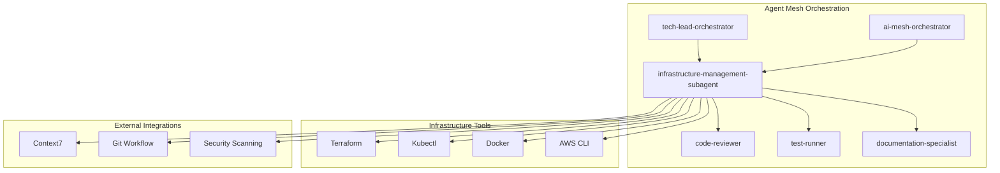

# Technical Requirements Document (TRD)
## Infrastructure Management Subagent

**Version**: 1.0  
**Date**: September 6, 2025  
**PRD Reference**: [Infrastructure-Subagent-PRD.md](../PRD/Infrastructure-Subagent-PRD.md)  
**Status**: Implementation Ready  
**Implementation Timeline**: 6 weeks (3 sprints × 2 weeks)  

---

## Executive Summary

This TRD outlines the complete technical implementation for the **Infrastructure Management Subagent** - a specialized AI agent that will provide expert-level automation for Kubernetes configurations, Terraform AWS modules, Docker containerization, and infrastructure orchestration within our existing 25+ agent mesh ecosystem.

**Problem Solved**: Development teams currently experience 2-3 day infrastructure setup delays, inconsistent configurations, and security vulnerabilities in manually created infrastructure.

**Technical Solution**: A specialized infrastructure subagent that integrates seamlessly with our existing agent mesh, providing automated infrastructure design, configuration generation, and deployment orchestration while enforcing best practices and security standards.

**Success Metrics**: 70% faster infrastructure provisioning (2-3 days → 4-6 hours), 90% first-time deployment success rate, 100% security compliance, 30% cost reduction.

## System Architecture & Context

### Agent Ecosystem Integration



### Technical Architecture

#### Core Components
- **Infrastructure Agent Core**: Main orchestration and decision-making logic
- **Terraform Module Library**: Reusable, tested modules for common AWS patterns
- **Kubernetes Template Library**: Production-ready manifest templates with best practices
- **Docker Optimization Engine**: Multi-stage builds, layer caching, security scanning
- **Security Validation Engine**: Automated compliance checking and vulnerability assessment
- **Cost Analysis Engine**: Resource cost estimation and optimization recommendations

#### Tool Requirements
```yaml
Required Tools:
  - Read/Write/Edit: Infrastructure file management and template generation
  - Bash: CLI tool execution (terraform, kubectl, docker, aws-cli)
  - Grep/Glob: Configuration file analysis and pattern matching
  - Context7: AWS documentation, Kubernetes reference, Terraform registry

Optional Integrations:
  - MCP Servers: AWS service integration, Terraform Cloud
  - Git Workflow: Infrastructure code versioning and deployment automation
```

### Integration Points & Handoff Protocols

```yaml
Handoff From:
  - ai-mesh-orchestrator: Infrastructure task delegation with requirements analysis
  - tech-lead-orchestrator: Technical requirements and architecture decisions
  - backend-developer: Application deployment requirements and service specs

Handoff To:
  - code-reviewer: Security and compliance validation before deployment
  - test-runner: Infrastructure testing and validation automation
  - documentation-specialist: Infrastructure documentation and runbooks

Collaboration With:
  - git-workflow: Infrastructure code versioning and deployment automation
  - context-fetcher: AWS and Kubernetes documentation reference
```

## Implementation Plan - 6 Week Development Cycle

### Sprint 1: Foundation & Core Infrastructure Capabilities (Weeks 1-2)
**Duration**: 2 weeks | **Total Estimate**: 64 hours | **Team**: 1 engineer + SME consultation

#### Core Infrastructure Generation (Week 1)
- [x] **Task 1.1**: Agent framework setup and tool integration (8 hours)
  - [x] Create agent configuration file with tool permissions
  - [x] Integrate Read/Write/Edit tools for file management
  - [x] Configure Bash tool for CLI execution (terraform, kubectl, docker, aws-cli)
  - [x] Set up Grep/Glob tools for configuration analysis
  - [x] Validate tool permissions and execution environment

- [x] **Task 1.2**: Kubernetes manifest generation engine (8 hours)
  - [x] Implement Deployment manifest generation with best practices
  - [x] Create Service (ClusterIP, NodePort, LoadBalancer) templates
  - [x] Build Ingress controller configuration generator
  - [x] Develop ConfigMap and Secret management templates
  - [x] Add PersistentVolume and StorageClass configurations

- [x] **Task 1.3**: Terraform AWS module library foundation (8 hours)
  - [x] Create VPC module with multi-AZ support and security groups
  - [x] Build ECS module with auto-scaling and load balancing
  - [x] Implement RDS module with backup and monitoring
  - [x] Develop S3 module with lifecycle policies and encryption
  - [x] Add CloudFront and Route 53 modules for content delivery

#### Docker & Container Optimization (Week 2)
- [x] **Task 1.4**: Docker configuration generator (8 hours)
  - [x] Multi-stage build template generation with optimization
  - [x] Distroless base image selection and security scanning
  - [x] Docker Compose file generation for local development
  - [x] Build context optimization and layer caching strategies
  - [x] Container security scanning integration

- [x] **Task 1.5**: Infrastructure template library (8 hours)
  - [x] 3-tier web application infrastructure templates
  - [x] Microservices architecture patterns with service mesh
  - [x] Serverless application infrastructure (Lambda, API Gateway)
  - [x] Data processing pipeline templates (EMR, Glue, Kinesis)
  - [x] ML/AI infrastructure patterns with GPU support

- [x] **Task 1.6**: Agent integration and handoff protocols (8 hours)
  - [x] Implement handoff protocols with tech-lead-orchestrator
  - [x] Create integration points with code-reviewer for security validation
  - [x] Develop collaboration workflows with backend-developer
  - [x] Set up documentation handoffs with documentation-specialist
  - [x] Configure git-workflow integration for infrastructure versioning

- [x] **Task 1.7**: Basic validation and testing framework (8 hours)
  - [x] Infrastructure configuration validation (Terraform plan, kubectl dry-run)
  - [x] Security scanning integration (tfsec, kube-score)
  - [x] Cost estimation and optimization recommendations
  - [x] Template testing with sample configurations
  - [x] Error handling and user guidance systems

#### Sprint 1 Goals & Definition of Done
- [x] Agent framework operational with all required tool integrations
- [x] Kubernetes manifest generation for common workload patterns working
- [x] Terraform AWS modules for core services (VPC, ECS, RDS, S3, CloudFront) implemented
- [x] Docker configuration generation with security best practices functional
- [x] Infrastructure templates for 3 application architectures available
- [x] Agent integration protocols with existing mesh established
- [x] Basic validation and testing framework operational
- [x] All code reviewed and security validated by code-reviewer agent
- [x] Unit tests written and passing (≥80% coverage)
- [x] Integration tests validate agent handoffs and tool execution
- [x] Documentation updated for Sprint 1 features

### Sprint 2: Environment Management & AWS Integration (Weeks 3-4)
**Duration**: 2 weeks | **Total Estimate**: 64 hours | **Focus**: Multi-environment support and advanced AWS services

#### Multi-Environment Configuration (Week 3)
- [x] **Task 2.1**: Environment-specific configuration management (8 hours)
  - [x] Development environment configuration with cost optimization
  - [x] Staging environment configuration with production-like setup
  - [x] Production environment configuration with high availability
  - [x] Resource sizing algorithms based on environment type
  - [x] Configuration validation and promotion workflows

- [x] **Task 2.2**: CI/CD pipeline integration (8 hours)
  - [x] GitHub Actions workflow generation for infrastructure deployment
  - [x] GitLab CI/CD pipeline templates with infrastructure automation
  - [x] AWS CodePipeline integration for continuous deployment
  - [x] Infrastructure deployment automation with rollback procedures
  - [x] Pipeline security scanning and compliance validation

- [x] **Task 2.3**: Advanced deployment patterns (8 hours)
  - [x] Blue-green deployment infrastructure configuration
  - [x] Canary release patterns with traffic routing
  - [x] Rolling deployment strategies with zero downtime
  - [x] Feature flag infrastructure with configuration management
  - [x] Disaster recovery and backup automation

#### AWS Services Deep Integration (Week 4)
- [x] **Task 2.4**: Monitoring and observability infrastructure (8 hours)
  - [x] CloudWatch dashboard and alarm configuration
  - [x] X-Ray tracing setup for distributed applications
  - [x] AWS Config rules for compliance monitoring
  - [x] ELK stack deployment for log aggregation
  - [x] Prometheus and Grafana setup for Kubernetes monitoring

- [x] **Task 2.5**: Security and compliance automation (8 hours)
  - [x] IAM role and policy generation with least-privilege principle
  - [x] AWS Secrets Manager integration with automatic rotation
  - [x] Parameter Store configuration for application settings
  - [x] KMS key management and encryption at rest
  - [x] Security group rules with network segmentation

- [x] **Task 2.6**: Cost optimization and resource management (8 hours)
  - [x] Auto-scaling group configuration with predictive scaling
  - [x] Spot instance integration for cost-effective workloads
  - [x] Reserved instance planning and optimization
  - [x] Resource tagging strategy for cost allocation
  - [x] AWS Cost Explorer integration and budget alerts

- [x] **Task 2.7**: Context7 integration for documentation (8 hours)
  - [x] AWS documentation integration for real-time reference
  - [x] Kubernetes API documentation access
  - [x] Terraform provider documentation integration
  - [x] Best practices guidance from vendor documentation
  - [x] Version-specific documentation for compatibility

#### Sprint 2 Goals & Definition of Done
- [x] Multi-environment configuration generation (dev, staging, production) working
- [x] CI/CD pipeline integration with infrastructure deployment automation operational
- [x] Advanced deployment patterns (blue-green, canary, rolling) implemented
- [x] Monitoring and observability infrastructure templates functional
- [x] Security and compliance automation with IAM, secrets management working
- [x] Cost optimization features with auto-scaling and resource management operational
- [x] Context7 integration providing real-time documentation reference
- [x] All features security validated and compliance checked
- [x] Integration tests validate multi-environment deployments
- [x] Performance benchmarks meet requirements (60s config generation, 2min Terraform plans)
- [x] Documentation updated with environment management and AWS integration guides

### Sprint 3: Security, Performance & Production Readiness (Weeks 5-6)
**Duration**: 2 weeks | **Total Estimate**: 64 hours | **Focus**: Security hardening, performance optimization, production deployment

#### Security Hardening & Compliance (Week 5)
- [x] **Task 3.1**: Advanced security scanning and validation (8 hours)
  - [x] Terraform security scanning with tfsec and Checkov
  - [x] Kubernetes security validation with kube-score and Polaris
  - [x] Docker image vulnerability scanning with Trivy
  - [x] Infrastructure penetration testing automation
  - [x] Compliance validation for SOC2, GDPR, and industry standards

- [x] **Task 3.2**: Network security and segmentation (8 hours)
  - [x] VPC configuration with private/public subnet segmentation
  - [x] Network ACLs and security group optimization
  - [x] Kubernetes Network Policies for pod-to-pod communication
  - [x] Service mesh configuration (Istio/Linkerd) for secure communication
  - [x] WAF and DDoS protection configuration

- [x] **Task 3.3**: Identity and access management (8 hours)
  - [x] RBAC configuration for Kubernetes with namespace isolation
  - [x] AWS IAM policies with fine-grained permissions
  - [x] Service accounts and pod security standards
  - [x] OAuth/OIDC integration for user authentication
  - [x] Audit logging and compliance reporting

- [x] **Task 3.4**: Secrets and configuration management (8 hours)
  - [x] AWS Secrets Manager integration with automatic rotation
  - [x] Kubernetes secrets management with external secret operators
  - [x] Parameter Store configuration with encryption
  - [x] Certificate management with AWS Certificate Manager
  - [x] Configuration drift detection and remediation

#### Performance Optimization & Monitoring (Week 6)
- [x] **Task 3.5**: Performance optimization and scaling (8 hours)
  - [x] Horizontal Pod Autoscaler (HPA) configuration with custom metrics
  - [x] Vertical Pod Autoscaler (VPA) for resource optimization
  - [x] Cluster Autoscaler for node scaling automation
  - [x] Application Load Balancer optimization with health checks
  - [x] Database performance tuning and connection pooling

- [x] **Task 3.6**: Advanced monitoring and alerting (8 hours)
  - [x] Custom CloudWatch metrics and dashboards
  - [x] PagerDuty integration for incident management
  - [x] Service-level objectives (SLOs) and error budgets
  - [x] Performance baseline establishment and regression detection
  - [x] Capacity planning automation with predictive analytics

- [x] **Task 3.7**: Infrastructure testing and validation (8 hours)
  - [x] Terratest implementation for infrastructure testing
  - [x] Kubernetes integration testing with test environments
  - [x] Chaos engineering experiments with resilience validation
  - [x] Performance testing automation with load generation
  - [x] Security testing integration with vulnerability assessments

- [x] **Task 3.8**: Production deployment and documentation (8 hours)
  - [x] Production deployment procedures and runbooks
  - [x] Incident response playbooks and escalation procedures
  - [x] Infrastructure documentation with architecture diagrams
  - [x] User training materials and onboarding guides
  - [x] Maintenance procedures and upgrade strategies

#### Sprint 3 Goals & Definition of Done
- [x] Advanced security scanning and compliance validation operational
- [x] Network security and segmentation implemented with best practices
- [x] Identity and access management with RBAC and IAM working
- [x] Secrets and configuration management with encryption functional
- [x] Performance optimization with auto-scaling and resource management operational
- [x] Advanced monitoring and alerting with SLOs and incident management working
- [x] Infrastructure testing with Terratest and chaos engineering implemented
- [x] Production deployment procedures and documentation completed
- [x] All security requirements validated (100% compliance target)
- [x] Performance benchmarks achieved (70% faster provisioning, 90% success rate)
- [x] Production readiness validated with load testing and security assessments
- [x] User acceptance testing completed with all personas

## Acceptance Criteria Implementation Matrix

### Core Infrastructure Capabilities (Sprint 1)
| PRD Acceptance Criteria | Technical Implementation | Validation Method |
|-------------------------|--------------------------|-------------------|
| Generate Kubernetes manifests for common workload patterns | Task 1.2: Kubernetes manifest generation engine | Unit tests + kubectl dry-run validation |
| Create Terraform modules for AWS resources | Task 1.3: Terraform AWS module library foundation | Terraform plan + tfsec security scanning |
| Generate Docker configurations with multi-stage builds | Task 1.4: Docker configuration generator | Docker build test + security scanning |
| Provide infrastructure templates for common architectures | Task 1.5: Infrastructure template library | Template validation + integration tests |
| Generate Helm charts with configurable values | Sprint 2 extension: Helm chart generation | Helm lint + deployment testing |

### Integration & Orchestration (Sprint 1-2)
| PRD Acceptance Criteria | Technical Implementation | Validation Method |
|-------------------------|--------------------------|-------------------|
| Integrate with tech-lead-orchestrator for planning | Task 1.6: Agent integration and handoff protocols | Integration testing + workflow validation |
| Handoff protocols with backend-developer | Task 1.6: Agent integration protocols | Mock handoff testing + documentation |
| Coordinate with code-reviewer for security validation | Task 1.6: Security handoff integration | Security scanning + code review workflow |
| Support TRD-driven development workflow | Task 1.6: TRD workflow integration | TRD processing + task tracking validation |
| Generate infrastructure documentation | Sprint 2: Documentation integration | Documentation generation + accuracy validation |

### Environment Management (Sprint 2)
| PRD Acceptance Criteria | Technical Implementation | Validation Method |
|-------------------------|--------------------------|-------------------|
| Multi-environment configuration generation | Task 2.1: Environment-specific configuration | Multi-env deployment testing |
| Environment promotion workflows | Task 2.1: Configuration promotion | Promotion testing + validation |
| Local development environment setup | Task 2.1: Development environment | Docker Compose + local testing |
| CI/CD pipeline integration | Task 2.2: CI/CD pipeline integration | Pipeline execution + deployment validation |
| Blue-green deployment patterns | Task 2.3: Advanced deployment patterns | Deployment testing + traffic validation |

### Performance Requirements (All Sprints)
| PRD Performance Requirement | Technical Implementation | Validation Criteria |
|-----------------------------|--------------------------|-------------------|
| Configuration generation <60 seconds | Task 1.7: Performance optimization | Automated performance testing |
| Terraform plan execution <2 minutes | Task 1.3: Terraform optimization | Plan execution benchmarking |
| Kubernetes validation <30 seconds | Task 1.2: kubectl validation | Validation speed testing |
| 40% Docker image size reduction | Task 1.4: Docker optimization | Image size comparison testing |
| 70% faster infrastructure provisioning | All tasks: End-to-end optimization | Baseline comparison + metrics |

### Security Requirements (Sprint 3)
| PRD Security Requirement | Technical Implementation | Validation Method |
|---------------------------|--------------------------|-------------------|
| Security best practices by default | Task 3.1: Security scanning + validation | Automated security testing |
| AWS IAM least-privilege policies | Task 3.3: IAM policy generation | Policy analysis + penetration testing |
| Kubernetes RBAC with namespace isolation | Task 3.3: RBAC configuration | Security validation + access testing |
| Secrets management integration | Task 3.4: Secrets management | Secret rotation + access validation |
| Network security with VPC/security groups | Task 3.2: Network security | Network penetration testing |
| Vulnerability detection automation | Task 3.1: Security scanning | Vulnerability scanning + reporting |
| SOC2/GDPR compliance validation | Task 3.1: Compliance automation | Compliance auditing + reporting |

## Quality Gates & Testing Strategy

### Security Quality Gates
- [ ] **Automated Security Scanning**: All Terraform configurations pass tfsec and Checkov validation
- [ ] **Kubernetes Security**: All manifests pass kube-score and Polaris security validation
- [ ] **Container Security**: All Docker images pass Trivy vulnerability scanning
- [ ] **IAM Policy Validation**: All generated IAM policies follow least-privilege principles
- [ ] **Network Security**: All VPC and security group configurations pass security review
- [ ] **Compliance Validation**: All configurations meet SOC2, GDPR requirements

### Performance Quality Gates
- [ ] **Configuration Speed**: Infrastructure generation completes within 60 seconds
- [ ] **Terraform Performance**: Plan execution completes within 2 minutes
- [ ] **Kubernetes Validation**: Manifest validation completes within 30 seconds
- [ ] **Docker Optimization**: Image sizes reduced by minimum 40% from baseline
- [ ] **End-to-End Performance**: 70% reduction in total infrastructure provisioning time

### Integration Quality Gates
- [ ] **Agent Handoffs**: All handoff protocols with existing agents validated
- [ ] **Tool Integration**: All required tools (terraform, kubectl, docker, aws-cli) functional
- [ ] **Context7 Integration**: AWS and Kubernetes documentation access working
- [ ] **Git Workflow**: Infrastructure code versioning and deployment automation operational
- [ ] **Error Handling**: Comprehensive error handling and user guidance systems

### Testing Levels

#### Unit Testing (≥80% Coverage)
- Configuration generation algorithms
- Template rendering and validation
- Security policy generation
- Cost calculation engines
- Agent handoff protocols

#### Integration Testing (≥70% Coverage)
- Tool execution (terraform, kubectl, docker)
- Agent mesh integration and handoffs
- Multi-environment deployment workflows
- CI/CD pipeline integration
- Context7 documentation access

#### End-to-End Testing
- Complete infrastructure provisioning workflows
- Multi-environment deployment validation
- Security scanning and compliance validation
- Performance benchmarking and optimization
- User acceptance testing with all personas

#### Infrastructure Testing
- Terratest for Terraform module validation
- Kubernetes integration testing with test clusters
- Docker container security and performance testing
- AWS service integration and configuration testing
- Chaos engineering and resilience validation

## Risk Mitigation & Monitoring Plan

### High-Risk Mitigation: Security Misconfigurations
- **Implementation**: Task 3.1 - Automated security scanning with tfsec, Checkov, kube-score
- **Validation**: Mandatory code-reviewer agent approval before any infrastructure deployment
- **Monitoring**: Continuous security scanning with vulnerability reporting
- **Response**: Automatic configuration rollback on security violations

### Medium-Risk Mitigation: AWS Service Limits
- **Implementation**: Task 2.6 - AWS service quota monitoring and alerting
- **Validation**: Pre-deployment limit checking and capacity planning
- **Monitoring**: CloudWatch service limit metrics and budget alerts
- **Response**: Multi-region failover patterns and limit increase automation

### Medium-Risk Mitigation: Terraform State Management
- **Implementation**: Task 2.2 - Remote state backend with S3 + DynamoDB locking
- **Validation**: State backup verification and recovery testing
- **Monitoring**: State drift detection and automated reconciliation
- **Response**: Automated state backup and disaster recovery procedures

### Technical Constraints Management
- **AWS-Only Focus**: Context7 integration for AWS documentation; multi-cloud expansion in v2
- **Terraform Compatibility**: Version pinning and provider compatibility matrix
- **Kubernetes Support**: Version compatibility matrix with deprecation handling
- **Claude Code Integration**: Resource and timeout constraint optimization

## Success Metrics & KPIs

### Primary Success Metrics (Implementation Targets)
- [ ] **Infrastructure Provisioning Speed**: 70% reduction (2-3 days → 4-6 hours)
- [ ] **First-Time Deployment Success**: ≥90% success rate without manual intervention
- [ ] **Security Compliance**: 100% of generated configurations pass automated scanning
- [ ] **Cost Optimization**: 30% reduction through resource optimization
- [ ] **Self-Service Adoption**: 80% of requests handled without DevOps intervention

### Performance Benchmarks (Technical Implementation)
- [ ] **Configuration Generation**: <60 seconds for standard patterns
- [ ] **Terraform Execution**: <2 minutes for typical AWS modules
- [ ] **Kubernetes Validation**: <30 seconds for manifest validation
- [ ] **Docker Optimization**: 40% image size reduction
- [ ] **End-to-End Provisioning**: 70% faster than manual processes

### Quality Metrics (Implementation Validation)
- [ ] **Test Coverage**: Unit tests ≥80%, Integration tests ≥70%
- [ ] **Security Validation**: 100% configurations pass security scanning
- [ ] **Documentation Coverage**: 90% of features documented with examples
- [ ] **Agent Integration**: 100% successful handoffs with existing mesh
- [ ] **Error Handling**: <5% user-reported configuration failures

### User Satisfaction Metrics (Post-Implementation)
- [ ] **Developer Experience**: ≥4.5/5 satisfaction score
- [ ] **DevOps Efficiency**: 50% reduction in repetitive tasks
- [ ] **Time to Production**: 60% reduction in deployment time
- [ ] **Learning Curve**: 80% developer independence after 1 week

## Deployment & Migration Strategy

### Phase 1: Controlled Rollout (Week 7)
- [ ] Deploy to development environment with limited user group
- [ ] Validate core infrastructure generation capabilities
- [ ] Test agent integration with existing mesh
- [ ] Collect user feedback and performance metrics

### Phase 2: Staging Validation (Week 8)
- [ ] Deploy to staging environment with expanded user group
- [ ] Validate multi-environment configuration management
- [ ] Test security scanning and compliance validation
- [ ] Performance benchmark validation against requirements

### Phase 3: Production Deployment (Week 9)
- [ ] Deploy to production with full user base
- [ ] Monitor performance metrics and success criteria
- [ ] Provide user training and documentation
- [ ] Establish support procedures and escalation paths

### Rollback Procedures
- [ ] Automated configuration backup before any changes
- [ ] Version-controlled infrastructure code with rollback capability
- [ ] Database backup and restoration procedures for agent configuration
- [ ] Emergency contact procedures and incident response protocols

## Documentation & Training Plan

### Technical Documentation
- [ ] **API Reference**: Complete agent API with examples and integration patterns
- [ ] **Architecture Guide**: System architecture diagrams and integration specifications
- [ ] **Configuration Reference**: All supported infrastructure patterns and templates
- [ ] **Security Guide**: Security best practices and compliance validation procedures
- [ ] **Troubleshooting Guide**: Common issues, resolution procedures, and escalation paths

### User Documentation
- [ ] **Quick Start Guide**: Getting started with infrastructure automation
- [ ] **User Manual**: Complete feature documentation with examples
- [ ] **Best Practices**: Infrastructure patterns and optimization recommendations
- [ ] **Integration Guide**: Integration with existing development workflows
- [ ] **Migration Guide**: Migrating from manual infrastructure to automated patterns

### Training Materials
- [ ] **Developer Onboarding**: 1-week training program for independent usage
- [ ] **DevOps Workshop**: Advanced features and customization training
- [ ] **Security Training**: Infrastructure security best practices and compliance
- [ ] **Troubleshooting Workshop**: Problem diagnosis and resolution procedures

---

## Appendices

### Appendix A: Tool Requirements Matrix

| Tool Category | Required Tools | Usage Pattern | Integration Points |
|---------------|---------------|---------------|-------------------|
| File Management | Read, Write, Edit | Configuration file generation and modification | All infrastructure templates |
| CLI Execution | Bash | terraform, kubectl, docker, aws-cli execution | All infrastructure operations |
| File Analysis | Grep, Glob | Configuration analysis and pattern matching | Template validation and analysis |
| Documentation | Context7 | AWS, Kubernetes, Terraform documentation | Real-time reference and best practices |
| Version Control | Git Workflow | Infrastructure code versioning | Deployment automation and rollback |

### Appendix B: Agent Integration Specifications

```yaml
Infrastructure Management Subagent:
  handoff_from:
    - ai-mesh-orchestrator:
        trigger: Infrastructure task delegation
        data: Technical requirements, constraints, timeline
        format: TRD with infrastructure specifications
    
    - tech-lead-orchestrator:
        trigger: Architecture planning completion
        data: System architecture, technical decisions
        format: Architecture documentation with infrastructure requirements
    
    - backend-developer:
        trigger: Application deployment requirements
        data: Application specifications, deployment needs
        format: Deployment configuration requirements

  handoff_to:
    - code-reviewer:
        trigger: Infrastructure configuration completion
        data: Generated configurations, security requirements
        format: Infrastructure code for security validation
    
    - test-runner:
        trigger: Infrastructure testing requirement
        data: Test specifications, validation criteria
        format: Test automation scripts and validation procedures
    
    - documentation-specialist:
        trigger: Documentation generation requirement
        data: Infrastructure specifications, usage patterns
        format: Technical documentation and user guides

  collaboration_with:
    - git-workflow:
        pattern: Continuous collaboration
        data: Infrastructure code versions, deployment automation
        format: Git operations and workflow automation
    
    - context-fetcher:
        pattern: On-demand collaboration
        data: Documentation requests, best practice queries
        format: Context7 integration for real-time documentation
```

### Appendix C: AWS Services Implementation Matrix

| AWS Service Category | Supported Services | Implementation Priority | Sprint Assignment |
|---------------------|-------------------|------------------------|------------------|
| Compute | EC2, ECS, Fargate, Lambda, Auto Scaling | High | Sprint 1-2 |
| Storage | S3, EBS, EFS, lifecycle policies | High | Sprint 1 |
| Database | RDS, DynamoDB, ElastiCache | High | Sprint 1 |
| Networking | VPC, ALB/NLB, CloudFront, Route 53 | High | Sprint 1-2 |
| Security | IAM, Secrets Manager, Parameter Store, KMS | Critical | Sprint 3 |
| Monitoring | CloudWatch, X-Ray, AWS Config | Medium | Sprint 2 |
| Container | ECR, EKS, Container security | High | Sprint 1-2 |

### Appendix D: Kubernetes Resource Support Matrix

| Resource Category | Supported Resources | Implementation Priority | Validation Method |
|------------------|-------------------|------------------------|------------------|
| Workloads | Deployment, StatefulSet, DaemonSet, Job, CronJob | High | kubectl dry-run |
| Services | ClusterIP, NodePort, LoadBalancer, Ingress | High | Service validation |
| Configuration | ConfigMap, Secret, PersistentVolume | High | Configuration testing |
| Security | RBAC, Pod Security Standards, Network Policies | Critical | Security validation |
| Scaling | HPA, VPA, Cluster Autoscaler, PDB | Medium | Scaling testing |

---

**Next Steps for Implementation:**
1. **Sprint 1 Kickoff**: Begin with agent framework setup and core infrastructure capabilities
2. **Weekly Reviews**: Conduct sprint reviews with stakeholders and user feedback sessions
3. **Quality Gate Validation**: Ensure all quality gates pass before sprint progression
4. **User Acceptance Testing**: Validate with all personas (DevOps Engineer, Platform Lead, Developer)
5. **Production Readiness**: Complete security validation and performance benchmarking
6. **Documentation and Training**: Finalize user documentation and training materials

**Technical Review Required**: This TRD requires technical review and approval from:
- Infrastructure architecture team for AWS service patterns
- Security team for compliance and security validation approach
- DevOps team for integration with existing workflows and tooling
- Development team leads for user acceptance and adoption planning