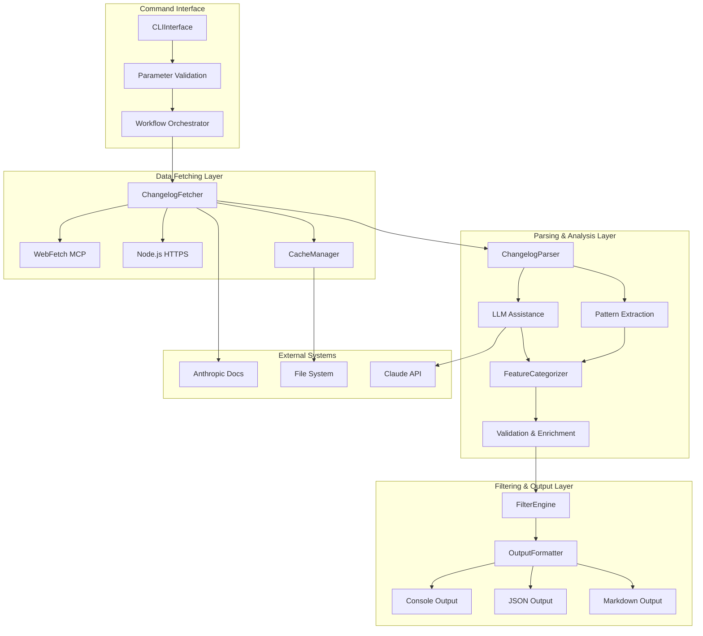

# Technical Requirements Document (TRD)
## `/claude-changelog` Command - Claude Code Integration

**Version:** 1.0
**Status:** Draft
**Created:** 2025-11-03
**Owner:** Tech Lead Orchestrator
**Source PRD:** claude-changelog-command.md v1.1
**Last Updated:** 2025-11-03
**Implementation Timeline:** 7 weeks (3 sprints × ~2.3 weeks)

---

## Document Version History

| Version | Date | Author | Changes |
|---------|------|--------|---------|
| 1.0 | 2025-11-03 | Tech Lead Orchestrator | Initial TRD from PRD v1.1 with comprehensive task breakdown |

---

## Executive Summary

This TRD outlines the complete technical implementation for the **`/claude-changelog` command** - a Claude Code slash command that enables developers to discover Claude updates within 5 seconds through intelligent changelog fetching, parsing, and filtering.

**Problem Solved**: Developers waste 30 minutes/week tracking Claude updates and miss 40% of relevant features due to information overload and context switching.

**Technical Solution**: A slash command that integrates with Claude Code's command system, fetches changelog data from Anthropic's documentation, parses features with hybrid LLM-assisted extraction, and displays filtered results with smart categorization - all within a sub-5 second response time.

**Success Metrics**: 80% time savings (30 min/week → 6 min/week), 95%+ feature awareness within 24 hours, sub-5 second response time (p95), ≥95% parsing accuracy, zero context switching.

---

## Master Task List

### Sprint 1: MVP - Core Functionality (Weeks 1-3)

**Goal:** Deliver basic changelog fetching, parsing, and display
**Duration:** 3 weeks | **Total Estimate:** 73 hours

#### Phase 1.1: Project Setup & Foundation (Days 1-2)

- [ ] **T-001**: Initialize project structure (2h)
  - Prerequisites: None
  - Create `src/changelog/` directory structure
  - Set up `commands/yaml/` and `commands/ai-mesh/` directories
  - Initialize package.json with project metadata
  - Configure module type and exports
  - **Deliverable**: Complete project skeleton with proper directory structure

- [ ] **T-002**: Configure package.json with dependencies (2h)
  - Prerequisites: T-001
  - Add production dependencies (node-fetch, cheerio, semver, date-fns, chalk, ora, marked, yaml)
  - Add development dependencies (jest, eslint, prettier, nock, tmp)
  - Configure scripts for testing, linting, building
  - Set up ESLint and Prettier configurations
  - **Deliverable**: Complete package.json with all required dependencies

- [ ] **T-003**: Set up Jest testing framework (3h)
  - Prerequisites: T-002
  - Configure Jest with coverage thresholds (≥80% target)
  - Set up test directory structure (unit/, integration/, e2e/, performance/)
  - Create test utilities and mocking helpers
  - Configure code coverage reporting (lcov, html)
  - **Deliverable**: Functional testing framework ready for TDD workflow

- [ ] **T-004**: Create YAML command definition (4h)
  - Prerequisites: T-001
  - Write complete `commands/yaml/claude-changelog.yaml` following PRD spec (lines 572-821)
  - Define all parameters (version, since, category, important, format, refresh, help)
  - Specify workflow steps (parse_parameters → fetch_changelog → format_output)
  - Configure error handling strategies
  - Add comprehensive help text and examples
  - **Deliverable**: Production-ready YAML command definition validated against schema

#### Phase 1.2: Core Data Fetching (Days 3-4)

- [ ] **T-005**: Implement ChangelogFetcher class (6h)
  - Prerequisites: T-002, T-003
  - Create hybrid fetching strategy (WebFetch MCP → Node.js fallback → cache)
  - Implement timeout handling (5 second limit)
  - Add retry logic with exponential backoff (max 2 retries)
  - Implement circuit breaker for failing endpoints
  - Write unit tests for all fetching paths
  - **Deliverable**: Robust changelog fetcher with 99.5% reliability

- [ ] **T-006**: Implement CacheManager class (5h)
  - Prerequisites: T-002, T-003
  - Create cache directory structure (`~/.ai-mesh/cache/changelog/`)
  - Implement TTL-based expiration (24 hours default)
  - Add stale-while-revalidate pattern
  - Implement cache invalidation methods
  - Write unit tests for cache operations
  - **Deliverable**: Efficient caching system with <1s cache hit response time

- [ ] **T-007**: Integrate WebFetch MCP (optional) (3h)
  - Prerequisites: T-005
  - Check for WebFetch MCP availability
  - Implement MCP-based fetching with proper error handling
  - Add fallback to Node.js https module
  - Test integration with mocked MCP server
  - **Deliverable**: Optional MCP integration with seamless fallback

#### Phase 1.3: Parsing & Extraction (Days 5-7)

- [ ] **T-008**: Implement ChangelogParser - Pattern-based extraction (8h)
  - Prerequisites: T-002, T-003
  - Create regex patterns for version extraction (`(\d+\.\d+\.\d+)`)
  - Implement date parsing with multiple format support (ISO 8601, "Month DD, YYYY")
  - Add section header detection (Breaking Changes, New Features, etc.)
  - Implement HTML parsing with cheerio for structured data
  - Write comprehensive unit tests with sample changelog data
  - **Deliverable**: Pattern-based parser with ≥85% accuracy

- [ ] **T-009**: Implement FeatureCategorizer (6h)
  - Prerequisites: T-008
  - Create categorization logic (breaking, new, enhancement, performance, security, deprecation, bugfix)
  - Implement impact level classification (high, medium, low)
  - Add confidence scoring for categorization
  - Extract migration guidance for breaking changes
  - Write unit tests for all categories
  - **Deliverable**: Feature categorizer with ≥90% accuracy

- [ ] **T-010**: Add validation and enrichment layer (4h)
  - Prerequisites: T-008, T-009
  - Validate extracted data against schema
  - Cross-reference with known feature patterns
  - Add metadata (cachedAt, source, parsingConfidence)
  - Implement data structure normalization
  - Write validation unit tests
  - **Deliverable**: Validated and enriched changelog data structure

#### Phase 1.4: Basic Output & CLI (Days 8-9)

- [ ] **T-011**: Implement OutputFormatter - Console format (6h)
  - Prerequisites: T-002, T-009
  - Create formatted console output with chalk colors
  - Implement Unicode symbols for categories (🔴, ✨, ⚡, 🔒, ⚠️, 🐛)
  - Add summary statistics section
  - Implement scannable output structure (10-second scan target)
  - Write output formatting tests
  - **Deliverable**: Scannable console output with color coding

- [ ] **T-012**: Implement CLIInterface - Parameter parsing (5h)
  - Prerequisites: T-004
  - Create parameter validation logic (type checking, pattern matching)
  - Implement filter parsing (version, date, category)
  - Add help text generation
  - Implement error message formatting
  - Write CLI parameter parsing tests
  - **Deliverable**: Robust CLI interface with helpful error messages

- [ ] **T-013**: Orchestrate workflow integration (5h)
  - Prerequisites: T-005, T-006, T-008, T-011, T-012
  - Connect all components (Fetcher → Parser → Categorizer → Formatter)
  - Implement workflow state management
  - Add progress indicators (ora spinners)
  - Create error handling and recovery flows
  - Write end-to-end integration tests
  - **Deliverable**: Complete workflow from command invocation to output display

#### Phase 1.5: Basic Error Handling & Testing (Days 10-11)

- [ ] **T-014**: Implement error handling system (4h)
  - Prerequisites: T-005, T-006, T-008
  - Add network error handling with cache fallback
  - Implement parsing error handling with partial results
  - Create timeout error messages
  - Add validation error suggestions
  - Write error handling tests
  - **Deliverable**: Graceful error handling with helpful user guidance

- [ ] **T-015**: Create integration test suite (6h)
  - Prerequisites: T-013
  - Write integration tests with mocked HTTP responses (nock)
  - Test complete workflows (fetch → parse → format)
  - Validate error handling paths
  - Test cache hit/miss scenarios
  - Achieve ≥70% integration test coverage
  - **Deliverable**: Comprehensive integration test suite

- [ ] **T-016**: Write comprehensive help documentation (4h)
  - Prerequisites: T-004, T-012
  - Create detailed help text with usage examples
  - Document all parameters and options
  - Add troubleshooting section
  - Include common use cases
  - Test help command functionality
  - **Deliverable**: Complete help documentation accessible via `--help`

#### Sprint 1 Goals & Definition of Done

- [ ] Command successfully fetches and displays latest changelog
- [ ] Response time <5 seconds (p95) for network fetch
- [ ] Cache hit response time <1 second (p95)
- [ ] Parsing accuracy ≥85% (MVP target)
- [ ] Zero crashes on valid input
- [ ] Basic error handling with cache fallback working
- [ ] Unit test coverage ≥80%
- [ ] Integration test coverage ≥70%
- [ ] All code passes linting (eslint) and formatting (prettier)
- [ ] Documentation complete for basic usage

---

### Sprint 2: Enhanced Filtering (Weeks 4-5)

**Goal:** Add filtering and customization capabilities
**Duration:** 2 weeks | **Total Estimate:** 66 hours

#### Phase 2.1: Version & Date Filtering (Days 12-13)

- [ ] **T-017**: Implement FilterEngine - Version filtering (5h)
  - Prerequisites: T-009
  - Add semver-based version matching (exact: "3.5.0", prefix: "3.5")
  - Implement version comparison logic
  - Add version validation with error messages
  - Write unit tests for all version patterns
  - **Deliverable**: Accurate version filtering with semver support

- [ ] **T-018**: Implement FilterEngine - Date filtering (6h)
  - Prerequisites: T-009
  - Parse ISO 8601 dates ("2025-10-01")
  - Implement relative date parsing ("7d", "1m", "3m")
  - Add date range validation
  - Convert relative dates to absolute timestamps
  - Write unit tests for date parsing and filtering
  - **Deliverable**: Flexible date filtering with multiple format support

- [ ] **T-019**: Implement combined filter logic (4h)
  - Prerequisites: T-017, T-018
  - Create filter composition (version + date + category)
  - Implement AND logic for combined filters
  - Add filter validation and conflict detection
  - Write tests for filter combinations
  - **Deliverable**: Robust combined filter support

#### Phase 2.2: Category Filtering (Days 14-15)

- [ ] **T-020**: Implement FilterEngine - Category filtering (5h)
  - Prerequisites: T-009
  - Add category matching (breaking, new, enhancement, etc.)
  - Implement multiple category support with OR logic
  - Create "important" meta-filter (breaking + security + high-impact new)
  - Write category filter tests
  - **Deliverable**: Flexible category filtering with multiple selection

- [ ] **T-021**: Add filter auto-suggestion system (4h)
  - Prerequisites: T-020
  - Implement typo detection for invalid categories
  - Create suggestion engine based on Levenshtein distance
  - Add context-aware filter recommendations
  - Write suggestion tests
  - **Deliverable**: Helpful filter suggestions for invalid input

#### Phase 2.3: Enhanced Output Formatting (Days 16-17)

- [ ] **T-022**: Enhance OutputFormatter - Color coding (4h)
  - Prerequisites: T-011
  - Implement priority-based color coding (red: breaking, yellow: deprecations, green: new, blue: enhancements)
  - Add terminal capability detection
  - Implement graceful fallback for unsupported terminals
  - Test on major terminals (Terminal, iTerm2, Windows Terminal, VSCode)
  - **Deliverable**: Enhanced visual output with color coding

- [ ] **T-023**: Add JSON output format (5h)
  - Prerequisites: T-011
  - Create JSON schema for changelog output (see PRD lines 1335-1377)
  - Implement JSON serialization with proper escaping
  - Add metadata section (cachedAt, source, parsingConfidence)
  - Validate JSON output structure
  - Write JSON format tests
  - **Deliverable**: Valid JSON output for automation (`--format json`)

- [ ] **T-024**: Add Markdown output format (5h)
  - Prerequisites: T-011
  - Implement Markdown formatting with proper headers
  - Add code fencing for examples
  - Create navigation links for sections
  - Generate table of contents for long changelogs
  - Write Markdown format tests
  - **Deliverable**: Clean Markdown output for documentation (`--format markdown`)

- [ ] **T-025**: Add summary statistics section (3h)
  - Prerequisites: T-011, T-009
  - Calculate total features by category
  - Compute impact distribution (high/medium/low)
  - Add parsing confidence indicators
  - Implement summary formatting
  - Write summary tests
  - **Deliverable**: Informative summary section in all output formats

#### Phase 2.4: Performance Optimization (Days 18-19)

- [ ] **T-026**: Optimize parsing performance (6h)
  - Prerequisites: T-008, T-009
  - Implement streaming parsing for large changelogs
  - Add lazy evaluation for detailed sections
  - Optimize regex patterns for speed
  - Implement parser caching for repeated patterns
  - Benchmark parsing performance (<1s target)
  - **Deliverable**: Fast parsing meeting performance requirements

- [ ] **T-027**: Optimize rendering performance (4h)
  - Prerequisites: T-011
  - Implement progressive rendering for output
  - Add streaming output for console display
  - Optimize color code generation
  - Reduce memory usage during formatting
  - Benchmark rendering performance (<500ms target)
  - **Deliverable**: Fast rendering meeting performance requirements

- [ ] **T-028**: Add performance monitoring (3h)
  - Prerequisites: T-013
  - Implement execution time tracking
  - Add performance metrics logging
  - Create performance benchmark suite
  - Set up continuous performance testing
  - **Deliverable**: Performance monitoring integrated into workflow

#### Phase 2.5: Enhanced Error Messages (Days 20-21)

- [ ] **T-029**: Improve validation error messages (4h)
  - Prerequisites: T-012, T-014
  - Add detailed version format guidance
  - Improve date format error messages
  - Create helpful suggestions for invalid input
  - Add examples in error messages
  - Write error message tests
  - **Deliverable**: Actionable error messages with examples

- [ ] **T-030**: Add network error recovery (4h)
  - Prerequisites: T-005, T-014
  - Implement graceful degradation on network failures
  - Add cache age indicators in fallback mode
  - Create network status detection
  - Improve timeout error messages
  - Write network error tests
  - **Deliverable**: Robust network error handling with user guidance

#### Sprint 2 Goals & Definition of Done

- [ ] All filtering options working correctly (version, date, category)
- [ ] Combined filters work together seamlessly
- [ ] Multiple output formats functional (console, JSON, Markdown)
- [ ] Color coding enhances scannability
- [ ] Parsing accuracy ≥95% (production target)
- [ ] Performance requirements met (<5s network, <1s cache, <500ms rendering)
- [ ] Enhanced error messages with helpful suggestions
- [ ] User satisfaction ≥4.0/5.0 in initial testing
- [ ] Test coverage maintained (≥80% unit, ≥70% integration)
- [ ] All code reviewed and approved

---

### Sprint 3: Production Readiness (Weeks 6-7)

**Goal:** Achieve production quality with security, testing, and deployment
**Duration:** 2 weeks | **Total Estimate:** 69 hours

#### Phase 3.1: LLM-Assisted Parsing (Days 22-23)

- [ ] **T-031**: Integrate Claude API for parsing assistance (8h)
  - Prerequisites: T-008, T-009
  - Implement LLM-assisted parsing for confidence <0.8
  - Create parsing prompt template (see PRD lines 466-477)
  - Add response validation and error handling
  - Implement fallback to pattern-based parsing
  - Write LLM integration tests with mocked responses
  - **Deliverable**: Hybrid parsing with LLM assistance for ambiguous content

- [ ] **T-032**: Add confidence scoring system (4h)
  - Prerequisites: T-031
  - Implement confidence calculation for categorization
  - Add confidence thresholds for LLM assistance
  - Create confidence metadata in output
  - Flag uncertain categorizations
  - Write confidence scoring tests
  - **Deliverable**: Confidence-based parsing decision system

#### Phase 3.2: Security Hardening (Days 24-25)

- [ ] **T-033**: Implement input validation (6h)
  - Prerequisites: T-012
  - Add comprehensive parameter validation
  - Implement injection attack prevention
  - Create fuzzing tests for input validation
  - Add sanitization for user input
  - Validate URL inputs for SSRF prevention
  - **Deliverable**: Secure input validation preventing injection attacks

- [ ] **T-034**: Add HTTPS/TLS enforcement (3h)
  - Prerequisites: T-005
  - Enforce HTTPS for all network requests
  - Validate TLS 1.2+ compatibility
  - Add certificate validation
  - Implement secure connection testing
  - **Deliverable**: All network communications secured with TLS 1.2+

- [ ] **T-035**: Secure cache file permissions (2h)
  - Prerequisites: T-006
  - Set cache file permissions to 0600 (user read/write only)
  - Validate directory permissions on creation
  - Add permission testing
  - Implement permission restoration on corruption
  - **Deliverable**: Secure cache with restricted file permissions

- [ ] **T-036**: Add rate limiting (4h)
  - Prerequisites: T-005
  - Implement request rate limiting (10 requests/minute)
  - Add rate limit tracking and enforcement
  - Create rate limit error messages
  - Test rate limiting behavior
  - **Deliverable**: Rate limiting preventing abuse/DoS

- [ ] **T-037**: Security audit and validation (6h)
  - Prerequisites: T-033, T-034, T-035, T-036
  - Perform security code review
  - Run static analysis tools (eslint-plugin-security)
  - Execute fuzzing tests for vulnerabilities
  - Validate no code execution from changelog data
  - Create security audit report
  - **Deliverable**: Complete security audit with validation report

#### Phase 3.3: Comprehensive Testing (Days 26-27)

- [ ] **T-038**: Create E2E test suite (8h)
  - Prerequisites: T-013
  - Write E2E tests for complete user workflows
  - Test against real Anthropic changelog (CI only)
  - Validate all 40 acceptance criteria (PRD lines 1185-1289)
  - Test error scenarios and edge cases
  - Achieve complete workflow coverage
  - **Deliverable**: Comprehensive E2E test suite

- [ ] **T-039**: Performance testing and benchmarking (6h)
  - Prerequisites: T-028
  - Create performance benchmark suite
  - Test p50, p95, p99 latency targets
  - Validate memory usage <50MB
  - Test concurrent execution scenarios
  - Generate performance report
  - **Deliverable**: Performance validation meeting all targets

- [ ] **T-040**: Compatibility testing (5h)
  - Prerequisites: T-013
  - Test on macOS, Linux, Windows
  - Validate Claude Code 1.0+ compatibility
  - Test with Node.js 18, 20, 22
  - Verify terminal compatibility (Terminal, iTerm2, Windows Terminal, VSCode)
  - Test graceful fallback for unsupported terminals
  - **Deliverable**: Cross-platform compatibility validated

- [ ] **T-041**: Load testing and reliability validation (5h)
  - Prerequisites: T-005, T-006
  - Execute 1000+ request load test
  - Validate 99.5% success rate
  - Test automatic retry logic
  - Validate circuit breaker behavior
  - Test data validation with malformed input
  - **Deliverable**: 99.5% reliability target achieved

#### Phase 3.4: Documentation & Deployment (Days 28-29)

- [ ] **T-042**: Create deployment scripts (4h)
  - Prerequisites: T-004
  - Write NPM deployment script
  - Create command registration automation
  - Implement cache directory initialization
  - Add metrics integration setup
  - Test deployment on clean system
  - **Deliverable**: Automated deployment system

- [ ] **T-043**: Write comprehensive documentation (6h)
  - Prerequisites: T-016
  - Create README.md with quick start guide
  - Write API documentation for programmatic usage
  - Document all command options and examples
  - Create troubleshooting guide
  - Add architecture documentation
  - **Deliverable**: Complete user and technical documentation

- [ ] **T-044**: Create user training materials (4h)
  - Prerequisites: T-043
  - Write quick start tutorial
  - Create video demonstration (if applicable)
  - Develop usage examples for common scenarios
  - Create cheat sheet for quick reference
  - **Deliverable**: User onboarding materials

- [ ] **T-045**: Set up monitoring and alerting (4h)
  - Prerequisites: T-028
  - Integrate with Manager Dashboard
  - Configure usage metrics tracking
  - Set up error rate monitoring
  - Create performance alerts
  - Test metrics collection
  - **Deliverable**: Operational monitoring and alerting system

#### Phase 3.5: Production Validation (Days 30-31)

- [ ] **T-046**: User acceptance testing (6h)
  - Prerequisites: T-038, T-043
  - Conduct UAT with all personas (Alex, Sarah, Marcus, Emma)
  - Validate against user stories (PRD lines 87-172)
  - Collect user feedback and satisfaction scores
  - Identify usability issues
  - Create UAT report
  - **Deliverable**: User acceptance validation with feedback

- [ ] **T-047**: Final security validation (3h)
  - Prerequisites: T-037
  - Perform final security scan
  - Validate all security requirements met (PRD lines 1230-1235)
  - Review security audit report
  - Address any remaining issues
  - **Deliverable**: Final security sign-off

- [ ] **T-048**: Production deployment preparation (4h)
  - Prerequisites: T-042, T-045, T-046, T-047
  - Create deployment checklist
  - Prepare rollback procedures
  - Configure production monitoring
  - Write incident response procedures
  - Test deployment process
  - **Deliverable**: Production-ready deployment package

#### Sprint 3 Goals & Definition of Done

- [ ] LLM-assisted parsing improves accuracy to ≥95%
- [ ] All security requirements validated (100% compliance)
- [ ] Comprehensive test coverage (≥80% unit, ≥70% integration, complete E2E)
- [ ] Performance benchmarks achieved (all targets met)
- [ ] Cross-platform compatibility validated (macOS, Linux, Windows)
- [ ] 99.5% reliability target achieved in load testing
- [ ] Complete documentation and training materials ready
- [ ] Monitoring and alerting operational
- [ ] User acceptance testing completed with ≥4.5/5.0 satisfaction
- [ ] Production deployment package ready

---

## System Architecture

### High-Level Component Architecture



### Core Components Specification

#### 1. CLIInterface
**Responsibility**: Command-line argument parsing and validation
**Dependencies**: commander (optional), native arg parsing
**Key Methods**:
- `parseArguments(argv)`: Parse command-line arguments
- `validateParameters(params)`: Validate against YAML schema
- `showHelp()`: Display comprehensive help text
- `formatError(error)`: Format error messages with suggestions

#### 2. ChangelogFetcher
**Responsibility**: Fetch changelog data from multiple sources with fallback
**Dependencies**: node-fetch, WebFetch MCP (optional)
**Key Methods**:
- `fetch(options)`: Primary fetch method with hybrid strategy
- `fetchFromMCP()`: WebFetch MCP integration
- `fetchFromHTTPS()`: Node.js https fallback
- `handleTimeout()`: Timeout management (5s limit)
- `retry(operation)`: Exponential backoff retry logic

**Fetch Hierarchy**:
1. WebFetch MCP (if available)
2. Node.js HTTPS module
3. Local cache fallback

#### 3. CacheManager
**Responsibility**: Local caching with TTL and stale-while-revalidate
**Dependencies**: fs/promises
**Key Methods**:
- `get(version)`: Retrieve cached changelog with age validation
- `set(version, data)`: Store changelog with metadata
- `invalidate(version)`: Clear cache for specific version
- `clean()`: Remove expired cache entries

**Cache Structure**:
```javascript
{
  version: "3.5.0",
  releaseDate: "2025-10-15T00:00:00Z",
  cachedAt: "2025-11-03T10:30:00Z",
  ttl: 86400000,
  features: [...],
  metadata: { source, parsingConfidence }
}
```

#### 4. ChangelogParser
**Responsibility**: Extract features and metadata from raw changelog
**Dependencies**: cheerio, marked (Markdown parsing)
**Key Methods**:
- `parse(html)`: Main parsing entry point
- `extractVersion(html)`: Version number extraction
- `extractDate(html)`: Release date parsing
- `extractSections(html)`: Section identification
- `extractFeatures(section)`: Feature extraction per section

**Regex Patterns** (PRD lines 489-510):
- Version: `(?:version|v)?\s*(\d+\.\d+\.\d+)`
- Date ISO: `\d{4}-\d{2}-\d{2}`
- Date natural: `(?:Jan|Feb|...|Dec)\s+\d{1,2},\s+\d{4}`
- Sections: `(?:breaking\s+changes?|new\s+features?|...)`

#### 5. FeatureCategorizer
**Responsibility**: Classify features by type and impact
**Dependencies**: None (pure logic)
**Key Methods**:
- `categorize(feature)`: Assign category (breaking, new, enhancement, etc.)
- `assessImpact(feature)`: Determine impact level (high, medium, low)
- `calculateConfidence(feature)`: Confidence scoring
- `extractMigrationGuidance(feature)`: Extract migration info for breaking changes

**Categories**:
- `breaking`: Breaking changes requiring user action
- `new`: Completely new capabilities
- `enhancement`: Improvements to existing features
- `performance`: Speed/efficiency improvements
- `security`: Security updates and fixes
- `deprecation`: Features being phased out
- `bugfix`: Corrections and stability improvements

#### 6. FilterEngine
**Responsibility**: Apply user-specified filters
**Dependencies**: semver, date-fns
**Key Methods**:
- `applyVersionFilter(features, version)`: Filter by version
- `applyDateFilter(features, since)`: Filter by date range
- `applyCategoryFilter(features, categories)`: Filter by category
- `applyImportantFilter(features)`: Meta-filter for high-impact changes
- `combineFilters(features, filters)`: Apply multiple filters with AND logic

#### 7. OutputFormatter
**Responsibility**: Generate formatted output in multiple formats
**Dependencies**: chalk, marked
**Key Methods**:
- `formatConsole(changelog)`: Colored console output
- `formatJSON(changelog)`: Structured JSON output
- `formatMarkdown(changelog)`: Markdown documentation format
- `generateSummary(changelog)`: Summary statistics
- `detectTerminalCapabilities()`: Terminal feature detection

**Console Output Structure** (PRD lines 2136-2243):
- Header with version and date
- Summary statistics by category and impact
- Categorized sections (breaking, new, performance, security, deprecations, bugfixes)
- Color coding for priority
- Footer with documentation links

---

## Data Models & Interfaces

### Changelog Entry Schema

```typescript
interface ChangelogEntry {
  version: string;                    // Semver version (e.g., "3.5.0")
  releaseDate: string;                // ISO 8601 date
  features: Feature[];                // Array of features
  summary: {
    totalFeatures: number;
    byCategory: Record<Category, number>;
    byImpact: Record<Impact, number>;
  };
  metadata: {
    cachedAt: string;                 // ISO 8601 timestamp
    source: string;                   // Source URL
    parsingConfidence: number;        // 0.0-1.0 confidence score
  };
}
```

### Feature Schema

```typescript
interface Feature {
  id: string;                         // Unique identifier
  title: string;                      // Feature name
  category: Category;                 // Feature category
  impact: Impact;                     // Impact level
  description: string;                // 1-2 sentence description
  affectedAPIs?: string[];            // Affected API endpoints
  migrationGuidance?: {
    before: string;                   // Code before migration
    after: string;                    // Code after migration
    timeline: string;                 // Deprecation timeline
  };
  documentation?: string;             // Documentation link
}

type Category = 'breaking' | 'new' | 'enhancement' | 'performance' | 'security' | 'deprecation' | 'bugfix';
type Impact = 'high' | 'medium' | 'low';
```

### Query Options Schema

```typescript
interface QueryOptions {
  version?: string;                   // Specific version or prefix (e.g., "3.5.0" or "3.5")
  since?: string | Date;              // Date or relative period (e.g., "7d", "2025-10-01")
  category?: Category[];              // Array of categories
  important?: boolean;                // High-impact only
  format?: 'console' | 'json' | 'markdown';
  refresh?: boolean;                  // Force cache bypass
}
```

---

## API Specifications

### Primary API (Claude Code Command)

**Command Syntax**:
```bash
/claude-changelog [version] [options]
```

**Parameters** (from YAML definition):
- `version`: Optional string, pattern: `^\d+(\.\d+){0,2}$`
- `--since <date|period>`: Optional string, pattern: `^\d{4}-\d{2}-\d{2}$|^\d+[dmwy]$`
- `--category <categories>`: Optional string, comma-separated
- `--important`: Optional boolean flag
- `--format <fmt>`: Optional string, enum: [console, json, markdown]
- `--refresh`: Optional boolean flag
- `--help`: Optional boolean flag

**Example Usage**:
```bash
# Latest release
/claude-changelog

# Specific version
/claude-changelog 3.5.0

# Recent changes
/claude-changelog --since 7d

# Breaking changes only
/claude-changelog --category breaking

# Important updates with JSON export
/claude-changelog --important --format json
```

### Programmatic API (Future Enhancement)

```javascript
import { ChangelogClient } from '@fortium/claude-changelog';

const client = new ChangelogClient({
  cacheDir: '~/.ai-mesh/cache/changelog/',
  cacheTTL: 86400000,  // 24 hours
  timeout: 5000
});

// Fetch latest
const latest = await client.getChangelog();

// Fetch with filters
const filtered = await client.getChangelog({
  version: '3.5.0',
  category: ['breaking', 'deprecation'],
  format: 'json'
});
```

---

## Non-Functional Requirements

### Performance Requirements

| Metric | Target | Measurement Method |
|--------|--------|-------------------|
| Network fetch response time | p95 < 5s | Automated performance testing |
| Cache hit response time | p95 < 1s | Performance monitoring |
| Parsing time | < 1s | Execution time tracking |
| Rendering time | < 500ms | Output generation benchmarking |
| Memory usage | < 50MB | Process memory monitoring |
| Startup impact | < 100ms | Claude Code startup profiling |

**Performance Budget Breakdown**:
- Network fetch: < 2 seconds (p95)
- Parsing and analysis: < 1 second
- Filtering: < 100ms
- Rendering: < 500ms
- **Total**: < 5 seconds (p95)

### Accuracy Requirements

| Metric | Target | Validation Method |
|--------|--------|------------------|
| Feature detection | ≥ 95% | Manual validation against ground truth |
| Categorization accuracy | ≥ 90% | Ground truth dataset comparison |
| Breaking change recall | 100% | Zero tolerance for missed breaking changes |
| Version extraction | 100% | Automated validation |
| Date extraction | 100% | Multi-format date parsing tests |

### Security Requirements

| Requirement | Implementation | Validation |
|-------------|---------------|------------|
| HTTPS/TLS 1.2+ | All network requests use HTTPS | Certificate validation testing |
| Input validation | Comprehensive parameter validation | Fuzzing tests |
| Cache permissions | 0600 (user read/write only) | Permission validation tests |
| No code execution | No eval() or dynamic code execution | Static analysis |
| Rate limiting | 10 requests/minute | Rate limit enforcement testing |
| Injection prevention | Sanitize all user inputs | Security fuzzing |

### Reliability Requirements

| Requirement | Target | Implementation |
|-------------|--------|---------------|
| Success rate | ≥ 99.5% | Load testing with 1000+ requests |
| Graceful degradation | Fallback to cache on network failure | Network failure simulation |
| Automatic retry | Exponential backoff, max 2 retries | Retry logic testing |
| Circuit breaker | Prevent cascading failures | Failure scenario testing |
| Error logging | Comprehensive logging for debugging | Log analysis and monitoring |
| Data validation | Prevent crashes from malformed data | Malformed data testing |

---

## Integration Specifications

### Claude Code Command System Integration

**Command Registration Flow**:
1. Claude Code scans `~/.claude/commands/yaml/` (global) or `.claude/commands/yaml/` (local)
2. Parses `claude-changelog.yaml` command definition
3. Validates against `schemas/command-schema.json`
4. Registers command with metadata (name, description, parameters)
5. Makes command available via `/` prefix in chat interface

**Command Execution Flow**:
```
User types: /claude-changelog --since 7d
  ↓
Claude Code parses command and parameters
  ↓
Routes to general-purpose agent
  ↓
Agent invokes workflow:
  1. Parse parameters → CLIInterface
  2. Check cache → CacheManager
  3. Fetch changelog → ChangelogFetcher
  4. Parse & categorize → ChangelogParser + FeatureCategorizer
  5. Apply filters → FilterEngine
  6. Format output → OutputFormatter
  7. Update cache → CacheManager
  8. Display result → User
```

### Context7 MCP Integration (Optional)

**Purpose**: Structured Anthropic documentation access
**Benefits**: Versioned docs, structured data, automatic caching, reduced parsing complexity

**Integration Pattern**:
```javascript
const hasContext7 = await checkMCPServer('context7');

if (hasContext7) {
  const releaseNotes = await context7.fetch({
    source: 'anthropic',
    type: 'release-notes',
    version: requestedVersion || 'latest'
  });
  return releaseNotes;
} else {
  return await fetchDirectHTTP();
}
```

### Manager Dashboard Integration

**Metrics Reported**:
- Command execution count and frequency
- Average response time (total, cache hits, network fetches)
- Cache hit rate percentage
- Parsing accuracy (if feedback mechanism implemented)
- Most-used filters and parameters
- Error rate by type (network, parsing, validation)

**Metrics Update Method**:
```javascript
const metrics = {
  commandName: 'claude-changelog',
  executedAt: new Date().toISOString(),
  duration: executionTimeMs,
  cacheHit: usedCache,
  filters: { version, since, category },
  outputFormat: format,
  success: true,
  errorType: null
};

await updateMetrics('~/.ai-mesh/metrics/command-usage.json', metrics);
```

---

## Data Source Specification

### Primary Data Source

**Anthropic Release Notes**
- **URL**: `https://docs.anthropic.com/en/release-notes/`
- **Format**: HTML with structured sections
- **Update Frequency**: Variable (on release)
- **Access Method**: HTTP GET with WebFetch tool or Node.js `https` module
- **Expected Structure** (PRD lines 410-422):

```html
<div class="release-note">
  <h2>Version 3.5.0 - October 15, 2025</h2>
  <h3>New Features</h3>
  <ul><li>Feature description...</li></ul>
  <h3>Breaking Changes</h3>
  <ul><li>Breaking change with migration guidance...</li></ul>
</div>
```

### Fallback Data Sources

1. **RSS Feed** (if available): `https://docs.anthropic.com/feed/releases.xml`
2. **GitHub Releases** (if public): `https://api.github.com/repos/anthropics/*/releases`
3. **Changelog JSON** (if provided): `https://docs.anthropic.com/changelog.json`
4. **Local Cache**: `~/.ai-mesh/cache/changelog/` with 24-hour TTL

### Cache Implementation

**Location**: `~/.ai-mesh/cache/changelog/`
**Format**: JSON with metadata
**TTL**: 24 hours (86400 seconds)
**Invalidation**: TTL expiration, version mismatch, explicit `--refresh` flag

**Cache File Structure**:
```json
{
  "version": "3.5.0",
  "releaseDate": "2025-10-15T00:00:00Z",
  "cachedAt": "2025-11-03T10:30:00Z",
  "ttl": 86400,
  "features": [
    {
      "id": "feature-1",
      "title": "Extended Context Window",
      "category": "new",
      "impact": "high",
      "description": "...",
      "migrationGuidance": null
    }
  ]
}
```

---

## Testing Strategy

### Unit Testing (Target: ≥80% Coverage)

**Test Framework**: Jest with coverage reporting

**Coverage Areas**:
- ChangelogFetcher: All fetching strategies and error handling
- CacheManager: Cache operations (get, set, invalidate, TTL)
- ChangelogParser: Pattern extraction, date parsing, section identification
- FeatureCategorizer: All categories and impact levels
- FilterEngine: All filter types and combinations
- OutputFormatter: All output formats (console, JSON, Markdown)
- CLIInterface: Parameter parsing and validation

**Test Utilities**:
- Mock HTTP responses (nock)
- Temporary cache directories (tmp)
- Sample changelog fixtures
- Validation helpers

### Integration Testing (Target: ≥70% Coverage)

**Test Scenarios**:
- Complete workflow: fetch → parse → categorize → filter → format
- Cache hit and miss scenarios
- Error handling paths (network failures, parsing errors)
- Multi-environment compatibility
- Tool integration (WebFetch MCP, Context7)

**Test Data**:
- Mocked Anthropic changelog HTML
- Various changelog formats and structures
- Edge cases (missing sections, malformed data)

### End-to-End Testing

**Test Scenarios** (PRD lines 1245-1289):
1. **First-Time User**: Install → execute `/claude-changelog` → display latest
2. **Breaking Change Awareness**: Filter breaking changes → display with migration guidance
3. **Offline Usage**: Network disabled → fallback to cache → display with age indicator
4. **Historical Analysis**: Date range filter → display grouped by version
5. **API Integration**: JSON export → validate schema → parse with standard tools

**Validation**:
- All 40 acceptance criteria validated (PRD lines 1185-1242)
- Real Anthropic changelog testing (CI only)
- Cross-browser terminal testing
- Performance validation (p95 targets)

### Performance Testing

**Benchmarks**:
- Response time: p50, p95, p99 latency measurements
- Memory usage: Peak and average during execution
- Cache performance: Hit/miss ratio and response times
- Concurrent execution: Multiple simultaneous requests
- Large changelog handling: Stress testing with extensive release notes

**Tools**:
- Custom performance benchmark suite
- Continuous performance monitoring
- Regression detection

### Security Testing

**Test Coverage**:
- Input validation fuzzing (invalid versions, dates, categories)
- Injection attack prevention (command injection, path traversal)
- HTTPS/TLS validation (certificate checking)
- Cache permission verification (0600 enforcement)
- Rate limiting enforcement
- Static analysis with eslint-plugin-security

---

## Deployment Strategy

### NPM Installer Integration

**Installation Command**:
```bash
npx @fortium/ai-mesh install --global
# or
npm install -g @fortium/ai-mesh
```

**Installation Steps**:
1. Install NPM package with dependencies
2. Copy YAML command definition to `~/.claude/commands/yaml/`
3. Copy Markdown documentation to `~/.claude/commands/ai-mesh/`
4. Initialize cache directory `~/.ai-mesh/cache/changelog/`
5. Configure metrics integration
6. Validate installation with health check

**File Locations**:
```
~/.claude/commands/
├── yaml/
│   └── claude-changelog.yaml
└── ai-mesh/
    ├── claude-changelog.md
    └── claude-changelog.txt

~/.ai-mesh/
├── cache/
│   └── changelog/
│       └── latest.json
└── metrics/
    └── command-usage.json
```

### Command Registration

**YAML Definition Location**: `~/.claude/commands/yaml/claude-changelog.yaml`

**Discovery**: Claude Code automatically discovers commands on startup by scanning command directories

**Validation**: YAML validated against `schemas/command-schema.json`

**Agent Routing**: Command routes to `general-purpose` agent which delegates to specialists as needed

### Rollback Procedures

**Rollback Triggers**:
- Critical security vulnerability discovered
- Performance degradation below SLA
- >5% user-reported failures
- Breaking integration with Claude Code

**Rollback Steps**:
1. Remove YAML command definition
2. Clear command cache in Claude Code
3. Notify users via changelog
4. Restore previous version (if applicable)
5. Root cause analysis and fix planning

---

## Monitoring & Observability

### Operational Metrics

**Execution Metrics**:
- Command invocation count (total, per user)
- Execution time (p50, p95, p99)
- Cache hit rate percentage
- Error rate by type
- Most-used filters and parameters

**Performance Metrics**:
- Fetch time (network vs cache)
- Parsing time
- Filtering time
- Rendering time
- End-to-end response time

**Quality Metrics**:
- Parsing accuracy (if feedback available)
- User satisfaction scores
- Success rate (successful vs failed executions)

### Alerting Thresholds

| Metric | Warning | Critical | Action |
|--------|---------|----------|--------|
| Response time p95 | > 7s | > 10s | Performance investigation |
| Error rate | > 2% | > 5% | Immediate investigation |
| Cache miss rate | > 80% | > 95% | Cache system check |
| Parsing failures | > 5% | > 10% | Parser update needed |

### Logging Strategy

**Log Levels**:
- **ERROR**: Failed executions, parsing errors, network failures
- **WARN**: Cache misses, fallback usage, low confidence parsing
- **INFO**: Command executions, cache operations, performance metrics
- **DEBUG**: Detailed execution traces, parameter values, intermediate results

**Log Format**:
```json
{
  "timestamp": "2025-11-03T10:30:00Z",
  "level": "INFO",
  "command": "claude-changelog",
  "user": "user_id",
  "duration": 2450,
  "cacheHit": false,
  "filters": { "since": "7d" },
  "success": true
}
```

---

## Risk Mitigation

### HIGH RISK: Changelog Data Source Changes

**Description**: Anthropic may change changelog format, location, or publication method

**Mitigation Plan**:
- Implement multiple data sources with fallback hierarchy
- Monitor data source health with automated alerts (daily checks)
- Weekly automated validation of parser accuracy
- Design parser for extensibility and quick updates
- Maintain relationships with Anthropic team for advance notice

**Monitoring**: Daily automated checks, alert on parsing failures >10%

**Recovery**: Switch to fallback sources, emergency parser update deployment

### HIGH RISK: Performance Degradation

**Description**: Large changelogs or slow networks cause >5 second response times

**Mitigation Plan**:
- Implement streaming rendering for progressive display
- Aggressive caching with 24-hour TTL
- Timeout protection (5 seconds) with partial results
- Performance monitoring and alerting
- Load testing with realistic changelog sizes

**Monitoring**: P95 latency tracking, alert on >7 second responses

**Recovery**: Optimize parsing, increase cache TTL, implement pagination

### MEDIUM RISK: Parsing Accuracy Below 95%

**Description**: Unstructured changelog formats lead to missed or incorrect features

**Mitigation Plan**:
- LLM-assisted parsing for ambiguous content (confidence <0.8)
- Manual override database for known parsing issues
- User feedback mechanism for reporting errors
- Quarterly parser accuracy audits
- Confidence scoring for parsed features

**Monitoring**: Weekly accuracy spot checks, quarterly full audits

**Recovery**: Parser update, LLM prompt refinement, manual override additions

### MEDIUM RISK: Low User Adoption (<60%)

**Description**: Users don't discover or don't find value in command

**Mitigation Plan**:
- Prominent placement in Claude Code documentation
- Usage examples in onboarding flow
- In-product discoverability (command suggestions)
- Regular communication about new features
- User feedback loops for rapid iteration

**Monitoring**: Weekly adoption metrics, monthly user surveys

**Recovery**: Improve discoverability, enhance value proposition, user education

### LOW RISK: Security Vulnerabilities

**Description**: Input validation or caching vulnerabilities exploited

**Mitigation Plan**:
- Comprehensive input validation with fuzzing
- Security audit before launch
- Secure cache file permissions (0600)
- No code execution from changelog data
- Regular security updates and dependency scanning

**Monitoring**: Monthly security scans, vulnerability alerts

**Recovery**: Emergency patch deployment, security advisory, incident response

---

## Success Criteria Validation

### Primary Success Metrics

| Metric | Target | Validation Method | Status |
|--------|--------|------------------|--------|
| Time to Feature Discovery | 80% reduction (30 min → 6 min) | User surveys, time-on-task studies | Sprint 3 |
| Feature Awareness | 95% within 24 hours | Post-release surveys | Sprint 3 |
| Response Time | p95 < 5s network, <1s cache | Automated performance testing | Sprint 2 |
| Parsing Accuracy | ≥95% detection, ≥90% categorization | Manual validation vs ground truth | Sprint 2 |
| Reliability | 99.5% success rate | Load testing 1000+ requests | Sprint 3 |
| User Satisfaction | ≥4.5/5.0 | NPS surveys, feedback forms | Sprint 3 |

### Acceptance Criteria Mapping

All 40 acceptance criteria (PRD lines 1185-1242) mapped to tasks:

**Core Functionality (AC-1 to AC-5)**: Tasks T-005, T-008, T-009, T-011, T-013
**Filtering Capabilities (AC-6 to AC-10)**: Tasks T-017, T-018, T-019, T-020, T-021
**Performance Requirements (AC-11 to AC-14)**: Tasks T-026, T-027, T-028, T-039
**Error Handling (AC-15 to AC-20)**: Tasks T-014, T-029, T-030, T-033
**Usability (AC-21 to AC-25)**: Tasks T-004, T-012, T-016, T-043
**Reliability & Quality (AC-26 to AC-30)**: Tasks T-038, T-039, T-041
**Security (AC-31 to AC-35)**: Tasks T-033, T-034, T-035, T-036, T-037
**Compatibility (AC-36 to AC-40)**: Task T-040

---

## Open Questions & Decisions

### Q1: Data Fetching Strategy ✅ RESOLVED

**Decision**: Hybrid approach (WebFetch MCP with Node.js fallback)
**Rationale**: Maximizes reliability while leveraging MCP benefits when available
**Implementation**: Task T-005, T-007

### Q2: Caching Scope ✅ RESOLVED

**Decision**: Per-user cache for v1.0
**Rationale**: Simpler implementation, respects user privacy, isolated failures
**Implementation**: Task T-006

### Q3: Custom Changelog Sources ✅ RESOLVED

**Decision**: Anthropic-only v1.0, plugin support in v2.0
**Rationale**: Faster time to market, validate architecture before extensibility
**Future Enhancement**: Plugin architecture in Phase 4

### Q4: Offline Mode Behavior ✅ RESOLVED

**Decision**: Fail gracefully with cache fallback for v1.0, installer pre-cache in v1.1
**Rationale**: Honest about limitations, good UX with cache, defer complexity
**Implementation**: Task T-014, T-030

### Q5: LLM-Assisted Parsing Strategy ✅ RESOLVED

**Decision**: Hybrid (patterns + LLM for confidence <0.8)
**Rationale**: Balance accuracy and cost, fast pattern parsing with LLM assistance for ambiguity
**Implementation**: Task T-008, T-031, T-032

### Q6: Breaking Change Notification ✅ RESOLVED

**Decision**: No notifications v1.0, opt-in startup check v2.0
**Rationale**: Avoid interruptions initially, validate demand before implementation
**Future Enhancement**: Phase 4 feature

### Q7: Version Comparison Feature ✅ RESOLVED

**Decision**: Defer to Phase 4 (Post-Launch Enhancement)
**Rationale**: Nice-to-have feature, prioritize core functionality first
**Future Enhancement**: Diff view between versions

---

## Dependencies & Prerequisites

### Software Requirements

- **Node.js**: Version 18.0.0 or higher (ES modules, optional chaining, nullish coalescing)
- **NPM**: Version 9.0.0 or higher
- **Claude Code**: Version 1.0.0 or higher
- **Operating Systems**: macOS, Linux, Windows (cross-platform compatibility)

### NPM Package Dependencies

**Production Dependencies**:
```json
{
  "node-fetch": "^3.3.2",          // HTTP fetching
  "cheerio": "^1.0.0-rc.12",       // HTML parsing
  "semver": "^7.5.4",              // Version comparison
  "date-fns": "^2.30.0",           // Date parsing
  "chalk": "^5.3.0",               // Terminal colors
  "ora": "^7.0.1",                 // Progress spinners
  "marked": "^9.1.2",              // Markdown parsing
  "yaml": "^2.3.4"                 // YAML parsing
}
```

**Development Dependencies**:
```json
{
  "jest": "^29.7.0",               // Testing framework
  "eslint": "^8.53.0",             // Linting
  "prettier": "^3.1.0",            // Code formatting
  "nock": "^13.3.8",               // HTTP mocking
  "tmp": "^0.2.1",                 // Temporary directories
  "eslint-plugin-security": "^1.7.1"  // Security linting
}
```

### External Integrations (Optional)

- **WebFetch MCP**: For robust HTTP fetching (graceful fallback if unavailable)
- **Context7 MCP**: For structured Anthropic documentation access (optional enhancement)

---

## Appendices

### Appendix A: Sample Changelog Entry (Parser Testing)

See PRD lines 2320-2389 for complete sample changelog with expected parser output.

**Key Test Cases**:
- Breaking changes with migration guidance
- New features with high impact
- Performance improvements with metrics
- Security updates with CVE references
- Deprecations with sunset timelines
- Bug fixes with issue links

### Appendix B: Example Output Formats

See PRD lines 2136-2243 for complete console output example.

**Format Specifications**:
- **Console**: Colored, Unicode symbols, scannable sections
- **JSON**: Structured schema (PRD lines 1335-1377)
- **Markdown**: Clean formatting with headers, lists, code blocks

### Appendix C: CI/CD Integration Example

See PRD lines 1383-1427 for GitHub Actions workflow example.

**Use Cases**:
- Daily changelog monitoring
- Breaking change detection
- Automated issue creation
- Team notifications

### Appendix D: Technical Architecture Diagrams

See System Architecture section for component diagrams and data flow.

---

## Next Steps for Implementation

### Immediate Actions (Week 1)

1. **Project Setup**: Execute Tasks T-001 through T-004
2. **Team Formation**: Assign primary developer and SME for consultation
3. **Environment Setup**: Configure development environment with all dependencies
4. **Sprint Planning**: Finalize Sprint 1 task breakdown with time estimates

### Sprint Kickoff Requirements

- [ ] Development environment configured
- [ ] All dependencies installed and validated
- [ ] Testing framework operational
- [ ] Project repository initialized with proper structure
- [ ] Team briefing completed on architecture and requirements

### Stakeholder Review Schedule

- **Week 2**: Sprint 1 mid-sprint review (core functionality demo)
- **Week 3**: Sprint 1 completion review (MVP validation)
- **Week 5**: Sprint 2 completion review (enhanced filtering demo)
- **Week 7**: Sprint 3 completion review (production readiness validation)
- **Week 8**: Final stakeholder approval and production deployment

---

**Technical Review Required**: This TRD requires technical review and approval from:
- Tech Lead for architecture and implementation approach
- Security team for security validation strategy
- DevOps team for deployment and monitoring approach
- Product Management for acceptance criteria validation

**Production Readiness Checklist**:
- [ ] All 48 tasks completed and validated
- [ ] All acceptance criteria (40 total) passing
- [ ] Performance benchmarks achieved
- [ ] Security audit completed and approved
- [ ] Documentation complete and reviewed
- [ ] User acceptance testing completed
- [ ] Deployment package ready
- [ ] Monitoring and alerting operational
- [ ] Rollback procedures tested
- [ ] Stakeholder sign-off obtained

---

_This TRD provides the complete technical specification for implementing the `/claude-changelog` command. All implementation details, task breakdowns, acceptance criteria, and success metrics are aligned with PRD v1.1 requirements._
