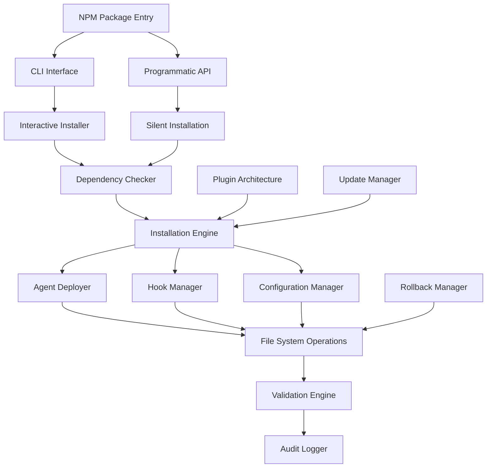

# Technical Requirements Document

# Claude Configuration Node.js Installer Module

**Document Version**: 1.0
**Created**: 2025-01-18
**Status**: Draft
**Project Type**: NPM Module Development
**Target Timeline**: 12 weeks (3 phases)

## 1. System Context & Constraints

### 1.1 Project Overview

Converting the existing 600+ line bash installation script (`install.sh`) to a professional Node.js NPM module with enhanced functionality, cross-platform support, and enterprise features.

### 1.2 System Constraints

- **Platform Support**: macOS, Linux, Windows
- **Node.js Version**: ≥18.0.0 LTS
- **Python Requirement**: 3.8+ (for existing hook compatibility)
- **External Dependencies**: git, jq, npm/yarn
- **Installation Time**: <30 seconds target
- **Success Rate**: >99% reliability
- **Backward Compatibility**: Full compatibility with existing `.claude/` structure

### 1.3 Integration Context

- **Claude Code Runtime**: Primary integration target
- **Existing Infrastructure**: 25+ agents, commands, hooks, settings.json
- **Git Workflow**: Version tracking, conflict resolution
- **CI/CD Pipeline**: Automated testing and deployment
- **NPM Ecosystem**: Package distribution and versioning

## 2. Architecture Overview

### 2.1 High-Level Architecture



### 2.2 Core Components

#### 2.2.1 CLI Interface (`bin/claude-installer`)
- Interactive installation with inquirer.js
- Progress reporting with ora/cli-progress
- Colored output with chalk
- Error recovery and user guidance

#### 2.2.2 Installation Engine (`src/engine/`)
- Modular installation pipeline
- Plugin architecture for extensibility
- Dependency resolution and validation
- Cross-platform file operations

#### 2.2.3 Configuration Manager (`src/config/`)
- settings.json management
- CLAUDE.md integration and updates
- Environment-specific configurations
- Version tracking and compatibility

#### 2.2.4 Agent & Hook Deployer (`src/deployers/`)
- Agent mesh deployment (25+ agents)
- Command installation and registration
- Hook migration and validation
- Permission and security enforcement

### 2.3 Data Architecture

#### 2.3.1 Installation Manifest Schema

```typescript
interface InstallationManifest {
  version: string;
  timestamp: string;
  installationType: 'global' | 'local';
  components: {
    agents: AgentManifest[];
    commands: CommandManifest[];
    hooks: HookManifest[];
    settings: SettingsManifest;
  };
  dependencies: DependencyManifest;
  validation: ValidationResult;
}

interface AgentManifest {
  name: string;
  path: string;
  checksum: string;
  dependencies: string[];
  tools: string[];
}
```

#### 2.3.2 Configuration Schema

```typescript
interface InstallerConfig {
  installation: {
    type: 'global' | 'local';
    path: string;
    backupEnabled: boolean;
    rollbackSupport: boolean;
  };
  dependencies: {
    node: string;
    python: string;
    git: boolean;
    jq: boolean;
  };
  plugins: PluginConfig[];
  logging: LoggingConfig;
}
```

## 3. API Specifications

### 3.1 CLI Interface

```bash
# Interactive installation
npx @fortium/claude-installer

# Silent installation with options
npx @fortium/claude-installer --type=global --backup --no-interaction

# Update existing installation
npx @fortium/claude-installer --update

# Rollback to previous version
npx @fortium/claude-installer --rollback

# Validation and health check
npx @fortium/claude-installer --validate
```

### 3.2 Programmatic API

```typescript
import { ClaudeInstaller } from '@fortium/claude-installer';

// Basic installation
const installer = new ClaudeInstaller({
  type: 'global',
  backup: true,
  plugins: ['enterprise-logging']
});

await installer.install();

// Advanced usage with callbacks
await installer.install({
  onProgress: (progress) => console.log(`${progress.percentage}%`),
  onError: (error) => handleError(error),
  onComplete: (manifest) => logSuccess(manifest)
});

// Validation and management
await installer.validate();
await installer.update();
await installer.rollback();
```

### 3.3 Plugin API

```typescript
interface InstallerPlugin {
  name: string;
  version: string;

  preInstall?(context: InstallationContext): Promise<void>;
  postInstall?(context: InstallationContext): Promise<void>;
  validate?(context: InstallationContext): Promise<ValidationResult>;
  rollback?(context: InstallationContext): Promise<void>;
}

// Plugin registration
installer.registerPlugin(new EnterpriseLoggingPlugin());
installer.registerPlugin(new CustomValidationPlugin());
```

## 4. Non-Functional Requirements

### 4.1 Performance Requirements

- **Installation Time**: <30 seconds for complete installation
- **Memory Usage**: <100MB during installation
- **CPU Usage**: <50% during peak operations
- **Network Efficiency**: Minimal bandwidth usage with caching
- **Startup Time**: <2 seconds for CLI initialization

### 4.2 Security Requirements

- **Code Signing**: All distributed packages must be signed
- **Checksum Validation**: SHA-256 verification for all installed files
- **Permission Management**: Minimal required permissions
- **Audit Trail**: Complete installation audit logging
- **Secure Defaults**: Conservative security settings by default

### 4.3 Reliability Requirements

- **Success Rate**: >99% installation success across platforms
- **Error Recovery**: Automatic retry with exponential backoff
- **Rollback Capability**: 100% rollback success for failed installations
- **Idempotency**: Safe to run multiple times without side effects
- **Crash Recovery**: Resume interrupted installations

### 4.4 Usability Requirements

- **Progress Reporting**: Real-time progress with ETA
- **Error Messages**: Clear, actionable error descriptions
- **Help System**: Comprehensive CLI help and documentation
- **Accessibility**: Screen reader compatible output
- **Internationalization**: Multi-language support foundation

## 5. Implementation Plan

### Phase 1: Foundation & Core Engine (Weeks 1-4)

#### Sprint 1.1: Project Setup & Architecture (Week 1)

- [ ] Initialize NPM package with TypeScript configuration (4h)
- [ ] Set up development environment with ESLint, Prettier, Jest (3h)
- [ ] Create basic CLI structure with commander.js (3h)
- [ ] Implement logging system with winston (2h)
- [ ] Set up CI/CD pipeline with GitHub Actions (4h)
- [ ] Create project documentation structure (2h)
- [ ] Design and document core interfaces and types (4h)

#### Sprint 1.2: Dependency Management & Validation (Week 2)

- [ ] Implement dependency checker for Node.js, Python, git, jq (6h)
- [ ] Create cross-platform compatibility layer (5h)
- [ ] Build validation engine with comprehensive checks (4h)
- [ ] Implement error handling and recovery mechanisms (3h)
- [ ] Add progress reporting infrastructure (3h)
- [ ] Create unit tests for core validation logic (3h)

#### Sprint 1.3: File System Operations (Week 3)

- [ ] Implement safe file operations with backup support (5h)
- [ ] Create cross-platform path resolution utilities (3h)
- [ ] Build atomic installation operations (4h)
- [ ] Implement checksum validation for all file operations (3h)
- [ ] Add rollback infrastructure for file operations (4h)
- [ ] Create integration tests for file system layer (3h)

#### Sprint 1.4: Configuration Management (Week 4)

- [ ] Implement settings.json management with validation (4h)
- [ ] Create CLAUDE.md integration and update system (5h)
- [ ] Build configuration merging and conflict resolution (4h)
- [ ] Implement environment-specific configuration handling (3h)
- [ ] Add configuration validation and schema enforcement (3h)
- [ ] Create tests for configuration management (3h)

### Phase 2: Agent & Component Deployment (Weeks 5-8)

#### Sprint 2.1: Agent Deployment System (Week 5)

- [ ] Create agent manifest parsing and validation (4h)
- [ ] Implement agent file deployment with checksums (5h)
- [ ] Build agent dependency resolution system (4h)
- [ ] Add agent tool permission validation (3h)
- [ ] Implement agent registration and indexing (3h)
- [ ] Create comprehensive agent deployment tests (3h)

#### Sprint 2.2: Command & Hook Management (Week 6)

- [ ] Implement command installation and registration (4h)
- [ ] Create hook deployment with Node.js compatibility (5h)
- [ ] Build command validation and testing framework (4h)
- [ ] Add hook migration from Python to Node.js (4h)
- [ ] Implement command discovery and indexing (2h)
- [ ] Create integration tests for commands and hooks (3h)

#### Sprint 2.3: Interactive Installation Flow (Week 7)

- [ ] Build interactive CLI with inquirer.js (5h)
- [ ] Implement progress reporting with visual indicators (4h)
- [ ] Create user choice handling (global/local) (3h)
- [ ] Add real-time validation feedback (3h)
- [ ] Implement error recovery and retry logic (4h)
- [ ] Create comprehensive UX testing (3h)

#### Sprint 2.4: Silent & Programmatic API (Week 8)

- [ ] Implement programmatic installation API (5h)
- [ ] Create silent installation mode with configuration (4h)
- [ ] Build callback system for progress and events (3h)
- [ ] Add comprehensive API documentation (3h)
- [ ] Implement API error handling and validation (3h)
- [ ] Create API integration tests and examples (4h)

### Phase 3: Enterprise Features & Production Readiness (Weeks 9-12)

#### Sprint 3.1: Plugin Architecture (Week 9)

- [ ] Design and implement plugin interface specification (5h)
- [ ] Create plugin registration and lifecycle management (4h)
- [ ] Build plugin validation and security checks (4h)
- [ ] Implement plugin dependency resolution (3h)
- [ ] Add plugin discovery and loading system (3h)
- [ ] Create plugin development documentation and examples (3h)

#### Sprint 3.2: Audit & Logging System (Week 10)

- [ ] Implement comprehensive audit logging (5h)
- [ ] Create installation manifest generation (4h)
- [ ] Build audit trail query and analysis tools (4h)
- [ ] Add security event logging and monitoring (3h)
- [ ] Implement log rotation and cleanup (2h)
- [ ] Create audit system tests and validation (4h)

#### Sprint 3.3: Update & Rollback Management (Week 11)

- [ ] Implement update detection and management (5h)
- [ ] Create rollback system with full state restoration (6h)
- [ ] Build incremental update capabilities (4h)
- [ ] Add update conflict resolution (3h)
- [ ] Implement update validation and testing (3h)
- [ ] Create comprehensive update/rollback tests (3h)

#### Sprint 3.4: Production Deployment & Documentation (Week 12)

- [ ] Finalize NPM package configuration and metadata (3h)
- [ ] Create comprehensive user documentation (5h)
- [ ] Implement telemetry and usage analytics (4h)
- [ ] Add performance monitoring and optimization (4h)
- [ ] Create production deployment pipeline (4h)
- [ ] Conduct final integration testing and validation (4h)

## 6. Test Strategy

### 6.1 Testing Pyramid

#### Unit Tests (Target: >90% coverage)
- Core logic validation
- Configuration management
- File operations
- Error handling
- Plugin system

#### Integration Tests (Target: >80% coverage)
- CLI interface testing
- API integration
- Cross-platform compatibility
- Agent deployment workflows
- Update and rollback scenarios

#### End-to-End Tests (Target: >70% coverage)
- Complete installation flows
- Real-world scenario validation
- Performance benchmarking
- Cross-platform testing matrix
- Rollback and recovery testing

### 6.2 Testing Infrastructure

```typescript
// Jest configuration for comprehensive testing
module.exports = {
  preset: 'ts-jest',
  testEnvironment: 'node',
  coverage: {
    reporters: ['text', 'lcov', 'html'],
    thresholds: {
      global: {
        branches: 80,
        functions: 90,
        lines: 90,
        statements: 90
      }
    }
  },
  testMatch: [
    '**/__tests__/**/*.test.ts',
    '**/*.integration.test.ts',
    '**/*.e2e.test.ts'
  ]
};
```

### 6.3 Cross-Platform Testing Matrix

| Platform | Node.js | Python | Git | jq | Status |
|----------|---------|--------|-----|----|---------|
| macOS 12+ | 18+ | 3.8+ | ✓ | ✓ | ✅ Supported |
| macOS 11 | 18+ | 3.8+ | ✓ | ✓ | ✅ Supported |
| Ubuntu 22.04 | 18+ | 3.8+ | ✓ | ✓ | ✅ Supported |
| Ubuntu 20.04 | 18+ | 3.8+ | ✓ | ✓ | ✅ Supported |
| Windows 11 | 18+ | 3.8+ | ✓ | ✓ | ✅ Supported |
| Windows 10 | 18+ | 3.8+ | ✓ | ✓ | ✅ Supported |

## 7. Security Architecture

### 7.1 Security Requirements

- **Code Integrity**: SHA-256 checksums for all installed files
- **Permission Model**: Minimal required permissions with explicit grants
- **Audit Trail**: Complete installation and modification logging
- **Secure Defaults**: Conservative security settings by default
- **Vulnerability Scanning**: Automated dependency vulnerability checks

### 7.2 Security Implementation

```typescript
interface SecurityConfig {
  checksumValidation: boolean;
  auditLogging: boolean;
  permissionChecks: boolean;
  vulnerabilityScanning: boolean;
  secureDefaults: boolean;
}

class SecurityManager {
  async validateChecksum(file: string, expectedHash: string): Promise<boolean>;
  async auditLog(event: SecurityEvent): Promise<void>;
  async checkPermissions(operation: string): Promise<boolean>;
  async scanVulnerabilities(): Promise<VulnerabilityReport>;
}
```

## 8. Deployment & Migration Strategy

### 8.1 NPM Package Deployment

```json
{
  "name": "@fortium/claude-installer",
  "version": "1.0.0",
  "main": "dist/index.js",
  "bin": {
    "claude-installer": "dist/bin/cli.js"
  },
  "engines": {
    "node": ">=18.0.0"
  },
  "files": [
    "dist/",
    "README.md",
    "LICENSE"
  ]
}
```

### 8.2 Migration from Bash Script

#### Migration Strategy
1. **Parallel Deployment**: Both bash and Node.js installers available during transition
2. **Feature Parity**: Complete feature compatibility before deprecation
3. **User Communication**: Clear migration path and timeline
4. **Rollback Support**: Ability to revert to bash installer if needed

#### Migration Timeline
- **Weeks 1-8**: Development and testing
- **Weeks 9-10**: Beta testing with select users
- **Weeks 11-12**: Production deployment and documentation
- **Week 13+**: Full migration and bash script deprecation

### 8.3 CI/CD Pipeline

```yaml
name: Claude Installer CI/CD

on: [push, pull_request]

jobs:
  test:
    strategy:
      matrix:
        os: [ubuntu-latest, macos-latest, windows-latest]
        node: [18, 20, 21]
    runs-on: ${{ matrix.os }}
    steps:
      - uses: actions/checkout@v4
      - uses: actions/setup-node@v4
        with:
          node-version: ${{ matrix.node }}
      - run: npm ci
      - run: npm test
      - run: npm run test:integration
      - run: npm run test:e2e

  publish:
    needs: test
    if: github.ref == 'refs/heads/main'
    runs-on: ubuntu-latest
    steps:
      - uses: actions/checkout@v4
      - uses: actions/setup-node@v4
        with:
          node-version: 18
          registry-url: 'https://registry.npmjs.org'
      - run: npm ci
      - run: npm run build
      - run: npm publish
        env:
          NODE_AUTH_TOKEN: ${{ secrets.NPM_TOKEN }}
```

## 9. Risk Assessment & Mitigation

### 9.1 Technical Risks

| Risk | Probability | Impact | Mitigation Strategy |
|------|-------------|--------|-------------------|
| Cross-platform compatibility issues | Medium | High | Comprehensive testing matrix, platform-specific code paths |
| Performance degradation | Low | Medium | Performance benchmarking, optimization passes |
| Breaking changes in dependencies | Medium | Medium | Dependency pinning, automated security updates |
| Migration complexity | Medium | High | Thorough testing, parallel deployment, rollback plan |

### 9.2 Business Risks

| Risk | Probability | Impact | Mitigation Strategy |
|------|-------------|--------|-------------------|
| User adoption resistance | Low | Medium | Clear benefits communication, migration support |
| Timeline delays | Medium | Medium | Agile methodology, scope prioritization |
| Quality issues | Low | High | Comprehensive testing, beta program |
| Maintenance overhead | Low | Medium | Good documentation, plugin architecture |

## 10. Success Criteria & Quality Gates

### 10.1 Success Metrics

- **Installation Time**: <30 seconds (baseline: 45-60 seconds)
- **Success Rate**: >99% across all supported platforms
- **User Satisfaction**: >90% positive feedback
- **Productivity Improvement**: 30% reduction in setup time
- **Maintenance Effort**: <20% of current bash script maintenance

### 10.2 Quality Gates

#### Phase 1 Quality Gates
- [ ] All unit tests passing (>90% coverage)
- [ ] Cross-platform compatibility verified
- [ ] Performance benchmarks met
- [ ] Security audit completed
- [ ] Documentation review passed

#### Phase 2 Quality Gates
- [ ] Integration tests passing (>80% coverage)
- [ ] Agent deployment validation complete
- [ ] CLI UX testing passed
- [ ] API documentation complete
- [ ] Beta user feedback incorporated

#### Phase 3 Quality Gates
- [ ] End-to-end tests passing (>70% coverage)
- [ ] Production deployment pipeline verified
- [ ] Security penetration testing completed
- [ ] Performance optimization validated
- [ ] Final user acceptance testing passed

## 11. Monitoring & Analytics

### 11.1 Installation Analytics

```typescript
interface InstallationMetrics {
  platform: string;
  nodeVersion: string;
  installationType: 'global' | 'local';
  duration: number;
  success: boolean;
  errorCode?: string;
  components: string[];
  timestamp: string;
}
```

### 11.2 Performance Monitoring

- Installation duration tracking
- Memory usage monitoring
- Error rate analysis
- Platform-specific performance metrics
- User satisfaction surveys

## 12. Documentation Strategy

### 12.1 User Documentation

- **README.md**: Quick start and basic usage
- **Installation Guide**: Comprehensive installation instructions
- **API Documentation**: Programmatic usage and examples
- **Migration Guide**: Transition from bash script
- **Troubleshooting Guide**: Common issues and solutions

### 12.2 Developer Documentation

- **Architecture Overview**: System design and components
- **Plugin Development**: Creating custom plugins
- **Contributing Guide**: Development setup and processes
- **API Reference**: Complete API documentation
- **Testing Guide**: Testing strategies and execution

## 13. Future Enhancements

### 13.1 Planned Features (Post-V1)

- **Web Dashboard**: Browser-based installation management
- **Cloud Integration**: Remote configuration management
- **Advanced Analytics**: Detailed usage and performance analytics
- **Enterprise SSO**: Single sign-on integration
- **Container Support**: Docker and Kubernetes deployment

### 13.2 Extensibility Points

- **Plugin Ecosystem**: Rich plugin marketplace
- **Custom Validation**: User-defined validation rules
- **Integration Hooks**: Third-party tool integration
- **Theme System**: Customizable CLI appearance
- **Workflow Templates**: Pre-configured installation profiles

---

**Document Status**: Ready for Implementation
**Next Steps**: Begin Phase 1 Sprint 1.1 - Project Setup & Architecture
**Estimated Completion**: 12 weeks from start date
**Success Criteria**: >99% installation success rate, <30 second installation time, 30% productivity improvement