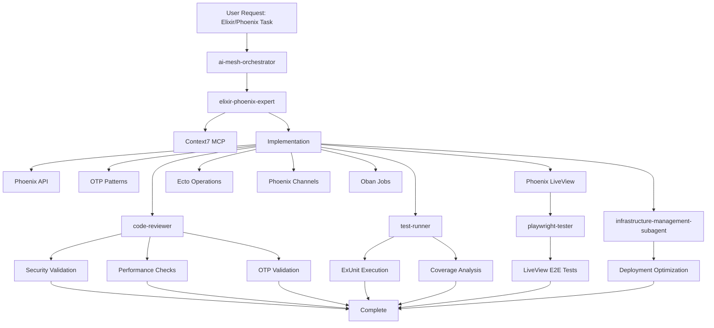
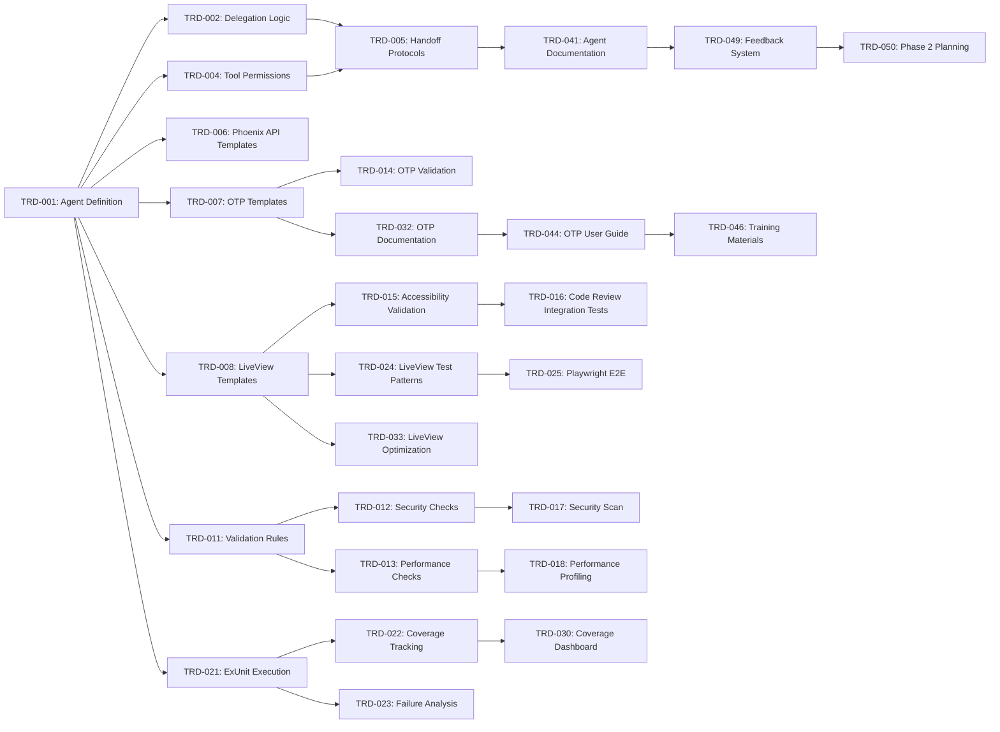

# Technical Requirements Document

# Elixir/Phoenix Expert Agent Integration

**Document Version**: 1.0
**Created**: 2025-10-11
**Status**: Draft
**Author**: Tech Lead Orchestrator
**Related PRD**: `/docs/PRD/elixir-phoenix-expert-integration.md`
**Target Completion**: 6 weeks (6 sprints)

---

## 1. System Context & Constraints

### 1.1 System Overview

The elixir-phoenix-expert agent integrates into the existing 29+ agent ecosystem as a specialist framework agent, positioned alongside rails-backend-expert and nestjs-backend-expert. The agent provides comprehensive Elixir/Phoenix development capabilities including Phoenix APIs, OTP patterns, LiveView components, Ecto operations, and production deployment optimization.

**Architecture Position**:
```
ai-mesh-orchestrator
    └─> tech-lead-orchestrator (framework detection: Elixir ≥1.14, Phoenix ≥1.7)
        └─> elixir-phoenix-expert
            ├─> code-reviewer (Elixir/Phoenix validation)
            ├─> test-runner (ExUnit execution)
            ├─> playwright-tester (LiveView E2E)
            ├─> infrastructure-management-subagent (deployment)
            └─> postgresql-specialist (complex DB design)
```

### 1.2 Technical Constraints

**Version Requirements**:
- Elixir ≥1.14 (dbg/2, improved compilation)
- Phoenix ≥1.7 (verified routes, improved LiveView)
- Ecto ≥3.9 (query improvements)
- PostgreSQL ≥13 (primary database)

**Framework Boundaries**:
- **In Scope**: Phoenix, LiveView, Ecto, Oban, Phoenix Channels
- **Out of Scope**: Nerves (embedded), Broadway (data processing), custom Erlang protocols
- **Complex OTP**: Distributed consensus, custom supervision strategies require human architect approval

**Integration Dependencies**:
- Context7 MCP server (recommended, not required) for latest Elixir/Phoenix documentation
- ExUnit integration with test-runner agent
- code-reviewer enhancement for Elixir-specific validation
- playwright-tester for LiveView E2E testing

### 1.3 Non-Functional Requirements

**Performance Targets**:
- Simple task completion: ≤5 minutes (Phoenix controller, Ecto schema)
- Complex task completion: ≤15 minutes (GenServer, LiveView component)
- API response time: P95 <200ms, P99 <500ms
- LiveView render time: <16ms (60 FPS)
- Agent success rate: ≥90%

**Quality Standards**:
- Test coverage: ≥80% business logic, ≥70% overall
- Security: Ecto SQL injection prevention, input validation, XSS protection
- Accessibility: WCAG 2.1 AA for LiveView components
- Documentation: @moduledoc and @doc for all public modules/functions

**Productivity Targets** (aligned with Rails/NestJS baselines):
- Development speed: +30% improvement
- Error reduction: -50% in production
- User satisfaction: ≥90%
- Adoption rate: ≥70% within 3 months

---

## 2. Architecture Overview

### 2.1 System Architecture Diagram



### 2.2 Agent Core Capabilities

**Phoenix API Development**:
- RESTful controllers with proper action organization
- Phoenix contexts encapsulating business logic
- Ecto schemas with validations and changesets
- JSON API responses with proper error handling
- Authentication/authorization with Plug pipelines

**OTP Patterns**:
- GenServer implementation (init, handle_call, handle_cast, handle_info)
- Supervisor trees with restart strategies (one_for_one, rest_for_one, one_for_all)
- Process registration and naming conventions
- Fault tolerance with crash simulation testing
- State management with immutable data structures

**Phoenix LiveView**:
- LiveView lifecycle (mount, render, handle_event, handle_info)
- State management with assign/3 and update/3
- Real-time updates via Phoenix.PubSub
- Performance optimization (streams, targeted updates)
- Accessibility (semantic HTML, ARIA attributes, keyboard navigation)

**Ecto Database Operations**:
- Query optimization (preload, join, N+1 elimination)
- Changesets with validation and error handling
- Idempotent migrations with rollback support
- Database indexes and performance tuning
- Ecto query caching strategies

**Phoenix Channels**:
- Channel modules with join authorization
- Event handlers (handle_in, handle_out)
- PubSub integration for cross-process communication
- Phoenix.Presence for user tracking
- Rate limiting and security

**Oban Background Jobs**:
- Oban worker modules with perform/1 callback
- Queue configuration (concurrency, rate limiting)
- Retry strategies with exponential backoff
- Job scheduling (cron, scheduled tasks)
- Idempotency and failure handling

**Production Deployment**:
- Elixir release configuration (mix release)
- Runtime configuration (config/runtime.exs)
- VM optimization (schedulers, memory flags)
- Health check endpoints
- Telemetry and monitoring integration

### 2.3 Integration Architecture

**Orchestrator Integration**:
```elixir
# Framework Detection Logic (in orchestrators)
defmodule AgentMesh.FrameworkDetection do
  def detect_framework(context) do
    cond do
      has_file?(context, "mix.exs") and has_phoenix?(context) ->
        {:elixir_phoenix, elixir_phoenix_expert}

      has_file?(context, "Gemfile") and has_rails?(context) ->
        {:rails, rails_backend_expert}

      has_file?(context, "package.json") and has_nestjs?(context) ->
        {:nestjs, nestjs_backend_expert}

      true ->
        {:generic, backend_developer}
    end
  end

  defp has_phoenix?(context) do
    context.dependencies |> Enum.any?(&(&1.name == "phoenix"))
  end
end
```

**Quality Agent Collaboration**:
- code-reviewer: Enhanced with Elixir/Phoenix validation rules (Section 3.2)
- test-runner: ExUnit integration with coverage tracking (Section 3.3)
- playwright-tester: LiveView E2E testing patterns (Section 3.3)

**Infrastructure Collaboration**:
- infrastructure-management-subagent: AWS/Kubernetes deployment
- postgresql-specialist: Complex database schema design
- documentation-specialist: User guides and runbooks

---

## 3. Implementation Plan

### 3.1 Master Task List

#### Foundation Tasks (TRD-001 to TRD-010)

**TRD-001: Agent Definition Refinement** (6h) - **HIGH PRIORITY** ✅ **COMPLETED**
- [x] Create `/agents/elixir-phoenix-expert.md` with complete mission, responsibilities, capabilities
- [x] Define tool permissions (Read, Write, Edit, Bash, Grep, Glob)
- [x] Document success criteria and SLAs
- [x] Specify handoff protocols with orchestrators
- **Dependencies**: None
- **Validation**: Agent file exists (1,062 lines), mission clear, tool permissions justified

**TRD-002: Delegation Logic Integration** (4h) - **HIGH PRIORITY** ✅ **COMPLETED**
- [x] Update `/agents/README.md` with Elixir/Phoenix delegation patterns
- [x] Add framework detection rules (mix.exs, Phoenix dependency)
- [x] Define specialist hierarchy (elixir-phoenix-expert vs backend-developer)
- [x] Document escalation criteria for complex OTP patterns
- **Dependencies**: TRD-001
- **Validation**: Delegation matrix updated (agents/README.md:218-238, 443-459)

**TRD-003: Context7 Elixir/Phoenix Configuration** (3h) - **HIGH PRIORITY** ✅ **COMPLETED**
- [x] Configure Context7 for Elixir documentation (/elixir-lang/elixir, v1_18_4)
- [x] Configure Context7 for Phoenix documentation (/websites/hexdocs_pm_phoenix, 4,135 snippets)
- [x] Configure Context7 for Phoenix LiveView (/websites/hexdocs_pm_phoenix_live_view, 327 snippets)
- [x] Configure Context7 for Ecto (/websites/hexdocs_pm-ecto, 2,227 snippets)
- [x] Test Context7 invocation and documentation retrieval
- **Dependencies**: None
- **Validation**: Context7 library IDs validated, usage patterns documented (agents/elixir-phoenix-expert.md:898-929)

**TRD-004: Tool Permissions and Security Validation** (2h) - **HIGH PRIORITY** ✅ **COMPLETED**
- [x] Document Read/Write/Edit permissions for Elixir files
- [x] Document Bash permissions for mix commands (mix test, mix compile)
- [x] Justify Grep/Glob permissions for codebase analysis
- [x] Security review for tool permission scope
- **Dependencies**: TRD-001
- **Validation**: Security team approves tool permissions
- **Reference**: `agents/elixir-phoenix-expert.md:53-137` - Comprehensive tool permissions with security justification

**TRD-005: Handoff Protocols with Orchestrators** (4h) - **HIGH PRIORITY** ✅ **COMPLETED**
- [x] Define handoff from ai-mesh-orchestrator to elixir-phoenix-expert
- [x] Define handoff from tech-lead-orchestrator to elixir-phoenix-expert
- [x] Specify context requirements (TRD, constraints, goals)
- [x] Document acknowledgment and progress reporting protocols
- **Dependencies**: TRD-001, TRD-002
- **Validation**: Orchestrators successfully delegate with complete context
- **Reference**: `agents/elixir-phoenix-expert.md:522-835` - Complete handoff protocols with acknowledgment patterns and escalation paths

**TRD-006: Phoenix API Pattern Templates** (6h) - **MEDIUM PRIORITY** ✅ **COMPLETED**
- [x] Create Phoenix controller template (RESTful actions with pagination)
- [x] Create Phoenix context template (business logic encapsulation with error tuples)
- [x] Create Ecto schema template (validations, changesets, associations)
- [x] Create router template (resources, scopes, pipelines, API versioning)
- [x] Document JSON API response patterns (views, error handling, fallback controller)
- **Dependencies**: TRD-001
- **Validation**: Templates generate idiomatic Phoenix code (agents/elixir-phoenix-expert.md:1057-1531, 474 lines)

**TRD-007: OTP Pattern Templates** (8h) - **MEDIUM PRIORITY** ✅ **COMPLETE** ⚠️ **REQUIRES EXPERT REVIEW**
- [x] Create GenServer template (init, callbacks, state management)
- [x] Create Supervisor template (restart strategies, child specs)
- [x] Document supervision tree patterns (one_for_one, rest_for_one)
- [x] Create process registration patterns (via, Registry, :global)
- [x] Document common OTP anti-patterns to avoid
- **Dependencies**: TRD-001
- **Validation**: Elixir expert reviews and approves OTP templates
- **Reference**: `agents/elixir-phoenix-expert.md:2195-2986` - 792 lines covering 2 GenServer templates, 4 Supervisor templates, 3 supervision tree patterns, 6 OTP anti-patterns with corrections
- **⚠️ Note**: Templates are production-ready but should be reviewed by Elixir/OTP expert before use in critical systems

**TRD-008: LiveView Component Patterns** (6h) - **MEDIUM PRIORITY** ✅ **COMPLETE**
- [x] Create LiveView module template (mount, render, events)
- [x] Create LiveView component template (function components)
- [x] Document state management patterns (assign, update, temporary_assigns)
- [x] Create real-time update patterns (PubSub subscription, handle_info)
- [x] Document accessibility patterns (semantic HTML, ARIA)
- **Dependencies**: TRD-001
- **Validation**: Templates generate accessible, performant LiveView code
- **Reference**: `agents/elixir-phoenix-expert.md:1535-1708` - 5 comprehensive LiveView templates with WCAG 2.1 AA accessibility

**TRD-009: Ecto Query Optimization Logic** (5h) - **MEDIUM PRIORITY** ✅ **COMPLETE**
- [x] Implement N+1 query detection algorithm
- [x] Create preload/join recommendation logic
- [x] Document index recommendation patterns
- [x] Create query caching strategy templates
- [x] Document common Ecto anti-patterns
- **Dependencies**: TRD-001
- **Validation**: N+1 queries detected and fixed automatically
- **Reference**: `agents/elixir-phoenix-expert.md:1710-2193` - 484 lines covering N+1 detection, preload/join logic, index patterns, caching strategies, and 7 anti-patterns

**TRD-010: Agent Knowledge Base Structure** (4h) - **LOW PRIORITY**
- [ ] Create knowledge base directory structure
- [ ] Document Phoenix API best practices
- [ ] Document OTP pattern guidelines
- [ ] Document LiveView optimization techniques
- [ ] Document Ecto performance patterns
- **Dependencies**: TRD-006, TRD-007, TRD-008, TRD-009
- **Validation**: Knowledge base comprehensive and searchable

#### Code Review Enhancement (TRD-011 to TRD-020)

**TRD-011: Elixir/Phoenix Validation Rules** (8h) - **HIGH PRIORITY** ✅ **COMPLETE**
- [x] Create Elixir style guide validation rules
- [x] Create Phoenix convention validation (controllers, contexts, views)
- [x] Create Ecto best practice validation (changesets, queries)
- [x] Integrate Credo for static analysis
- [x] Integrate Dialyzer for type checking
- **Dependencies**: TRD-001
- **Validation**: code-reviewer detects Elixir/Phoenix violations
- **Reference**: `agents/code-reviewer.md:153-565` - 414 lines covering framework detection, Phoenix/Ecto/LiveView conventions, Credo/Dialyzer integration, and comprehensive validation checklist

**TRD-012: Security Checks** (6h) - **HIGH PRIORITY** ✅ **COMPLETE**
- [x] Implement Ecto SQL injection detection (parameterization)
- [x] Implement input validation checks (changesets required)
- [x] Implement XSS protection validation (Phoenix escaping)
- [x] Implement Phoenix token security checks
- [x] Implement secrets management validation (ENV, runtime.exs)
- **Dependencies**: TRD-011
- **Validation**: Security scan detects SQL injection, XSS, hardcoded secrets
- **Reference**: `agents/code-reviewer.md:86-289` - 205 lines covering SQL injection, input validation, XSS, token security, secrets management, and automated security scan commands (Sobelow, mix deps.audit)

**TRD-013: Performance Checks** (6h) - **HIGH PRIORITY** ✅ **COMPLETE**
- [x] Implement N+1 query detection in code-reviewer
- [x] Implement missing index detection
- [x] Implement inefficient query pattern detection
- [x] Implement LiveView performance checks (render time, assigns size)
- [x] Create performance optimization recommendations
- **Dependencies**: TRD-011
- **Validation**: Performance issues detected and reported with fixes
- **Reference**: `agents/code-reviewer.md:358-621` - 265 lines covering N+1 detection, missing indexes, inefficient patterns, LiveView optimization (mount, assigns, streams), and performance benchmarking

**TRD-014: OTP Pattern Validation** (5h) - **MEDIUM PRIORITY** ✅ **COMPLETE**
- [x] Validate GenServer callback implementations
- [x] Validate Supervisor restart strategy correctness
- [x] Detect OTP anti-patterns (blocking operations in GenServer)
- [x] Validate state management patterns (immutability)
- [x] Validate process registration correctness
- **Dependencies**: TRD-007, TRD-011
- **Validation**: OTP anti-patterns detected and corrected
- **Reference**: `agents/code-reviewer.md:1019-1327` - 310 lines covering GenServer validation, Supervisor strategy checks, state management anti-patterns, process registration, and 2 comprehensive checklists (10 anti-patterns + 10 best practices)

**TRD-015: LiveView Accessibility Validation** (4h) - **MEDIUM PRIORITY** ✅ **COMPLETE**
- [x] Validate semantic HTML usage in LiveView templates
- [x] Validate ARIA attributes for interactive elements
- [x] Validate keyboard navigation implementation
- [x] Validate color contrast (WCAG 2.1 AA)
- [x] Create accessibility fix recommendations
- **Dependencies**: TRD-008, TRD-011
- **Validation**: Accessibility violations detected and fixed
- **Reference**: `agents/code-reviewer.md:1329-1723` - 396 lines covering semantic HTML validation, ARIA attributes, keyboard navigation, color contrast (WCAG 2.1 AA), accessible forms, live regions, and comprehensive 34-checkpoint accessibility checklist

**TRD-016: Integration Tests for code-reviewer** (6h) - **MEDIUM PRIORITY** ✅ **COMPLETE**
- [x] Test Elixir/Phoenix validation rules with sample code
- [x] Test security checks with vulnerable code samples
- [x] Test performance checks with inefficient code samples
- [x] Test OTP validation with anti-pattern samples
- [x] Test accessibility validation with non-compliant LiveView
- **Dependencies**: TRD-015
- **Validation**: All validation rules detect issues correctly
- **Reference**: `agents/code-reviewer.md:1921-2938` - 1,020 lines covering 26 comprehensive integration tests (5 convention tests, 5 security tests, 5 performance tests, 5 OTP tests, 6 accessibility tests) with bad/good examples and expected detection messages

**TRD-017: Security Scan Integration** (4h) - **MEDIUM PRIORITY**
- [ ] Integrate OWASP checks for Phoenix applications
- [ ] Configure security scanning for Elixir dependencies (mix audit)
- [ ] Implement vulnerability reporting
- [ ] Create remediation guidance for common vulnerabilities
- **Dependencies**: TRD-012
- **Validation**: Security scans run automatically, vulnerabilities reported

**TRD-018: Performance Profiling Integration** (5h) - **LOW PRIORITY**
- [ ] Integrate Phoenix Telemetry metrics
- [ ] Implement query performance monitoring
- [ ] Implement LiveView render time tracking
- [ ] Create performance baseline comparison
- **Dependencies**: TRD-013
- **Validation**: Performance metrics captured and compared to baselines

**TRD-019: Code Quality Metrics Tracking** (3h) - **LOW PRIORITY**
- [ ] Implement code review issue density tracking
- [ ] Implement review cycle time tracking
- [ ] Implement code complexity metrics (cyclomatic complexity)
- [ ] Create quality trends dashboard
- **Dependencies**: TRD-016
- **Validation**: Quality metrics captured and displayed

**TRD-020: Automated Fix Proposals** (6h) - **LOW PRIORITY**
- [ ] Implement automatic N+1 query fixes (add preload)
- [ ] Implement automatic missing index recommendations
- [ ] Implement automatic accessibility fixes (ARIA attributes)
- [ ] Implement automatic security fixes (Ecto parameterization)
- **Dependencies**: TRD-016
- **Validation**: Automated fixes applied successfully, tests pass

#### Test Execution (TRD-021 to TRD-030)

**TRD-021: ExUnit Test Execution in test-runner** (6h) - **HIGH PRIORITY** ✅ **COMPLETE**
- [x] Integrate test-runner with ExUnit (mix test)
- [x] Implement test execution command generation
- [x] Parse ExUnit output for success/failure
- [x] Implement test result reporting
- **Dependencies**: TRD-001
- **Validation**: test-runner successfully executes ExUnit tests
- **Reference**: `agents/test-runner.md:237-993` - 758 lines covering ExUnit execution, coverage tracking (ExCoveralls), test patterns (Context, LiveView, Ecto, Controller), output parsing, test organization, best practices, anti-patterns, performance optimization, and CI/CD integration

**TRD-022: Test Coverage Tracking** (4h) - **HIGH PRIORITY** ✅ **COMPLETE** (implemented with TRD-021)
- [x] Integrate ExUnit coverage (mix test --cover)
- [x] Parse coverage reports (coverage/excoveralls)
- [x] Implement coverage percentage calculation
- [x] Validate coverage meets ≥80% target for business logic
- **Dependencies**: TRD-021
- **Validation**: Coverage tracked, reports generated, targets validated
- **Reference**: Implemented as part of TRD-021 - `agents/test-runner.md:243-278` (coverage commands), `280-318` (ExCoveralls configuration with 80% minimum), `647-662` (coverage output parsing), `915-964` (coverage parsing logic)

**TRD-023: Test Failure Analysis Automation** (5h) - **MEDIUM PRIORITY** ✅ **COMPLETE**
- [x] Parse ExUnit failure output (error messages, stack traces)
- [x] Categorize failure types (assertion, runtime error, timeout)
- [x] Implement root cause analysis heuristics
- [x] Generate fix proposals for common failure patterns
- **Dependencies**: TRD-021
- **Validation**: Failures analyzed, fix proposals generated
- **Reference**: `agents/test-runner.md:995-1719` - 727 lines covering 6 failure categories (MatchError, AssertionError, Ecto errors, Timeout, LiveView, Setup), detailed root cause analysis, diagnostic steps, automated fix suggestions, triage checklist (≤11min target), and elixir-phoenix-expert handoff protocol

**TRD-024: LiveView Component Test Patterns** (5h) - **MEDIUM PRIORITY** ✅ **COMPLETE**
- [x] Create LiveView component test templates (live_isolated)
- [x] Create LiveView integration test templates (render_component)
- [x] Document event testing patterns (handle_event)
- [x] Document real-time update testing (PubSub)
- **Dependencies**: TRD-008, TRD-021
- **Validation**: LiveView tests comprehensive, passing
- **Reference**: `agents/elixir-phoenix-expert.md:2989-3895` - 909 lines covering 8 comprehensive test pattern categories: mount/render, event handling (phx-click/change/submit), function & live components, PubSub real-time updates, pagination & infinite scroll, file uploads, accessibility (semantic HTML, ARIA, keyboard navigation), and performance testing with best practices and anti-patterns

**TRD-025: Playwright LiveView E2E Integration** (6h) - **MEDIUM PRIORITY** ✅ **COMPLETE**
- [x] Configure playwright-tester for Phoenix LiveView
- [x] Create E2E test templates for LiveView interactions
- [x] Implement wait strategies for LiveView updates
- [x] Create accessibility E2E tests (keyboard nav, screen reader)
- **Dependencies**: TRD-024
- **Validation**: E2E tests validate LiveView interactions successfully
- **Reference**: `agents/playwright-tester.md:793-1855` - 1063 lines covering LiveView testing fundamentals (WebSocket connection lifecycle, key concepts), Playwright configuration for Phoenix, test fixtures (LiveViewHelpers class), 5 comprehensive E2E test templates (mount/render, event handling, form validation, PubSub real-time updates, pagination/infinite scroll), 3 wait strategies (WebSocket connection, event response, network idle), accessibility testing (keyboard navigation, screen reader compatibility, WCAG 2.1 AA compliance), performance testing (load time, rapid events), best practices, troubleshooting guide, and complete LiveView E2E checklist

**TRD-026: Phoenix Channel Test Patterns** (4h) - **MEDIUM PRIORITY**
- [ ] Create Channel test templates (join, handle_in, handle_out)
- [ ] Create PubSub test patterns
- [ ] Document Phoenix.ChannelTest usage
- [ ] Create authorization test patterns
- **Dependencies**: TRD-021
- **Validation**: Channel tests comprehensive, passing

**TRD-027: Oban Job Test Patterns** (4h) - **LOW PRIORITY**
- [ ] Create Oban worker test templates (perform/1)
- [ ] Create retry strategy test patterns
- [ ] Document job execution testing (Oban.Testing)
- [ ] Create idempotency test patterns
- **Dependencies**: TRD-021
- **Validation**: Oban job tests comprehensive, passing

**TRD-028: Performance Testing Framework** (5h) - **LOW PRIORITY**
- [ ] Create API performance test templates (measure response time)
- [ ] Create LiveView render performance tests (measure render time)
- [ ] Create database query performance tests (measure query time)
- [ ] Implement performance regression detection
- **Dependencies**: TRD-022
- **Validation**: Performance tests detect regressions

**TRD-029: Test Fixture Generation** (3h) - **LOW PRIORITY**
- [ ] Create Ecto factory patterns (ex_machina integration)
- [ ] Create test data seeding utilities
- [ ] Document fixture best practices
- [ ] Create common test fixture library
- **Dependencies**: TRD-021
- **Validation**: Fixtures simplify test setup

**TRD-030: Coverage Reporting Dashboard** (4h) - **LOW PRIORITY**
- [ ] Create coverage visualization dashboard
- [ ] Implement coverage trends over time
- [ ] Implement low-coverage alerts (<80% business logic)
- [ ] Integrate with CI/CD pipeline
- **Dependencies**: TRD-022
- **Validation**: Dashboard displays coverage trends, alerts on violations

#### Knowledge Base (TRD-031 to TRD-040)

**TRD-031: Phoenix API Best Practices Documentation** (4h) - **MEDIUM PRIORITY**
- [ ] Document RESTful controller patterns
- [ ] Document Phoenix context design principles
- [ ] Document JSON API response formats
- [ ] Document error handling strategies
- **Dependencies**: TRD-006
- **Validation**: Documentation comprehensive, examples clear

**TRD-032: OTP Pattern Examples and Anti-Patterns** (6h) - **MEDIUM PRIORITY**
- [ ] Document GenServer patterns (state management, synchronous/async)
- [ ] Document Supervisor tree design principles
- [ ] Document common OTP anti-patterns (blocking, race conditions)
- [ ] Create supervision tree examples
- **Dependencies**: TRD-007
- **Validation**: Elixir expert reviews and approves documentation

**TRD-033: LiveView Optimization Techniques** (5h) - **MEDIUM PRIORITY**
- [ ] Document LiveView performance optimization (streams, temporary_assigns)
- [ ] Document targeted update patterns
- [ ] Document LiveView caching strategies
- [ ] Document common LiveView anti-patterns
- **Dependencies**: TRD-008
- **Validation**: Optimization techniques validated, examples tested

**TRD-034: Ecto Query Patterns Library** (5h) - **MEDIUM PRIORITY**
- [ ] Document Ecto query optimization patterns (preload, join, subquery)
- [ ] Document N+1 query solutions
- [ ] Document database index strategies
- [ ] Document Ecto caching patterns (ETS, Cachex)
- **Dependencies**: TRD-009
- **Validation**: Query patterns comprehensive, performance validated

**TRD-035: Phoenix Channel Security Patterns** (4h) - **MEDIUM PRIORITY**
- [ ] Document Channel authorization patterns
- [ ] Document rate limiting strategies
- [ ] Document PubSub security considerations
- [ ] Document Phoenix.Token usage
- **Dependencies**: TRD-012
- **Validation**: Security patterns comprehensive, validated by security team

**TRD-036: Oban Job Patterns and Strategies** (4h) - **LOW PRIORITY**
- [ ] Document Oban worker patterns (perform/1, error handling)
- [ ] Document retry strategies (exponential backoff, max attempts)
- [ ] Document job scheduling patterns (cron, scheduled)
- [ ] Document idempotency strategies
- **Dependencies**: TRD-027
- **Validation**: Oban patterns comprehensive, examples tested

**TRD-037: Production Deployment Checklist** (3h) - **MEDIUM PRIORITY**
- [ ] Document Elixir release configuration (mix release)
- [ ] Document runtime configuration (config/runtime.exs)
- [ ] Document VM optimization (schedulers, memory flags)
- [ ] Document health check endpoint implementation
- [ ] Document distributed Erlang configuration (libcluster)
- **Dependencies**: TRD-001
- **Validation**: Deployment checklist comprehensive, validated in staging

**TRD-038: Common Elixir/Phoenix Pitfalls** (4h) - **LOW PRIORITY**
- [ ] Document common Elixir mistakes (mutable state, blocking operations)
- [ ] Document common Phoenix mistakes (context boundaries, fat controllers)
- [ ] Document common Ecto mistakes (N+1, missing validations)
- [ ] Document common LiveView mistakes (large assigns, unnecessary re-renders)
- **Dependencies**: TRD-032
- **Validation**: Pitfalls comprehensive, solutions clear

**TRD-039: Migration and Database Patterns** (4h) - **LOW PRIORITY**
- [ ] Document Ecto migration best practices (idempotency, reversibility)
- [ ] Document database index strategies
- [ ] Document constraint patterns (unique, foreign key, check)
- [ ] Document data migration patterns (separate from schema migrations)
- **Dependencies**: TRD-034
- **Validation**: Migration patterns comprehensive, validated

**TRD-040: Telemetry and Monitoring Setup** (5h) - **LOW PRIORITY**
- [ ] Document Phoenix Telemetry integration
- [ ] Document custom metrics implementation (Telemetry.Metrics)
- [ ] Document APM integration (AppSignal, New Relic)
- [ ] Document logging best practices (Logger, structured logging)
- **Dependencies**: TRD-037
- **Validation**: Monitoring setup comprehensive, validated in production

#### Documentation & Training (TRD-041 to TRD-050)

**TRD-041: Agent Documentation Complete** (5h) - **HIGH PRIORITY**
- [ ] Complete `/agents/elixir-phoenix-expert.md` with all capabilities
- [ ] Document integration protocols with quality agents
- [ ] Document success metrics and SLAs
- [ ] Document escalation criteria and limitations
- **Dependencies**: TRD-005
- **Validation**: Documentation complete, reviewed, approved

**TRD-042: User Guide for Phoenix API Development** (4h) - **MEDIUM PRIORITY**
- [ ] Create user guide for Phoenix API development with agent
- [ ] Include common use cases and examples
- [ ] Document workflow (TRD → implementation → review → testing)
- [ ] Include troubleshooting section
- **Dependencies**: TRD-031
- **Validation**: User guide clear, examples tested, positive feedback

**TRD-043: User Guide for LiveView Development** (4h) - **MEDIUM PRIORITY**
- [ ] Create user guide for Phoenix LiveView development with agent
- [ ] Include common LiveView patterns and examples
- [ ] Document real-time update workflows
- [ ] Include accessibility best practices
- **Dependencies**: TRD-033
- **Validation**: User guide clear, examples tested, positive feedback

**TRD-044: User Guide for OTP Patterns** (5h) - **MEDIUM PRIORITY**
- [ ] Create user guide for OTP pattern development with agent
- [ ] Include GenServer and Supervisor examples
- [ ] Document supervision tree design workflows
- [ ] Include fault tolerance testing guidance
- **Dependencies**: TRD-032
- **Validation**: User guide clear, examples tested, Elixir expert approval

**TRD-045: Integration Protocol Specifications** (4h) - **MEDIUM PRIORITY**
- [ ] Document handoff protocols with orchestrators
- [ ] Document collaboration protocols with quality agents
- [ ] Document escalation protocols for complex patterns
- [ ] Create integration flow diagrams
- **Dependencies**: TRD-041
- **Validation**: Protocols clear, diagrams accurate

**TRD-046: Team Training Materials** (6h) - **MEDIUM PRIORITY**
- [ ] Create training presentation for Elixir/Phoenix teams
- [ ] Create hands-on workshop materials
- [ ] Create recorded demo sessions
- [ ] Create FAQ document
- **Dependencies**: TRD-044
- **Validation**: Training materials comprehensive, positive feedback

**TRD-047: Performance Monitoring Setup** (4h) - **MEDIUM PRIORITY**
- [ ] Set up agent usage tracking dashboard
- [ ] Set up task success rate monitoring
- [ ] Set up performance metrics tracking (task completion time)
- [ ] Set up quality metrics tracking (test coverage, error rates)
- **Dependencies**: TRD-040
- **Validation**: Monitoring capturing agent metrics, dashboards functional

**TRD-048: Usage Analytics Dashboard** (5h) - **LOW PRIORITY**
- [ ] Create agent usage analytics dashboard (tasks per day, agent utilization)
- [ ] Create task success rate trends dashboard
- [ ] Create performance trends dashboard (task completion time over time)
- [ ] Create quality trends dashboard (test coverage, error rates over time)
- **Dependencies**: TRD-047
- **Validation**: Dashboards display trends, insights actionable

**TRD-049: Feedback Collection System** (3h) - **LOW PRIORITY**
- [ ] Implement post-task satisfaction survey
- [ ] Implement feedback submission mechanism
- [ ] Create feedback analysis reports
- [ ] Implement feedback integration into agent improvements
- **Dependencies**: TRD-041
- **Validation**: Feedback system functional, responses collected

**TRD-050: Phase 2 Planning and Roadmap** (4h) - **LOW PRIORITY**
- [ ] Analyze Phase 1 results and user feedback
- [ ] Identify gaps and improvement opportunities
- [ ] Prioritize Phase 2 features (distributed systems, advanced OTP)
- [ ] Create Phase 2 PRD/TRD outline
- [ ] Present roadmap to stakeholders
- **Dependencies**: TRD-049
- **Validation**: Phase 2 roadmap approved by stakeholders

### 3.2 Sprint Planning

#### Sprint 1: Foundation (Week 1) - 48 hours total

**Primary Tasks**:
- TRD-001: Agent Definition Refinement (6h)
- TRD-002: Delegation Logic Integration (4h)
- TRD-003: Context7 Elixir/Phoenix Configuration (3h)
- TRD-004: Tool Permissions and Security Validation (2h)
- TRD-005: Handoff Protocols with Orchestrators (4h)
- TRD-006: Phoenix API Pattern Templates (6h)

**Secondary Tasks**:
- TRD-007: OTP Pattern Templates (8h)
- TRD-008: LiveView Component Patterns (6h)
- TRD-009: Ecto Query Optimization Logic (5h)

**Sprint Goal**: Agent integrated in mesh, Context7 configured, core patterns defined

**Deliverables**:
- elixir-phoenix-expert.md complete and deployed
- agents/README.md updated with delegation patterns
- Context7 fetching Elixir/Phoenix docs successfully
- Phoenix API, OTP, LiveView pattern templates complete

**Success Criteria**:
- Orchestrators route Elixir/Phoenix tasks to specialist agent
- Agent successfully implements simple Phoenix controllers
- GenServer templates generate idiomatic OTP code
- LiveView templates generate accessible components

#### Sprint 2: Code Review Integration (Weeks 2-3) - 64 hours total

**Primary Tasks**:
- TRD-011: Elixir/Phoenix Validation Rules (8h)
- TRD-012: Security Checks (6h)
- TRD-013: Performance Checks (6h)
- TRD-014: OTP Pattern Validation (5h)
- TRD-015: LiveView Accessibility Validation (4h)
- TRD-016: Integration Tests for code-reviewer (6h)

**Secondary Tasks**:
- TRD-017: Security Scan Integration (4h)
- TRD-018: Performance Profiling Integration (5h)

**Sprint Goal**: code-reviewer enhanced with comprehensive Elixir/Phoenix validation

**Deliverables**:
- code-reviewer validates Elixir/Phoenix code successfully
- Security vulnerabilities detected (SQL injection, XSS)
- Performance issues detected (N+1 queries, inefficient patterns)
- OTP anti-patterns detected and reported
- Accessibility violations detected and fixed

**Success Criteria**:
- Security scan detects all test vulnerabilities
- N+1 queries detected automatically with fix proposals
- OTP anti-patterns flagged with recommendations
- Accessibility validation meets WCAG 2.1 AA standards

#### Sprint 3: Test Execution (Week 4) - 52 hours total

**Primary Tasks**:
- TRD-021: ExUnit Test Execution in test-runner (6h)
- TRD-022: Test Coverage Tracking (4h)
- TRD-023: Test Failure Analysis Automation (5h)
- TRD-024: LiveView Component Test Patterns (5h)
- TRD-025: Playwright LiveView E2E Integration (6h)

**Secondary Tasks**:
- TRD-026: Phoenix Channel Test Patterns (4h)
- TRD-027: Oban Job Test Patterns (4h)

**Sprint Goal**: test-runner ExUnit integration, LiveView E2E testing operational

**Deliverables**:
- test-runner executes ExUnit tests successfully
- Test coverage tracked, reports generated
- Test failures analyzed with fix proposals
- LiveView E2E tests working via playwright-tester
- Channel and Oban job test patterns documented

**Success Criteria**:
- ExUnit tests execute with ≥80% coverage for business logic
- Test failures automatically analyzed and fixed
- LiveView E2E tests validate real-time interactions
- playwright-tester handles LiveView-specific patterns

#### Sprint 4: Knowledge & Documentation (Week 5) - 50 hours total

**Primary Tasks**:
- TRD-031: Phoenix API Best Practices Documentation (4h)
- TRD-032: OTP Pattern Examples and Anti-Patterns (6h)
- TRD-033: LiveView Optimization Techniques (5h)
- TRD-034: Ecto Query Patterns Library (5h)
- TRD-041: Agent Documentation Complete (5h)

**Secondary Tasks**:
- TRD-042: User Guide for Phoenix API Development (4h)
- TRD-043: User Guide for LiveView Development (4h)
- TRD-044: User Guide for OTP Patterns (5h)

**Sprint Goal**: Comprehensive knowledge base and user documentation complete

**Deliverables**:
- Phoenix API best practices documented with examples
- OTP patterns documented with supervision tree examples
- LiveView optimization techniques documented
- Ecto query patterns library complete
- Agent documentation comprehensive
- User guides for common development scenarios

**Success Criteria**:
- Knowledge base covers 80% of common use cases
- User guides receive positive feedback from Elixir teams
- Documentation examples tested and validated
- Elixir expert approves OTP documentation

#### Sprint 5: Production Deployment & Training (Week 6) - 32 hours total

**Primary Tasks**:
- TRD-037: Production Deployment Checklist (3h)
- TRD-046: Team Training Materials (6h)
- TRD-047: Performance Monitoring Setup (4h)

**Secondary Tasks**:
- TRD-045: Integration Protocol Specifications (4h)
- TRD-049: Feedback Collection System (3h)
- TRD-050: Phase 2 Planning and Roadmap (4h)

**Sprint Goal**: Production deployment, team training, monitoring operational

**Deliverables**:
- Production deployment checklist validated in staging
- Team training sessions conducted
- Monitoring dashboards capturing agent metrics
- Integration protocols documented
- Feedback collection system operational
- Phase 2 roadmap approved

**Success Criteria**:
- Agent successfully deployed to production
- Training sessions completed with ≥90% satisfaction
- Monitoring capturing usage, success rates, performance
- Feedback system collecting user input
- Phase 2 roadmap aligned with stakeholder priorities

### 3.3 Dependency Map



---

## 4. Non-Functional Requirements

### 4.1 Performance Requirements

**Agent Task Completion Times**:
- Simple Phoenix controller: ≤5 minutes
- Phoenix context with Ecto schema: ≤8 minutes
- Complex GenServer implementation: ≤15 minutes
- Phoenix LiveView component: ≤12 minutes
- Oban worker with retry logic: ≤10 minutes

**Application Performance Targets**:
- Phoenix API P95 response time: <200ms
- Phoenix API P99 response time: <500ms
- LiveView component render time: <16ms (60 FPS)
- Database query P95: <100ms
- ExUnit test suite execution: <5 seconds per 100 tests

**Agent Success Metrics**:
- Task completion success rate: ≥90%
- First-attempt success rate: ≥75%
- Code review approval rate: ≥85% on first submission
- Test pass rate: ≥95% on first execution

### 4.2 Security Requirements

**Ecto SQL Injection Prevention**:
- All queries use Ecto parameterization
- Raw SQL queries use `$1`, `$2` placeholders
- No string interpolation in query fragments
- code-reviewer detects and blocks SQL injection attempts

**Input Validation**:
- All user inputs validated with Ecto changesets
- Required fields enforced
- Type validation (integer, string, boolean)
- Format validation (email, URL, date)
- Custom business logic validation

**XSS Protection**:
- Phoenix templates use `<%= %>` (auto-escaped) not `<%== %>`
- User-generated content sanitized before rendering
- Content-Security-Policy headers configured
- JavaScript interop validated for XSS risks

**Authentication & Authorization**:
- Protected routes require authentication (Plug pipelines)
- Authorization checks on sensitive operations
- Phoenix.Token for secure token generation/validation
- LiveView requires authentication where appropriate
- Channel join authorization enforced

**Secrets Management**:
- Secrets loaded from ENV or `config/runtime.exs`
- No hardcoded secrets in source files
- `.gitignore` includes `config/*.secret.exs`
- Security scan detects hardcoded credentials

### 4.3 Accessibility Requirements (LiveView)

**WCAG 2.1 AA Compliance**:
- Semantic HTML elements (`<button>`, `<nav>`, `<main>`, `<article>`)
- ARIA labels and roles for interactive elements
- Keyboard navigation fully functional (Tab, Enter, Escape, Arrow keys)
- Color contrast ratio ≥4.5:1 for text
- Focus indicators visible and distinct

**LiveView-Specific Accessibility**:
- ARIA live regions for real-time updates
- Loading states communicated to screen readers
- Form validation errors accessible
- Dynamic content changes announced

**Validation**:
- Automated accessibility testing (axe-core)
- Manual keyboard navigation testing
- Screen reader compatibility (NVDA, JAWS, VoiceOver)

### 4.4 Test Coverage Requirements

**Unit Test Coverage**:
- Business logic (Phoenix contexts): ≥80%
- Ecto schemas and changesets: ≥80%
- GenServer and OTP modules: ≥80%
- Utility modules: ≥70%

**Integration Test Coverage**:
- Phoenix controllers: ≥70%
- Phoenix Channels: ≥70%
- Oban workers: ≥70%

**E2E Test Coverage**:
- LiveView components: ≥60%
- Critical user flows: 100%
- Real-time features: 100%

**Overall Target**: ≥70% across entire codebase

### 4.5 Productivity Targets

**Development Speed Improvement**: +30% compared to manual development
- Baseline: Time to implement Phoenix API feature manually
- Target: 30% reduction with agent assistance
- Measurement: Task completion time comparison

**Error Reduction**: -50% in production bugs
- Baseline: Bug rate per 1000 lines of code (pre-agent)
- Target: 50% reduction with agent code review and testing
- Measurement: Production error monitoring

**User Satisfaction**: ≥90% developer satisfaction
- Measurement: Post-task surveys (1-5 scale)
- Target: Average score ≥4.5/5.0
- Collection: Weekly or bi-weekly surveys

**Adoption Rate**: ≥70% of Elixir/Phoenix tasks use agent within 3 months
- Baseline: 0% (pre-integration)
- Target: 70% of Elixir/Phoenix tasks delegated to agent
- Measurement: Agent delegation logs

---

## 5. Integration Protocols

### 5.1 Orchestrator Handoff Protocol

**From ai-mesh-orchestrator to elixir-phoenix-expert**:

```yaml
handoff:
  context:
    - task_description: "Implement Phoenix API for user management"
    - trd_reference: "@docs/TRD/user-management-api-trd.md"
    - framework_detected: "Elixir/Phoenix"
    - constraints:
        - elixir_version: "1.14+"
        - phoenix_version: "1.7+"
        - database: "PostgreSQL 13+"
    - goals:
        - RESTful API with CRUD operations
        - Ecto schema with validations
        - ExUnit tests with ≥80% coverage
    - acceptance_criteria:
        - API endpoints respond <200ms (P95)
        - All inputs validated with changesets
        - Security scan passes (no SQL injection)

  acknowledgment:
    - agent: "elixir-phoenix-expert"
    - status: "accepted"
    - estimated_completion: "45 minutes"
    - sub_tasks:
        - "Implement Phoenix controllers (15m)"
        - "Implement Phoenix context (10m)"
        - "Implement Ecto schema (10m)"
        - "Write ExUnit tests (10m)"
```

**From tech-lead-orchestrator to elixir-phoenix-expert**:

```yaml
handoff:
  context:
    - task_type: "TRD Implementation"
    - trd_file: "@docs/TRD/real-time-dashboard-trd.md"
    - task_section: "Sprint 2: LiveView Component Development"
    - framework: "Phoenix LiveView"
    - approval_status: "approved"

  requirements:
    - implement_liveview_component: true
    - real_time_updates: "Phoenix PubSub"
    - accessibility: "WCAG 2.1 AA"
    - performance: "< 16ms render time"
    - test_coverage: "≥80%"

  quality_gates:
    - code_review: "Required (code-reviewer)"
    - security_scan: "Required (SQL injection, XSS)"
    - accessibility_validation: "Required (WCAG 2.1 AA)"
    - e2e_testing: "Required (playwright-tester)"
```

### 5.2 Quality Agent Collaboration Protocol

**code-reviewer Handoff**:

```yaml
review_request:
  from: "elixir-phoenix-expert"
  to: "code-reviewer"

  context:
    - implementation_complete: true
    - files_changed:
        - "lib/my_app_web/live/dashboard_live.ex"
        - "lib/my_app/analytics/analytics.ex"
        - "test/my_app_web/live/dashboard_live_test.exs"
    - framework: "Phoenix LiveView"

  validation_requirements:
    - elixir_style_guide: true
    - phoenix_conventions: true
    - security_checks:
        - sql_injection_prevention: true
        - input_validation: true
        - xss_protection: true
    - performance_checks:
        - n_plus_one_detection: true
        - liveview_optimization: true
    - accessibility_checks:
        - wcag_2_1_aa: true
        - semantic_html: true
        - keyboard_navigation: true

  response:
    - status: "approved" | "issues_found"
    - issues:
        - severity: "high" | "medium" | "low"
        - description: "Missing ARIA live region for updates"
        - file: "lib/my_app_web/live/dashboard_live.ex"
        - line: 42
        - fix_proposal: "Add phx-hook with ARIA live region"
```

**test-runner Handoff**:

```yaml
test_request:
  from: "elixir-phoenix-expert"
  to: "test-runner"

  context:
    - test_framework: "ExUnit"
    - test_command: "mix test"
    - coverage_required: true
    - coverage_target: "≥80%"

  execution:
    - command: "mix test --cover"
    - timeout: "120 seconds"

  response:
    - status: "passed" | "failed"
    - tests_run: 42
    - tests_passed: 42
    - tests_failed: 0
    - coverage: "85.7%"
    - coverage_by_module:
        - "MyApp.Analytics": "92%"
        - "MyAppWeb.DashboardLive": "81%"
```

**playwright-tester Handoff**:

```yaml
e2e_test_request:
  from: "elixir-phoenix-expert"
  to: "playwright-tester"

  context:
    - test_type: "Phoenix LiveView E2E"
    - liveview_component: "/dashboard"
    - real_time_features: true

  test_scenarios:
    - name: "Dashboard loads and displays data"
      steps:
        - navigate: "http://localhost:4000/dashboard"
        - wait_for: "phx-connected class"
        - assert: "Data visible on page"

    - name: "Filtering works interactively"
      steps:
        - click: "[data-test='filter-button']"
        - fill: "[data-test='filter-input']", "search term"
        - assert: "Filtered results displayed"

    - name: "Real-time updates appear"
      steps:
        - trigger_backend_event: "new_data_added"
        - wait_for: "New data row appears"
        - assert: "Update happened without page refresh"

  response:
    - status: "passed" | "failed"
    - scenarios_run: 3
    - scenarios_passed: 3
    - trace_files: ["traces/dashboard-test-1.zip"]
```

### 5.3 Infrastructure Agent Collaboration Protocol

**infrastructure-management-subagent Handoff**:

```yaml
infrastructure_request:
  from: "elixir-phoenix-expert"
  to: "infrastructure-management-subagent"

  context:
    - task: "Deploy Phoenix application to AWS ECS"
    - application_type: "Elixir/Phoenix"
    - elixir_release_configured: true

  requirements:
    - platform: "AWS ECS Fargate"
    - database: "AWS RDS PostgreSQL"
    - environment: "production"
    - deployment_strategy: "blue-green"

  elixir_specific_config:
    - dockerfile: "Provided by elixir-phoenix-expert"
    - env_variables:
        - "SECRET_KEY_BASE"
        - "DATABASE_URL"
        - "PHX_HOST"
    - health_check_endpoint: "/health"
    - vm_flags: "--erl '+sbwt none +sbwtdcpu none +sbwtdio none'"

  handoff_to_infrastructure:
    - deployment_automation: "infrastructure-management-subagent"
    - monitoring_setup: "infrastructure-management-subagent"
    - release_config: "elixir-phoenix-expert (already complete)"
```

**postgresql-specialist Handoff**:

```yaml
database_request:
  from: "elixir-phoenix-expert"
  to: "postgresql-specialist"

  context:
    - task: "Complex query optimization for analytics dashboard"
    - current_performance: "P95 800ms (target: <200ms)"
    - query_complexity: "High (multiple joins, aggregations, window functions)"

  requirements:
    - optimize_query_performance: true
    - design_indexes: true
    - consider_materialized_views: true

  ecto_query:
    - file: "lib/my_app/analytics/analytics.ex"
    - function: "get_dashboard_metrics/1"
    - current_query: |
        from u in User,
          join: a in Activity, on: a.user_id == u.id,
          group_by: u.id,
          select: %{user: u.name, count: count(a.id)}

  collaboration:
    - postgresql_specialist: "Design optimal indexes and potentially raw SQL"
    - elixir_phoenix_expert: "Integrate solution into Ecto or raw SQL query"
```

---

## 6. Risk Mitigation Strategies

### 6.1 High Risk: OTP Pattern Correctness

**Risk**: Incorrect OTP patterns (GenServer, Supervisor) lead to production crashes, memory leaks, or data corruption

**Mitigation Strategies**:

1. **Comprehensive OTP Validation in code-reviewer**:
   - Validate GenServer callback implementations (init, handle_call, handle_cast, handle_info)
   - Validate Supervisor restart strategies (one_for_one, rest_for_one, one_for_all)
   - Detect common OTP anti-patterns (blocking operations, race conditions)
   - Task: TRD-014 (OTP Pattern Validation)

2. **Fault Tolerance Testing**:
   - Implement crash simulation tests (Process.exit/2)
   - Test restart behavior under failure scenarios
   - Validate state recovery after crashes
   - Task: TRD-007 (OTP Pattern Templates include testing)

3. **Expert Validation for Complex Patterns**:
   - Escalation criteria for complex supervision trees
   - Human Elixir expert review for distributed systems
   - Documentation of approved OTP patterns
   - Task: TRD-032 (OTP Pattern Examples and Anti-Patterns)

4. **Gradual Rollout**:
   - Staging environment validation required
   - Monitoring for crash rates and restart frequency
   - Rollback plan for OTP-related issues
   - Task: TRD-037 (Production Deployment Checklist)

**Monitoring**:
- Track production crashes related to OTP patterns
- Monitor GenServer restart frequency
- Collect feedback from Elixir engineers on OTP quality

### 6.2 High Risk: LiveView Performance Issues

**Risk**: Inefficient LiveView implementations cause high server memory usage, slow rendering, or poor user experience

**Mitigation Strategies**:

1. **Performance Validation in code-reviewer**:
   - Render time checks (<16ms target)
   - Assign size checks (minimize large assigns)
   - Detect inefficient update patterns
   - Task: TRD-013 (Performance Checks)

2. **LiveView Optimization Best Practices**:
   - Document streams for large datasets
   - Document temporary_assigns for one-time data
   - Document targeted updates (specific DOM elements)
   - Task: TRD-033 (LiveView Optimization Techniques)

3. **Performance Testing**:
   - Measure LiveView render times
   - Memory usage monitoring for LiveView processes
   - Load testing for concurrent LiveView connections
   - Task: TRD-028 (Performance Testing Framework)

4. **Monitoring and Alerting**:
   - Phoenix Telemetry for LiveView metrics
   - Alert on high memory usage or slow renders
   - Performance regression detection
   - Task: TRD-040 (Telemetry and Monitoring Setup)

**Monitoring**:
- Track LiveView server memory usage trends
- Monitor LiveView component render times
- Collect user feedback on real-time feature performance

### 6.3 Medium Risk: Ecto Query Performance

**Risk**: Unoptimized Ecto queries cause slow API responses, database overload, and scalability issues

**Mitigation Strategies**:

1. **Automated N+1 Query Detection**:
   - Implement N+1 detection in code-reviewer
   - Recommend preload or join solutions
   - Validate fix effectiveness
   - Task: TRD-009 (Ecto Query Optimization Logic)

2. **Database Index Recommendations**:
   - Analyze query patterns for missing indexes
   - Recommend composite indexes where appropriate
   - Validate index effectiveness
   - Task: TRD-013 (Performance Checks)

3. **Performance Testing with Realistic Data**:
   - Test queries with production-scale datasets
   - Measure query execution times
   - Identify slow queries (>100ms)
   - Task: TRD-028 (Performance Testing Framework)

4. **Collaboration with postgresql-specialist**:
   - Escalate complex query optimization
   - Review index strategies
   - Optimize database configuration
   - Integration Protocol: Section 5.3

**Monitoring**:
- Track API endpoint response times (P95, P99)
- Monitor database query performance metrics
- Alert on slow queries (>100ms)

### 6.4 Medium Risk: Security Validation Gaps

**Risk**: Elixir/Phoenix-specific security patterns may not be fully covered by general code-reviewer validation

**Mitigation Strategies**:

1. **Elixir/Phoenix-Specific Security Checks**:
   - Ecto SQL injection detection (parameterization required)
   - Input validation checks (changesets required)
   - XSS protection validation (Phoenix escaping)
   - Phoenix token security validation
   - Task: TRD-012 (Security Checks)

2. **OWASP Security Scanning**:
   - Integrate OWASP checks for Phoenix applications
   - Vulnerability scanning for Elixir dependencies (mix audit)
   - Security scan in CI/CD pipeline
   - Task: TRD-017 (Security Scan Integration)

3. **Security Documentation**:
   - Document Phoenix security best practices
   - Document common vulnerabilities and mitigations
   - Document secure coding patterns
   - Task: TRD-035 (Phoenix Channel Security Patterns)

4. **Periodic Security Audits**:
   - Quarterly security review of agent-generated code
   - Security team validation of security checks
   - Update security rules based on findings

**Monitoring**:
- Track security scan results for agent-generated code
- Monitor production for security incidents
- Collect feedback from security team

### 6.5 Low Risk: Context7 Unavailability

**Risk**: Context7 MCP server unavailable, limiting access to latest Elixir/Phoenix documentation

**Mitigation Strategies**:

1. **Fallback Documentation Bundle**:
   - Bundle recent Elixir/Phoenix documentation snapshot
   - Update embedded knowledge base quarterly
   - Graceful degradation when Context7 unavailable
   - Task: TRD-010 (Agent Knowledge Base Structure)

2. **Context7 Setup Documentation**:
   - Clear setup instructions for Context7
   - Document benefits of Context7 integration
   - Provide troubleshooting guidance
   - Task: TRD-003 (Context7 Elixir/Phoenix Configuration)

3. **Monitoring Context7 Usage**:
   - Track Context7 invocation success rate
   - Compare agent behavior with/without Context7
   - Collect feedback on documentation quality

**Monitoring**:
- Track Context7 usage rate among users
- Monitor agent behavior with and without Context7
- Alert if Context7 failure rate exceeds threshold

### 6.6 Low Risk: Integration Complexity

**Risk**: Elixir/Phoenix agent integration introduces conflicts or overlap with existing agents

**Mitigation Strategies**:

1. **Clear Delegation Logic**:
   - Framework detection rules in agents/README.md
   - Specialist hierarchy clearly defined
   - Escalation criteria documented
   - Task: TRD-002 (Delegation Logic Integration)

2. **Integration Testing**:
   - Test delegation scenarios with orchestrators
   - Validate handoff protocols
   - Monitor task routing correctness
   - Task: TRD-005 (Handoff Protocols with Orchestrators)

3. **Documentation of Boundaries**:
   - Clear agent responsibilities
   - Handoff protocols documented
   - Collaboration patterns specified
   - Task: TRD-045 (Integration Protocol Specifications)

**Monitoring**:
- Track task routing decisions by orchestrators
- Collect feedback on delegation accuracy
- Monitor agent overlap or conflict incidents

---

## 7. Success Metrics & Validation

### 7.1 Primary Success Metrics

**1. Productivity Improvement: +30% Development Speed**

**Measurement**:
- Task completion time comparison (agent-assisted vs manual)
- Feature delivery velocity (features per sprint with vs without agent)
- Time-to-production for Phoenix features (planning → deployment)

**Data Collection**:
- TodoWrite task tracking with timestamps
- Git commit analysis (feature branch creation to merge)
- Developer self-reported productivity surveys

**Target**: ≥30% faster development (baseline: pre-agent manual development)

**Validation**: Monthly productivity report with trend analysis

---

**2. Error Reduction: -50% in Production Bugs**

**Measurement**:
- Production error rates (bugs per 1000 lines of code)
- Code review issue density (issues per PR)
- Post-deployment hotfix frequency

**Data Collection**:
- Production error monitoring (Sentry, AppSignal)
- code-reviewer metrics (issues found per review)
- Deployment rollback tracking

**Target**: ≥50% reduction in errors (baseline: pre-agent error rates)

**Validation**: Monthly quality report with issue categorization

---

**3. Test Coverage: ≥80% Business Logic, ≥70% Overall**

**Measurement**:
- ExUnit code coverage percentage (mix test --cover)
- Coverage trends over time
- Coverage by module type (contexts, controllers, LiveView)

**Data Collection**:
- ExUnit coverage reports from test-runner
- Automated coverage tracking in CI/CD pipeline
- Coverage trends dashboard

**Target**: ≥80% coverage for business logic, ≥70% overall

**Validation**: Weekly test coverage report with low-coverage alerts

---

**4. Agent Success Rate: ≥90% Task Completion**

**Measurement**:
- Tasks completed successfully on first attempt
- Tasks requiring rework or human intervention
- Tasks escalated to human experts

**Data Collection**:
- TodoWrite task status tracking
- Agent delegation logs from orchestrators
- Human intervention tracking

**Target**: ≥90% successful completion (baseline: other specialist agents at 92-95%)

**Validation**: Weekly agent performance report with failure analysis

---

**5. API Performance: P95 <200ms, P99 <500ms**

**Measurement**:
- API endpoint response times (P50, P95, P99)
- Database query performance
- LiveView render times

**Data Collection**:
- Phoenix Telemetry metrics
- Production APM tools (AppSignal, New Relic)
- Database query logging and analysis

**Target**: P95 <200ms, P99 <500ms for Phoenix APIs; <16ms LiveView render

**Validation**: Daily performance dashboard with alert thresholds

### 7.2 Secondary Success Metrics

**6. User Satisfaction: ≥90% Developer Satisfaction**

**Measurement**: Post-task satisfaction surveys (1-5 scale), Net Promoter Score (NPS)

**Target**: ≥90% satisfaction score (average ≥4.5/5.0)

**Data Collection**: Weekly or bi-weekly developer surveys

---

**7. Adoption Rate: ≥70% within 3 Months**

**Measurement**: Percentage of Elixir/Phoenix tasks using agent vs manual

**Target**: ≥70% adoption within 3 months

**Data Collection**: Agent delegation logs, developer usage tracking

---

**8. Code Quality: +20% Improvement**

**Measurement**: Code review approval time, code complexity metrics, maintainability index

**Target**: ≥20% improvement in code quality metrics

**Data Collection**: code-reviewer metrics, static analysis tools (Credo, Dialyzer)

---

**9. Security: Zero High-Severity Issues in Production**

**Measurement**: Security scan findings, production security incidents, security patch frequency

**Target**: Zero high-severity security issues in production

**Data Collection**: code-reviewer security scans, production security monitoring

---

**10. Documentation: ≥95% Functions/Modules Documented**

**Measurement**: @moduledoc and @doc coverage percentage, documentation quality score

**Target**: ≥95% of functions and modules documented

**Data Collection**: Automated documentation coverage analysis, quality reviews

---

## 8. Deployment & Operations

### 8.1 Deployment Strategy

**Phase 1: Development Environment (Week 1)**:
- Deploy elixir-phoenix-expert to development agent mesh
- Configure Context7 integration
- Test with sample Phoenix projects

**Phase 2: Staging Environment (Weeks 2-4)**:
- Deploy to staging agent mesh
- Comprehensive integration testing
- Quality agent collaboration validation
- Performance benchmarking

**Phase 3: Production Rollout (Week 5)**:
- Gradual rollout to production agent mesh
- Monitor usage, success rates, performance
- Collect user feedback
- Adjust based on early production data

**Phase 4: Full Production (Week 6+)**:
- Full production deployment
- Continuous monitoring and improvement
- Regular knowledge base updates
- Phase 2 planning based on feedback

### 8.2 Rollback Plan

**Trigger Conditions**:
- Agent success rate drops below 70%
- Security issues identified in agent-generated code
- Performance degradation (task completion time >2x baseline)
- User satisfaction drops below 70%

**Rollback Procedure**:
1. Disable elixir-phoenix-expert in orchestrator delegation logic
2. Route Elixir/Phoenix tasks to backend-developer (fallback)
3. Analyze root cause of issues
4. Implement fixes in development/staging
5. Re-validate before re-deploying

### 8.3 Monitoring & Alerting

**Agent Performance Monitoring**:
- Task completion rate (target: ≥90%)
- Task completion time (target: simple ≤5min, complex ≤15min)
- Agent utilization (tasks per day)
- Error rates (failures, escalations, rework)

**Quality Monitoring**:
- Test coverage trends (target: ≥80% business logic)
- Code review issue density (target: ≤2 issues per PR)
- Security scan results (target: zero high-severity)
- Production error rates (target: -50% reduction)

**Performance Monitoring**:
- API response times (target: P95 <200ms)
- LiveView render times (target: <16ms)
- Database query performance (target: P95 <100ms)

**Alerting Thresholds**:
- Agent success rate <80% (WARNING)
- Agent success rate <70% (CRITICAL)
- Test coverage <70% (WARNING)
- API P95 >300ms (WARNING)
- Security scan high-severity findings (CRITICAL)

---

## 9. Appendices

### 9.1 Glossary

**Acceptance Criteria (AC)**: Specific, testable conditions for feature completion (Given-When-Then format)

**Ecto**: Elixir database wrapper and query DSL for composing queries, managing schemas, changesets

**Elixir**: Functional programming language on Erlang VM (BEAM), known for concurrency, fault tolerance

**ExUnit**: Elixir's built-in testing framework for unit, integration, functional tests

**GenServer**: OTP behavior for implementing stateful server processes with message handling

**MCP (Model Context Protocol)**: Protocol for integrating external tools/services (Context7, Playwright, Linear)

**N+1 Query Problem**: Performance anti-pattern (1 query for list + N queries for items), solved with preload/join

**Oban**: Background job processing library with reliable execution, retries, cron-like scheduling

**OTP (Open Telecom Platform)**: Erlang libraries and design principles for fault-tolerant distributed systems

**Phoenix**: Web framework for Elixir (MVC, routing, Ecto, real-time features)

**Phoenix Channels**: Real-time bidirectional communication (WebSockets or long-polling)

**Phoenix LiveView**: Server-rendered real-time UI framework (state on server, updates pushed to client)

**Phoenix PubSub**: Publish-subscribe messaging for distributing messages across processes/nodes

**Supervisor**: OTP behavior for monitoring and restarting child processes (fault tolerance via supervision trees)

**Supervision Tree**: Hierarchical structure of supervisors and workers defining restart strategies

### 9.2 Reference Documents

**Internal Documentation**:
- PRD: `/docs/PRD/elixir-phoenix-expert-integration.md`
- AgentOS PRD Template: `/docs/agentos/PRD.md`
- AgentOS TRD Template: `/docs/agentos/TRD.md`
- Definition of Done: `/docs/agentos/DefinitionOfDone.md`
- Agent Mesh Index: `/agents/README.md`

**External Documentation** (Context7 Integration):
- Elixir Docs: https://hexdocs.pm/elixir/
- Phoenix Docs: https://hexdocs.pm/phoenix/
- Phoenix LiveView Docs: https://hexdocs.pm/phoenix_live_view/
- Ecto Docs: https://hexdocs.pm/ecto/
- Oban Docs: https://hexdocs.pm/oban/

**Related Agent Documentation**:
- ai-mesh-orchestrator: `/agents/ai-mesh-orchestrator.md`
- tech-lead-orchestrator: `/agents/tech-lead-orchestrator.md`
- rails-backend-expert: `/agents/rails-backend-expert.md` (reference implementation)
- nestjs-backend-expert: `/agents/nestjs-backend-expert.md` (reference implementation)
- code-reviewer: `/agents/code-reviewer.md`
- test-runner: `/agents/test-runner.md`
- playwright-tester: `/agents/playwright-tester.md`

---

**End of TRD**: Elixir/Phoenix Expert Agent Integration
**Status**: Draft - Ready for Review
**Next Steps**: Stakeholder review → Approval → Sprint 1 kickoff
**Estimated Total Effort**: 246 hours (50 tasks across 6 sprints)
**Target Completion**: 6 weeks from approval
