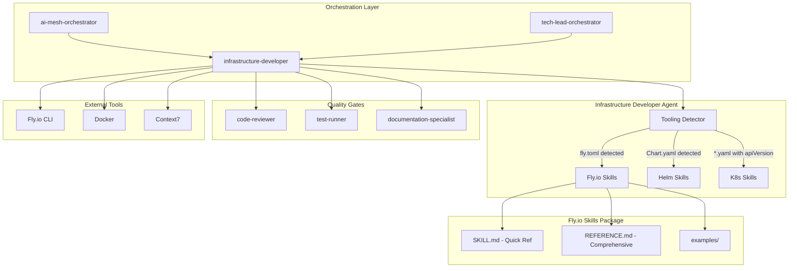

# Technical Requirements Document (TRD)
## Fly.io Infrastructure Integration

**Version**: 1.0
**Date**: 2025-10-25
**PRD Reference**: [flyio-infrastructure-integration.md](../PRD/flyio-infrastructure-integration.md)
**Status**: Implementation Ready
**Implementation Timeline**: 4 weeks (4 sprints × 1 week)

---

## Executive Summary

This TRD outlines the complete technical implementation for **Fly.io Infrastructure Integration** - comprehensive Fly.io support for the infrastructure-developer agent through a skills-based architecture that matches our proven Helm and Kubernetes integration patterns. This enhancement enables developers to deploy applications to Fly.io's modern PaaS platform with the same ease and AI assistance currently available for AWS/Kubernetes deployments.

**Problem Solved**: Development teams lack AI-augmented support for Fly.io deployments, forcing manual configuration of fly.toml files, deployment scripts, and security patterns without best practice guidance. This creates a 2-3 hour deployment setup burden and increases configuration errors.

**Technical Solution**: A comprehensive Fly.io skills package (`skills/flyio/`) integrated with our existing tooling detection system, providing automated fly.toml generation, Dockerfile optimization, multi-environment support, and security-first deployment patterns. The infrastructure-developer agent will auto-detect Fly.io projects and load appropriate skills, maintaining 100% compatibility with existing AWS/K8s workflows.

**Success Metrics**: 60% deployment speed increase (2-3 hours → 30-45 minutes), 90% first-time deployment success, 95%+ detection accuracy, sub-10ms detection performance, 100% security compliance, 85% self-service adoption.

---

## System Architecture & Context

### Agent Ecosystem Integration



### Technical Architecture

#### Core Components

1. **Fly.io Skills Package** (`skills/flyio/`)
   - **SKILL.md**: Quick reference guide (<25KB, <100ms load time)
   - **REFERENCE.md**: Comprehensive guide with 10+ production examples (<50KB)
   - **examples/**: Production-ready templates for common application types

2. **Detection System Integration** (`skills/tooling-detector/`)
   - Multi-signal detection (fly.toml, CLI commands, domain patterns)
   - 95%+ accuracy target, sub-10ms performance
   - Integration with `tooling-patterns.json`

3. **infrastructure-developer Enhancement** (`agents/infrastructure-developer.yaml`)
   - Auto-detect and load Fly.io skills when patterns detected
   - Platform recommendation logic (Fly.io vs K8s decision support)
   - Mixed infrastructure support (hybrid AWS/K8s + Fly.io deployments)

4. **Security Validation Engine**
   - Automated fly.toml security scanning
   - Dockerfile vulnerability assessment
   - Secrets management validation
   - Network security configuration checks

#### Tool Requirements

```yaml
Required Tools:
  - Read/Write/Edit: fly.toml, Dockerfile, deployment scripts generation
  - Bash: Fly.io CLI execution (fly deploy, fly scale, fly secrets)
  - Grep/Glob: Configuration file analysis and project structure detection
  - Context7: Fly.io documentation and best practices reference

Optional Integrations:
  - MCP Servers: Future Fly.io API integration for deployment automation
  - Git Workflow: Infrastructure code versioning and CI/CD integration
```

### Integration Points & Handoff Protocols

```yaml
Handoff From:
  - ai-mesh-orchestrator:
      trigger: Fly.io deployment task delegation
      data: Application requirements, deployment constraints
      format: Task specification with Fly.io context

  - tech-lead-orchestrator:
      trigger: Platform selection and architecture decisions
      data: Technical requirements, architecture design
      format: TRD with infrastructure specifications

  - backend-developer:
      trigger: Application deployment needs
      data: Application type, framework, dependencies
      format: Deployment configuration requirements

  - frontend-developer:
      trigger: Static site or edge deployment
      data: Build configuration, deployment requirements
      format: Frontend deployment specifications

Handoff To:
  - code-reviewer:
      trigger: Fly.io configuration completion
      data: Generated fly.toml, Dockerfile, deployment scripts
      format: Infrastructure code for security validation

  - test-runner:
      trigger: Deployment validation requirement
      data: Test specifications, health check endpoints
      format: Test automation scripts

  - documentation-specialist:
      trigger: Deployment documentation needs
      data: Configuration details, deployment procedures
      format: Technical documentation and runbooks

Collaboration With:
  - git-workflow:
      pattern: Continuous collaboration
      data: Infrastructure code versions, deployment automation
      format: Git operations and CI/CD integration

  - context-fetcher:
      pattern: On-demand collaboration
      data: Fly.io documentation requests, best practices
      format: Context7 integration for real-time documentation
```

---

## Implementation Plan - 4 Week Development Cycle

### Sprint 1: Core Skills Development (Week 1)
**Duration**: 1 week | **Total Estimate**: 40 hours | **Focus**: Foundational Fly.io skills and documentation

#### SKILL.md Creation (Days 1-2)

- [ ] **TRD-001**: Fly.io overview and when to use (2h) - Priority: High
  - Platform introduction and key concepts
  - Comparison with Kubernetes and traditional PaaS
  - Use case decision matrix (when Fly.io vs K8s)
  - Detection criteria and auto-load behavior
  - **Acceptance**: Clear decision framework for platform selection

- [ ] **TRD-002**: fly.toml quick reference (3h) - Priority: High
  - Essential configuration options with examples
  - Common application type templates (Node.js, Python, Go, Ruby, Elixir)
  - Environment-specific configurations (dev, staging, production)
  - **Acceptance**: Cover 80% of common use cases in quick reference format

- [ ] **TRD-003**: Deployment patterns and strategies (2h) - Priority: High
  - Zero-downtime deployments
  - Blue-green deployment configuration
  - Canary release patterns
  - Rollback procedures
  - **Acceptance**: Production-ready deployment patterns documented

- [ ] **TRD-004**: Secrets management quick guide (2h) - Priority: High
  - Fly.io secrets CLI usage
  - Environment variable best practices
  - Multi-environment secret segregation
  - Secrets rotation strategies
  - **Acceptance**: Security-first secrets management patterns

- [ ] **TRD-005**: Networking basics (2h) - Priority: Medium
  - Internal service communication
  - External access configuration
  - Private networking setup
  - Fly Proxy and anycast routing
  - **Acceptance**: Common networking patterns covered

- [ ] **TRD-006**: Health checks configuration (2h) - Priority: High
  - HTTP health check setup
  - TCP health check patterns
  - Script-based health checks
  - Zero-downtime deployment health checks
  - **Acceptance**: Production-ready health check examples

- [ ] **TRD-007**: Scaling patterns overview (2h) - Priority: Medium
  - Horizontal scaling (machine count)
  - Auto-scaling configuration
  - Regional distribution
  - Resource limits and quotas
  - **Acceptance**: Scaling best practices documented

- [ ] **TRD-008**: Common Fly.io commands cheat sheet (2h) - Priority: Medium
  - fly deploy, fly scale, fly secrets, fly regions
  - Monitoring and debugging commands
  - Log access and analysis
  - Status and health check commands
  - **Acceptance**: Complete CLI command reference

- [ ] **TRD-009**: Quick troubleshooting guide (1h) - Priority: Medium
  - Common deployment errors and resolutions
  - Networking and DNS issues
  - Health check failures
  - Resource limit problems
  - **Acceptance**: Cover top 10 common issues

- [ ] **TRD-010**: SKILL.md validation and optimization (2h) - Priority: High - Depends: TRD-001 to TRD-009
  - Content structure and organization review
  - File size optimization (target: <25KB)
  - Load time testing (target: <100ms)
  - Readability and accessibility improvements
  - **Acceptance**: File under 25KB, loads in <100ms, passes readability review

#### REFERENCE.md Creation (Days 3-4)

- [ ] **TRD-011**: Fly.io architecture deep dive (3h) - Priority: High
  - Fly Machines architecture
  - Global regions and anycast networking
  - Fly Proxy and load balancing
  - Storage and volume management
  - **Acceptance**: Comprehensive architecture explanation with diagrams

- [ ] **TRD-012**: Advanced fly.toml configuration (3h) - Priority: High
  - Multi-process applications
  - Custom machine types and resource allocation
  - Volume configuration and persistence
  - Advanced networking patterns
  - **Acceptance**: Cover advanced configuration scenarios

- [ ] **TRD-013**: Production deployment examples (4h) - Priority: High
  - Node.js web application (Express, Next.js)
  - Python web application (Django, Flask, FastAPI)
  - Go microservice with database
  - Ruby on Rails application
  - Elixir Phoenix LiveView application
  - **Acceptance**: 5+ complete, tested production examples

- [ ] **TRD-014**: Database integration patterns (3h) - Priority: High
  - Fly Postgres setup and configuration
  - Redis cache integration
  - External database connections (Supabase, PlanetScale)
  - Connection pooling and optimization
  - Backup and disaster recovery
  - **Acceptance**: Production-ready database patterns

- [ ] **TRD-015**: Monitoring and observability (2h) - Priority: Medium
  - Fly.io logs access and analysis
  - Metrics collection and dashboards
  - Alert configuration
  - Distributed tracing setup
  - Performance monitoring
  - **Acceptance**: Complete observability setup guide

- [ ] **TRD-016**: Security hardening guide (3h) - Priority: High
  - Private networking configuration
  - VPN and secure access setup
  - OAuth/OIDC integration
  - Secrets rotation automation
  - Security best practices checklist
  - **Acceptance**: Production security hardening procedures

- [ ] **TRD-017**: Performance optimization (2h) - Priority: Medium
  - Regional placement strategies
  - Caching configuration
  - CDN integration
  - Machine sizing and resource optimization
  - Network latency reduction
  - **Acceptance**: Performance optimization playbook

- [ ] **TRD-018**: Cost optimization strategies (2h) - Priority: Medium
  - Right-sizing machines for workload
  - Auto-scaling for cost efficiency
  - Reserved capacity planning
  - Cost monitoring and alerts
  - **Acceptance**: Cost optimization best practices

- [ ] **TRD-019**: CI/CD integration patterns (3h) - Priority: Medium
  - GitHub Actions integration
  - GitLab CI/CD pipelines
  - CircleCI configuration
  - Jenkins deployment automation
  - **Acceptance**: Production CI/CD examples for major platforms

- [ ] **TRD-020**: Migration guides (3h) - Priority: Low
  - AWS → Fly.io conversion (informational)
  - Kubernetes → Fly.io migration patterns
  - Heroku → Fly.io migration guide
  - Platform comparison and decision matrix
  - **Acceptance**: Clear migration guidance for common platforms

- [ ] **TRD-021**: REFERENCE.md validation and optimization (2h) - Priority: High - Depends: TRD-011 to TRD-020
  - Content completeness review
  - Example validation and testing
  - File size optimization (target: <50KB)
  - Cross-reference and link validation
  - **Acceptance**: File under 50KB, all examples validated

#### Example Templates (Day 5)

- [ ] **TRD-022**: Node.js application templates (3h) - Priority: High
  - Express.js REST API (fly.toml, Dockerfile, deploy.sh)
  - Next.js web application with static exports
  - NestJS microservice with health checks
  - **Acceptance**: 3 production-ready Node.js templates

- [ ] **TRD-023**: Python application templates (3h) - Priority: High
  - Django web application with PostgreSQL
  - FastAPI microservice with async
  - Flask application with Redis cache
  - **Acceptance**: 3 production-ready Python templates

- [ ] **TRD-024**: Go microservice template (2h) - Priority: Medium
  - Go HTTP server with graceful shutdown
  - Dockerfile multi-stage build optimization
  - Health checks and metrics endpoints
  - **Acceptance**: Production-ready Go template

- [ ] **TRD-025**: Ruby on Rails template (2h) - Priority: Medium
  - Rails API application
  - Database integration (PostgreSQL)
  - Background job processing (Sidekiq)
  - **Acceptance**: Production-ready Rails template

- [ ] **TRD-026**: Elixir Phoenix LiveView template (2h) - Priority: Low
  - Phoenix LiveView application
  - PostgreSQL database integration
  - Real-time updates configuration
  - **Acceptance**: Production-ready Phoenix template

- [ ] **TRD-027**: Database integration examples (2h) - Priority: Medium
  - Fly Postgres deployment and configuration
  - Redis cache setup
  - External database connection examples
  - **Acceptance**: Database integration templates

- [ ] **TRD-028**: Static site deployment template (1h) - Priority: Low
  - Static HTML/CSS/JS deployment
  - React/Vue build and deploy
  - CDN and caching configuration
  - **Acceptance**: Static site deployment template

- [ ] **TRD-029**: Background worker template (2h) - Priority: Low
  - Background job processing (Node.js, Python)
  - Queue integration (Redis, RabbitMQ)
  - Worker scaling configuration
  - **Acceptance**: Background worker template

- [ ] **TRD-030**: Multi-region deployment example (2h) - Priority: Low
  - Multi-region fly.toml configuration
  - Regional database replication
  - Traffic routing and failover
  - **Acceptance**: Multi-region deployment template

- [ ] **TRD-031**: Example templates validation (2h) - Priority: High - Depends: TRD-022 to TRD-030
  - Test all templates on live Fly.io environment
  - Validate Dockerfile builds
  - Test deployment scripts
  - Security scanning of all examples
  - **Acceptance**: All templates tested and validated in production

#### Sprint 1 Goals & Definition of Done

- [ ] SKILL.md completed under 25KB with <100ms load time
- [ ] REFERENCE.md completed under 50KB with 10+ production examples
- [ ] 8-10 example templates created and validated on Fly.io
- [ ] All documentation peer-reviewed by Fly.io experts
- [ ] Content structure matches Helm/K8s skills format
- [ ] Examples tested on live Fly.io deployments
- [ ] Security best practices validated
- [ ] File size and performance targets met

---

### Sprint 2: Detection System Integration (Week 2)
**Duration**: 1 week | **Total Estimate**: 40 hours | **Focus**: Tooling detection and infrastructure-developer enhancement

#### Detection Pattern Development (Days 1-2)

- [ ] **TRD-032**: Update tooling-patterns.json with Fly.io signals (3h) - Priority: High
  - Add fly.toml file detection (weight: 0.7)
  - Add Fly.io CLI command patterns (weight: 0.3)
  - Add fly.io domain patterns (weight: 0.2)
  - Add Dockerfile Fly.io optimization patterns (weight: 0.1)
  - Define minimum confidence threshold (70%)
  - **Acceptance**: Complete signal definitions in tooling-patterns.json

- [ ] **TRD-033**: Implement fly.toml file detection (2h) - Priority: High
  - File existence check for fly.toml in project root
  - File content validation (TOML format)
  - Signal weight: 0.7 (primary signal)
  - **Acceptance**: 100% accuracy for fly.toml detection

- [ ] **TRD-034**: Implement Fly.io CLI command detection (3h) - Priority: High
  - Pattern matching in shell scripts (.sh, .bash)
  - Detect: fly deploy, fly launch, fly scale, fly secrets, flyctl commands
  - Signal weight: 0.3 (secondary signal)
  - **Acceptance**: Detect CLI commands in scripts with 95%+ accuracy

- [ ] **TRD-035**: Implement Fly.io domain pattern detection (2h) - Priority: Medium
  - Pattern matching in configuration files (.toml, .yaml, .json, .env)
  - Detect: .fly.dev, .fly.io, fly_app_name, FLY_APP_NAME
  - Signal weight: 0.2 (tertiary signal)
  - **Acceptance**: Detect domain patterns with 90%+ accuracy

- [ ] **TRD-036**: Implement Dockerfile optimization detection (2h) - Priority: Low
  - Pattern matching in Dockerfile for Fly.io-specific patterns
  - Detect: flyctl references, Fly.io deployment comments
  - Signal weight: 0.1 (quaternary signal)
  - **Acceptance**: Detect Fly.io Dockerfiles with 85%+ accuracy

- [ ] **TRD-037**: Multi-signal confidence calculation (3h) - Priority: High - Depends: TRD-032 to TRD-036
  - Implement weighted signal aggregation
  - Add 10% confidence boost for 3+ signals
  - Calculate final confidence score
  - Apply 70% minimum threshold
  - **Acceptance**: Confidence calculation matches specification

- [ ] **TRD-038**: Detection performance optimization (2h) - Priority: High
  - File system scanning optimization
  - Pattern matching performance tuning
  - Caching for repeated detections
  - Target: Sub-10ms detection time
  - **Acceptance**: Detection completes in 1-10ms

#### Detection Testing (Days 2-3)

- [ ] **TRD-039**: Create detection test suite (4h) - Priority: High
  - Test project 1: fly.toml only (expect 80% confidence)
  - Test project 2: fly.toml + CLI commands (expect 100% confidence)
  - Test project 3: CLI commands only (expect 60% confidence, below threshold)
  - Test project 4: fly.toml + domain patterns (expect 100% confidence)
  - Test project 5: Mixed K8s + Fly.io (expect both detected)
  - Test project 6-20: Diverse real-world projects
  - **Acceptance**: 20+ test projects with expected confidence scores

- [ ] **TRD-040**: Validate detection accuracy (3h) - Priority: High - Depends: TRD-039
  - Run test suite against all test projects
  - Measure true positive rate (target: 95%+)
  - Measure false positive rate (target: <5%)
  - Validate confidence score accuracy
  - **Acceptance**: 95%+ detection accuracy across test suite

- [ ] **TRD-041**: Performance benchmark validation (2h) - Priority: High - Depends: TRD-040
  - Measure detection time for each test project
  - Average detection time across all projects
  - Identify performance outliers
  - Optimize slow detection paths
  - **Acceptance**: Sub-10ms average detection time

- [ ] **TRD-042**: False positive/negative analysis (2h) - Priority: Medium - Depends: TRD-040
  - Analyze false positive cases
  - Analyze false negative cases
  - Tune detection weights to reduce errors
  - Document edge cases and limitations
  - **Acceptance**: <5% false positive/negative rate

- [ ] **TRD-043**: Multi-tool detection validation (2h) - Priority: Medium
  - Test Fly.io + Helm detection
  - Test Fly.io + Kubernetes detection
  - Test Fly.io + AWS detection
  - Validate priority and conflict resolution
  - **Acceptance**: Multi-tool detection works correctly

#### infrastructure-developer Enhancement (Days 4-5)

- [ ] **TRD-044**: Add Fly.io capability section to agent YAML (3h) - Priority: High
  - Document Fly.io auto-detection behavior
  - List core Fly.io capabilities
  - Define when to use Fly.io vs Kubernetes
  - Document mixed infrastructure support
  - **Acceptance**: Complete Fly.io capability documentation in agent YAML

- [ ] **TRD-045**: Implement auto-load logic for skills/flyio/ (4h) - Priority: High - Depends: TRD-037
  - Detection trigger integration
  - SKILL.md auto-load when confidence ≥70%
  - REFERENCE.md load on-demand
  - Example template access
  - **Acceptance**: Automatic skill loading when Fly.io detected

- [ ] **TRD-046**: Platform recommendation logic (4h) - Priority: High
  - Decision framework: Fly.io vs Kubernetes vs AWS
  - Input: application requirements, team expertise, scale, budget
  - Output: platform recommendation with rationale
  - Trade-off analysis (cost, complexity, features)
  - **Acceptance**: Intelligent platform recommendations with clear rationale

- [ ] **TRD-047**: Mixed infrastructure support (3h) - Priority: Medium
  - Detect and load multiple platform skills
  - Handle Fly.io + Kubernetes projects
  - Handle Fly.io + AWS projects
  - Service placement recommendations
  - **Acceptance**: Support hybrid multi-platform deployments

- [ ] **TRD-048**: Integration testing with agent mesh (3h) - Priority: High - Depends: TRD-044 to TRD-047
  - Test handoff from ai-mesh-orchestrator
  - Test handoff from tech-lead-orchestrator
  - Test handoff to code-reviewer
  - Test collaboration with context-fetcher
  - **Acceptance**: All agent handoffs working correctly

- [ ] **TRD-049**: End-to-end workflow validation (3h) - Priority: High - Depends: TRD-048
  - Test complete workflow: detection → skill load → configuration generation
  - Test multi-environment deployment workflow
  - Test security validation workflow
  - Test documentation generation workflow
  - **Acceptance**: Complete end-to-end workflows functional

- [ ] **TRD-050**: Performance testing (2h) - Priority: High - Depends: TRD-049
  - Skill loading performance (<100ms target)
  - Configuration generation performance (<30s target)
  - End-to-end workflow performance
  - Memory usage profiling
  - **Acceptance**: All performance targets met

#### Sprint 2 Goals & Definition of Done

- [ ] Detection system achieves 95%+ accuracy across 20+ test projects
- [ ] Sub-10ms detection performance validated
- [ ] infrastructure-developer agent enhanced with Fly.io capabilities
- [ ] Auto-load logic functional for skills/flyio/
- [ ] Platform recommendation logic implemented and tested
- [ ] Mixed infrastructure support working (K8s + Fly.io, AWS + Fly.io)
- [ ] Zero breaking changes to existing workflows validated
- [ ] All integration tests passing
- [ ] Performance benchmarks met (<100ms skill load, sub-10ms detect)

---

### Sprint 3: Production Hardening & Beta Testing (Week 3)
**Duration**: 1 week | **Total Estimate**: 40 hours | **Focus**: Security validation, documentation, and beta deployment

#### User Documentation (Days 1-2)

- [ ] **TRD-051**: Update CLAUDE.md with Fly.io capabilities (2h) - Priority: High
  - Add Fly.io section to Quick Reference
  - Document auto-detection behavior
  - Add platform selection guidelines
  - Update command examples
  - **Acceptance**: CLAUDE.md updated with complete Fly.io documentation

- [ ] **TRD-052**: Create Fly.io quick start guide (3h) - Priority: High
  - Getting started with Fly.io deployments
  - First deployment walkthrough
  - Common configuration patterns
  - Troubleshooting guide
  - **Acceptance**: Quick start guide enables independent usage

- [ ] **TRD-053**: Platform selection guidelines documentation (2h) - Priority: High
  - Decision framework: when to use Fly.io vs K8s vs AWS
  - Use case examples and recommendations
  - Trade-off analysis (cost, complexity, features)
  - Migration considerations
  - **Acceptance**: Clear platform selection decision support

- [ ] **TRD-054**: Troubleshooting guide enhancement (2h) - Priority: Medium
  - Common Fly.io deployment errors
  - Networking and DNS issues
  - Health check failures
  - Resource limit problems
  - Security configuration issues
  - **Acceptance**: Comprehensive troubleshooting documentation

- [ ] **TRD-055**: API and integration documentation (2h) - Priority: Medium
  - Fly.io skills API reference
  - Integration with infrastructure-developer
  - Handoff protocols documentation
  - Example workflows
  - **Acceptance**: Complete API and integration documentation

#### Security Review (Day 2)

- [ ] **TRD-056**: Security validation of example configurations (3h) - Priority: High
  - Audit all fly.toml examples for security best practices
  - Validate Dockerfile security (non-root user, minimal attack surface)
  - Check secrets management patterns
  - Verify network security configurations
  - **Acceptance**: All examples pass security validation

- [ ] **TRD-057**: Secrets management audit (2h) - Priority: High
  - Verify no hardcoded credentials in examples
  - Validate Fly.io secrets API usage
  - Check environment variable segregation
  - Test secrets rotation procedures
  - **Acceptance**: 100% secrets management compliance

- [ ] **TRD-058**: Network security validation (2h) - Priority: High
  - Validate private networking configurations
  - Check firewall rules and access controls
  - Verify TLS/SSL certificate automation
  - Test VPN and secure access patterns
  - **Acceptance**: Network security best practices validated

- [ ] **TRD-059**: Compliance checklist validation (2h) - Priority: Medium
  - SOC2 compliance requirements
  - GDPR compliance for EU deployments
  - Industry-specific compliance (HIPAA, PCI-DSS)
  - Audit logging requirements
  - **Acceptance**: Compliance requirements documented and validated

#### Performance Optimization (Day 3)

- [ ] **TRD-060**: Skill loading optimization (2h) - Priority: High
  - SKILL.md load time profiling
  - Content caching strategies
  - Progressive loading for REFERENCE.md
  - Memory usage optimization
  - **Acceptance**: <100ms SKILL.md load time achieved

- [ ] **TRD-061**: Detection system performance tuning (2h) - Priority: High
  - File system scanning optimization
  - Pattern matching performance
  - Caching for repeated detections
  - Parallel signal detection
  - **Acceptance**: Sub-10ms detection performance validated

- [ ] **TRD-062**: Memory usage profiling and optimization (2h) - Priority: Medium
  - Memory usage during skill loading
  - Detection system memory footprint
  - Configuration generation memory usage
  - Memory leak detection and fixes
  - **Acceptance**: Memory usage within acceptable limits (<50MB)

- [ ] **TRD-063**: Configuration generation performance (2h) - Priority: Medium
  - fly.toml generation performance
  - Dockerfile generation performance
  - Deployment script generation
  - End-to-end workflow performance
  - **Acceptance**: <30s configuration generation time

#### Beta Testing (Days 4-5)

- [ ] **TRD-064**: Beta deployment to development environment (3h) - Priority: High - Depends: TRD-051 to TRD-063
  - Deploy to development infrastructure
  - Configure access for beta users (5-10 developers)
  - Set up usage metrics collection
  - Enable feedback collection mechanisms
  - **Acceptance**: Beta environment operational with monitoring

- [ ] **TRD-065**: Beta user onboarding and training (2h) - Priority: High - Depends: TRD-064
  - Conduct onboarding session for beta users
  - Distribute quick start documentation
  - Set up support channels (Slack, email)
  - Collect baseline experience data
  - **Acceptance**: Beta users onboarded and productive

- [ ] **TRD-066**: Usage metrics collection (3h) - Priority: High - Depends: TRD-065
  - Detection rate tracking (% projects with Fly.io detected)
  - Skill loading performance metrics
  - Configuration generation success rate
  - Deployment success rate (first-time, overall)
  - User satisfaction surveys
  - **Acceptance**: Comprehensive usage metrics collected

- [ ] **TRD-067**: Critical bug identification and fixes (4h) - Priority: High - Depends: TRD-066
  - Triage reported issues by severity
  - Fix critical bugs (P0/P1)
  - Document known issues and workarounds
  - Release bug fix updates to beta
  - **Acceptance**: Critical bugs fixed within 24-48 hours

- [ ] **TRD-068**: Documentation iteration based on feedback (3h) - Priority: Medium - Depends: TRD-066
  - Identify documentation gaps from user feedback
  - Update quick start guide based on user pain points
  - Enhance troubleshooting guide with real issues
  - Add FAQ section with common questions
  - **Acceptance**: Documentation improved based on beta feedback

- [ ] **TRD-069**: Beta testing report and recommendations (2h) - Priority: High - Depends: TRD-067, TRD-068
  - Compile beta testing metrics and findings
  - User satisfaction score (target: >4/5)
  - Success rate analysis (target: 90% first-time success)
  - Recommendations for production release
  - Go/no-go decision for production
  - **Acceptance**: Complete beta testing report with recommendations

#### Sprint 3 Goals & Definition of Done

- [ ] User documentation complete and peer-reviewed
- [ ] Security audit passed with zero high-severity findings
- [ ] Performance benchmarks met (<100ms load, sub-10ms detect, <30s config gen)
- [ ] Beta deployment successful with 5-10 users
- [ ] Beta user satisfaction >4/5
- [ ] 90% first-time deployment success in beta
- [ ] Critical bugs identified and fixed
- [ ] Documentation iterated based on beta feedback
- [ ] Production release decision made (go/no-go)

---

### Sprint 4: Production Release & Monitoring (Week 4)
**Duration**: 1 week | **Total Estimate**: 40 hours | **Focus**: Production deployment, monitoring, training, and support

#### Production Deployment (Day 1)

- [ ] **TRD-070**: Production release preparation (3h) - Priority: High
  - Final code review and security validation
  - Version tagging (v3.4.0)
  - Release notes and changelog preparation
  - Deployment checklist validation
  - **Acceptance**: Production release artifacts ready

- [ ] **TRD-071**: Merge skills/flyio/ to main branch (2h) - Priority: High - Depends: TRD-070
  - Create production release branch
  - Merge feature branch to main
  - Tag release version (v3.4.0)
  - Verify all files included correctly
  - **Acceptance**: skills/flyio/ merged to main successfully

- [ ] **TRD-072**: Update infrastructure-developer agent (2h) - Priority: High - Depends: TRD-071
  - Deploy updated agent YAML configuration
  - Verify Fly.io capability section active
  - Test auto-load logic in production
  - Validate agent mesh integration
  - **Acceptance**: infrastructure-developer agent updated in production

- [ ] **TRD-073**: Deploy updated tooling-detector (2h) - Priority: High - Depends: TRD-071
  - Deploy updated tooling-patterns.json
  - Verify Fly.io detection signals active
  - Test detection performance in production
  - Validate multi-tool detection working
  - **Acceptance**: Detection system updated in production

- [ ] **TRD-074**: Production smoke testing (2h) - Priority: High - Depends: TRD-072, TRD-073
  - Test Fly.io detection with sample projects
  - Test skill auto-loading
  - Test configuration generation
  - Test complete deployment workflow
  - **Acceptance**: All smoke tests passing in production

#### Monitoring Setup (Day 2)

- [ ] **TRD-075**: Usage metrics tracking (3h) - Priority: High
  - Detection rate monitoring (% projects with Fly.io detected)
  - Skill loading performance tracking
  - Configuration generation success rate
  - Deployment success metrics
  - User adoption tracking
  - **Acceptance**: Comprehensive usage metrics dashboard

- [ ] **TRD-076**: Error monitoring and alerting (3h) - Priority: High
  - Detection failure alerts
  - Skill loading errors
  - Configuration generation failures
  - Deployment failures
  - Performance degradation alerts
  - **Acceptance**: Error monitoring and alerting operational

- [ ] **TRD-077**: User feedback collection mechanism (2h) - Priority: Medium
  - In-app feedback forms
  - Post-deployment satisfaction surveys
  - Issue tracking integration
  - Feature request collection
  - **Acceptance**: User feedback channels established

- [ ] **TRD-078**: Performance dashboards (2h) - Priority: Medium - Depends: TRD-075
  - Detection performance trends
  - Skill loading performance over time
  - Configuration generation performance
  - End-to-end workflow performance
  - **Acceptance**: Performance dashboards operational

#### User Training (Day 3)

- [ ] **TRD-079**: Internal training sessions (3h) - Priority: High
  - Conduct 2-hour live training for internal teams
  - Hands-on Fly.io deployment workshop
  - Platform selection decision workshop
  - Q&A and troubleshooting session
  - **Acceptance**: >90% internal team attendance

- [ ] **TRD-080**: Video tutorials and screencasts (4h) - Priority: Medium
  - Getting started with Fly.io deployments (10 min)
  - fly.toml configuration guide (15 min)
  - Multi-environment deployment (10 min)
  - Troubleshooting common issues (10 min)
  - **Acceptance**: 4 video tutorials published

- [ ] **TRD-081**: FAQ and troubleshooting documentation (2h) - Priority: Medium - Depends: TRD-069
  - Compile top 20 frequently asked questions
  - Document common issues and resolutions
  - Create troubleshooting decision tree
  - Add platform selection FAQ
  - **Acceptance**: Comprehensive FAQ documentation

- [ ] **TRD-082**: Community support channels setup (1h) - Priority: Low
  - Slack channel for Fly.io support
  - Office hours schedule
  - Knowledge base articles
  - Support ticket system integration
  - **Acceptance**: Support channels operational

#### Post-Launch Support (Days 4-5)

- [ ] **TRD-083**: Production monitoring and triage (4h) - Priority: High - Depends: TRD-075, TRD-076
  - Monitor usage metrics and error rates
  - Triage reported issues by severity
  - Track deployment success rates
  - Monitor performance metrics
  - **Acceptance**: Continuous production monitoring operational

- [ ] **TRD-084**: Critical issue response (4h) - Priority: High - Depends: TRD-083
  - Respond to critical issues within 24 hours
  - Deploy hotfixes for urgent bugs
  - Communicate status to affected users
  - Document resolutions and workarounds
  - **Acceptance**: <24h response time for critical issues

- [ ] **TRD-085**: User feedback analysis (3h) - Priority: Medium - Depends: TRD-077
  - Collect and categorize user feedback
  - Identify common pain points
  - Prioritize feature requests
  - Track user satisfaction trends
  - **Acceptance**: User feedback analysis report

- [ ] **TRD-086**: Success metrics validation (3h) - Priority: High - Depends: TRD-083
  - Validate 60% deployment speed increase
  - Validate 90% first-time deployment success
  - Validate 95%+ detection accuracy
  - Validate sub-10ms detection performance
  - Validate 85% self-service adoption
  - **Acceptance**: All success metrics validated or deviation explained

- [ ] **TRD-087**: Iteration planning (3h) - Priority: Medium - Depends: TRD-085, TRD-086
  - Identify improvement opportunities
  - Plan next iteration features
  - Prioritize bug fixes and enhancements
  - Update roadmap based on learnings
  - **Acceptance**: Next iteration plan created

- [ ] **TRD-088**: Post-launch report (2h) - Priority: High - Depends: TRD-086, TRD-087
  - Compile launch metrics and outcomes
  - Success metrics achievement summary
  - Lessons learned and recommendations
  - Next steps and iteration plan
  - **Acceptance**: Complete post-launch report delivered

#### Sprint 4 Goals & Definition of Done

- [ ] Production deployment successful with zero rollbacks
- [ ] Monitoring dashboards operational with usage metrics
- [ ] User training completed with >90% attendance
- [ ] Support channels established and operational
- [ ] Support response time <24 hours for critical issues
- [ ] Success metrics validated (60% speed increase, 90% success rate, 95%+ accuracy)
- [ ] User satisfaction >4.5/5
- [ ] Post-launch report completed with next iteration plan

---

## Master Task Summary

### Task Distribution by Sprint

**Sprint 1 (Week 1)**: 31 tasks (TRD-001 to TRD-031) - Core skills development
**Sprint 2 (Week 2)**: 19 tasks (TRD-032 to TRD-050) - Detection system integration
**Sprint 3 (Week 3)**: 19 tasks (TRD-051 to TRD-069) - Production hardening & beta testing
**Sprint 4 (Week 4)**: 19 tasks (TRD-070 to TRD-088) - Production release & monitoring

**Total Tasks**: 88 tasks
**Total Estimate**: 160 hours (4 weeks × 40 hours/week)

### Task Priority Breakdown

**High Priority**: 54 tasks (61%) - Critical path items
**Medium Priority**: 28 tasks (32%) - Important supporting work
**Low Priority**: 6 tasks (7%) - Nice-to-have enhancements

---

## Acceptance Criteria Implementation Matrix

### Core Fly.io Capabilities (Sprint 1)

| PRD Acceptance Criteria | Technical Implementation | Validation Method |
|-------------------------|--------------------------|-------------------|
| Generate fly.toml for common app types | TRD-002, TRD-022 to TRD-030 | Template validation + deployment testing |
| Multi-environment configurations | TRD-002, TRD-013 | Multi-env deployment tests |
| Dockerfile optimizations | TRD-004 in SKILL.md, TRD-022 to TRD-030 | Build performance testing |
| Deployment scripts with health checks | TRD-003, TRD-006 | Deployment automation testing |
| Secrets management configurations | TRD-004, TRD-016 | Security validation |
| Networking patterns | TRD-005, TRD-016 | Network connectivity testing |

### Detection System Integration (Sprint 2)

| PRD Acceptance Criteria | Technical Implementation | Validation Method |
|-------------------------|--------------------------|-------------------|
| fly.toml detection (weight: 0.7) | TRD-032, TRD-033 | 100% accuracy testing |
| Fly.io CLI command detection | TRD-034 | Pattern matching validation |
| Fly.io domain pattern detection | TRD-035 | Domain detection testing |
| 95%+ detection accuracy | TRD-039 to TRD-042 | 20+ project test suite |
| Sub-10ms detection performance | TRD-038, TRD-041 | Performance benchmarking |

### infrastructure-developer Enhancement (Sprint 2)

| PRD Acceptance Criteria | Technical Implementation | Validation Method |
|-------------------------|--------------------------|-------------------|
| Auto-detect and load Fly.io skills | TRD-045 | Detection trigger testing |
| 100% feature parity with AWS/K8s | TRD-047, TRD-049 | Integration testing |
| Mixed infrastructure support | TRD-047 | Multi-platform testing |
| Platform recommendations | TRD-046 | Decision logic validation |

### Performance Requirements (All Sprints)

| PRD Performance Requirement | Technical Implementation | Validation Criteria |
|-----------------------------|--------------------------|-------------------|
| Skill loading <100ms | TRD-010, TRD-060 | Performance testing |
| Configuration generation <30s | TRD-063 | Generation benchmarking |
| Detection <10ms | TRD-038, TRD-041, TRD-061 | Detection performance testing |
| SKILL.md <25KB | TRD-010 | File size validation |
| REFERENCE.md <50KB | TRD-021 | File size validation |

### Security Requirements (Sprint 3)

| PRD Security Requirement | Technical Implementation | Validation Method |
|---------------------------|--------------------------|-------------------|
| Security best practices by default | TRD-056 | Security scanning |
| Secrets via Fly.io API | TRD-057 | Secrets management audit |
| Environment variable segregation | TRD-057 | Configuration validation |
| Network security | TRD-058 | Network security testing |
| Health checks | TRD-006, TRD-056 | Health check validation |
| TLS/SSL automation | TRD-058 | Certificate validation |
| Resource limits configured | TRD-056 | Resource limit testing |

### Quality Requirements (Sprint 3)

| PRD Quality Requirement | Technical Implementation | Validation Criteria |
|---------------------------|--------------------------|-------------------|
| 95%+ detection accuracy | TRD-040, TRD-086 | Test suite validation |
| 90% first-time success | TRD-066, TRD-086 | Deployment success tracking |
| Zero breaking changes | TRD-049 | Regression testing |

---

## Quality Gates & Testing Strategy

### Security Quality Gates

- [ ] **Automated Security Scanning**: All fly.toml and Dockerfile configurations pass security validation
- [ ] **Secrets Management**: No hardcoded credentials; all secrets via Fly.io secrets API
- [ ] **Network Security**: Private networking, TLS/SSL, firewall rules validated
- [ ] **Container Security**: Non-root user, minimal attack surface, vulnerability scanning
- [ ] **Compliance Validation**: SOC2, GDPR requirements documented and validated

### Performance Quality Gates

- [ ] **Skill Loading**: SKILL.md loads within 100ms
- [ ] **Detection Speed**: Project detection completes within 10ms
- [ ] **Configuration Generation**: fly.toml generation within 30 seconds
- [ ] **File Size**: SKILL.md <25KB, REFERENCE.md <50KB
- [ ] **End-to-End Performance**: 60% deployment speed increase validated

### Integration Quality Gates

- [ ] **Agent Handoffs**: All handoff protocols with existing agents validated
- [ ] **Tool Integration**: Fly.io CLI, Docker, Context7 integrations functional
- [ ] **Multi-Platform Support**: Mixed infrastructure (Fly.io + K8s, Fly.io + AWS) working
- [ ] **Error Handling**: Comprehensive error handling and user guidance
- [ ] **Backward Compatibility**: Zero breaking changes to existing workflows

### Testing Levels

#### Unit Testing (≥80% Coverage)

- Fly.io detection algorithms (file, CLI, domain patterns)
- Confidence calculation logic
- fly.toml template generation
- Dockerfile optimization logic
- Platform recommendation engine

#### Integration Testing (≥70% Coverage)

- Detection system integration with infrastructure-developer
- Agent mesh handoffs (ai-mesh-orchestrator, tech-lead-orchestrator)
- Multi-platform detection (Fly.io + K8s, Fly.io + AWS)
- Context7 integration for Fly.io documentation
- Quality gate workflows (code-reviewer, test-runner)

#### End-to-End Testing

- Complete deployment workflow (detection → skill load → config generation → deployment)
- Multi-environment deployment (dev → staging → production)
- Security validation workflow (config generation → security scanning → approval)
- Documentation generation workflow (deployment → documentation → runbooks)

#### User Acceptance Testing

- Beta testing with 5-10 developers (Sprint 3)
- First-time deployment success validation
- User satisfaction surveys (target: >4/5)
- Platform selection decision validation
- Documentation clarity and completeness validation

---

## Risk Mitigation & Monitoring Plan

### High-Risk Mitigation: Fly.io Platform Evolution

**Risk**: Breaking changes to fly.toml schema or CLI commands invalidate skills content

**Implementation**:
- TRD-001: Version-specific documentation in SKILL.md
- TRD-011: Platform architecture deep dive with version compatibility notes
- TRD-019: CI/CD integration for automated validation

**Validation**:
- Weekly Fly.io changelog monitoring
- Automated validation of example configurations against latest platform
- Community engagement for early warning of changes

**Monitoring**:
- Track Fly.io platform version compatibility
- Alert on configuration validation failures
- Monitor community forums and Fly.io blog

**Response**:
- Update skills content within 1 week of breaking changes
- Deprecate incompatible examples
- Document migration path for users

### Medium-Risk Mitigation: Detection False Positives

**Risk**: Non-Fly.io projects with fly.toml (different tool) incorrectly detected

**Implementation**:
- TRD-032 to TRD-037: Multi-signal detection with 70% minimum confidence
- TRD-042: False positive/negative analysis and tuning
- TRD-043: Multi-tool detection validation

**Validation**:
- Test suite with edge cases (fly.toml for different tools)
- User feedback mechanism for incorrect detections
- Continuous tuning of detection weights

**Monitoring**:
- Track false positive rate (target: <5%)
- User-reported incorrect detections
- Confidence score distribution analysis

**Response**:
- Tune detection weights based on feedback
- Add negative signals to exclude false positives
- Provide manual override options

### Medium-Risk Mitigation: Mixed Infrastructure Complexity

**Risk**: Projects with both K8s and Fly.io configs confuse agent or provide conflicting recommendations

**Implementation**:
- TRD-046: Platform recommendation logic with trade-off analysis
- TRD-047: Mixed infrastructure support with service placement guidance
- TRD-053: Platform selection guidelines documentation

**Validation**:
- Test mixed infrastructure scenarios
- Validate recommendation logic against real-world use cases
- User feedback on platform selection guidance

**Monitoring**:
- Track mixed infrastructure detection rate
- Monitor platform recommendation acceptance rate
- User confusion or incorrect platform selection reports

**Response**:
- Clarify platform selection criteria
- Improve recommendation logic based on feedback
- Provide explicit user prompts for ambiguous cases

### Low-Risk Acceptance: User Adoption Resistance

**Risk**: Developers prefer manual Fly.io configuration over AI assistance

**Implementation**:
- TRD-052: Quick start guide for easy onboarding
- TRD-079 to TRD-081: Training and education materials
- TRD-082: Community support channels

**Validation**:
- User satisfaction surveys (target: >4.5/5)
- Adoption rate tracking (target: 85% self-service)
- Feature usage analytics

**Monitoring**:
- Track usage metrics (detection rate, configuration generation rate)
- Monitor support requests for manual configuration
- User satisfaction trends

**Response**:
- Gradual rollout with early adopter feedback
- Success stories and case studies
- Support both AI-assisted and manual workflows
- Iterate based on user feedback

---

## Success Metrics & KPIs

### Primary Success Metrics (Implementation Targets)

- [ ] **Deployment Speed Increase**: 60% reduction in setup time (2-3 hours → 30-45 minutes)
- [ ] **First-Time Deployment Success**: ≥90% success rate without manual intervention
- [ ] **Detection Accuracy**: 95%+ Fly.io project detection accuracy
- [ ] **Detection Performance**: Sub-10ms detection time (1-10ms range)
- [ ] **Self-Service Adoption**: 85% of Fly.io deployments with no DevOps intervention

### Performance Benchmarks (Technical Implementation)

- [ ] **Skill Loading**: <100ms for SKILL.md auto-load
- [ ] **Configuration Generation**: <30 seconds for standard applications
- [ ] **Detection Speed**: 1-10ms average detection time
- [ ] **File Size Optimization**: SKILL.md <25KB, REFERENCE.md <50KB
- [ ] **Memory Efficiency**: <50MB memory usage during operations

### Quality Metrics (Implementation Validation)

- [ ] **Test Coverage**: Unit tests ≥80%, Integration tests ≥70%
- [ ] **Security Compliance**: 100% configurations pass security validation
- [ ] **Documentation Coverage**: 90% of features documented with examples
- [ ] **Agent Integration**: 100% successful handoffs with existing mesh
- [ ] **Error Rate**: <5% user-reported configuration failures

### User Satisfaction Metrics (Post-Implementation)

- [ ] **User Satisfaction**: ≥4.5/5 satisfaction score
- [ ] **Onboarding Success**: 80% developer independence after 2 hours
- [ ] **Platform Adoption**: 30% increase in teams evaluating/adopting Fly.io
- [ ] **Support Request Reduction**: 50% decrease in Fly.io-related questions

---

## Deployment & Migration Strategy

### Phase 1: Beta Deployment (Sprint 3, Days 4-5)

**Target**: Development environment with 5-10 beta users

**Activities**:
- [ ] Deploy skills/flyio/ to development infrastructure
- [ ] Configure beta user access
- [ ] Enable usage metrics collection
- [ ] Set up feedback collection mechanisms

**Validation**:
- [ ] Beta environment operational
- [ ] Detection working correctly
- [ ] Configuration generation functional
- [ ] User feedback mechanisms active

**Success Criteria**:
- [ ] Beta deployment successful
- [ ] Users able to deploy applications
- [ ] Metrics collection operational
- [ ] Feedback flowing from users

### Phase 2: Production Deployment (Sprint 4, Day 1)

**Target**: Production environment with all users

**Activities**:
- [ ] Final code review and security validation
- [ ] Merge skills/flyio/ to main branch (tag v3.4.0)
- [ ] Deploy infrastructure-developer agent updates
- [ ] Deploy detection system updates
- [ ] Production smoke testing

**Validation**:
- [ ] All smoke tests passing
- [ ] No breaking changes detected
- [ ] Performance benchmarks met
- [ ] Security validation passed

**Success Criteria**:
- [ ] Production deployment successful with zero rollbacks
- [ ] All existing workflows functional
- [ ] Fly.io detection and skills loading working
- [ ] Monitoring dashboards operational

### Phase 3: Monitoring & Support (Sprint 4, Days 2-5)

**Target**: Continuous monitoring and user support

**Activities**:
- [ ] Monitor usage metrics and error rates
- [ ] Respond to critical issues within 24 hours
- [ ] Collect user feedback
- [ ] Conduct training sessions
- [ ] Iterate documentation based on feedback

**Validation**:
- [ ] Usage metrics showing adoption
- [ ] Error rates within acceptable limits
- [ ] User satisfaction positive
- [ ] Support response time <24 hours

**Success Criteria**:
- [ ] Success metrics validated (60% speed increase, 90% success rate)
- [ ] User satisfaction >4.5/5
- [ ] Support channels effective
- [ ] Iteration plan created

### Rollback Procedures

**Trigger Conditions**:
- Critical bug affecting >50% of users
- Security vulnerability discovered
- Performance degradation >50%
- Breaking change to existing workflows

**Rollback Steps**:
1. [ ] Disable Fly.io detection in tooling-patterns.json
2. [ ] Revert infrastructure-developer agent to previous version
3. [ ] Remove skills/flyio/ from active skills directory
4. [ ] Notify users of rollback and issue
5. [ ] Deploy hotfix to development for testing
6. [ ] Re-deploy to production after validation

**Rollback Validation**:
- [ ] Existing workflows functional
- [ ] No user impact from rollback
- [ ] Issue documented and communicated
- [ ] Hotfix plan created

---

## Documentation & Training Plan

### Technical Documentation

- [ ] **SKILL.md** (TRD-001 to TRD-010): Quick reference guide for Fly.io deployments
- [ ] **REFERENCE.md** (TRD-011 to TRD-020): Comprehensive guide with 10+ production examples
- [ ] **API Reference** (TRD-055): Fly.io skills API and integration documentation
- [ ] **Architecture Guide** (TRD-011): Fly.io platform architecture and design patterns
- [ ] **Security Guide** (TRD-016, TRD-056 to TRD-059): Security best practices and compliance
- [ ] **Troubleshooting Guide** (TRD-009, TRD-054): Common issues and resolutions

### User Documentation

- [ ] **Quick Start Guide** (TRD-052): Getting started with Fly.io deployments (15 minutes to first deployment)
- [ ] **Platform Selection Guide** (TRD-053): When to use Fly.io vs K8s vs AWS
- [ ] **Multi-Environment Guide**: Development → staging → production workflows
- [ ] **Migration Guides** (TRD-020): AWS/K8s → Fly.io conversion (informational)
- [ ] **FAQ** (TRD-081): Top 20 frequently asked questions and answers
- [ ] **CLAUDE.md Updates** (TRD-051): Project-level documentation integration

### Training Materials

- [ ] **Internal Training Session** (TRD-079): 2-hour live workshop for internal teams
- [ ] **Video Tutorials** (TRD-080): 4 screencasts covering key workflows
  - Getting started with Fly.io deployments (10 min)
  - fly.toml configuration guide (15 min)
  - Multi-environment deployment (10 min)
  - Troubleshooting common issues (10 min)
- [ ] **Hands-On Workshop**: Guided Fly.io deployment exercise
- [ ] **Platform Selection Workshop**: Decision framework practice
- [ ] **Troubleshooting Workshop**: Issue diagnosis and resolution training

### Support Resources

- [ ] **Community Support Channels** (TRD-082): Slack, office hours, knowledge base
- [ ] **Support Ticket System**: Issue tracking and resolution
- [ ] **Knowledge Base Articles**: Self-service troubleshooting documentation
- [ ] **Office Hours**: Weekly Q&A sessions for user support

---

## Appendices

### Appendix A: Tool Requirements Matrix

| Tool Category | Required Tools | Usage Pattern | Integration Points |
|---------------|---------------|---------------|-------------------|
| File Management | Read, Write, Edit | fly.toml, Dockerfile, deployment scripts generation | All configuration workflows |
| CLI Execution | Bash | fly deploy, fly scale, fly secrets execution | Deployment and management operations |
| File Analysis | Grep, Glob | Configuration analysis, project structure detection | Detection system and validation |
| Documentation | Context7 | Fly.io documentation and best practices reference | Real-time guidance and recommendations |
| Version Control | Git Workflow | Infrastructure code versioning | Deployment automation and CI/CD |

### Appendix B: Agent Integration Specifications

```yaml
infrastructure-developer Agent:
  handoff_from:
    - ai-mesh-orchestrator:
        trigger: Fly.io deployment task delegation
        data: Application requirements, deployment constraints, timeline
        format: Task specification with Fly.io context
        example: "Deploy Node.js application to Fly.io with PostgreSQL database"

    - tech-lead-orchestrator:
        trigger: Platform selection and architecture decisions
        data: Technical requirements, architecture design, TRD
        format: Architecture documentation with infrastructure requirements
        example: "TRD specifies Fly.io for edge services, K8s for backend"

    - backend-developer:
        trigger: Application deployment needs
        data: Application type, framework, dependencies, environment variables
        format: Deployment configuration requirements
        example: "Django application with Celery workers, PostgreSQL, Redis"

    - frontend-developer:
        trigger: Static site or edge deployment
        data: Build configuration, deployment requirements, CDN needs
        format: Frontend deployment specifications
        example: "Next.js application with static exports, edge functions"

  handoff_to:
    - code-reviewer:
        trigger: Fly.io configuration completion
        data: Generated fly.toml, Dockerfile, deployment scripts
        format: Infrastructure code for security validation
        validation: Security scanning, secrets management, resource limits

    - test-runner:
        trigger: Deployment validation requirement
        data: Test specifications, health check endpoints, validation criteria
        format: Test automation scripts and validation procedures
        validation: Health checks, deployment success, rollback testing

    - documentation-specialist:
        trigger: Deployment documentation needs
        data: Configuration details, deployment procedures, architecture
        format: Technical documentation and runbooks
        output: Deployment guides, troubleshooting docs, architecture diagrams

  collaboration_with:
    - git-workflow:
        pattern: Continuous collaboration
        data: Infrastructure code versions, deployment automation, CI/CD
        format: Git operations and workflow automation
        integration: Version control, branch management, deployment pipelines

    - context-fetcher:
        pattern: On-demand collaboration
        data: Fly.io documentation requests, best practices, examples
        format: Context7 integration for real-time documentation
        usage: Platform documentation, API reference, troubleshooting guides
```

### Appendix C: Fly.io Services Support Matrix

| Service Category | Supported Features | Implementation Priority | Sprint Assignment |
|------------------|-------------------|------------------------|------------------|
| Compute | Machines, auto-scaling, multi-region | High | Sprint 1 |
| Storage | Volumes, S3-compatible storage | Medium | Sprint 1 |
| Database | Fly Postgres, external databases | High | Sprint 1 |
| Networking | Private networking, Fly Proxy, anycast | High | Sprint 1 |
| Security | Secrets management, TLS/SSL, private networking | Critical | Sprint 3 |
| Monitoring | Logs, metrics, distributed tracing | Medium | Sprint 1 |
| Deployment | Blue-green, canary, rolling updates | High | Sprint 1 |

### Appendix D: Detection Signal Specifications

```json
{
  "tools": {
    "flyio": {
      "name": "Fly.io",
      "description": "Modern platform-as-a-service for global application deployment",
      "confidence_boost": 0.1,
      "minimum_confidence": 0.7,
      "detection_signals": {
        "fly_toml": {
          "weight": 0.7,
          "files": ["fly.toml"],
          "description": "Primary Fly.io configuration file",
          "validation": "TOML format with app name and services configuration"
        },
        "fly_cli": {
          "weight": 0.3,
          "file_pattern": "*.sh",
          "patterns": [
            "fly deploy",
            "fly launch",
            "fly scale",
            "fly secrets",
            "fly regions",
            "flyctl deploy",
            "flyctl launch"
          ],
          "description": "Fly.io CLI commands in deployment scripts"
        },
        "fly_domain": {
          "weight": 0.2,
          "file_pattern": "*.{toml,yaml,json,env}",
          "patterns": [
            "\\.fly\\.dev",
            "\\.fly\\.io",
            "fly_app_name",
            "FLY_APP_NAME"
          ],
          "description": "Fly.io domain patterns in configuration files"
        },
        "dockerfile_flyio": {
          "weight": 0.1,
          "files": ["Dockerfile"],
          "patterns": [
            "# syntax = docker/dockerfile:1",
            "flyctl"
          ],
          "description": "Fly.io-optimized Dockerfile patterns"
        }
      },
      "detection_rules": {
        "minimum_confidence": 0.7,
        "multi_signal_boost": 0.1,
        "minimum_signals_for_boost": 3
      }
    }
  }
}
```

### Appendix E: Example fly.toml Templates

#### Node.js Web Application

```toml
# fly.toml - Node.js Web Application (Production-Ready)

app = "my-nodejs-app"
primary_region = "sea"

[build]
  dockerfile = "Dockerfile"

[env]
  NODE_ENV = "production"
  PORT = "8080"

[http_service]
  internal_port = 8080
  force_https = true
  auto_stop_machines = true
  auto_start_machines = true
  min_machines_running = 1

  [[http_service.checks]]
    grace_period = "10s"
    interval = "30s"
    method = "GET"
    timeout = "5s"
    path = "/health"

[[vm]]
  cpu_kind = "shared"
  cpus = 1
  memory_mb = 256
```

#### Python Django Application with PostgreSQL

```toml
# fly.toml - Django Application with PostgreSQL

app = "my-django-app"
primary_region = "sea"

[build]
  dockerfile = "Dockerfile"

[env]
  DJANGO_SETTINGS_MODULE = "myapp.settings.production"
  PORT = "8000"

[http_service]
  internal_port = 8000
  force_https = true
  auto_stop_machines = true
  auto_start_machines = true
  min_machines_running = 2

  [[http_service.checks]]
    grace_period = "10s"
    interval = "30s"
    method = "GET"
    timeout = "5s"
    path = "/health/"

[processes]
  web = "gunicorn myapp.wsgi:application --bind 0.0.0.0:8000 --workers 2"
  worker = "celery -A myapp worker -l info"

[[services]]
  internal_port = 5432
  protocol = "tcp"

  [[services.ports]]
    port = 5432

[[vm]]
  cpu_kind = "shared"
  cpus = 2
  memory_mb = 512
```

### Appendix F: Detection Test Cases

| Test Case | fly.toml | Fly CLI | Fly Domain | Dockerfile | Expected Confidence | Expected Result |
|-----------|----------|---------|------------|------------|---------------------|-----------------|
| Fly.io Node.js project | ✅ | ✅ | ✅ | ✅ | 100% (0.7+0.3+0.2+0.1+0.1) | Detected |
| Fly.io Python project | ✅ | ✅ | ❌ | ❌ | 100% (0.7+0.3+0.1) | Detected |
| Fly.io Go microservice | ✅ | ❌ | ✅ | ✅ | 100% (0.7+0.2+0.1+0.1) | Detected |
| Scripts only (no config) | ❌ | ✅ | ✅ | ❌ | 60% (0.3+0.2+0.1) | Not detected (<70%) |
| Non-Fly.io project | ❌ | ❌ | ❌ | ❌ | 0% | Not detected |
| Mixed Fly.io + K8s | ✅ (both) | ✅ (both) | ✅ (both) | ✅ (both) | 100% each | Both detected |
| False positive test | ❌ | ❌ | ❌ | ❌ | 0% | Not detected |

---

## Next Steps for Implementation

### Immediate Actions (Week 1 - Sprint 1)

1. **Sprint 1 Kickoff**: Begin with SKILL.md creation (TRD-001 to TRD-010)
2. **REFERENCE.md Development**: Create comprehensive guide with examples (TRD-011 to TRD-021)
3. **Example Templates**: Build production-ready templates (TRD-022 to TRD-031)
4. **Quality Validation**: Ensure all Sprint 1 deliverables meet acceptance criteria

### Sprint Progression (Weeks 2-4)

1. **Sprint 2**: Detection system integration and infrastructure-developer enhancement
2. **Sprint 3**: Production hardening, security validation, and beta testing
3. **Sprint 4**: Production deployment, monitoring, training, and support

### Quality Gates

1. **After Sprint 1**: Skills content complete and validated
2. **After Sprint 2**: Detection system working with 95%+ accuracy
3. **After Sprint 3**: Beta testing successful with >4/5 satisfaction
4. **After Sprint 4**: Production deployment successful with metrics validation

### Success Validation

1. **User Acceptance Testing**: Validate with all personas (developers, DevOps, platform engineers)
2. **Performance Benchmarking**: Confirm all performance targets met
3. **Security Validation**: Pass security audit with zero high-severity findings
4. **Documentation Review**: Ensure comprehensive documentation and training materials

---

## Technical Review Required

This TRD requires technical review and approval from:

| Role | Responsibilities | Review Focus |
|------|-----------------|--------------|
| Infrastructure Architect | Platform strategy and integration | Fly.io skills architecture, detection system design |
| Security Team | Security compliance and validation | Secrets management, network security, compliance requirements |
| DevOps Team | Integration with workflows and tooling | CI/CD integration, deployment automation, monitoring |
| Development Team Leads | User acceptance and adoption | Platform selection guidance, documentation clarity, training effectiveness |
| Product Management | Success metrics and business value | User satisfaction, adoption targets, ROI validation |

---

**Document Status**: Implementation Ready
**Version**: 1.0
**Date**: 2025-10-25
**Next Review**: After Sprint 1 completion (Week 1 end)

---

*This TRD follows AgentOS standards and integrates with the Claude Code agent ecosystem for comprehensive Fly.io infrastructure support. The implementation maintains 100% compatibility with existing AWS/Kubernetes workflows while adding modern PaaS deployment capabilities through a proven skills-based architecture.*
