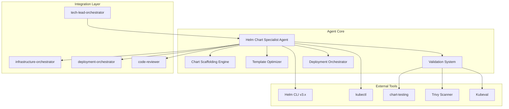

# Technical Requirements Document (TRD)
## Helm Chart Specialist Agent

**Version**: 1.0  
**Date**: 2025-01-09  
**PRD Reference**: [helm-chart-specialist-prd.md](../PRD/helm-chart-specialist-prd.md)  
**Status**: Implementation Ready  
**Implementation Timeline**: 16 weeks (4 phases)  

---

## Executive Summary

This TRD outlines the complete technical implementation for the **Helm Chart Specialist Agent** - a sophisticated AI agent that provides comprehensive Helm chart lifecycle management including creation, optimization, validation, and deployment orchestration. The agent will seamlessly integrate with the existing 25+ agent mesh ecosystem to accelerate Kubernetes deployments by 60% while ensuring security and reliability.

**Problem Solved**: Complex Helm chart management currently causes 60% slower development velocity, 40% deployment incidents, and security compliance gaps.

**Technical Solution**: An intelligent Helm chart specialist agent with automated scaffolding, template optimization, security scanning, and multi-environment deployment management integrated with tech-lead-orchestrator workflows.

**Success Metrics**: 60% faster chart creation (4-6 hours → 15-30 minutes), 95% deployment success rate, 100% security scanning coverage, 40% reduction in deployment incidents.

## System Architecture

### Component Architecture



### Technical Components

#### 1. Chart Scaffolding Engine
- **Purpose**: Generate production-ready Helm charts from application specifications
- **Technologies**: Go templates, YAML processing, Kubernetes API schemas
- **Capabilities**: Multi-resource generation, security policies, best practices enforcement

#### 2. Template Optimizer
- **Purpose**: Analyze and improve existing Helm chart templates
- **Technologies**: Template parsing, static analysis, pattern detection
- **Capabilities**: Hardcoded value extraction, template consolidation, values optimization

#### 3. Validation System
- **Purpose**: Comprehensive testing and security validation
- **Technologies**: helm lint, chart-testing, Trivy, Kubeval, OPA
- **Capabilities**: Syntax validation, security scanning, policy enforcement, dry-run testing

#### 4. Deployment Orchestrator
- **Purpose**: Manage Helm operations across environments
- **Technologies**: Helm CLI, kubectl, GitOps integrations
- **Capabilities**: Install/upgrade/rollback, canary deployments, multi-environment management

### Integration Architecture

```yaml
Agent Configuration:
  name: helm-chart-specialist
  tools: [Read, Write, Edit, Bash, Grep, Glob]
  dependencies: [helm, kubectl, chart-testing, trivy, kubeval]
  
Integration Points:
  Incoming:
    - tech-lead-orchestrator: Application architecture, deployment requirements
    - infrastructure-orchestrator: Cluster resources, networking specs
    
  Outgoing:
    - deployment-orchestrator: GitOps workflows, pipeline integration
    - code-reviewer: Security validation, quality checks
    - git-workflow: Version control, change management
    
  Shared Context:
    - Application topology and dependencies
    - Resource requirements and constraints
    - Security and compliance policies
    - Environment configurations
```

## Implementation Plan - 16 Week Development Cycle

### Phase 1: Core Chart Management (Weeks 1-4)
**Duration**: 4 weeks | **Total Estimate**: 160 hours | **Team**: 1-2 engineers

#### Sprint 1: Foundation & Setup (Week 1-2)
**Duration**: 2 weeks | **Estimate**: 80 hours

##### Week 1 Tasks
- [x] **Task 1.1**: Agent framework setup and configuration (8 hours)
  - [x] Create helm-chart-specialist.md agent specification
  - [x] Configure tool permissions (Read, Write, Edit, Bash, Grep, Glob)
  - [x] Set up development environment with Helm v3.x
  - [x] Install and configure chart-testing tools
  - [x] Validate kubectl cluster access

- [x] **Task 1.2**: Chart scaffolding foundation (8 hours)
  - [x] Implement basic Chart.yaml generation
  - [x] Create values.yaml template structure
  - [x] Build templates directory scaffolding
  - [x] Add README generation capability
  - [x] Implement version management

- [x] **Task 1.3**: Resource template generation (8 hours)
  - [x] Deployment template generation
  - [x] Service template creation
  - [x] Ingress configuration templates
  - [x] ConfigMap/Secret templates
  - [x] PersistentVolume templates

- [x] **Task 1.4**: Integration with tech-lead-orchestrator (8 hours)
  - [x] Parse TRD application specifications
  - [x] Extract service dependencies
  - [x] Map requirements to Kubernetes resources
  - [x] Implement handoff protocols
  - [x] Create shared context management

##### Week 1 Deliverables
- [x] Basic agent framework operational
- [x] Simple chart generation working
- [x] Initial tech-lead-orchestrator integration

##### Week 2 Tasks
- [ ] **Task 1.5**: Security best practices implementation (8 hours)
  - [ ] Non-root container configurations
  - [ ] Security context templates
  - [ ] Resource limits and requests
  - [ ] Network policy templates
  - [ ] Pod security standards

- [ ] **Task 1.6**: Health checks and probes (8 hours)
  - [ ] Liveness probe templates
  - [ ] Readiness probe configurations
  - [ ] Startup probe implementation
  - [ ] Health check customization
  - [ ] Probe failure handling

- [ ] **Task 1.7**: Template parameterization (8 hours)
  - [ ] Value extraction from specifications
  - [ ] Default value determination
  - [ ] Environment-specific overrides
  - [ ] Template variable naming conventions
  - [ ] Documentation generation for values

- [ ] **Task 1.8**: Basic validation framework (8 hours)
  - [ ] Helm lint integration
  - [ ] YAML syntax validation
  - [ ] Template rendering tests
  - [ ] Basic error handling
  - [ ] Validation reporting

##### Week 2 Deliverables
- [ ] Security-hardened chart templates
- [ ] Comprehensive health check configurations
- [ ] Basic validation framework operational

#### Sprint 2: Template Optimization & Testing (Week 3-4)
**Duration**: 2 weeks | **Estimate**: 80 hours

##### Week 3 Tasks
- [ ] **Task 2.1**: Template optimization engine (8 hours)
  - [ ] Hardcoded value detection
  - [ ] Template variable extraction
  - [ ] Logic optimization algorithms
  - [ ] Duplicate code detection
  - [ ] Refactoring recommendations

- [ ] **Task 2.2**: Advanced templating features (8 hours)
  - [ ] Conditional resource generation
  - [ ] Loop and range operations
  - [ ] Helper function library
  - [ ] Template composition
  - [ ] Advanced value merging

- [ ] **Task 2.3**: Chart testing framework (8 hours)
  - [ ] Unit test implementation
  - [ ] Integration test setup
  - [ ] Test data generation
  - [ ] Mock environment configuration
  - [ ] Test reporting system

- [ ] **Task 2.4**: Multi-application support (8 hours)
  - [ ] Web application templates
  - [ ] API service patterns
  - [ ] Background worker configurations
  - [ ] Database deployment templates
  - [ ] Microservices patterns

##### Week 3 Deliverables
- [ ] Template optimization engine functional
- [ ] Advanced templating capabilities
- [ ] Comprehensive testing framework

##### Week 4 Tasks
- [ ] **Task 2.5**: Documentation automation (8 hours)
  - [ ] README generation from templates
  - [ ] Values documentation extraction
  - [ ] Usage examples generation
  - [ ] Troubleshooting guides
  - [ ] API documentation

- [ ] **Task 2.6**: Performance optimization (8 hours)
  - [ ] Template rendering optimization
  - [ ] Caching mechanisms
  - [ ] Parallel processing
  - [ ] Resource usage optimization
  - [ ] Response time improvements

- [ ] **Task 2.7**: Error handling and recovery (8 hours)
  - [ ] Comprehensive error messages
  - [ ] Recovery suggestions
  - [ ] Rollback mechanisms
  - [ ] State management
  - [ ] Debug logging

- [ ] **Task 2.8**: Phase 1 integration testing (8 hours)
  - [ ] End-to-end chart generation tests
  - [ ] Integration with tech-lead-orchestrator
  - [ ] Performance benchmarking
  - [ ] Security validation
  - [ ] Documentation review

##### Week 4 Deliverables
- [ ] Complete Phase 1 functionality
- [ ] Comprehensive documentation
- [ ] All Phase 1 tests passing

### Phase 1 Goals & Definition of Done
- [ ] Chart scaffolding generates complete, valid Helm charts
- [ ] Template optimization identifies and fixes common issues
- [ ] All security best practices implemented
- [ ] Testing framework validates all generated charts
- [ ] Integration with tech-lead-orchestrator fully functional
- [ ] Documentation complete and accurate
- [ ] Performance targets met (<30 second generation)

### Phase 2: Deployment Operations (Weeks 5-8)
**Duration**: 4 weeks | **Total Estimate**: 160 hours

#### Sprint 3: Deployment Automation (Week 5-6)
**Duration**: 2 weeks | **Estimate**: 80 hours

##### Week 5 Tasks
- [ ] **Task 3.1**: Helm deployment engine (8 hours)
  - [ ] Install operation implementation
  - [ ] Upgrade operation with hooks
  - [ ] Rollback functionality
  - [ ] Delete operation with cleanup
  - [ ] Operation status tracking

- [ ] **Task 3.2**: Pre-deployment validation (8 hours)
  - [ ] Environment readiness checks
  - [ ] Resource availability validation
  - [ ] Dependency verification
  - [ ] Security policy checks
  - [ ] Namespace preparation

- [ ] **Task 3.3**: Deployment monitoring (8 hours)
  - [ ] Real-time status updates
  - [ ] Resource health monitoring
  - [ ] Event stream processing
  - [ ] Progress reporting
  - [ ] Failure detection

- [ ] **Task 3.4**: Rollback automation (8 hours)
  - [ ] Automatic failure detection
  - [ ] Rollback trigger conditions
  - [ ] State preservation
  - [ ] Rollback validation
  - [ ] Recovery procedures

##### Week 6 Tasks
- [ ] **Task 3.5**: Multi-environment configuration (8 hours)
  - [ ] Environment-specific values
  - [ ] Configuration inheritance
  - [ ] Override mechanisms
  - [ ] Environment validation
  - [ ] Promotion workflows

- [ ] **Task 3.6**: Canary deployment support (8 hours)
  - [ ] Traffic splitting configuration
  - [ ] Gradual rollout automation
  - [ ] Metrics-based promotion
  - [ ] Automatic rollback triggers
  - [ ] A/B testing support

- [ ] **Task 3.7**: Blue-green deployments (8 hours)
  - [ ] Parallel environment setup
  - [ ] Traffic switching mechanisms
  - [ ] Validation procedures
  - [ ] Cutover automation
  - [ ] Rollback procedures

- [ ] **Task 3.8**: Deployment orchestration (8 hours)
  - [ ] Multi-service coordination
  - [ ] Dependency ordering
  - [ ] Parallel deployment support
  - [ ] Cross-environment sync
  - [ ] State management

#### Sprint 4: Environment Management (Week 7-8)
**Duration**: 2 weeks | **Estimate**: 80 hours

##### Week 7 Tasks
- [ ] **Task 4.1**: Values management system (8 hours)
  - [ ] Values file organization
  - [ ] Hierarchical value merging
  - [ ] Secret value handling
  - [ ] Dynamic value generation
  - [ ] Value validation

- [ ] **Task 4.2**: Configuration drift detection (8 hours)
  - [ ] Deployed state tracking
  - [ ] Drift detection algorithms
  - [ ] Drift reporting
  - [ ] Reconciliation procedures
  - [ ] Audit logging

- [ ] **Task 4.3**: Environment promotion (8 hours)
  - [ ] Promotion workflows
  - [ ] Approval mechanisms
  - [ ] Validation gates
  - [ ] Rollback procedures
  - [ ] Promotion history

- [ ] **Task 4.4**: Deployment history management (8 hours)
  - [ ] Version tracking
  - [ ] Change documentation
  - [ ] Rollback points
  - [ ] Audit trail
  - [ ] Compliance reporting

##### Week 8 Tasks
- [ ] **Task 4.5**: CI/CD pipeline integration (8 hours)
  - [ ] GitHub Actions integration
  - [ ] GitLab CI templates
  - [ ] Jenkins pipeline support
  - [ ] ArgoCD integration
  - [ ] Flux compatibility

- [ ] **Task 4.6**: GitOps workflow support (8 hours)
  - [ ] Repository structure setup
  - [ ] Commit automation
  - [ ] PR generation
  - [ ] Merge strategies
  - [ ] Sync mechanisms

- [ ] **Task 4.7**: Artifact management (8 hours)
  - [ ] Chart repository integration
  - [ ] Image registry connections
  - [ ] Version management
  - [ ] Artifact validation
  - [ ] Cleanup procedures

- [ ] **Task 4.8**: Phase 2 integration testing (8 hours)
  - [ ] Deployment operation tests
  - [ ] Multi-environment validation
  - [ ] CI/CD integration tests
  - [ ] Performance validation
  - [ ] Security assessment

### Phase 2 Goals & Definition of Done
- [ ] All Helm operations fully automated
- [ ] Multi-environment deployments working reliably
- [ ] Canary and blue-green deployments functional
- [ ] CI/CD pipeline integration complete
- [ ] GitOps workflows supported
- [ ] Deployment success rate >95%
- [ ] All integration tests passing

### Phase 3: Advanced Features (Weeks 9-12)
**Duration**: 4 weeks | **Total Estimate**: 160 hours

#### Sprint 5: Security & Compliance (Week 9-10)
**Duration**: 2 weeks | **Estimate**: 80 hours

##### Week 9 Tasks
- [ ] **Task 5.1**: Security scanning integration (8 hours)
  - [ ] Trivy scanner integration
  - [ ] Image vulnerability scanning
  - [ ] Configuration security checks
  - [ ] Secret detection
  - [ ] CVE database updates

- [ ] **Task 5.2**: Policy enforcement (8 hours)
  - [ ] OPA policy integration
  - [ ] Custom policy creation
  - [ ] Policy validation
  - [ ] Enforcement mechanisms
  - [ ] Policy reporting

- [ ] **Task 5.3**: RBAC configuration (8 hours)
  - [ ] Role generation
  - [ ] Service account creation
  - [ ] Permission mapping
  - [ ] Access validation
  - [ ] RBAC documentation

- [ ] **Task 5.4**: Compliance validation (8 hours)
  - [ ] SOC2 compliance checks
  - [ ] PCI DSS validation
  - [ ] HIPAA requirements
  - [ ] Custom compliance rules
  - [ ] Compliance reporting

##### Week 10 Tasks
- [ ] **Task 5.5**: Secret management (8 hours)
  - [ ] External secrets integration
  - [ ] Vault integration
  - [ ] Secret rotation
  - [ ] Encryption at rest
  - [ ] Access audit

- [ ] **Task 5.6**: Network security (8 hours)
  - [ ] Network policy generation
  - [ ] Service mesh integration
  - [ ] mTLS configuration
  - [ ] Ingress security
  - [ ] Egress controls

- [ ] **Task 5.7**: Security reporting (8 hours)
  - [ ] Vulnerability reports
  - [ ] Compliance dashboards
  - [ ] Risk assessment
  - [ ] Remediation tracking
  - [ ] Executive summaries

- [ ] **Task 5.8**: Security automation (8 hours)
  - [ ] Automated patching
  - [ ] Security updates
  - [ ] Incident response
  - [ ] Alert integration
  - [ ] Remediation workflows

#### Sprint 6: Monitoring & Observability (Week 11-12)
**Duration**: 2 weeks | **Estimate**: 80 hours

##### Week 11 Tasks
- [ ] **Task 6.1**: Metrics integration (8 hours)
  - [ ] Prometheus configuration
  - [ ] Custom metrics
  - [ ] Metric aggregation
  - [ ] Dashboard generation
  - [ ] Alert rules

- [ ] **Task 6.2**: Logging configuration (8 hours)
  - [ ] Log aggregation setup
  - [ ] Structured logging
  - [ ] Log routing
  - [ ] Log retention
  - [ ] Search capabilities

- [ ] **Task 6.3**: Tracing setup (8 hours)
  - [ ] Distributed tracing
  - [ ] Trace collection
  - [ ] Correlation IDs
  - [ ] Performance analysis
  - [ ] Bottleneck detection

- [ ] **Task 6.4**: Health monitoring (8 hours)
  - [ ] Service health checks
  - [ ] Dependency monitoring
  - [ ] SLA tracking
  - [ ] Availability reporting
  - [ ] Incident detection

##### Week 12 Tasks
- [ ] **Task 6.5**: Performance optimization (8 hours)
  - [ ] Resource optimization
  - [ ] Scaling configurations
  - [ ] Cache implementation
  - [ ] Query optimization
  - [ ] Load balancing

- [ ] **Task 6.6**: Advanced templating (8 hours)
  - [ ] Dynamic resource generation
  - [ ] Complex conditionals
  - [ ] Template libraries
  - [ ] Reusable components
  - [ ] Template testing

- [ ] **Task 6.7**: Integration enhancements (8 hours)
  - [ ] Enhanced orchestrator integration
  - [ ] Additional tool support
  - [ ] API development
  - [ ] Webhook support
  - [ ] Event streaming

- [ ] **Task 6.8**: Phase 3 testing (8 hours)
  - [ ] Security validation
  - [ ] Compliance testing
  - [ ] Performance benchmarking
  - [ ] Integration validation
  - [ ] User acceptance testing

### Phase 3 Goals & Definition of Done
- [ ] 100% security scanning coverage achieved
- [ ] All compliance requirements validated
- [ ] Monitoring and observability fully integrated
- [ ] Advanced templating features functional
- [ ] Performance optimizations implemented
- [ ] Security and compliance reports generated
- [ ] All Phase 3 tests passing

### Phase 4: Production Hardening (Weeks 13-16)
**Duration**: 4 weeks | **Total Estimate**: 160 hours

#### Sprint 7: Production Readiness (Week 13-14)
**Duration**: 2 weeks | **Estimate**: 80 hours

##### Week 13 Tasks
- [ ] **Task 7.1**: Production validation (8 hours)
  - [ ] Load testing
  - [ ] Stress testing
  - [ ] Chaos engineering
  - [ ] Failure scenarios
  - [ ] Recovery testing

- [ ] **Task 7.2**: Performance tuning (8 hours)
  - [ ] Response time optimization
  - [ ] Resource utilization
  - [ ] Caching strategies
  - [ ] Database optimization
  - [ ] Network optimization

- [ ] **Task 7.3**: Scalability testing (8 hours)
  - [ ] Horizontal scaling
  - [ ] Vertical scaling
  - [ ] Auto-scaling validation
  - [ ] Load distribution
  - [ ] Bottleneck analysis

- [ ] **Task 7.4**: Reliability improvements (8 hours)
  - [ ] Retry mechanisms
  - [ ] Circuit breakers
  - [ ] Timeout configurations
  - [ ] Error recovery
  - [ ] State management

##### Week 14 Tasks
- [ ] **Task 7.5**: Documentation completion (8 hours)
  - [ ] User guides
  - [ ] API documentation
  - [ ] Troubleshooting guides
  - [ ] Best practices
  - [ ] Video tutorials

- [ ] **Task 7.6**: Training materials (8 hours)
  - [ ] Onboarding guides
  - [ ] Workshop materials
  - [ ] Lab exercises
  - [ ] Certification content
  - [ ] Knowledge base

- [ ] **Task 7.7**: Support procedures (8 hours)
  - [ ] Incident response
  - [ ] Escalation procedures
  - [ ] Runbook creation
  - [ ] FAQ compilation
  - [ ] Support tooling

- [ ] **Task 7.8**: Migration planning (8 hours)
  - [ ] Migration strategies
  - [ ] Rollout planning
  - [ ] User communication
  - [ ] Feedback mechanisms
  - [ ] Success metrics

#### Sprint 8: Deployment & Monitoring (Week 15-16)
**Duration**: 2 weeks | **Estimate**: 80 hours

##### Week 15 Tasks
- [ ] **Task 8.1**: Production deployment (8 hours)
  - [ ] Environment setup
  - [ ] Agent deployment
  - [ ] Configuration validation
  - [ ] Health checks
  - [ ] Smoke testing

- [ ] **Task 8.2**: Monitoring setup (8 hours)
  - [ ] Metrics collection
  - [ ] Dashboard creation
  - [ ] Alert configuration
  - [ ] Log aggregation
  - [ ] Trace collection

- [ ] **Task 8.3**: User onboarding (8 hours)
  - [ ] User provisioning
  - [ ] Access control
  - [ ] Training sessions
  - [ ] Support channels
  - [ ] Feedback collection

- [ ] **Task 8.4**: Early adopter program (8 hours)
  - [ ] User selection
  - [ ] Beta testing
  - [ ] Feedback analysis
  - [ ] Issue resolution
  - [ ] Feature refinement

##### Week 16 Tasks
- [ ] **Task 8.5**: Performance monitoring (8 hours)
  - [ ] Baseline establishment
  - [ ] Trend analysis
  - [ ] Optimization opportunities
  - [ ] Capacity planning
  - [ ] Cost analysis

- [ ] **Task 8.6**: Security monitoring (8 hours)
  - [ ] Threat detection
  - [ ] Vulnerability tracking
  - [ ] Compliance monitoring
  - [ ] Incident response
  - [ ] Security updates

- [ ] **Task 8.7**: Continuous improvement (8 hours)
  - [ ] Feature prioritization
  - [ ] Bug tracking
  - [ ] Enhancement planning
  - [ ] Roadmap updates
  - [ ] Release planning

- [ ] **Task 8.8**: Final validation (8 hours)
  - [ ] Success metrics validation
  - [ ] User satisfaction assessment
  - [ ] Performance benchmarking
  - [ ] Security audit
  - [ ] Project retrospective

### Phase 4 Goals & Definition of Done
- [ ] Production deployment successful
- [ ] All success metrics achieved
- [ ] User onboarding completed
- [ ] Monitoring and alerting operational
- [ ] Documentation comprehensive and accurate
- [ ] Support procedures established
- [ ] Continuous improvement process in place

## Acceptance Criteria Matrix

### Chart Creation Criteria
| Requirement | Implementation | Validation |
|-------------|----------------|------------|
| Complete chart generation | Tasks 1.2, 1.3 | Helm lint, dry-run tests |
| Security best practices | Task 1.5 | Security scanning, policy validation |
| Health check configuration | Task 1.6 | Probe testing, failure scenarios |
| Template parameterization | Task 1.7 | Value injection tests |
| Multi-application support | Task 2.4 | Pattern validation tests |

### Deployment Operations Criteria
| Requirement | Implementation | Validation |
|-------------|----------------|------------|
| Automated deployments | Tasks 3.1, 3.2 | End-to-end deployment tests |
| Rollback capability | Task 3.4 | Failure recovery tests |
| Multi-environment support | Task 3.5 | Environment promotion tests |
| Canary deployments | Task 3.6 | Traffic splitting validation |
| CI/CD integration | Task 4.5 | Pipeline execution tests |

### Security & Compliance Criteria
| Requirement | Implementation | Validation |
|-------------|----------------|------------|
| Security scanning | Task 5.1 | Vulnerability detection rate |
| Policy enforcement | Task 5.2 | Policy violation tests |
| RBAC configuration | Task 5.3 | Access control validation |
| Compliance validation | Task 5.4 | Compliance audit reports |
| Secret management | Task 5.5 | Secret rotation tests |

## Quality Gates & Testing Strategy

### Testing Levels

#### Unit Testing (≥80% Coverage)
- Chart template generation logic
- Value merging algorithms
- Validation rules
- Security policy checks
- Template optimization

#### Integration Testing (≥70% Coverage)
- Tech-lead-orchestrator handoffs
- Helm CLI operations
- Kubernetes API interactions
- CI/CD pipeline integration
- External tool integration

#### End-to-End Testing
- Complete chart lifecycle tests
- Multi-environment deployments
- Rollback scenarios
- Security scanning workflows
- Performance benchmarks

### Performance Benchmarks
- **Chart Generation**: <30 seconds for standard applications
- **Deployment Operations**: <5 minutes for typical deployments
- **Validation & Testing**: <2 minutes for comprehensive validation
- **Security Scanning**: <3 minutes for complete scan
- **Rollback Operations**: <1 minute for automatic rollback

### Security Requirements
- **Vulnerability Scanning**: 100% of container images scanned
- **Policy Compliance**: All charts pass OPA policy validation
- **Secret Management**: Zero plaintext secrets in charts
- **RBAC Validation**: Least privilege principle enforced
- **Audit Trail**: Complete logging of all operations

## Risk Mitigation

### High-Risk Mitigation
**Risk**: Template complexity leading to fragile charts
- **Mitigation**: Comprehensive testing framework, template validation, gradual complexity introduction
- **Monitoring**: Template complexity metrics, failure rate tracking

**Risk**: Multi-environment configuration drift
- **Mitigation**: Automated drift detection, value validation, environment sync procedures
- **Monitoring**: Drift detection alerts, configuration audits

### Medium-Risk Mitigation
**Risk**: Tool chain compatibility issues
- **Mitigation**: Version pinning, compatibility matrix, fallback mechanisms
- **Monitoring**: Tool version tracking, compatibility testing

**Risk**: Performance degradation at scale
- **Mitigation**: Performance testing, optimization phases, caching strategies
- **Monitoring**: Response time metrics, resource utilization

## Success Metrics

### Primary KPIs
- [ ] **Chart Creation Time**: 60% reduction (4-6 hours → 15-30 minutes)
- [ ] **Deployment Success Rate**: >95% successful deployments
- [ ] **Security Scanning Coverage**: 100% of charts scanned
- [ ] **Deployment Incidents**: 40% reduction in deployment-related incidents

### Secondary KPIs
- [ ] **User Onboarding Time**: <1 hour to productivity
- [ ] **Chart Quality Score**: >90% compliance with best practices
- [ ] **Rollback Success Rate**: 100% successful rollbacks
- [ ] **Configuration Drift**: 100% drift detected within 24 hours

### User Satisfaction Metrics
- [ ] **Developer Experience**: >4.5/5 satisfaction score
- [ ] **Support Ticket Volume**: 60% reduction in Helm-related tickets
- [ ] **Feature Adoption**: 80% using advanced features within 30 days
- [ ] **Time to Deploy**: 50% reduction in end-to-end deployment time

## Deployment Strategy

### Rollout Plan
1. **Alpha Release** (Week 13): Internal testing with platform team
2. **Beta Release** (Week 14): Early adopter program with 5-10 teams
3. **Production Release** (Week 15): General availability with phased rollout
4. **Full Adoption** (Week 16): Organization-wide deployment

### Migration Strategy
- Gradual migration from manual Helm processes
- Backward compatibility with existing charts
- Automated chart conversion tools
- Comprehensive training and support

## Documentation Requirements

### Technical Documentation
- [ ] Agent specification and architecture
- [ ] API reference documentation
- [ ] Integration guides
- [ ] Troubleshooting procedures
- [ ] Performance tuning guide

### User Documentation
- [ ] Quick start guide
- [ ] User manual with examples
- [ ] Best practices guide
- [ ] Video tutorials
- [ ] FAQ and knowledge base

### Developer Documentation
- [ ] Contributing guidelines
- [ ] Development setup guide
- [ ] Testing procedures
- [ ] Release processes
- [ ] Architecture decision records

---

## Appendices

### Appendix A: Tool Requirements
| Tool | Version | Purpose |
|------|---------|---------|
| Helm | v3.x | Core chart operations |
| kubectl | Latest | Kubernetes interactions |
| chart-testing | Latest | Chart validation |
| Trivy | Latest | Security scanning |
| Kubeval | Latest | Manifest validation |
| OPA | Latest | Policy enforcement |

### Appendix B: Integration Specifications
```yaml
Handoff Protocols:
  From tech-lead-orchestrator:
    - Application architecture
    - Service dependencies
    - Resource requirements
    - Security policies
    
  To deployment-orchestrator:
    - Validated charts
    - Deployment specifications
    - Environment configurations
    
  To code-reviewer:
    - Chart code for review
    - Security scan results
    - Compliance reports
```

### Appendix C: Security Framework
- Container security scanning with Trivy
- Configuration validation with OPA
- Secret management with external secrets
- RBAC configuration and validation
- Network policy enforcement
- Compliance reporting and auditing

---

**Next Steps**:
1. Review and approve TRD with stakeholders
2. Set up development environment
3. Begin Phase 1 implementation
4. Establish CI/CD pipeline
5. Create initial documentation

**Technical Review Required**: This TRD requires review from:
- Platform Engineering team for Kubernetes patterns
- Security team for compliance requirements
- DevOps team for deployment workflows
- Development teams for usability validation