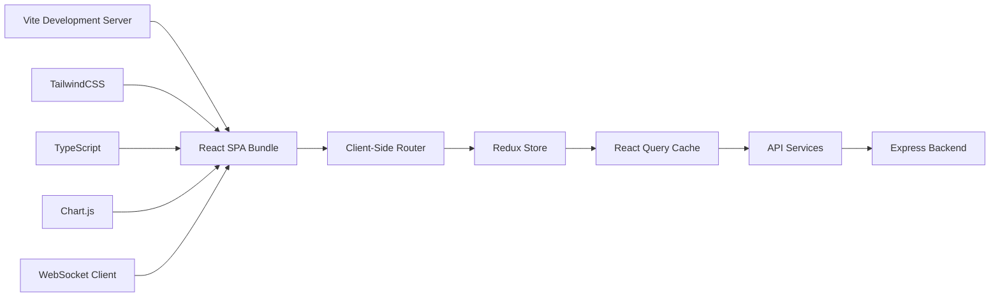
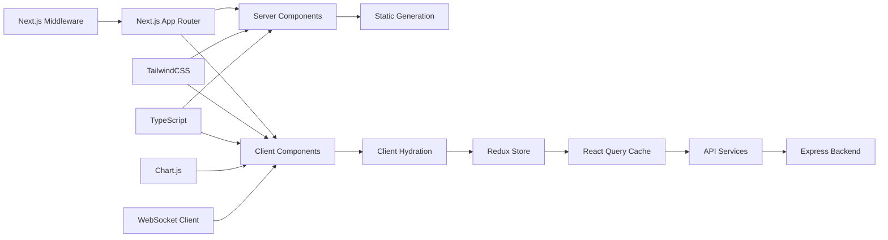
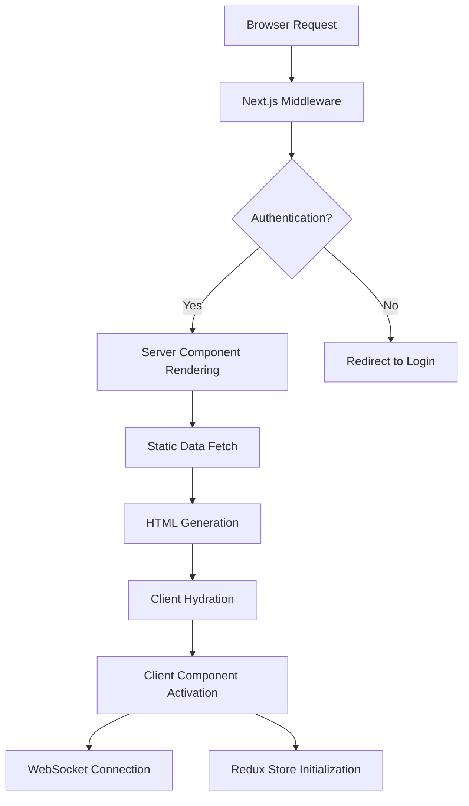
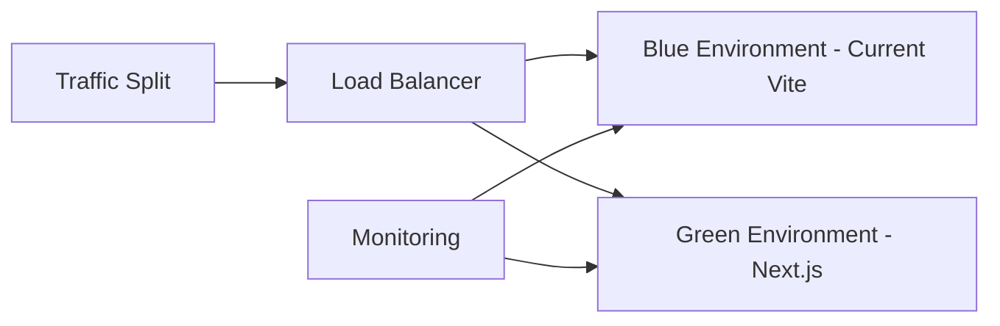

# Technical Requirements Document

# Next.js Frontend Migration

**Document Version**: 1.0
**Created**: September 19, 2025
**Status**: Ready for Implementation
**Product**: Fortium Monitoring Web Service Frontend
**Migration**: Vite/React → Next.js 14+ App Router

---

## Executive Summary

This TRD provides comprehensive technical specifications for migrating the Fortium Monitoring Web Service frontend from Vite/React to Next.js 14+ with App Router architecture. The migration targets 30% performance improvement, enhanced SEO capabilities, and improved developer experience while maintaining 100% feature parity.

**Key Technical Outcomes**:
- Server Components for optimal performance
- Automatic bundle optimization and code splitting
- Enhanced security through middleware integration
- Streamlined deployment with Next.js optimizations
- Maintained Redux integration for complex state management

---

## System Context & Constraints

### Current Architecture



**Current Tech Stack**:
- **Build Tool**: Vite 4.x with React plugin
- **Frontend Framework**: React 18.2.x with TypeScript 5.x
- **Styling**: TailwindCSS 3.x with PostCSS
- **State Management**: Redux Toolkit + React Query
- **Routing**: React Router v6
- **Charts**: Chart.js with react-chartjs-2
- **WebSockets**: Socket.io client
- **Testing**: Vitest + React Testing Library
- **Deployment**: Docker container with Nginx

**Current Performance Baseline**:
- First Contentful Paint: 3.2s
- Largest Contentful Paint: 4.1s
- Time to Interactive: 5.5s
- Cumulative Layout Shift: 0.15
- Bundle Size: 1.2MB initial JavaScript

### Target Architecture



**Target Tech Stack**:
- **Framework**: Next.js 14+ with App Router
- **Build Tool**: Next.js built-in Turbopack/Webpack
- **Server Components**: React Server Components for static content
- **Client Components**: React 18.2.x for interactivity
- **Styling**: TailwindCSS 3.x (unchanged)
- **State Management**: Redux Toolkit (client-side only)
- **Data Fetching**: Server Components + selective React Query
- **Routing**: Next.js App Router file-based routing
- **Charts**: Chart.js in Client Components
- **WebSockets**: Socket.io client in Client Components
- **Testing**: Jest + React Testing Library + Playwright
- **Deployment**: Next.js optimized Docker container

### Technical Constraints

**Framework Requirements**:
- Next.js 14+ with stable App Router
- TypeScript 5.x compatibility maintained
- TailwindCSS configuration preservation
- Redux Toolkit integration for complex state

**Performance Requirements**:
- Zero downtime during migration
- Progressive enhancement strategy
- Backward compatibility during transition
- Bundle size reduction of 25%

**Infrastructure Limitations**:
- Docker container deployment maintained
- Express backend API unchanged
- WebSocket server integration preserved
- CI/CD pipeline compatibility required

**Security Policies**:
- SOC 2 compliance throughout migration
- GDPR data handling preserved
- Content Security Policy implementation
- HTTPS enforcement in production

---

## Architecture Overview

### High-Level Design

**Component Architecture Strategy**:

```typescript
// Server Components (Default - No 'use client')
- Layout components (Header, Footer, Navigation)
- Static dashboard widgets (User info, Settings pages)
- Authentication pages (Login, Registration)
- Landing and marketing pages

// Client Components ('use client' directive)
- Interactive charts and visualizations
- Form inputs with real-time validation
- WebSocket real-time components
- Modal dialogs and dropdowns
- Redux state management components
```

**Data Flow Patterns**:



### Data Models

**Server/Client Boundary Definition**:

```typescript
interface ComponentClassification {
  serverComponents: {
    layout: ['Header', 'Footer', 'Sidebar', 'Navigation'];
    static: ['UserProfile', 'Settings', 'StaticDashboard'];
    auth: ['LoginPage', 'RegistrationPage'];
  };
  clientComponents: {
    interactive: ['MetricsChart', 'RealTimeGraph', 'DataTable'];
    forms: ['LoginForm', 'SettingsForm', 'ConfigurationForm'];
    realtime: ['WebSocketProvider', 'LiveMetrics', 'NotificationCenter'];
    state: ['ReduxProvider', 'ThemeProvider', 'AuthProvider'];
  };
}
```

**Migration Schema**:

```typescript
interface MigrationMapping {
  routes: {
    '/dashboard' → '/app/dashboard/page.tsx';
    '/settings' → '/app/settings/page.tsx';
    '/users' → '/app/users/page.tsx';
    '/login' → '/app/auth/login/page.tsx';
  };
  components: {
    'src/components/Dashboard.tsx' → 'app/components/server/Dashboard.tsx';
    'src/components/Chart.tsx' → 'app/components/client/Chart.tsx';
  };
  services: {
    'src/services/api.ts' → 'lib/api/index.ts';
    'src/services/websocket.ts' → 'lib/websocket/client.ts';
  };
}
```

---

## Interfaces & Data Contracts

### API Specifications

**Maintained API Contracts**:
- All existing REST endpoints preserved unchanged
- WebSocket event handlers maintain exact signatures
- Authentication JWT token format unchanged
- Error response structures maintained

```typescript
// Existing API patterns to preserve
interface APIService {
  metrics: {
    GET: '/api/metrics' → MetricsResponse;
    POST: '/api/metrics' → CreateMetricResponse;
  };
  auth: {
    POST: '/api/auth/login' → AuthResponse;
    POST: '/api/auth/refresh' → TokenResponse;
  };
  websocket: {
    events: ['metric_update', 'user_activity', 'system_status'];
    namespaces: ['/dashboard', '/admin'];
  };
}
```

**New Next.js Integration Patterns**:

```typescript
// Server Component data fetching
async function DashboardPage() {
  // Direct server-side API calls
  const metrics = await fetch('/api/metrics', {
    headers: { Authorization: `Bearer ${token}` }
  });

  return <MetricsDisplay data={metrics} />;
}

// Client Component with React Query (preserved)
'use client';
function InteractiveChart() {
  const { data } = useQuery(['chartData'], fetchChartData);
  return <Chart data={data} />;
}
```

### External Integrations

**Chart.js Integration in Client Components**:
```typescript
'use client';
import { Chart } from 'chart.js';
import { Line } from 'react-chartjs-2';

// Preserved exact functionality in Client Component
```

**WebSocket Integration Pattern**:
```typescript
'use client';
import { useEffect } from 'react';
import { io } from 'socket.io-client';

// Maintain existing WebSocket connection logic
// Move to Client Component with 'use client' directive
```

**Redux Integration Strategy**:
```typescript
// app/providers.tsx (Client Component)
'use client';
export function ReduxProvider({ children }: { children: React.ReactNode }) {
  return <Provider store={store}>{children}</Provider>;
}

// app/layout.tsx (Server Component)
export default function RootLayout({ children }) {
  return (
    <html>
      <body>
        <ReduxProvider>{children}</ReduxProvider>
      </body>
    </html>
  );
}
```

---

## Non-functional Requirements

### Performance

**Response Time Targets**:
- First Contentful Paint: <1.8s (improvement from 3.2s)
- Largest Contentful Paint: <2.5s (improvement from 4.1s)
- Time to Interactive: <3.8s (improvement from 5.5s)
- Cumulative Layout Shift: <0.1 (improvement from 0.15)
- First Input Delay: <100ms (maintained)

**Throughput Requirements**:
- Dashboard page load: 100 concurrent users
- WebSocket connections: 500 simultaneous connections
- API request handling: 1000 requests/minute
- Bundle size: 25% reduction in initial JavaScript

**Scalability Considerations**:
- Server Components reduce client-side JavaScript
- Automatic code splitting through Next.js
- Static generation for marketing pages
- Incremental Static Regeneration (ISR) for semi-dynamic content

**Resource Utilization Limits**:
- Memory usage: <512MB per container instance
- CPU usage: <80% during peak load
- Network bandwidth: <50MB/minute per user session
- Cache hit ratio: >85% for static assets

### Security

**Authentication/Authorization**:
```typescript
// middleware.ts - Route protection
export function middleware(request: NextRequest) {
  const token = request.cookies.get('auth-token');

  // Protect dashboard routes
  if (request.nextUrl.pathname.startsWith('/dashboard')) {
    if (!token || !validateJWT(token.value)) {
      return NextResponse.redirect(new URL('/auth/login', request.url));
    }
  }
}

export const config = {
  matcher: ['/dashboard/:path*', '/admin/:path*', '/settings/:path*']
};
```

**Data Protection**:
- Content Security Policy headers via middleware
- XSS prevention through automatic HTML escaping
- CSRF protection for form submissions
- Secure cookie configuration for authentication

**Input Validation**:
- Server-side validation for all form inputs
- Client-side validation for user experience
- API request sanitization maintained
- File upload restrictions preserved

### Reliability & Observability

**Uptime Targets**:
- Application availability: 99.9%
- Dashboard responsiveness: 99.5%
- WebSocket connection stability: 98%
- API endpoint availability: 99.8%

**Error Handling Strategy**:
```typescript
// app/error.tsx - Global error boundary
'use client';
export default function Error({
  error,
  reset,
}: {
  error: Error;
  reset: () => void;
}) {
  return (
    <div>
      <h2>Something went wrong!</h2>
      <button onClick={reset}>Try again</button>
    </div>
  );
}

// app/loading.tsx - Loading states
export default function Loading() {
  return <DashboardSkeleton />;
}
```

**Monitoring and Alerting**:
- Next.js built-in Web Vitals reporting
- Custom performance metrics tracking
- Error boundary reporting to logging service
- WebSocket connection monitoring

---

## Test Strategy

### Unit Testing (Target: ≥80% Coverage)

**Testing Framework Migration**:
```bash
# Current: Vitest
# Target: Jest with Next.js integration

npm install --save-dev jest @testing-library/react @testing-library/jest-dom
```

**Server Component Testing**:
```typescript
// Server Components require special testing approach
import { render } from '@testing-library/react';

// Test Server Component rendering
test('Dashboard server component renders metrics', async () => {
  const DashboardPage = await import('./page');
  render(<DashboardPage />);
  // Assertions for server-rendered content
});
```

**Client Component Testing (Preserved)**:
```typescript
// Existing test patterns maintained for Client Components
import { render, screen } from '@testing-library/react';
import { InteractiveChart } from './Chart';

test('chart renders with data', () => {
  render(<InteractiveChart data={mockData} />);
  expect(screen.getByTestId('chart')).toBeInTheDocument();
});
```

### Integration Testing (Target: ≥70% Coverage)

**API Integration Testing**:
```typescript
// Test Server Component data fetching
test('dashboard fetches and displays metrics', async () => {
  // Mock API response
  fetchMock.mockResponseOnce(JSON.stringify(mockMetrics));

  const dashboard = await DashboardPage();
  expect(dashboard).toContain('Metrics Dashboard');
});
```

**Redux Integration Testing**:
```typescript
// Test Client Component state management
test('redux state updates in client components', () => {
  const store = createTestStore();
  render(
    <Provider store={store}>
      <MetricsClient />
    </Provider>
  );
  // Test state updates and UI changes
});
```

### End-to-End Testing

**Playwright Test Migration**:
```typescript
// test/e2e/dashboard.spec.ts
import { test, expect } from '@playwright/test';

test('dashboard loads and displays real-time data', async ({ page }) => {
  await page.goto('/dashboard');

  // Test server-rendered content appears immediately
  await expect(page.locator('[data-testid="dashboard-header"]')).toBeVisible();

  // Test client-side hydration and interactivity
  await page.click('[data-testid="refresh-button"]');
  await expect(page.locator('[data-testid="loading-spinner"]')).toBeVisible();
});
```

**Performance Testing**:
```typescript
test('dashboard meets performance requirements', async ({ page }) => {
  const startTime = Date.now();
  await page.goto('/dashboard');

  // Wait for hydration complete
  await page.waitForLoadState('networkidle');
  const loadTime = Date.now() - startTime;

  expect(loadTime).toBeLessThan(2500); // <2.5s LCP target
});
```

**Cross-browser Testing**:
- Chrome 88+ (primary target)
- Firefox 85+ (secondary target)
- Safari 14+ (macOS/iOS support)
- Edge 88+ (enterprise support)

---

## Implementation Plan

### Sprint 1: Foundation Setup (Weeks 1-2)

**Sprint Goal**: Establish Next.js foundation with basic routing and build pipeline

#### Core Setup Tasks
- [ ] Install Next.js 14+ with App Router configuration (4h)
- [ ] Migrate TypeScript configuration and types (3h)
- [ ] Configure TailwindCSS with Next.js integration (2h)
- [ ] Set up environment variable migration (`VITE_` → `NEXT_PUBLIC_`) (2h)
- [ ] Create basic App Router file structure (`app/` directory) (3h)
- [ ] Configure Next.js build pipeline and optimization settings (4h)

#### Development Environment Tasks
- [ ] Update development scripts and package.json (2h)
- [ ] Configure Next.js dev server with hot reload (2h)
- [ ] Set up ESLint and Prettier for Next.js (2h)
- [ ] Create Docker configuration for Next.js development (3h)

#### Testing Infrastructure Tasks
- [ ] Migrate from Vitest to Jest with Next.js integration (4h)
- [ ] Set up React Testing Library with Next.js components (3h)
- [ ] Configure Playwright for E2E testing (3h)
- [ ] Create initial test utilities and helpers (2h)

**Sprint 1 Acceptance Criteria**:
- [ ] Next.js development server runs without errors
- [ ] TypeScript compilation succeeds for all existing code
- [ ] TailwindCSS styles compile and apply correctly
- [ ] Environment variables load properly in development
- [ ] Basic routing structure matches current application
- [ ] Jest unit tests execute successfully
- [ ] Playwright E2E tests can navigate basic routes

**Sprint 1 Deliverables**:
- Working Next.js development environment
- Migrated build configuration
- Basic routing structure
- Updated testing framework
- Development Docker container

---

### Sprint 2: Layout and Authentication (Weeks 3-4)

**Sprint Goal**: Migrate core layout components and authentication flow with middleware

#### Layout Component Migration
- [ ] Convert Header component to Server Component (3h)
- [ ] Convert Sidebar navigation to Server Component (3h)
- [ ] Convert Footer component to Server Component (2h)
- [ ] Create root layout with proper metadata and providers (4h)
- [ ] Implement loading and error boundaries (3h)

#### Authentication Integration
- [ ] Create Next.js middleware for route protection (4h)
- [ ] Migrate login page to App Router with Server Component (3h)
- [ ] Migrate registration page to App Router (2h)
- [ ] Convert authentication forms to Client Components (4h)
- [ ] Integrate JWT token handling with Next.js cookies (3h)
- [ ] Test authentication flow end-to-end (2h)

#### Basic Navigation
- [ ] Convert React Router navigation to Next.js Link components (3h)
- [ ] Implement active route highlighting (2h)
- [ ] Set up breadcrumb navigation component (2h)
- [ ] Create 404 and error pages (2h)

**Sprint 2 Acceptance Criteria**:
- [ ] All layout components render correctly as Server Components
- [ ] Authentication middleware protects dashboard routes
- [ ] Login/logout flow works identical to current system
- [ ] Navigation between pages functions properly
- [ ] Error boundaries catch and display errors appropriately
- [ ] Loading states show during navigation

**Sprint 2 Deliverables**:
- Migrated layout components
- Working authentication flow
- Route protection middleware
- Basic navigation system
- Error handling framework

---

### Sprint 3: Static Pages and Basic Dashboard (Weeks 5-6)

**Sprint Goal**: Migrate static pages and implement basic dashboard with Server Components

#### Static Page Migration
- [ ] Migrate Settings page to Server Component (3h)
- [ ] Migrate User Management page to Server Component (3h)
- [ ] Migrate Profile page to Server Component (2h)
- [ ] Convert static dashboard widgets to Server Components (4h)
- [ ] Implement server-side data fetching for static content (4h)

#### Dashboard Foundation
- [ ] Create dashboard layout with Server Components (3h)
- [ ] Implement basic metrics display with Server Components (4h)
- [ ] Set up data fetching patterns for dashboard (3h)
- [ ] Create skeleton loading states for dashboard sections (2h)

#### Data Integration
- [ ] Integrate API calls in Server Components (4h)
- [ ] Set up error handling for server-side data fetching (2h)
- [ ] Implement caching strategy for dashboard data (3h)
- [ ] Test server-side rendering with real API data (2h)

**Sprint 3 Acceptance Criteria**:
- [ ] All static pages load with server-rendered content
- [ ] Dashboard displays basic metrics without client-side JavaScript
- [ ] Data fetching works correctly in Server Components
- [ ] Loading states appear during data fetching
- [ ] Error handling works for failed API calls
- [ ] Page performance improves with server-side rendering

**Sprint 3 Deliverables**:
- Migrated static pages
- Basic dashboard with Server Components
- Server-side data fetching implementation
- Performance improvement baseline

---

### Sprint 4: Interactive Components and State Management (Weeks 7-8)

**Sprint Goal**: Migrate interactive components to Client Components with Redux integration

#### Client Component Migration
- [ ] Convert Chart.js components to Client Components (4h)
- [ ] Migrate form components with validation to Client Components (4h)
- [ ] Convert modal dialogs and dropdowns to Client Components (3h)
- [ ] Migrate data tables with sorting/filtering to Client Components (4h)

#### State Management Integration
- [ ] Set up Redux Provider as Client Component (3h)
- [ ] Migrate Redux store configuration to work with App Router (3h)
- [ ] Integrate Redux state with Client Components (4h)
- [ ] Set up React Query for client-side data fetching (3h)
- [ ] Test state management across Server/Client component boundaries (2h)

#### WebSocket Integration
- [ ] Migrate WebSocket connection to Client Component (3h)
- [ ] Implement real-time data updates in dashboard (4h)
- [ ] Set up WebSocket event handlers (2h)
- [ ] Test real-time functionality with Server/Client hybrid architecture (3h)

#### Interactive Features
- [ ] Implement dashboard filtering and search (3h)
- [ ] Add interactive chart controls (3h)
- [ ] Set up form submission handling (2h)
- [ ] Test all interactive features for functionality parity (2h)

**Sprint 4 Acceptance Criteria**:
- [ ] All interactive components work identically to current system
- [ ] Redux state management functions correctly
- [ ] WebSocket connections establish and receive updates
- [ ] Charts render and update with real-time data
- [ ] Forms submit and validate properly
- [ ] Client-side interactivity works after server-side rendering

**Sprint 4 Deliverables**:
- Fully functional interactive components
- Working state management system
- Real-time WebSocket integration
- Complete dashboard functionality

---

### Sprint 5: Optimization, Testing, and Production Readiness (Weeks 9-10)

**Sprint Goal**: Performance optimization, comprehensive testing, and production deployment

#### Performance Optimization
- [ ] Analyze bundle size and implement code splitting optimizations (4h)
- [ ] Optimize Server Component caching and ISR configuration (3h)
- [ ] Implement image optimization with next/image (2h)
- [ ] Set up font optimization and preloading (2h)
- [ ] Configure CSP headers and security middleware (3h)
- [ ] Run Lighthouse audits and address performance issues (3h)

#### Comprehensive Testing
- [ ] Complete unit test coverage for all migrated components (6h)
- [ ] Write integration tests for Server/Client component interactions (4h)
- [ ] Create comprehensive E2E test suite with Playwright (6h)
- [ ] Perform accessibility testing and WCAG compliance verification (3h)
- [ ] Execute cross-browser testing on all supported browsers (3h)
- [ ] Load testing with production-like data volumes (2h)

#### Production Deployment
- [ ] Create production-optimized Docker configuration (3h)
- [ ] Update CI/CD pipeline for Next.js builds (4h)
- [ ] Set up production monitoring and error tracking (3h)
- [ ] Configure environment-specific settings (2h)
- [ ] Create deployment rollback procedures (2h)
- [ ] Perform staging environment validation (3h)

#### Documentation and Handoff
- [ ] Update README with Next.js development instructions (2h)
- [ ] Document Server/Client component patterns and guidelines (3h)
- [ ] Create deployment and maintenance documentation (2h)
- [ ] Conduct team training on new architecture (2h)

**Sprint 5 Acceptance Criteria**:
- [ ] Lighthouse Performance score >90
- [ ] All Core Web Vitals in "Good" range
- [ ] Test coverage >95% for all components
- [ ] E2E tests cover all critical user journeys
- [ ] Production deployment succeeds without issues
- [ ] Performance metrics meet or exceed targets
- [ ] Security audit passes with no critical issues

**Sprint 5 Deliverables**:
- Production-ready Next.js application
- Comprehensive test suite
- Performance-optimized build
- Production deployment pipeline
- Complete documentation

---

## Deployment & Migration Notes

### Deployment Strategy

**Blue-Green Deployment Approach**:


**Rollout Plan**:
1. **Week 9**: Deploy to staging environment for final validation
2. **Week 10**: Deploy to production with 10% traffic split
3. **Week 10 + 1**: Increase to 50% traffic if metrics are positive
4. **Week 10 + 2**: Full traffic migration if all KPIs met
5. **Week 10 + 3**: Decommission old Vite environment

**Feature Flags**:
```typescript
// Feature flag configuration for gradual rollout
const features = {
  nextjsApp: process.env.ENABLE_NEXTJS === 'true',
  serverComponents: process.env.ENABLE_SSR === 'true',
  newAuth: process.env.ENABLE_NEW_AUTH === 'true'
};
```

**Rollback Procedures**:
- **5-minute rollback SLA**: Immediate traffic revert to Vite version
- **Database compatibility**: No schema changes during migration
- **Session preservation**: JWT tokens remain valid across environments
- **WebSocket graceful degradation**: Connection retry logic maintained

### Migration Procedures

**Data Migration** (None Required):
- No database schema changes required
- API contracts maintained exactly
- WebSocket event structures preserved
- User sessions remain valid during migration

**Configuration Migration**:
```bash
# Environment variable mapping
VITE_API_URL → NEXT_PUBLIC_API_URL
VITE_WS_URL → NEXT_PUBLIC_WS_URL
VITE_ENV → NEXT_PUBLIC_ENV

# Build configuration migration
vite.config.ts → next.config.js
tsconfig.json → updated for App Router
tailwind.config.js → Next.js integration
```

**Asset Migration**:
```typescript
// Static asset path updates
'/assets/images/' → '/public/images/'
'import logo from "/logo.svg"' → 'import logo from "/public/logo.svg"'

// Next.js Image optimization
 → <Image src="/logo.png" width={100} height={50} />
```

### Infrastructure Requirements

**Resource Provisioning**:
- **CPU**: Same as current (2 vCPU per container)
- **Memory**: 512MB per container (unchanged)
- **Storage**: 1GB for Next.js cache (additional)
- **Network**: CDN edge caching for static assets

**Configuration Changes**:
```yaml
# Docker configuration updates
FROM node:18-alpine
COPY . .
RUN npm run build
CMD ["npm", "start"]

# Nginx configuration for Next.js
location /_next/static/ {
  expires 1y;
  add_header Cache-Control "public, immutable";
}
```

**Environment Setup**:
- **Development**: Next.js dev server on port 3000
- **Staging**: Production build with staging API endpoints
- **Production**: Optimized build with CDN integration

---

## Risk Mitigation & Monitoring

### Critical Success Factors

**Performance Monitoring**:
- Real User Monitoring (RUM) for Core Web Vitals
- Synthetic testing for performance regression detection
- Bundle size monitoring with automated alerts
- Server Component rendering time tracking

**Error Tracking**:
- Client-side error boundary reporting
- Server-side error logging and alerting
- WebSocket connection failure monitoring
- Authentication flow error tracking

**User Experience Monitoring**:
- Session replay for migration issues
- User feedback collection system
- A/B testing between old and new versions
- Feature flag monitoring and control

### Rollback Strategy

**Automated Rollback Triggers**:
- Error rate >1% for 5 minutes
- Performance degradation >20% from baseline
- Authentication failure rate >0.5%
- WebSocket connection failure >5%

**Manual Rollback Process**:
1. Load balancer traffic redirect to Vite environment
2. DNS TTL reduction for faster propagation
3. Monitoring alert acknowledgment
4. Post-incident analysis and documentation

### Success Validation

**Technical Metrics**:
- First Contentful Paint <1.8s (target achieved)
- Largest Contentful Paint <2.5s (target achieved)
- Bundle size reduction 25% (target achieved)
- Test coverage maintained >95%

**Business Metrics**:
- Zero user-reported critical issues
- Developer velocity maintained or improved
- Deployment success rate >99%
- User satisfaction >4.5/5 in post-migration survey

---

**Document Status**: Ready for Implementation
**Implementation Start**: Upon approval
**Estimated Completion**: 10 weeks from start date
**Technical Review**: Frontend Architecture Team
**Approval Required**: Product Owner, Technical Lead

---

**Next Steps**:
1. Technical review and approval
2. Sprint 1 kickoff and team assignment
3. Development environment setup
4. Daily standup and progress tracking initiation