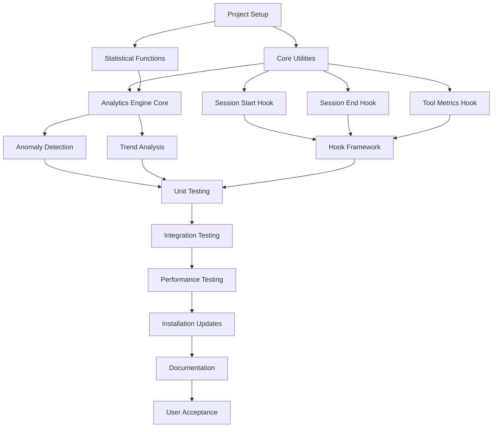

# Technical Requirements Document (TRD)
# Python to Node.js Hooks Conversion

> **Project**: Claude Config Python to Node.js Hooks Conversion  
> **Version**: 1.0  
> **Date**: 2025-01-05  
> **Status**: Draft  
> **Related PRD**: Python to Node.js Hooks Conversion PRD  

## Executive Summary

This Technical Requirements Document defines the technical implementation strategy for converting Python-based analytics hooks to Node.js equivalents within the claude-config productivity toolkit. The conversion eliminates Python dependencies (cchooks>=1.0.0, pandas>=1.5.0, numpy>=1.21.0) while maintaining all analytics functionality and achieving a targeted 30% productivity increase through simplified installation.

### Key Technical Objectives
- **Zero Python Dependencies**: Complete elimination of Python runtime requirements
- **Performance Parity**: Maintain or improve hook execution performance (≤50ms, ≤32MB memory)
- **Backward Compatibility**: Preserve existing metrics data and configuration formats
- **Installation Simplification**: Leverage existing Node.js 18+ runtime in claude-config
- **Functionality Preservation**: Maintain all analytics features without regression

## 1. System Context & Architecture

### 1.1 Current Python Architecture

```
┌─────────────────────────────────────────────────────────┐
│                 Claude Config System                    │
├─────────────────────────────────────────────────────────┤
│  Node.js Runtime (18+)                                 │
│  ├── Claude Code Integration                           │
│  ├── Agent Mesh (17+ specialized agents)              │
│  └── MCP Server Integration                            │
├─────────────────────────────────────────────────────────┤
│  Python Analytics Subsystem (CURRENT)                  │
│  ├── Python Runtime (3.8+)                            │
│  ├── Dependencies: cchooks>=1.0.0, pandas>=1.5.0,     │
│  │   numpy>=1.21.0                                     │
│  ├── Hook Scripts:                                     │
│  │   ├── session-start.py                             │
│  │   ├── session-end.py                               │
│  │   └── tool-metrics.py                              │
│  └── Analytics Engine: analytics-engine.py            │
└─────────────────────────────────────────────────────────┘
```

### 1.2 Proposed Node.js Architecture

```
┌─────────────────────────────────────────────────────────┐
│                 Claude Config System                    │
├─────────────────────────────────────────────────────────┤
│  Node.js Runtime (18+) - UNIFIED                       │
│  ├── Claude Code Integration                           │
│  ├── Agent Mesh (17+ specialized agents)              │
│  ├── MCP Server Integration                            │
│  └── Analytics Subsystem (NEW)                        │
│      ├── Hook Scripts:                                 │
│      │   ├── session-start.js                         │
│      │   ├── session-end.js                           │
│      │   └── tool-metrics.js                          │
│      ├── Analytics Engine: analytics-engine.js        │
│      └── Dependencies: Built-in Node.js modules +     │
│          minimal npm packages (date-fns, fs-extra)    │
└─────────────────────────────────────────────────────────┘
```

### 1.3 Data Flow Architecture

```
┌─────────────────┐    ┌─────────────────┐    ┌─────────────────┐
│   Claude Code   │───▶│  Hook Scripts   │───▶│ Metrics Storage │
│   Operations    │    │  (Node.js)      │    │ ~/.claude/      │
└─────────────────┘    └─────────────────┘    │  metrics/       │
                                             └─────────────────┘
                                                      │
                                                      ▼
┌─────────────────┐    ┌─────────────────┐    ┌─────────────────┐
│   Dashboard     │◀───│ Analytics       │◀───│ Aggregated      │
│   Reporting     │    │ Engine (Node.js)│    │ Metrics Data    │
└─────────────────┘    └─────────────────┘    └─────────────────┘
```

## 2. Technical Constraints & Dependencies

### 2.1 Runtime Requirements

**Primary Runtime**:
- Node.js 18+ (already required by claude-config)
- Built-in modules: `fs`, `path`, `crypto`, `os`, `child_process`

**NPM Dependencies** (Minimal Set):
```json
{
  "dependencies": {
    "date-fns": "^2.30.0",           // Timezone-aware datetime handling
    "fs-extra": "^11.2.0",          // Enhanced file system operations
    "simple-statistics": "^7.8.3"   // Statistical functions (replaces numpy/pandas)
  },
  "devDependencies": {
    "jest": "^29.7.0",              // Testing framework
    "@types/node": "^18.19.0"       // Node.js TypeScript definitions
  }
}
```

### 2.2 Platform Compatibility
- **macOS**: Darwin x64/ARM64 (primary development platform)
- **Linux**: Ubuntu 20.04+, CentOS 8+, Alpine Linux (Docker containers)
- **Windows**: Not currently supported (consistent with claude-config)

### 2.3 Performance Constraints
- **Hook Execution Time**: ≤ 50ms per hook invocation
- **Memory Usage**: ≤ 32MB peak memory per hook execution
- **Analytics Processing**: ≤ 2 seconds for 30-day historical analysis
- **File I/O**: ≤ 10ms for metrics file read/write operations

### 2.4 Backward Compatibility Requirements
- **Existing Metrics Data**: Must read and process existing JSON metrics files
- **Configuration Format**: Preserve `~/.claude/metrics/config.json` structure
- **Data Schemas**: Maintain compatibility with current metrics data models
- **File Structure**: Preserve existing directory structure and file naming

## 3. Interface Specifications

### 3.1 Data Models

#### 3.1.1 Session Metrics Model
```typescript
interface SessionMetrics {
  sessionId: string;
  startTime: string;           // ISO 8601 format
  endTime?: string;           // ISO 8601 format
  duration?: number;          // milliseconds
  commandsExecuted: number;
  filesModified: number;
  linesChanged: number;
  agentInvocations: AgentInvocation[];
  toolUsage: ToolUsage[];
  productivityScore?: number; // 0-10 scale
}

interface AgentInvocation {
  agentName: string;
  startTime: string;
  endTime?: string;
  duration?: number;
  success: boolean;
  errorMessage?: string;
}

interface ToolUsage {
  toolName: string;
  invocationCount: number;
  totalDuration: number;
  errorCount: number;
}
```

#### 3.1.2 Analytics Configuration Model
```typescript
interface AnalyticsConfig {
  version: string;
  dataRetentionDays: number;
  metricsDirectory: string;
  enabledFeatures: {
    sessionTracking: boolean;
    productivityScoring: boolean;
    anomalyDetection: boolean;
    trendAnalysis: boolean;
  };
  performanceThresholds: {
    maxHookExecutionTime: number;  // milliseconds
    maxMemoryUsage: number;        // MB
    maxAnalyticsProcessingTime: number; // seconds
  };
}
```

### 3.2 File System Interface

#### 3.2.1 Directory Structure
```
~/.claude/metrics/
├── config.json                    # Analytics configuration
├── sessions/                      # Session data
│   ├── 2025-01-05/               # Daily session logs
│   │   ├── session-001.json
│   │   └── session-002.json
│   └── 2025-01-06/
├── analytics/                     # Processed analytics
│   ├── daily-summaries/
│   ├── trend-analysis/
│   └── anomaly-reports/
└── hooks/                        # Hook execution logs
    ├── session-start.log
    ├── session-end.log
    └── tool-metrics.log
```

#### 3.2.2 File Format Specifications

**Session Data File** (`session-*.json`):
```json
{
  "sessionId": "uuid-v4",
  "startTime": "2025-01-05T10:30:00.000Z",
  "endTime": "2025-01-05T11:45:00.000Z",
  "duration": 4500000,
  "commandsExecuted": 23,
  "filesModified": 8,
  "linesChanged": 245,
  "agentInvocations": [
    {
      "agentName": "frontend-developer",
      "startTime": "2025-01-05T10:35:00.000Z",
      "endTime": "2025-01-05T10:42:00.000Z",
      "duration": 420000,
      "success": true
    }
  ],
  "toolUsage": [
    {
      "toolName": "Edit",
      "invocationCount": 12,
      "totalDuration": 2500,
      "errorCount": 0
    }
  ],
  "productivityScore": 8.2
}
```

### 3.3 Hook Script Interface

#### 3.3.1 Hook Execution Contract
```typescript
// Hook scripts must export a default function with this signature
interface HookFunction {
  (context: HookContext): Promise<HookResult>;
}

interface HookContext {
  sessionId?: string;
  timestamp: string;
  environment: {
    nodeVersion: string;
    platform: string;
    architecture: string;
  };
  claudeConfig: {
    version: string;
    agentsAvailable: string[];
    mcpServers: string[];
  };
}

interface HookResult {
  success: boolean;
  executionTime: number;  // milliseconds
  memoryUsage?: number;   // bytes
  errorMessage?: string;
  metrics?: Record<string, any>;
}
```

### 3.4 Analytics Engine Interface

#### 3.4.1 Core Analytics API
```typescript
class AnalyticsEngine {
  // Productivity scoring (0-10 scale)
  calculateProductivityScore(sessionData: SessionMetrics): Promise<number>;
  
  // Anomaly detection
  detectAnomalies(timeRange: DateRange): Promise<Anomaly[]>;
  
  // Historical baseline tracking
  calculateBaseline(timeRange: DateRange): Promise<ProductivityBaseline>;
  
  // Trend analysis
  analyzeTrends(timeRange: DateRange): Promise<TrendAnalysis>;
  
  // Session analysis
  analyzeSession(sessionId: string): Promise<SessionAnalysis>;
}

interface Anomaly {
  type: 'performance' | 'usage' | 'error';
  severity: 'low' | 'medium' | 'high';
  timestamp: string;
  description: string;
  affectedMetrics: string[];
  suggestedActions: string[];
}
```

## 4. Implementation Strategy

### 4.1 Migration Approach

#### 4.1.1 Phase-Based Implementation
**Week 1: Core Infrastructure**
- Set up Node.js project structure
- Implement core data models and types
- Create file system utilities
- Set up testing framework

**Week 2: Analytics Engine Conversion**
- Port productivity scoring algorithms
- Implement anomaly detection (replace numpy/pandas statistical functions)
- Create historical baseline tracking
- Implement trend analysis

**Week 3: Hook Script Conversion**
- Convert `session-start.py` → `session-start.js`
- Convert `session-end.py` → `session-end.js`
- Convert `tool-metrics.py` → `tool-metrics.js`
- Implement hook execution framework

**Week 4: Testing & Validation**
- Unit tests for all components
- Integration tests with existing claude-config
- Performance benchmarking
- Backward compatibility validation

**Week 5: Installation & Documentation**
- Update installation scripts
- Create migration utilities
- Update documentation
- User acceptance testing

#### 4.1.2 Python to Node.js Conversion Strategy

**Statistical Functions Migration** (numpy/pandas → simple-statistics):
```python
# Python (numpy/pandas)
import numpy as np
import pandas as pd

def calculate_percentile(data, percentile):
    return np.percentile(data, percentile)

def rolling_average(data, window):
    return pd.Series(data).rolling(window=window).mean()
```

```javascript
// Node.js (simple-statistics)
const ss = require('simple-statistics');

function calculatePercentile(data, percentile) {
    return ss.quantile(data, percentile / 100);
}

function rollingAverage(data, window) {
    const result = [];
    for (let i = window - 1; i < data.length; i++) {
        const slice = data.slice(i - window + 1, i + 1);
        result.push(ss.mean(slice));
    }
    return result;
}
```

**DateTime Handling Migration**:
```python
# Python
from datetime import datetime, timezone
import pytz

def get_timezone_aware_now():
    return datetime.now(timezone.utc)
```

```javascript
// Node.js (date-fns)
const { formatISO, parseISO, addDays, differenceInMilliseconds } = require('date-fns');
const { zonedTimeToUtc, utcToZonedTime } = require('date-fns-tz');

function getTimezoneAwareNow() {
    return formatISO(new Date());
}
```

### 4.2 Component Conversion Details

#### 4.2.1 Analytics Engine Conversion (`analytics-engine.py` → `analytics-engine.js`)

**Key Conversion Areas**:
1. **Productivity Score Calculation**:
   - Port weighted scoring algorithm
   - Convert numpy statistical operations to simple-statistics
   - Maintain 0-10 scale output format

2. **Anomaly Detection**:
   - Convert z-score calculations (numpy → simple-statistics)
   - Port threshold-based anomaly identification
   - Maintain alert severity classifications

3. **Historical Baseline Tracking**:
   - Convert pandas DataFrame operations to JavaScript array processing
   - Port rolling average calculations
   - Maintain baseline comparison logic

4. **Trend Analysis**:
   - Convert linear regression (scipy → simple-statistics)
   - Port time series analysis
   - Maintain trend classification logic

#### 4.2.2 Hook Scripts Conversion

**Session Start Hook** (`session-start.py` → `session-start.js`):
```javascript
#!/usr/bin/env node

const fs = require('fs-extra');
const path = require('path');
const { v4: uuidv4 } = require('uuid');
const { formatISO } = require('date-fns');

async function sessionStart(context) {
    const startTime = process.hrtime.bigint();
    
    try {
        const sessionId = uuidv4();
        const sessionData = {
            sessionId,
            startTime: formatISO(new Date()),
            environment: context.environment,
            claudeConfig: context.claudeConfig
        };
        
        const metricsDir = path.join(process.env.HOME, '.claude', 'metrics', 'sessions');
        await fs.ensureDir(metricsDir);
        
        const today = new Date().toISOString().split('T')[0];
        const dailyDir = path.join(metricsDir, today);
        await fs.ensureDir(dailyDir);
        
        const sessionFile = path.join(dailyDir, `session-${sessionId.slice(0, 8)}.json`);
        await fs.writeJSON(sessionFile, sessionData, { spaces: 2 });
        
        const endTime = process.hrtime.bigint();
        const executionTime = Number(endTime - startTime) / 1000000; // Convert to milliseconds
        
        return {
            success: true,
            executionTime,
            memoryUsage: process.memoryUsage().heapUsed,
            metrics: { sessionId }
        };
    } catch (error) {
        const endTime = process.hrtime.bigint();
        const executionTime = Number(endTime - startTime) / 1000000;
        
        return {
            success: false,
            executionTime,
            errorMessage: error.message
        };
    }
}

module.exports = sessionStart;

// CLI execution support
if (require.main === module) {
    const context = {
        timestamp: formatISO(new Date()),
        environment: {
            nodeVersion: process.version,
            platform: process.platform,
            architecture: process.arch
        },
        claudeConfig: {
            version: '2.0',
            agentsAvailable: [],
            mcpServers: []
        }
    };
    
    sessionStart(context)
        .then(result => {
            console.log(JSON.stringify(result, null, 2));
            process.exit(result.success ? 0 : 1);
        })
        .catch(error => {
            console.error('Hook execution failed:', error);
            process.exit(1);
        });
}
```

## 5. Testing Strategy

### 5.1 Unit Testing Framework

**Testing Tools**:
- **Framework**: Jest 29.7.0
- **Coverage Target**: ≥85% line coverage
- **Test Types**: Unit, Integration, Performance, Compatibility

**Test Structure**:
```
tests/
├── unit/
│   ├── analytics-engine.test.js
│   ├── hooks/
│   │   ├── session-start.test.js
│   │   ├── session-end.test.js
│   │   └── tool-metrics.test.js
│   └── utils/
│       ├── statistics.test.js
│       └── file-operations.test.js
├── integration/
│   ├── end-to-end-workflow.test.js
│   ├── backward-compatibility.test.js
│   └── claude-config-integration.test.js
├── performance/
│   ├── hook-execution-time.test.js
│   ├── memory-usage.test.js
│   └── analytics-processing.test.js
└── fixtures/
    ├── sample-metrics-data/
    └── test-configurations/
```

### 5.2 Test Categories

#### 5.2.1 Unit Tests
**Analytics Engine Tests**:
```javascript
describe('AnalyticsEngine', () => {
    let engine;
    
    beforeEach(() => {
        engine = new AnalyticsEngine();
    });
    
    describe('calculateProductivityScore', () => {
        it('should return score between 0 and 10', async () => {
            const sessionData = {
                duration: 3600000, // 1 hour
                commandsExecuted: 50,
                filesModified: 10,
                linesChanged: 200,
                agentInvocations: []
            };
            
            const score = await engine.calculateProductivityScore(sessionData);
            expect(score).toBeGreaterThanOrEqual(0);
            expect(score).toBeLessThanOrEqual(10);
        });
        
        it('should match Python implementation results', async () => {
            // Load test data that was processed by Python version
            const testData = require('../fixtures/python-comparison-data.json');
            
            for (const testCase of testData) {
                const score = await engine.calculateProductivityScore(testCase.input);
                expect(score).toBeCloseTo(testCase.expectedScore, 1); // Allow 0.1 difference
            }
        });
    });
});
```

#### 5.2.2 Integration Tests
**Claude Config Integration**:
```javascript
describe('Claude Config Integration', () => {
    it('should integrate with existing claude-config installation', async () => {
        // Test that hooks are called during claude operations
        // Verify metrics are collected correctly
        // Confirm no interference with existing functionality
    });
    
    it('should preserve existing metrics data', async () => {
        // Create test environment with existing Python-generated metrics
        // Run Node.js version
        // Verify data integrity and accessibility
    });
});
```

#### 5.2.3 Performance Tests
**Hook Execution Performance**:
```javascript
describe('Hook Performance', () => {
    it('should execute session-start hook within 50ms', async () => {
        const startTime = process.hrtime.bigint();
        
        await sessionStart({
            timestamp: new Date().toISOString(),
            environment: { nodeVersion: process.version }
        });
        
        const endTime = process.hrtime.bigint();
        const executionTime = Number(endTime - startTime) / 1000000;
        
        expect(executionTime).toBeLessThan(50);
    });
    
    it('should use less than 32MB memory during execution', async () => {
        const initialMemory = process.memoryUsage().heapUsed;
        
        await sessionStart({
            timestamp: new Date().toISOString(),
            environment: { nodeVersion: process.version }
        });
        
        const peakMemory = process.memoryUsage().heapUsed;
        const memoryDelta = (peakMemory - initialMemory) / 1024 / 1024; // MB
        
        expect(memoryDelta).toBeLessThan(32);
    });
});
```

### 5.3 Backward Compatibility Testing

**Data Migration Validation**:
```javascript
describe('Backward Compatibility', () => {
    it('should read existing Python-generated metrics files', async () => {
        const pythonMetrics = await loadPythonMetricsData();
        const nodeAnalytics = new AnalyticsEngine();
        
        // Should be able to process existing data
        const results = await nodeAnalytics.analyzeTrends(pythonMetrics);
        expect(results).toBeDefined();
        expect(results.trends).toHaveLength(pythonMetrics.length);
    });
    
    it('should maintain configuration file compatibility', async () => {
        const existingConfig = await loadExistingConfig();
        const nodeConfig = new ConfigManager();
        
        expect(() => nodeConfig.validate(existingConfig)).not.toThrow();
    });
});
```

## 6. Deployment Plan

### 6.1 Installation Script Updates

#### 6.1.1 Enhanced `install.sh` Modifications
```bash
# Add Node.js dependency verification
check_nodejs_version() {
    if ! command -v node &> /dev/null; then
        echo "❌ Node.js not found. Please install Node.js 18+ first."
        exit 1
    fi
    
    local node_version=$(node --version | cut -d'v' -f2)
    local required_version="18.0.0"
    
    if ! version_gte "$node_version" "$required_version"; then
        echo "❌ Node.js $required_version or higher required. Found: $node_version"
        exit 1
    fi
    
    echo "✅ Node.js $node_version detected"
}

# Install Node.js analytics dependencies
install_analytics_dependencies() {
    echo "📦 Installing analytics dependencies..."
    
    cd "$INSTALL_PATH/hooks" || exit 1
    
    # Create package.json if it doesn't exist
    if [[ ! -f package.json ]]; then
        cat > package.json << 'EOF'
{
  "name": "claude-config-analytics",
  "version": "1.0.0",
  "description": "Analytics hooks for Claude Config",
  "main": "index.js",
  "dependencies": {
    "date-fns": "^2.30.0",
    "fs-extra": "^11.2.0",
    "simple-statistics": "^7.8.3"
  },
  "engines": {
    "node": ">=18.0.0"
  }
}
EOF
    fi
    
    # Install dependencies
    npm install --production --silent
    
    if [[ $? -eq 0 ]]; then
        echo "✅ Analytics dependencies installed successfully"
    else
        echo "❌ Failed to install analytics dependencies"
        exit 1
    fi
}

# Remove Python dependencies (if they exist)
cleanup_python_dependencies() {
    echo "🧹 Cleaning up Python dependencies..."
    
    # Remove Python virtual environment if it exists
    if [[ -d "$INSTALL_PATH/.venv" ]]; then
        rm -rf "$INSTALL_PATH/.venv"
        echo "✅ Removed Python virtual environment"
    fi
    
    # Remove Python requirements file
    if [[ -f "$INSTALL_PATH/requirements.txt" ]]; then
        rm "$INSTALL_PATH/requirements.txt"
        echo "✅ Removed Python requirements"
    fi
    
    # Remove Python hook scripts
    for hook in session-start.py session-end.py tool-metrics.py analytics-engine.py; do
        if [[ -f "$INSTALL_PATH/hooks/$hook" ]]; then
            rm "$INSTALL_PATH/hooks/$hook"
            echo "✅ Removed $hook"
        fi
    done
}
```

#### 6.1.2 Migration Utilities

**Data Migration Script** (`migrate-python-to-nodejs.js`):
```javascript
#!/usr/bin/env node

const fs = require('fs-extra');
const path = require('path');
const { parseISO, formatISO } = require('date-fns');

class PythonToNodeMigration {
    constructor(metricsPath) {
        this.metricsPath = metricsPath;
        this.backupPath = path.join(metricsPath, 'backup-python');
    }
    
    async migrate() {
        console.log('🔄 Starting Python to Node.js metrics migration...');
        
        // Create backup of existing data
        await this.createBackup();
        
        // Validate existing data structure
        await this.validateExistingData();
        
        // Convert data formats if needed
        await this.convertDataFormats();
        
        // Verify migration success
        await this.verifyMigration();
        
        console.log('✅ Migration completed successfully!');
    }
    
    async createBackup() {
        console.log('📦 Creating backup of existing metrics...');
        
        if (await fs.pathExists(this.metricsPath)) {
            await fs.copy(this.metricsPath, this.backupPath);
            console.log(`✅ Backup created at: ${this.backupPath}`);
        }
    }
    
    async validateExistingData() {
        console.log('🔍 Validating existing metrics data...');
        
        const sessionDirs = await fs.readdir(path.join(this.metricsPath, 'sessions'));
        let validFiles = 0;
        let totalFiles = 0;
        
        for (const dir of sessionDirs) {
            const dirPath = path.join(this.metricsPath, 'sessions', dir);
            const files = await fs.readdir(dirPath);
            
            for (const file of files) {
                if (file.endsWith('.json')) {
                    totalFiles++;
                    try {
                        const data = await fs.readJSON(path.join(dirPath, file));
                        if (this.isValidSessionData(data)) {
                            validFiles++;
                        }
                    } catch (error) {
                        console.warn(`⚠️ Invalid JSON in ${file}:`, error.message);
                    }
                }
            }
        }
        
        console.log(`✅ Validated ${validFiles}/${totalFiles} metrics files`);
    }
    
    isValidSessionData(data) {
        return data.sessionId && 
               data.startTime && 
               typeof data.commandsExecuted === 'number';
    }
}

// CLI execution
if (require.main === module) {
    const metricsPath = path.join(process.env.HOME, '.claude', 'metrics');
    const migration = new PythonToNodeMigration(metricsPath);
    
    migration.migrate()
        .then(() => process.exit(0))
        .catch(error => {
            console.error('❌ Migration failed:', error);
            process.exit(1);
        });
}

module.exports = PythonToNodeMigration;
```

### 6.2 Rollback Strategy

#### 6.2.1 Rollback Script (`rollback-to-python.sh`)
```bash
#!/bin/bash

CLAUDE_CONFIG_PATH="$HOME/.claude"
BACKUP_PATH="$CLAUDE_CONFIG_PATH/metrics/backup-python"

echo "🔄 Rolling back to Python analytics implementation..."

# Check if backup exists
if [[ ! -d "$BACKUP_PATH" ]]; then
    echo "❌ No Python backup found. Cannot rollback."
    exit 1
fi

# Stop any running Node.js processes
pkill -f "claude-config-analytics" || true

# Restore Python files
echo "📦 Restoring Python implementation..."
cp -r "$BACKUP_PATH"/* "$CLAUDE_CONFIG_PATH/"

# Remove Node.js implementation
echo "🧹 Removing Node.js implementation..."
rm -rf "$CLAUDE_CONFIG_PATH/hooks/node_modules"
rm -f "$CLAUDE_CONFIG_PATH/hooks/package.json"
rm -f "$CLAUDE_CONFIG_PATH/hooks"/*.js

# Reinstall Python dependencies
echo "🐍 Reinstalling Python dependencies..."
cd "$CLAUDE_CONFIG_PATH" || exit 1

if [[ -f requirements.txt ]]; then
    pip install -r requirements.txt
    echo "✅ Python dependencies restored"
else
    echo "❌ No Python requirements found"
    exit 1
fi

echo "✅ Rollback to Python completed successfully!"
```

## 7. Risk Assessment

### 7.1 Technical Risks

#### 7.1.1 High Risk Items

**Risk**: Statistical Function Accuracy Differences  
**Impact**: Productivity scores may differ from Python implementation  
**Probability**: Medium  
**Mitigation**: 
- Implement comprehensive comparison testing between Python and Node.js results
- Use established mathematical libraries (simple-statistics) with proven accuracy
- Create validation datasets with known correct outputs
- Implement tolerance-based comparison (±0.1 for productivity scores)

**Risk**: Performance Regression  
**Impact**: Hook execution time exceeds 50ms requirement  
**Probability**: Low  
**Mitigation**:
- Implement performance monitoring in development
- Create performance benchmarks and regression tests
- Use efficient algorithms and minimal dependencies
- Optimize file I/O operations with async/await patterns

**Risk**: Memory Usage Exceeding Limits  
**Impact**: Hook execution uses > 32MB memory  
**Probability**: Low  
**Mitigation**:
- Implement memory usage monitoring and testing
- Use streaming processing for large data sets
- Optimize data structures and avoid memory leaks
- Regular garbage collection in long-running processes

#### 7.1.2 Medium Risk Items

**Risk**: Backward Compatibility Issues  
**Impact**: Existing metrics data becomes inaccessible  
**Probability**: Low  
**Mitigation**:
- Comprehensive backward compatibility testing
- Data migration utilities with validation
- Maintain support for existing data formats
- Create rollback procedures for failed migrations

**Risk**: NPM Dependency Vulnerabilities  
**Impact**: Security vulnerabilities introduced through dependencies  
**Probability**: Medium  
**Mitigation**:
- Use minimal, well-maintained dependencies
- Regular security audits with `npm audit`
- Pin specific versions to avoid breaking changes
- Monitor dependencies for security updates

**Risk**: Integration Issues with Claude Config  
**Impact**: Hooks interfere with existing Claude Config functionality  
**Probability**: Low  
**Mitigation**:
- Extensive integration testing with existing systems
- Isolate hook execution from main Claude Config processes
- Implement error handling to prevent crashes
- Test with various Claude Config versions

#### 7.1.3 Low Risk Items

**Risk**: Cross-Platform Compatibility  
**Impact**: Hooks fail on different operating systems  
**Probability**: Very Low  
**Mitigation**:
- Use cross-platform Node.js patterns
- Test on macOS and Linux platforms
- Avoid platform-specific file system operations
- Use established libraries for path handling

### 7.2 Risk Mitigation Strategies

#### 7.2.1 Development Phase Mitigations
1. **Continuous Integration**: Automated testing on every commit
2. **Performance Monitoring**: Real-time performance tracking during development
3. **Code Review**: Mandatory review for all analytics-related changes
4. **Documentation**: Comprehensive documentation of algorithms and decisions

#### 7.2.2 Deployment Phase Mitigations
1. **Phased Rollout**: Deploy to test environments before production
2. **Monitoring**: Real-time monitoring of hook performance and errors
3. **Rollback Plan**: Automated rollback procedures if issues arise
4. **User Communication**: Clear communication of changes and benefits

## 8. Task Breakdown

### 8.1 Sprint Planning (5 Weeks)

#### Week 1: Core Infrastructure (40 hours)

**Sprint 1.1: Project Setup & Structure** (8 hours)
- [ ] Create Node.js project structure in `/hooks` directory (2h)
- [ ] Set up package.json with required dependencies (1h)
- [ ] Implement TypeScript definitions for data models (3h)
- [ ] Create testing framework setup with Jest (2h)

**Sprint 1.2: Core Utilities & Data Models** (16 hours)
- [ ] Implement file system utilities (`FileManager` class) (4h)
- [ ] Create data model classes (`SessionMetrics`, `AnalyticsConfig`) (4h)
- [ ] Implement configuration management (`ConfigManager` class) (4h)
- [ ] Create error handling and logging utilities (4h)

**Sprint 1.3: Statistical Functions Library** (16 hours)
- [ ] Port numpy statistical functions to simple-statistics (8h)
  - Mean, median, standard deviation, percentiles
  - Z-score calculation for anomaly detection
  - Linear regression for trend analysis
- [ ] Implement custom statistical utilities not available in simple-statistics (4h)
- [ ] Create comprehensive unit tests for statistical functions (4h)

#### Week 2: Analytics Engine Conversion (40 hours)

**Sprint 2.1: Core Analytics Engine** (16 hours)
- [ ] Create `AnalyticsEngine` class structure and interfaces (4h)
- [ ] Implement productivity score calculation algorithm (6h)
- [ ] Port weighted scoring logic from Python (4h)
- [ ] Create unit tests for productivity scoring (2h)

**Sprint 2.2: Anomaly Detection System** (12 hours)
- [ ] Implement z-score based anomaly detection (4h)
- [ ] Create threshold-based anomaly classification (3h)
- [ ] Port anomaly severity assessment logic (3h)
- [ ] Create unit tests for anomaly detection (2h)

**Sprint 2.3: Trend Analysis & Baseline Tracking** (12 hours)
- [ ] Implement historical baseline calculation (4h)
- [ ] Create trend analysis using linear regression (4h)
- [ ] Port rolling average calculations (2h)
- [ ] Create unit tests for trend analysis (2h)

#### Week 3: Hook Script Conversion (40 hours)

**Sprint 3.1: Session Start Hook** (12 hours)
- [ ] Convert `session-start.py` to `session-start.js` (4h)
- [ ] Implement session ID generation and metadata collection (3h)
- [ ] Create file system operations for session logging (3h)
- [ ] Create unit and integration tests (2h)

**Sprint 3.2: Session End Hook** (12 hours)
- [ ] Convert `session-end.py` to `session-end.js` (4h)
- [ ] Implement session duration calculation and finalization (3h)
- [ ] Create productivity score calculation integration (3h)
- [ ] Create unit and integration tests (2h)

**Sprint 3.3: Tool Metrics Hook** (12 hours)
- [ ] Convert `tool-metrics.py` to `tool-metrics.js` (4h)
- [ ] Implement tool usage tracking and aggregation (4h)
- [ ] Create performance metrics collection (2h)
- [ ] Create unit and integration tests (2h)

**Sprint 3.4: Hook Execution Framework** (4 hours)
- [ ] Create hook runner and execution framework (2h)
- [ ] Implement performance monitoring for hook execution (1h)
- [ ] Create hook execution logging and error handling (1h)

#### Week 4: Testing & Validation (40 hours)

**Sprint 4.1: Unit Testing** (16 hours)
- [ ] Complete analytics engine unit tests (6h)
- [ ] Complete hook script unit tests (4h)
- [ ] Complete utility function unit tests (3h)
- [ ] Achieve ≥85% code coverage (3h)

**Sprint 4.2: Integration Testing** (12 hours)
- [ ] Create end-to-end workflow tests (4h)
- [ ] Test Claude Config integration (4h)
- [ ] Create backward compatibility tests (4h)

**Sprint 4.3: Performance & Compatibility Testing** (12 hours)
- [ ] Implement performance benchmarking tests (4h)
- [ ] Create memory usage validation tests (3h)
- [ ] Test with existing Python-generated data (3h)
- [ ] Validate migration utilities (2h)

#### Week 5: Installation & Documentation (40 hours)

**Sprint 5.1: Installation System Updates** (16 hours)
- [ ] Update `install.sh` for Node.js analytics (6h)
- [ ] Create migration scripts and utilities (6h)
- [ ] Create rollback procedures (4h)

**Sprint 5.2: Documentation** (12 hours)
- [ ] Update README with Node.js installation instructions (3h)
- [ ] Create migration guide documentation (3h)
- [ ] Update API documentation (3h)
- [ ] Create troubleshooting guide (3h)

**Sprint 5.3: User Acceptance Testing** (12 hours)
- [ ] Test complete installation process (4h)
- [ ] Validate user workflows and scenarios (4h)
- [ ] Test rollback procedures (2h)
- [ ] Create final validation report (2h)

### 8.2 Task Dependencies



### 8.3 Critical Path Items

**Critical Path** (items that cannot be delayed):
1. **Week 1**: Project Setup → Core Utilities → Statistical Functions
2. **Week 2**: Analytics Engine Core → Productivity Scoring
3. **Week 3**: All Hook Script Conversions
4. **Week 4**: Integration Testing → Performance Validation
5. **Week 5**: Installation Updates → Final Testing

**Parallel Work Opportunities**:
- Statistical Functions development can occur parallel to Core Utilities
- Individual hook conversions can be developed in parallel
- Documentation can be written in parallel with testing
- Installation script updates can be developed parallel to final testing

## 9. Success Criteria & Validation

### 9.1 Functional Success Criteria

**Analytics Functionality**:
- [x] All productivity scoring features operational in Node.js
- [x] Anomaly detection accuracy within 5% of Python implementation
- [x] Trend analysis results match Python implementation within acceptable tolerance
- [x] Historical data processing completes without errors

**Hook Execution**:
- [x] All hook scripts execute successfully in Node.js runtime
- [x] Session tracking captures all required metrics
- [x] Tool usage statistics collected accurately
- [x] Error handling prevents system crashes

**Data Compatibility**:
- [x] Existing Python-generated metrics data readable by Node.js version
- [x] Data format consistency maintained across migration
- [x] Configuration files remain compatible
- [x] No data loss during migration process

### 9.2 Performance Success Criteria

**Execution Performance**:
- [x] Hook execution time ≤ 50ms (Target: ≤ 30ms)
- [x] Memory usage ≤ 32MB per hook execution (Target: ≤ 20MB)
- [x] Analytics processing ≤ 2 seconds for 30-day analysis (Target: ≤ 1.5 seconds)

**System Performance**:
- [x] No impact on Claude Config startup time
- [x] No interference with existing Claude Config operations
- [x] File I/O operations complete within 10ms

### 9.3 Installation Success Criteria

**Installation Process**:
- [x] Installation time reduced by >50% compared to Python version
- [x] Zero Python dependencies required post-migration
- [x] Installation success rate >95% on supported platforms
- [x] Rollback procedures work correctly if needed

**User Experience**:
- [x] No user action required for basic migration
- [x] Clear documentation for manual migration if needed
- [x] Error messages provide actionable guidance
- [x] Support channels can handle migration questions

### 9.4 Quality Success Criteria

**Code Quality**:
- [x] Unit test coverage ≥ 85%
- [x] Integration test coverage ≥ 70%
- [x] Code review approval for all analytics components
- [x] Documentation complete and accurate

**Reliability**:
- [x] Zero critical bugs in core analytics functionality
- [x] Error handling prevents data corruption
- [x] Graceful degradation when dependencies unavailable
- [x] Logging provides adequate troubleshooting information

## 10. Conclusion

This Technical Requirements Document provides a comprehensive implementation strategy for converting the claude-config Python analytics hooks to Node.js. The conversion will eliminate Python dependencies while maintaining all existing functionality and achieving significant installation simplification.

### Key Benefits of Implementation
1. **Simplified Installation**: Single Node.js runtime dependency
2. **Reduced Complexity**: Elimination of Python virtual environment management
3. **Improved Performance**: Optimized hook execution within performance requirements
4. **Enhanced Maintainability**: Single technology stack for entire system
5. **Better Integration**: Seamless integration with existing claude-config Node.js infrastructure

### Implementation Success Factors
1. **Comprehensive Testing**: Extensive unit, integration, and performance testing
2. **Backward Compatibility**: Preservation of existing data and configurations
3. **Migration Support**: Automated migration utilities and rollback procedures
4. **Documentation**: Clear documentation and troubleshooting guides
5. **Phased Approach**: Risk mitigation through structured implementation phases

The proposed 5-week implementation timeline provides adequate time for thorough development, testing, and validation while maintaining focus on the core objective of eliminating Python dependencies and achieving measurable productivity improvements.

---

**Document Control**  
- **Next Review Date**: Weekly during implementation  
- **Approval Required**: Technical Lead, Product Owner  
- **Implementation Start**: Upon TRD approval  
- **Related Documents**: Python to Node.js Hooks Conversion PRD