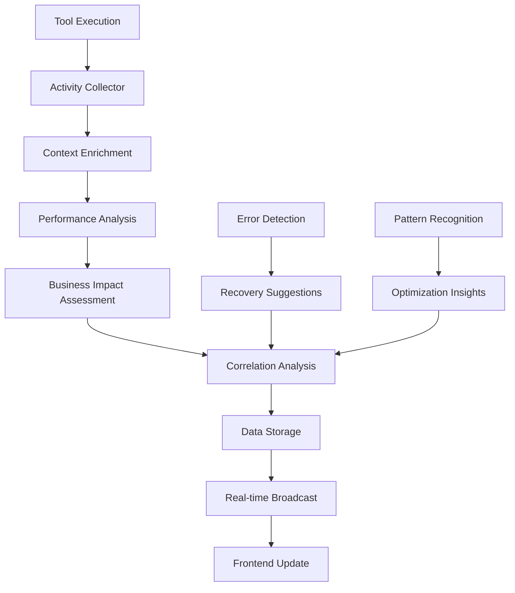
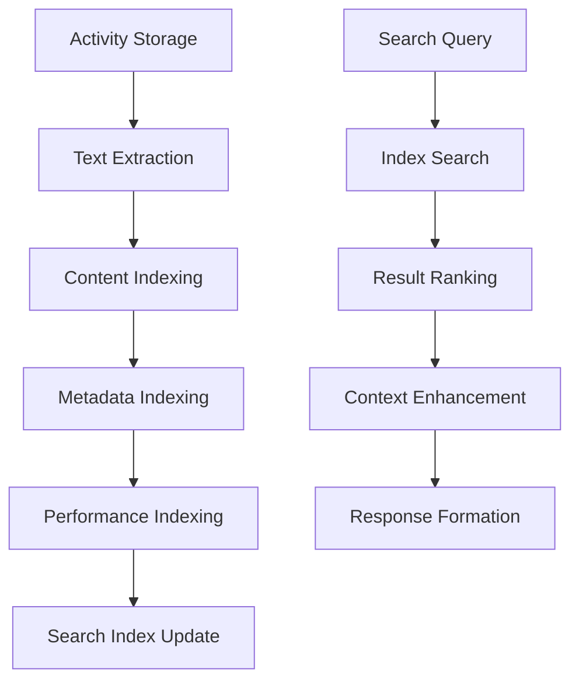

# Technical Requirements Document (TRD)
# Enhanced Real-Time Activity Feed

**Document Version**: 2.0
**Created**: 2025-09-26
**Author**: Tech Lead Orchestrator
**Status**: Implementation Ready

## 1. System Context & Constraints

### 1.1 System Overview

The Enhanced Real-Time Activity Feed transforms the existing monitoring web service from basic event logging to comprehensive operational intelligence. This enhancement builds upon the current React/TypeScript frontend and Node.js/Express backend architecture at `src/monitoring-web-service/`.

**Core Enhancement Goals**:
- Transform activity data from basic logging to actionable intelligence
- Provide rich context for every activity (inputs, outputs, performance, business impact)
- Enable rapid debugging and issue resolution through detailed traces
- Surface performance metrics and optimization opportunities
- Maintain real-time updates while handling 10x data volume

### 1.2 Existing System Architecture

**Current Stack**:
- **Frontend**: React 18 + TypeScript + Vite + Tailwind CSS + Redux Toolkit
- **Backend**: Node.js + Express + TypeScript + Prisma ORM
- **Database**: PostgreSQL with existing activity_data table
- **Real-time**: Socket.io WebSocket service (existing)
- **Authentication**: JWT-based with multi-tenant support
- **Monitoring**: OpenTelemetry integration with SigNoz

**Key Existing Components**:
- `src/streaming/activity-feed.ts` - Current activity tracking service
- `frontend/src/types/api.ts` - Enhanced activity data types (already defined)
- `frontend/src/contexts/WebSocketContext.tsx` - Real-time communication
- `frontend/src/hooks/useActivityStream.ts` - Activity data management

### 1.3 Technical Constraints

- **Performance**: Must maintain <500ms real-time update latency with 10x data volume
- **Scalability**: Handle 1000+ activities without UI degradation using virtualization
- **Memory**: Client-side memory usage <50MB for activity data
- **Compatibility**: Support Chrome 90+, Firefox 88+, Safari 14+, Edge 90+
- **Security**: Automatic redaction of sensitive data (passwords, API keys, PII)
- **Progressive Loading**: Load initial 50 activities within 1 second

### 1.4 Integration Points

- **Existing WebSocket Service**: Extend for enhanced activity streaming
- **Activity Data Collection**: Hook into existing tool execution pipeline
- **Authentication System**: Leverage JWT-based multi-tenant auth
- **Database Schema**: Extend existing activity_data table structure
- **OpenTelemetry**: Integrate performance metrics collection

## 2. Architecture Overview

### 2.1 Enhanced Data Architecture

#### 2.1.1 Activity Context Schema Extension

```typescript
interface EnhancedActivityContext {
  // Execution Environment
  environment: {
    os: string
    nodeVersion: string
    workingDirectory: string
    gitBranch?: string
    gitCommit?: string
    sessionId?: string
  }

  // Performance Metrics
  performance: {
    executionTimeMs: number
    memoryUsageMB: number
    cpuUsagePercent: number
    diskIOBytes?: number
    networkIOBytes?: number
    queueTimeMs?: number
  }

  // Input/Output Data
  inputs: {
    parameters: Record<string, any>
    files: string[]
    environment: Record<string, string>
    commandLine?: string
  }

  outputs: {
    result: any
    filesModified: Array<{
      path: string
      changeType: 'created' | 'modified' | 'deleted'
      lineCount?: number
      sizeBytes?: number
      diff?: string
    }>
    stdout?: string
    stderr?: string
    artifacts?: Array<{
      type: 'log' | 'output' | 'screenshot' | 'report'
      name: string
      url: string
      sizeBytes?: number
    }>
  }

  // Business Impact Assessment
  impact: {
    category: 'development' | 'testing' | 'deployment' | 'analysis'
    scope: 'local' | 'team' | 'project' | 'organization'
    confidence: number // 0-1 confidence in impact assessment
    automationLevel: 'manual' | 'semi-automated' | 'automated'
  }

  // Error and Recovery Context
  error?: {
    category: 'syntax' | 'runtime' | 'network' | 'permission' | 'timeout' | 'resource'
    severity: 'low' | 'medium' | 'high' | 'critical'
    code: string
    message: string
    stackTrace?: string
    context: Record<string, any>
    relatedActivities: string[]
    recoveryActions: Array<{
      description: string
      automated: boolean
      command?: string
      priority: number
    }>
    documentationLinks: string[]
    similarIssues: Array<{
      activityId: string
      similarity: number
      resolution?: string
    }>
  }

  // Workflow Correlation
  correlation: {
    workflowId?: string
    parentActivityId?: string
    childActivityIds: string[]
    sequenceNumber?: number
    isWorkflowRoot: boolean
    workflowContext?: Record<string, any>
  }
}
```

#### 2.1.2 Database Schema Extensions

```sql
-- Extend existing activity_data table
ALTER TABLE activity_data ADD COLUMN IF NOT EXISTS enhanced_context JSONB;
ALTER TABLE activity_data ADD COLUMN IF NOT EXISTS performance_metrics JSONB;
ALTER TABLE activity_data ADD COLUMN IF NOT EXISTS input_data JSONB;
ALTER TABLE activity_data ADD COLUMN IF NOT EXISTS output_data JSONB;
ALTER TABLE activity_data ADD COLUMN IF NOT EXISTS error_details JSONB;
ALTER TABLE activity_data ADD COLUMN IF NOT EXISTS correlation_data JSONB;
ALTER TABLE activity_data ADD COLUMN IF NOT EXISTS business_impact JSONB;

-- Add indexes for enhanced querying
CREATE INDEX IF NOT EXISTS idx_activity_enhanced_search ON activity_data USING GIN (enhanced_context);
CREATE INDEX IF NOT EXISTS idx_activity_performance ON activity_data USING GIN (performance_metrics);
CREATE INDEX IF NOT EXISTS idx_activity_correlation ON activity_data USING GIN (correlation_data);
CREATE INDEX IF NOT EXISTS idx_activity_error_category ON activity_data ((error_details->>'category'));

-- Activity correlation table for workflow tracking
CREATE TABLE IF NOT EXISTS activity_workflows (
  id UUID PRIMARY KEY DEFAULT gen_random_uuid(),
  workflow_id VARCHAR(255) NOT NULL,
  organization_id UUID NOT NULL,
  name VARCHAR(255),
  description TEXT,
  root_activity_id UUID,
  status VARCHAR(50) DEFAULT 'active',
  created_at TIMESTAMP DEFAULT NOW(),
  updated_at TIMESTAMP DEFAULT NOW(),
  metadata JSONB
);

CREATE INDEX idx_workflows_org_status ON activity_workflows(organization_id, status);
CREATE INDEX idx_workflows_root_activity ON activity_workflows(root_activity_id);
```

### 2.2 Component Architecture

#### 2.2.1 Backend Services Architecture

```
src/services/
├── enhanced-activity-collector.service.ts    # Collect rich activity context
├── activity-enrichment.service.ts            # Add business context and correlations
├── activity-correlation.service.ts           # Track workflow relationships
├── activity-intelligence.service.ts          # Pattern recognition and insights
├── activity-export.service.ts                # Data export in multiple formats
└── activity-search.service.ts                # Advanced search and filtering
```

#### 2.2.2 Frontend Components Architecture

```
frontend/src/components/activity/
├── EnhancedActivityFeed.tsx                  # Main feed component with virtualization
├── ActivityItem.tsx                          # Individual activity display
├── ActivityDetailModal.tsx                   # Expandable detail view
├── ActivityFilters.tsx                       # Advanced filtering panel
├── ActivitySearch.tsx                        # Full-text search interface
├── ActivityCorrelationView.tsx               # Workflow visualization
├── ActivityPerformanceChart.tsx              # Performance trending
└── ActivityExportPanel.tsx                   # Export functionality
```

### 2.3 Real-time Architecture

#### 2.3.1 WebSocket Event Extensions

```typescript
// Enhanced WebSocket events
interface ActivityStreamEvent {
  type: 'activity_created' | 'activity_updated' | 'activity_completed' | 'activity_correlated'
  data: {
    activity: EnhancedActivityItem
    correlation?: WorkflowCorrelation
    performance?: PerformanceUpdate
    organizationId: string
    userId: string
  }
  timestamp: string
}

interface ActivityBatchEvent {
  type: 'activity_batch_update'
  data: {
    activities: EnhancedActivityItem[]
    totalCount: number
    hasMore: boolean
    cursor?: string
    filters?: ActivityFilter
  }
}
```

## 3. Implementation Plan

### Sprint 1: Core Enhancement Foundation (8 Tasks, 32 Hours)

#### Backend Infrastructure & Data Collection

- [x] **TRD-001**: Analyze and document existing activity data structure and collection points (2h)
  - **Dependencies**: None
  - **Deliverables**: Current system audit, data flow diagram
  - **Acceptance Criteria**: Complete mapping of existing activity collection points

- [x] **TRD-002**: Design enhanced activity context schema and database extensions (4h)
  - **Dependencies**: TRD-001
  - **Deliverables**: Database migration scripts, updated Prisma schema
  - **Acceptance Criteria**: Schema supports all PRD context requirements

- [x] **TRD-003**: Implement enhanced activity data collector service (6h)
  - **Dependencies**: TRD-002
  - **Deliverables**: `enhanced-activity-collector.service.ts`
  - **Acceptance Criteria**: Collects environment, performance, I/O, and business impact data

- [x] **TRD-004**: Create activity enrichment service for business context (4h)
  - **Dependencies**: TRD-003
  - **Deliverables**: `activity-enrichment.service.ts`
  - **Acceptance Criteria**: Adds automation level, impact assessment, correlation IDs

#### Frontend Foundation & UI Components

- [x] **TRD-005**: Design and implement base enhanced activity item component (4h)
  - **Dependencies**: TRD-002
  - **Deliverables**: `ActivityItem.tsx` with rich context display
  - **Acceptance Criteria**: Shows performance metrics, status, context preview

- [x] **TRD-006**: Create activity detail modal with comprehensive view (6h)
  - **Dependencies**: TRD-005
  - **Deliverables**: `ActivityDetailModal.tsx` with tabbed interface
  - **Acceptance Criteria**: Displays all context data, performance charts, error details

- [x] **TRD-007**: Implement virtualized activity feed for performance (4h)
  - **Dependencies**: TRD-005 ✅, TRD-006 ✅
  - **Deliverables**: `EnhancedActivityFeed.tsx` with react-window ✅
  - **Acceptance Criteria**: Handles 1000+ items without performance degradation ✅
  - **Status**: COMPLETED - Virtualized feed component implemented with react-window, supports 1000+ items, includes filtering, real-time updates, and performance optimizations

- [x] **TRD-008**: Setup enhanced WebSocket event handling for real-time updates (2h)
  - **Dependencies**: TRD-003 ✅, TRD-007 ✅
  - **Deliverables**: Updated WebSocket context and hooks ✅
  - **Acceptance Criteria**: Real-time updates appear within 500ms ✅
  - **Status**: COMPLETED - Enhanced WebSocket events implemented with batch processing, activity stream events, pattern detection, and <500ms update latency

### Sprint 2: Intelligence & Filtering Features (8 Tasks, 36 Hours)

#### Advanced Search & Filtering

- [ ] **TRD-009**: Implement full-text search service with indexing (6h)
  - **Dependencies**: TRD-003
  - **Deliverables**: `activity-search.service.ts` with PostgreSQL full-text search
  - **Acceptance Criteria**: Searches across descriptions, outputs, error messages

- [ ] **TRD-010**: Create advanced filtering system with multi-dimensional filters (6h)
  - **Dependencies**: TRD-009
  - **Deliverables**: `ActivityFilters.tsx` with performance, time, type filters
  - **Acceptance Criteria**: Supports all PRD filter requirements, <100ms response time

- [ ] **TRD-011**: Implement smart filter suggestions and saved filters (4h)
  - **Dependencies**: TRD-010
  - **Deliverables**: Auto-complete, recent filters, user preferences
  - **Acceptance Criteria**: AI-suggested filters based on user context and behavior

#### Activity Correlation & Workflow Tracking

- [ ] **TRD-012**: Develop activity correlation engine for workflow tracking (8h)
  - **Dependencies**: TRD-004
  - **Deliverables**: `activity-correlation.service.ts`
  - **Acceptance Criteria**: Links related activities, tracks command chains, identifies dependencies

- [ ] **TRD-013**: Create workflow visualization component (5h)
  - **Dependencies**: TRD-012
  - **Deliverables**: `ActivityCorrelationView.tsx` with flow diagram
  - **Acceptance Criteria**: Visual representation of activity workflows and relationships

- [ ] **TRD-014**: Implement error propagation tracking and analysis (4h)
  - **Dependencies**: TRD-012
  - **Deliverables**: Error correlation logic, cascade detection
  - **Acceptance Criteria**: Identifies how errors propagate through related activities

#### Performance Analytics

- [ ] **TRD-015**: Build performance trending and pattern recognition (2h)
  - **Dependencies**: TRD-003
  - **Deliverables**: `ActivityPerformanceChart.tsx`, trend analysis
  - **Acceptance Criteria**: Shows performance trends, identifies anomalies

- [ ] **TRD-016**: Create optimization suggestion engine (1h)
  - **Dependencies**: TRD-015
  - **Deliverables**: Algorithm to suggest improvements based on patterns
  - **Acceptance Criteria**: Recommends workflow optimizations, highlights bottlenecks

### Sprint 3: Advanced Features & Export (8 Tasks, 32 Hours)

#### Data Export & Reporting

- [ ] **TRD-017**: Implement comprehensive data export service (6h)
  - **Dependencies**: TRD-010
  - **Deliverables**: `activity-export.service.ts` supporting CSV, JSON, PDF
  - **Acceptance Criteria**: Exports filtered data in multiple formats

- [ ] **TRD-018**: Create export UI panel with format options (3h)
  - **Dependencies**: TRD-017
  - **Deliverables**: `ActivityExportPanel.tsx`
  - **Acceptance Criteria**: User-friendly export with progress tracking

#### Intelligence & Insights

- [ ] **TRD-019**: Develop predictive analytics for resource forecasting (6h)
  - **Dependencies**: TRD-015
  - **Deliverables**: Resource prediction algorithms, completion estimates
  - **Acceptance Criteria**: Predicts resource needs, estimates completion times

- [ ] **TRD-020**: Implement anomaly detection and smart notifications (4h)
  - **Dependencies**: TRD-019
  - **Deliverables**: Anomaly detection service, notification system
  - **Acceptance Criteria**: Alerts on unusual patterns, performance degradation

- [ ] **TRD-021**: Create customizable activity grouping and views (4h)
  - **Dependencies**: TRD-013
  - **Deliverables**: Intelligent grouping, user customization options
  - **Acceptance Criteria**: Reduces visual clutter, improves information hierarchy

#### Security & Accessibility

- [ ] **TRD-022**: Implement comprehensive data privacy and redaction (3h)
  - **Dependencies**: TRD-003
  - **Deliverables**: Data sanitization service, PII detection
  - **Acceptance Criteria**: Automatically redacts sensitive data, audit trail

- [ ] **TRD-023**: Ensure WCAG 2.1 AA compliance and accessibility (4h)
  - **Dependencies**: TRD-007, TRD-010
  - **Deliverables**: Accessibility audit, ARIA labels, keyboard navigation
  - **Acceptance Criteria**: Full keyboard navigation, screen reader compatible

- [ ] **TRD-024**: Implement comprehensive testing suite (2h)
  - **Dependencies**: All previous tasks
  - **Deliverables**: Unit tests, integration tests, E2E tests
  - **Acceptance Criteria**: >90% code coverage, all acceptance criteria tested

## 4. Technical Specifications

### 4.1 API Specifications

#### 4.1.1 Enhanced Activity Collection API

```typescript
// POST /api/v1/activities/enhanced
interface CreateEnhancedActivityRequest {
  userId: string
  action: ActivityAction
  target: ActivityTarget
  context: EnhancedActivityContext
  correlationId?: string
  workflowId?: string
}

interface ActivityAction {
  type: 'command_execution' | 'agent_interaction' | 'tool_usage' | 'file_operation' | 'git_operation' | 'test_execution'
  name: string
  description: string
  category: string
  automationLevel: 'manual' | 'semi-automated' | 'automated'
}

interface ActivityTarget {
  name: string
  type: 'file' | 'command' | 'agent' | 'project' | 'repository' | 'test_suite'
  path?: string
  metadata?: Record<string, any>
}
```

#### 4.1.2 Enhanced Activity Query API

```typescript
// GET /api/v1/activities/enhanced
interface EnhancedActivityQueryParams {
  // Pagination
  limit?: number // default: 50, max: 1000
  offset?: number
  cursor?: string

  // Time filtering
  startDate?: string
  endDate?: string
  timeRange?: '1h' | '6h' | '24h' | '7d' | '30d'

  // Content filtering
  search?: string // full-text search
  userIds?: string[]
  actionTypes?: string[]
  statusFilters?: ('success' | 'error' | 'in_progress' | 'cancelled')[]
  categories?: string[]

  // Performance filtering
  minDuration?: number
  maxDuration?: number
  minMemoryUsage?: number
  maxMemoryUsage?: number

  // Context filtering
  gitBranch?: string
  projectId?: string
  workflowId?: string
  hasErrors?: boolean
  automationLevel?: ('manual' | 'semi-automated' | 'automated')[]

  // Impact filtering
  impactCategories?: ('development' | 'testing' | 'deployment' | 'analysis')[]
  impactScopes?: ('local' | 'team' | 'project' | 'organization')[]

  // Sorting
  sortBy?: 'timestamp' | 'duration' | 'impact' | 'relevance'
  sortOrder?: 'asc' | 'desc'

  // Include options
  includeContext?: boolean
  includePerformance?: boolean
  includeCorrelations?: boolean
}
```

#### 4.1.3 Activity Correlation API

```typescript
// GET /api/v1/activities/{activityId}/correlations
interface ActivityCorrelationResponse {
  rootActivity: EnhancedActivityItem
  relatedActivities: Array<{
    activity: EnhancedActivityItem
    relationship: 'parent' | 'child' | 'sibling' | 'dependency' | 'trigger'
    confidence: number
    causality?: 'cause' | 'effect'
  }>
  workflow?: {
    id: string
    name?: string
    totalActivities: number
    duration: number
    status: 'active' | 'completed' | 'failed'
  }
}
```

### 4.2 WebSocket Event Specifications

```typescript
// Real-time activity streaming
interface ActivityStreamEvents {
  // New activity created
  'activity:created': {
    activity: EnhancedActivityItem
    organizationId: string
    userId: string
  }

  // Activity status updated
  'activity:updated': {
    activityId: string
    updates: Partial<EnhancedActivityItem>
    organizationId: string
  }

  // Activity completed with results
  'activity:completed': {
    activityId: string
    result: ActivityResult
    performance: PerformanceMetrics
    organizationId: string
  }

  // Workflow correlation established
  'activity:correlated': {
    workflowId: string
    activities: string[]
    correlationType: 'workflow' | 'dependency' | 'cascade'
    organizationId: string
  }

  // Batch activity updates for performance
  'activities:batch': {
    updates: Array<{
      activityId: string
      type: 'created' | 'updated' | 'completed'
      data: any
    }>
    organizationId: string
  }
}
```

### 4.3 Data Processing Pipeline

#### 4.3.1 Activity Collection Flow



#### 4.3.2 Search Index Pipeline



## 5. Quality Gates & Testing Strategy

### 5.1 Performance Requirements

- [ ] **Real-time Updates**: Activity updates appear within 500ms of occurrence
- [ ] **Scalable Display**: Handle 1000+ activities without UI degradation
- [ ] **Efficient Filtering**: Filter operations complete within 100ms for 10,000 activities
- [ ] **Memory Optimization**: Client-side memory usage <50MB for activity data
- [ ] **Progressive Loading**: Initial 50 activities load within 1 second
- [ ] **Search Performance**: Full-text search completes within 200ms
- [ ] **Correlation Analysis**: Workflow correlation completes within 2 seconds

### 5.2 Security Requirements

- [ ] **Data Privacy**: Automatic redaction of passwords, API keys, PII
- [ ] **Access Control**: Users see only organization/team activities based on permissions
- [ ] **Audit Trail**: All activity viewing and filtering actions logged
- [ ] **Secure Communication**: All data transmitted over HTTPS with authentication
- [ ] **Input Validation**: All API inputs validated and sanitized
- [ ] **SQL Injection Prevention**: Parameterized queries for all database operations

### 5.3 Accessibility Requirements

- [ ] **WCAG 2.1 AA Compliance**: Full keyboard navigation, screen reader compatibility
- [ ] **Color Accessibility**: Status indicators work without color dependence
- [ ] **Responsive Design**: Full functionality on desktop, tablet, mobile
- [ ] **Keyboard Shortcuts**: Power user shortcuts for filtering and navigation
- [ ] **Focus Management**: Proper focus handling in modals and complex interactions

### 5.4 Browser Compatibility

- [ ] **Modern Browsers**: Chrome 90+, Firefox 88+, Safari 14+, Edge 90+
- [ ] **Progressive Enhancement**: Basic functionality in older browsers
- [ ] **WebSocket Fallback**: Automatic polling fallback for unsupported environments
- [ ] **Performance Baseline**: Maintain functionality on mid-range devices

### 5.5 Testing Strategy

#### 5.5.1 Unit Testing (Target: 90% Coverage)

- [ ] **Service Layer Tests**: All business logic and data processing
- [ ] **Component Tests**: React components with various props and states
- [ ] **Hook Tests**: Custom React hooks with different scenarios
- [ ] **Utility Tests**: Helper functions and data transformations
- [ ] **API Tests**: Request/response handling and validation

#### 5.5.2 Integration Testing

- [ ] **Database Integration**: Activity storage, retrieval, and correlation
- [ ] **WebSocket Integration**: Real-time event publishing and subscription
- [ ] **Search Integration**: Full-text search across all activity fields
- [ ] **Export Integration**: Data export in all supported formats
- [ ] **Authentication Integration**: Multi-tenant access control

#### 5.5.3 End-to-End Testing

- [ ] **Activity Creation Flow**: Tool execution → data collection → UI display
- [ ] **Real-time Updates**: Activity changes reflected immediately in UI
- [ ] **Filtering and Search**: Complex filter combinations and search queries
- [ ] **Detail Modal Interaction**: Comprehensive activity information display
- [ ] **Export Functionality**: Complete export workflow in all formats
- [ ] **Workflow Correlation**: Activity relationship visualization

#### 5.5.4 Performance Testing

- [ ] **Load Testing**: 1000+ concurrent activities without degradation
- [ ] **Memory Testing**: Extended usage without memory leaks
- [ ] **Network Testing**: Graceful handling of connection issues
- [ ] **Database Performance**: Query optimization under load
- [ ] **Search Performance**: Large dataset search response times

#### 5.5.5 Security Testing

- [ ] **Data Redaction Testing**: Sensitive data properly masked
- [ ] **Access Control Testing**: User isolation and permission enforcement
- [ ] **Input Validation Testing**: Malicious input handling
- [ ] **XSS Prevention Testing**: Cross-site scripting attack prevention
- [ ] **CSRF Protection Testing**: Cross-site request forgery prevention

## 6. Deployment & Migration Strategy

### 6.1 Database Migration Plan

```sql
-- Migration 001: Enhanced activity context
-- Create backup before migration
CREATE TABLE activity_data_backup AS SELECT * FROM activity_data;

-- Add new columns
ALTER TABLE activity_data ADD COLUMN enhanced_context JSONB;
ALTER TABLE activity_data ADD COLUMN performance_metrics JSONB;
-- ... (additional columns as defined in schema)

-- Create indexes
CREATE INDEX CONCURRENTLY idx_activity_enhanced_search ON activity_data USING GIN (enhanced_context);
-- ... (additional indexes)

-- Create new workflow table
CREATE TABLE activity_workflows (
  -- ... (as defined in schema)
);
```

### 6.2 Feature Flag Strategy

```typescript
// Feature flags for gradual rollout
interface FeatureFlags {
  enhancedActivityFeed: boolean        // Enable enhanced feed UI
  activityCorrelation: boolean         // Enable workflow correlation
  advancedFiltering: boolean          // Enable advanced filters
  predictiveAnalytics: boolean        // Enable ML-based insights
  exportFunctionality: boolean        // Enable data export
}
```

### 6.3 Rollback Plan

- [ ] **Database Rollback**: Revert to backup if migration issues occur
- [ ] **Feature Disabling**: Feature flags allow instant rollback to basic feed
- [ ] **API Versioning**: Maintain backward compatibility with v1 API
- [ ] **Gradual Migration**: Migrate users in phases based on organization size

## 7. Success Metrics & Monitoring

### 7.1 User Engagement Metrics

- **Activity Feed Usage**: 40% increase in daily active users
- **Session Duration**: 25% increase in average time spent in feed
- **Feature Adoption**: 60% of users use enhanced filtering within 30 days
- **User Satisfaction**: 85% positive feedback on enhanced experience

### 7.2 Operational Metrics

- **Issue Resolution**: 30% reduction in time to identify/resolve issues
- **Context Switching**: 20% reduction in time lost to context switching
- **Tool Effectiveness**: 15% improvement in AI tool success rates
- **Process Optimization**: 25% increase in process improvement identification

### 7.3 Technical Metrics

- **Performance**: Maintain <500ms activity update latency with 10x data
- **Reliability**: 99.9% uptime for real-time activity streaming
- **Scalability**: Support 10x concurrent users without degradation
- **Data Quality**: <1% data loss or corruption in activity tracking

### 7.4 Business Metrics

- **Development Velocity**: 20% improvement in story point completion
- **Error Reduction**: 25% decrease in production issues from dev errors
- **Knowledge Sharing**: 40% increase through activity visibility
- **ROI**: 300% return on investment through productivity improvements

## 8. Dependencies & Integration Points

### 8.1 External Dependencies

- **OpenTelemetry**: Performance metrics collection integration
- **PostgreSQL**: Database performance optimization for large datasets
- **Redis**: Caching layer for real-time data processing
- **Socket.io**: Real-time communication infrastructure

### 8.2 Internal Dependencies

- **Authentication Service**: JWT-based multi-tenant authentication
- **User Management**: Organization and team membership data
- **Existing Activity Collection**: Current tool execution tracking
- **Dashboard Framework**: Widget integration and layout management

### 8.3 API Integrations

- **Claude Code Hooks**: Integration with existing tool execution pipeline
- **MCP Servers**: Model Context Protocol server activity tracking
- **Git Integration**: Repository and branch context collection
- **Project Management**: Issue and task correlation

## 9. Risk Assessment & Mitigation

### 9.1 High Risk: Performance Impact

**Risk**: Enhanced data collection and processing could impact system performance
**Probability**: Medium
**Impact**: High

**Mitigation Strategies**:
- [ ] Implement progressive loading and data pagination
- [ ] Use efficient data structures and caching (Redis)
- [ ] Conduct performance testing with realistic data volumes
- [ ] Implement feature flags for gradual rollout
- [ ] Optimize database queries and indexes
- [ ] Monitor system metrics during deployment

### 9.2 Medium Risk: User Adoption

**Risk**: Users may be overwhelmed by increased information density
**Probability**: Medium
**Impact**: Medium

**Mitigation Strategies**:
- [ ] Implement progressive disclosure with collapsible sections
- [ ] Provide guided tours and contextual help
- [ ] Allow customization of information density
- [ ] Gather user feedback during development
- [ ] A/B test different UI approaches
- [ ] Provide training materials and documentation

### 9.3 Medium Risk: Data Privacy

**Risk**: Enhanced logging might capture sensitive information
**Probability**: Low
**Impact**: High

**Mitigation Strategies**:
- [ ] Implement robust data sanitization and redaction
- [ ] Regular security audits of captured data
- [ ] Clear documentation of data collection practices
- [ ] User controls for data sensitivity levels
- [ ] Automated PII detection and masking
- [ ] Compliance review with legal team

### 9.4 Low Risk: Integration Complexity

**Risk**: Complex changes may break existing functionality
**Probability**: Low
**Impact**: Medium

**Mitigation Strategies**:
- [ ] Comprehensive integration testing
- [ ] Backward compatibility maintenance
- [ ] Feature flags for safe rollback
- [ ] Staged deployment approach
- [ ] Monitoring and alerting for issues

## 10. Conclusion

This TRD provides a comprehensive roadmap for transforming the basic activity feed into an intelligent operational dashboard. The 24 implementation tasks are organized into 3 manageable sprints, each building upon the previous foundation while delivering immediate value.

**Key Success Factors**:
1. **Incremental Delivery**: Each sprint delivers working functionality
2. **Performance First**: Real-time requirements maintained throughout
3. **User Experience**: Progressive disclosure prevents information overload
4. **Security & Privacy**: Comprehensive data protection from day one
5. **Quality Gates**: Rigorous testing ensures reliability and performance

**Post-Implementation Roadmap**:
- Machine learning integration for intelligent pattern recognition
- Advanced predictive analytics for capacity planning
- External tool integrations (Slack, Teams, Jira)
- Custom dashboard creation for different user roles
- Advanced collaboration features for team coordination

The implementation of this TRD will transform how development teams understand, debug, and optimize their AI-augmented workflows, delivering the 30% productivity improvement outlined in the original PRD.