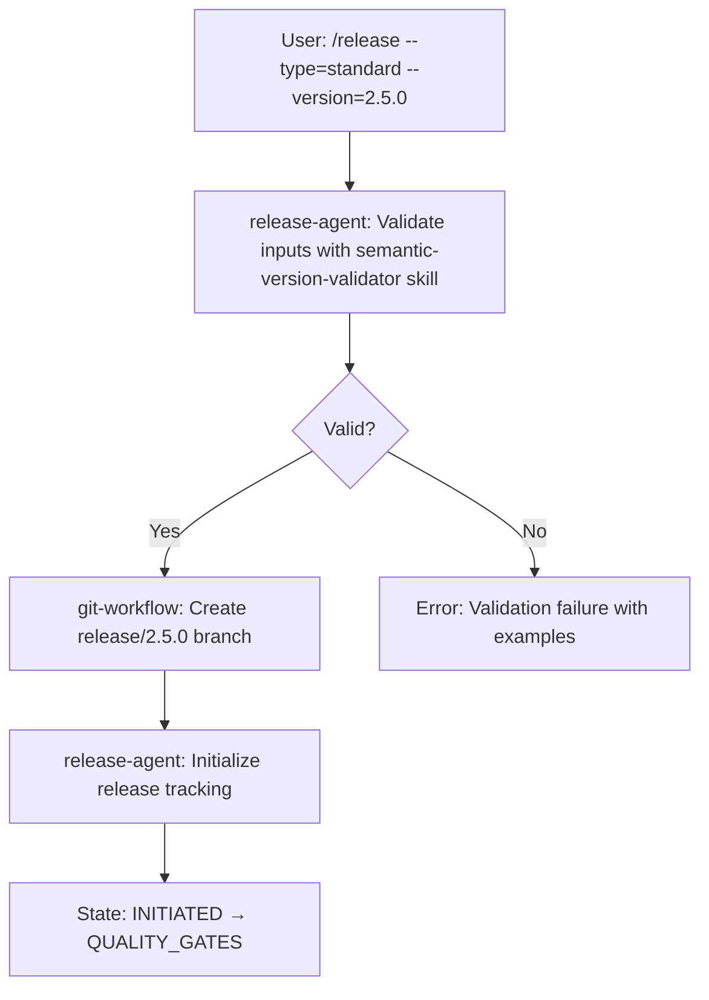
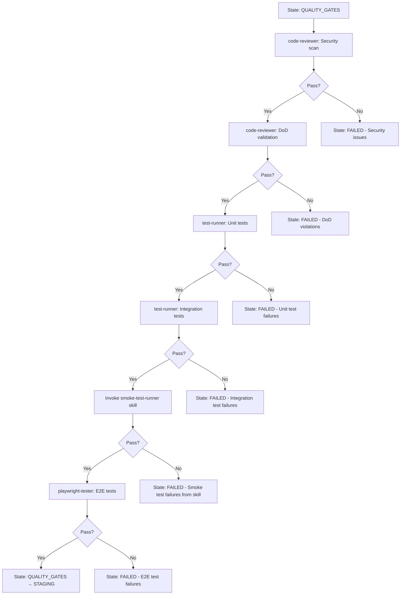
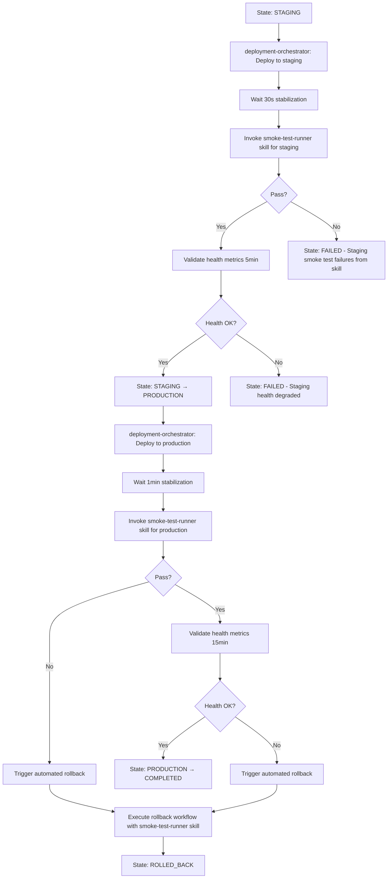
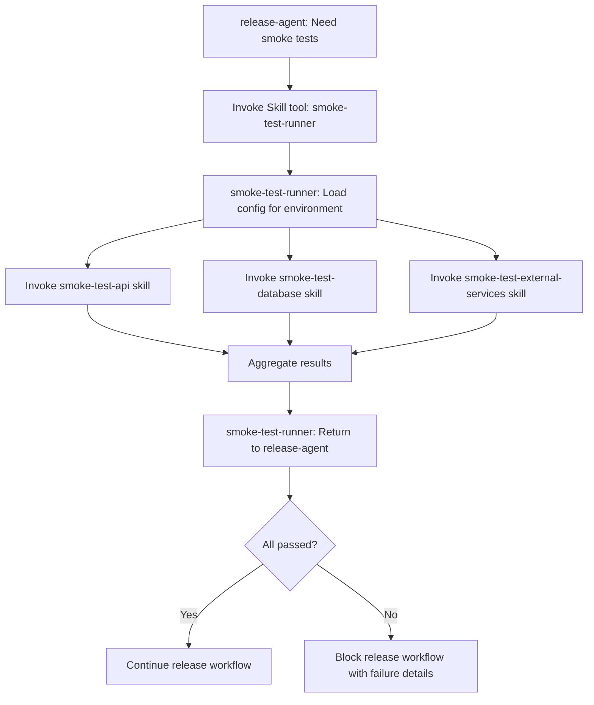

# Technical Requirements Document (TRD): Release Command System

## Document Metadata

- **PRD Reference**: docs/PRD/release-command-system.md v1.1.0
- **Created**: 2025-11-05
- **Version**: 1.2.0
- **Status**: Draft - Pending Stakeholder Review
- **Author**: Tech Lead Orchestrator (AI-Augmented Development Process)
- **Reviewers**: Engineering Management, DevOps Team, Technical Leads

## Executive Summary

The Release Command System implements a comprehensive automated release orchestration platform that reduces manual release steps by 80% while ensuring 100% quality gate compliance. This system coordinates 6 specialized agents (git-workflow, github-specialist, code-reviewer, test-runner, playwright-tester, deployment-orchestrator) through a new **release-agent** and introduces a comprehensive **smoke test suite** implemented as **reusable skills** that execute at critical deployment checkpoints (staging, production, rollback).

**Key Technical Achievements**:
- **Agent Orchestration**: Central release-agent coordinates 6 specialized agents with clear handoff contracts
- **Skills-Based Architecture**: Smoke tests, changelog generation, and reporting implemented as reusable skills (v3.1.0+ architecture)
- **Comprehensive Testing**: Sequential test execution (Unit → Integration → Smoke → E2E) with mandatory smoke tests at all deployment stages
- **Smoke Test Framework**: 5-category smoke test suite (API health, database connectivity, external services, authentication, critical user paths) orchestrated by smoke-test-runner skill with sub-3-minute execution
- **Rollback Automation**: Sub-5-minute rollback with automated smoke test verification
- **Multi-Workflow Support**: Git-flow, trunk-based development, and hotfix workflows with smoke test enforcement
- **Progressive Disclosure**: Skills load lightweight SKILL.md first (~5-10KB), comprehensive REFERENCE.md only when needed

**Technical Approach**:
1. Create release-agent (YAML) with agent coordination logic
2. Implement /release command with comprehensive argument parsing
3. Build smoke test framework as reusable skills with progressive disclosure
4. Design release workflow state machine
5. Implement quality gate orchestration with sequential test execution
6. Build deployment coordination with smoke test checkpoint skills
7. Implement rollback automation with smoke test verification skills

## Master Task List

### Sprint 1: Agent Architecture & Smoke Test Design (2 weeks)

#### Agent Architecture Tasks
- [ ] **TASK-001**: Create release-agent YAML definition with mission, tools, and behavior (3 days)
  - **Dependencies**: None
  - **Deliverables**: agents/yaml/release-agent.yaml
  - **Acceptance Criteria**: YAML validated, mission clear, tools minimal (Read, Write, Edit, Bash, Task), skills array defined (smoke-test-runner, changelog-generator, release-report-generator, audit-log-generator, semantic-version-validator)

- [ ] **TASK-002**: Define agent handoff contracts with 6 specialized agents (2 days)
  - **Dependencies**: TASK-001
  - **Deliverables**: docs/architecture/release-agent-handoffs.md
  - **Acceptance Criteria**: Input/output contracts for git-workflow, github-specialist, code-reviewer, test-runner, playwright-tester, deployment-orchestrator

- [ ] **TASK-003**: Design release workflow state machine (2 days)
  - **Dependencies**: TASK-001
  - **Deliverables**: docs/architecture/release-workflow-state-machine.md (Mermaid diagram)
  - **Acceptance Criteria**: States defined (initiated, quality_gates, staging, production, completed, failed, rolled_back), transitions validated

- [ ] **TASK-004**: Implement /release command YAML with argument parsing (2 days)
  - **Dependencies**: TASK-001, TASK-003
  - **Deliverables**: commands/yaml/release.yaml, commands/ai-mesh/release.md, commands/ai-mesh/release.txt
  - **Acceptance Criteria**: Arguments validated (--type, --version, --from, --to, --base, --target, --rollback), input validation logic complete

#### Smoke Test Framework Design Tasks
- [ ] **TASK-005**: Design smoke test suite structure with skills-based architecture (API, database, external services, auth, critical paths) (2 days)
  - **Dependencies**: None
  - **Deliverables**: docs/architecture/smoke-test-framework.md
  - **Acceptance Criteria**: 5 test categories defined as skills, execution timing <3min, environment-specific execution matrix, progressive disclosure pattern documented (SKILL.md + REFERENCE.md)

- [ ] **TASK-006**: Define smoke test execution points (pre-release, post-staging, post-production, post-rollback, canary) (1 day)
  - **Dependencies**: TASK-005
  - **Deliverables**: docs/architecture/smoke-test-execution-matrix.md
  - **Acceptance Criteria**: Execution points mapped to release workflow states, timing budgets allocated, skill invocation patterns documented

- [ ] **TASK-007**: Create smoke test configuration schema (YAML/JSON) for skill templates (2 days)
  - **Dependencies**: TASK-005
  - **Deliverables**: schemas/smoke-test-config-schema.json, skills/smoke-test-runner/templates/smoke-test-config.yaml
  - **Acceptance Criteria**: Schema validated, supports environment-specific config, critical path definitions, skill-compatible structure

### Sprint 2: Quality Gate Implementation & Skills-Based Test Suite (2 weeks)

#### Quality Gate Orchestration Tasks
- [ ] **TASK-008**: Implement sequential test execution controller (Unit → Integration → Smoke → E2E) (3 days)
  - **Dependencies**: TASK-001, TASK-005
  - **Deliverables**: src/quality-gates/test-execution-controller.js (or similar)
  - **Acceptance Criteria**: Sequential execution enforced, early exit on failure, progress tracking, timing metrics, smoke-test-runner skill invocation

- [ ] **TASK-009**: Integrate code-reviewer for security scan and DoD validation (2 days)
  - **Dependencies**: TASK-002, TASK-008
  - **Deliverables**: Updated release-agent with code-reviewer delegation
  - **Acceptance Criteria**: Security scan executes (3min target), DoD checklist enforced (2min target), results captured

- [ ] **TASK-010**: Integrate test-runner for unit test execution with coverage validation (2 days)
  - **Dependencies**: TASK-002, TASK-008
  - **Deliverables**: Updated release-agent with test-runner unit test delegation
  - **Acceptance Criteria**: Unit tests execute (5min target), coverage ≥80% enforced, failure triage provided

- [ ] **TASK-011**: Integrate test-runner for integration test execution with coverage validation (2 days)
  - **Dependencies**: TASK-010
  - **Deliverables**: Updated release-agent with test-runner integration test delegation
  - **Acceptance Criteria**: Integration tests execute (5min target), coverage ≥70% enforced, failure triage provided

- [ ] **TASK-012**: Integrate playwright-tester for E2E test execution (2 days)
  - **Dependencies**: TASK-002, TASK-008
  - **Deliverables**: Updated release-agent with playwright-tester delegation
  - **Acceptance Criteria**: E2E tests execute (5min target), critical journeys validated, trace artifacts captured

#### Smoke Test Skills Implementation Tasks
- [ ] **TASK-013**: Create smoke-test-api skill with progressive disclosure (2 days)
  - **Dependencies**: TASK-005, TASK-007
  - **Deliverables**:
    - skills/smoke-test-api/SKILL.md (quick reference, <5KB)
    - skills/smoke-test-api/REFERENCE.md (comprehensive patterns, API docs, ~15KB)
    - skills/smoke-test-api/scripts/execute-health-checks.js
    - skills/smoke-test-api/templates/health-check-config.yaml
  - **Acceptance Criteria**: Skill validates API endpoints, supports environment-specific config, <30s execution, progressive disclosure pattern

- [ ] **TASK-014**: Create smoke-test-database skill with progressive disclosure (2 days)
  - **Dependencies**: TASK-005, TASK-007
  - **Deliverables**:
    - skills/smoke-test-database/SKILL.md (quick reference, <5KB)
    - skills/smoke-test-database/REFERENCE.md (comprehensive patterns, ~15KB)
    - skills/smoke-test-database/scripts/test-connectivity.js
    - skills/smoke-test-database/templates/database-config.yaml
  - **Acceptance Criteria**: Skill validates read/write operations, connection pool health, <20s execution, progressive disclosure pattern

- [ ] **TASK-015**: Create smoke-test-external-services skill with progressive disclosure (2 days)
  - **Dependencies**: TASK-005, TASK-007
  - **Deliverables**:
    - skills/smoke-test-external-services/SKILL.md (quick reference, <5KB)
    - skills/smoke-test-external-services/REFERENCE.md (comprehensive patterns, ~15KB)
    - skills/smoke-test-external-services/scripts/test-integrations.js
    - skills/smoke-test-external-services/templates/external-services-config.yaml
  - **Acceptance Criteria**: Skill validates third-party APIs, outage detection, fallback recommendations, <30s execution, progressive disclosure pattern

- [ ] **TASK-016**: Create smoke-test-auth skill with progressive disclosure (2 days)
  - **Dependencies**: TASK-005, TASK-007
  - **Deliverables**:
    - skills/smoke-test-auth/SKILL.md (quick reference, <5KB)
    - skills/smoke-test-auth/REFERENCE.md (comprehensive patterns, ~15KB)
    - skills/smoke-test-auth/scripts/test-auth-flows.js
    - skills/smoke-test-auth/templates/auth-config.yaml
  - **Acceptance Criteria**: Skill validates login/logout, token generation, <20s execution, progressive disclosure pattern

- [ ] **TASK-017**: Create smoke-test-critical-paths skill with progressive disclosure (3 days)
  - **Dependencies**: TASK-005, TASK-007, TASK-013, TASK-014, TASK-015, TASK-016
  - **Deliverables**:
    - skills/smoke-test-critical-paths/SKILL.md (quick reference, <5KB)
    - skills/smoke-test-critical-paths/REFERENCE.md (comprehensive patterns, ~15KB)
    - skills/smoke-test-critical-paths/scripts/execute-journeys.js
    - skills/smoke-test-critical-paths/templates/critical-paths-config.yaml
  - **Acceptance Criteria**: Skill executes 3-5 user journeys, environment-specific paths, <80s execution, progressive disclosure pattern

- [ ] **TASK-018**: Create smoke-test-runner orchestration skill (2 days)
  - **Dependencies**: TASK-013, TASK-014, TASK-015, TASK-016, TASK-017
  - **Deliverables**:
    - skills/smoke-test-runner/SKILL.md (orchestration overview, <5KB)
    - skills/smoke-test-runner/REFERENCE.md (comprehensive orchestration patterns, ~15KB)
    - skills/smoke-test-runner/scripts/run-smoke-tests.js (invokes all 5 smoke test skills)
    - skills/smoke-test-runner/templates/smoke-test-config.yaml (environment-specific)
  - **Acceptance Criteria**: Orchestrates 5 smoke test categories, <3min total execution, parallel where possible, progressive disclosure pattern

- [ ] **TASK-019**: Update release-agent to invoke smoke-test-runner skill (1 day)
  - **Dependencies**: TASK-018
  - **Deliverables**: Updated agents/yaml/release-agent.yaml with smoke-test-runner in skills array
  - **Acceptance Criteria**: release-agent invokes smoke-test-runner via Skill tool, environment configuration supported, results aggregated

### Sprint 3: Deployment & Rollback Workflows with Skills Integration (2 weeks)

#### Deployment Orchestration Tasks
- [ ] **TASK-020**: Integrate git-workflow for branch management and tagging (2 days)
  - **Dependencies**: TASK-002
  - **Deliverables**: Updated release-agent with git-workflow delegation
  - **Acceptance Criteria**: Branch creation validated, semantic versioning enforced, conventional commits checked

- [ ] **TASK-021**: Create changelog-generator skill with progressive disclosure (2 days)
  - **Dependencies**: TASK-002
  - **Deliverables**:
    - skills/changelog-generator/SKILL.md (quick reference, <5KB)
    - skills/changelog-generator/REFERENCE.md (comprehensive patterns, ~15KB)
    - skills/changelog-generator/scripts/generate-changelog.js
  - **Acceptance Criteria**: Parses conventional commits, categorizes changes (Features, Bug Fixes, Breaking Changes), <60s execution

- [ ] **TASK-022**: Integrate github-specialist for PR creation with changelog skill (3 days)
  - **Dependencies**: TASK-002, TASK-008, TASK-021
  - **Deliverables**: Updated release-agent with github-specialist delegation and changelog-generator skill invocation
  - **Acceptance Criteria**: PR created with changelog from skill, test execution report (unit, integration, smoke, E2E), reviewers assigned

- [ ] **TASK-023**: Implement staging deployment workflow with smoke-test-runner skill (3 days)
  - **Dependencies**: TASK-002, TASK-018, TASK-019
  - **Deliverables**: Updated release-agent with staging deployment coordination and smoke-test-runner invocation
  - **Acceptance Criteria**: Deploy to staging (5min), execute smoke-test-runner skill (3min), validate health (5min), block on failure

- [ ] **TASK-024**: Implement production deployment workflow with smoke-test-runner skill (3 days)
  - **Dependencies**: TASK-023
  - **Deliverables**: Updated release-agent with production deployment coordination and smoke-test-runner invocation
  - **Acceptance Criteria**: Deploy to production (5min), execute smoke-test-runner skill (3min), validate health (15min), trigger rollback on failure

- [ ] **TASK-025**: Integrate deployment-orchestrator for deployment strategy execution (blue-green, canary, rolling) (3 days)
  - **Dependencies**: TASK-002, TASK-023, TASK-024
  - **Deliverables**: Updated release-agent with deployment-orchestrator delegation
  - **Acceptance Criteria**: Blue-green support (smoke tests on blue before switch), canary support (smoke tests at 5%, 100%), rolling support (smoke tests at 50%)

#### Rollback Automation Tasks
- [ ] **TASK-026**: Implement automated rollback trigger on production smoke test failure (2 days)
  - **Dependencies**: TASK-024, TASK-025
  - **Deliverables**: src/rollback/automated-rollback-trigger.js
  - **Acceptance Criteria**: Smoke test failure triggers rollback, error rate threshold validated, multi-signal triggers supported

- [ ] **TASK-027**: Implement rollback workflow with traffic reversion and smoke-test-runner verification (3 days)
  - **Dependencies**: TASK-026
  - **Deliverables**: Updated release-agent with rollback workflow and smoke-test-runner invocation
  - **Acceptance Criteria**: Traffic reverted (<2min), smoke-test-runner skill executed (3min), health validated (5min), git revert created

- [ ] **TASK-028**: Implement rollback smoke test verification using smoke-test-runner skill (2 days)
  - **Dependencies**: TASK-027, TASK-018
  - **Deliverables**: Updated rollback workflow with smoke-test-runner validation
  - **Acceptance Criteria**: Smoke-test-runner skill executes post-rollback, error rate normalization verified, escalation on failure

- [ ] **TASK-029**: Implement hotfix workflow with canary-stage smoke tests using smoke-test-runner skill (3 days)
  - **Dependencies**: TASK-025, TASK-018
  - **Deliverables**: Updated release-agent with hotfix workflow and smoke-test-runner invocation
  - **Acceptance Criteria**: Fast-track validation (10min), canary smoke tests via skill (5%, 25%, 100%), backport to develop automated

### Sprint 4: Release Workflow Skills, Dashboard & Polish (2 weeks)

#### Release Workflow Skills Tasks
- [ ] **TASK-030**: Create release-report-generator skill with progressive disclosure (2 days)
  - **Dependencies**: TASK-008, TASK-018, TASK-024
  - **Deliverables**:
    - skills/release-report-generator/SKILL.md (quick reference, <5KB)
    - skills/release-report-generator/REFERENCE.md (comprehensive patterns, ~15KB)
    - skills/release-report-generator/scripts/generate-report.js
    - skills/release-report-generator/templates/release-report.md.template
  - **Acceptance Criteria**: Generates comprehensive release report with test execution history, <60s generation, progressive disclosure pattern

- [ ] **TASK-031**: Create audit-log-generator skill (1 day)
  - **Dependencies**: TASK-030
  - **Deliverables**:
    - skills/audit-log-generator/SKILL.md (quick reference, <5KB)
    - skills/audit-log-generator/scripts/append-audit-entry.js
  - **Acceptance Criteria**: Appends audit log entry with test execution tracking, <5s execution

- [ ] **TASK-032**: Create semantic-version-validator skill (1 day)
  - **Dependencies**: None
  - **Deliverables**:
    - skills/semantic-version-validator/SKILL.md (quick reference, <5KB)
    - skills/semantic-version-validator/scripts/validate-version.js
  - **Acceptance Criteria**: Validates semantic versioning format (X.Y.Z), <1s execution

- [ ] **TASK-033**: Integrate release workflow skills with release-agent (2 days)
  - **Dependencies**: TASK-030, TASK-031, TASK-032
  - **Deliverables**: Updated release-agent with release workflow skills in skills array
  - **Acceptance Criteria**: release-agent invokes release-report-generator, audit-log-generator, semantic-version-validator via Skill tool

#### Dashboard & Reporting Tasks
- [ ] **TASK-034**: Integrate with Linear/Jira for ticket updates with release reports from skill (2 days)
  - **Dependencies**: TASK-030, TASK-031
  - **Deliverables**: Updated release-agent with MCP ticketing integration
  - **Acceptance Criteria**: Tickets updated with deployment status, release notes linked, test execution report from release-report-generator skill attached

- [ ] **TASK-035**: Integrate with manager-dashboard-agent for release metrics (2 days)
  - **Dependencies**: TASK-030, TASK-031
  - **Deliverables**: Updated release-agent with dashboard integration
  - **Acceptance Criteria**: Metrics sent (cycle time, success rate, rollback frequency, test execution metrics from skills)

- [ ] **TASK-036**: Implement real-time release progress dashboard (3 days)
  - **Dependencies**: TASK-008, TASK-035
  - **Deliverables**: src/dashboard/release-progress-dashboard.js
  - **Acceptance Criteria**: Real-time progress tracking, quality gate status visualization, test execution status, WCAG 2.1 AA compliant

- [ ] **TASK-037**: Implement release history analytics dashboard (test execution trends, bottlenecks) (2 days)
  - **Dependencies**: TASK-035, TASK-036
  - **Deliverables**: src/dashboard/release-analytics-dashboard.js
  - **Acceptance Criteria**: Historical trends displayed, bottleneck identification, test execution analytics (pass rates, timing)

#### Documentation & Testing Tasks
- [ ] **TASK-038**: Create comprehensive release-agent documentation with skills examples (2 days)
  - **Dependencies**: All agent tasks
  - **Deliverables**: agents/yaml/release-agent.yaml with inline comments, docs/guides/release-agent-guide.md
  - **Acceptance Criteria**: All features documented, skill invocation examples provided, troubleshooting guide included

- [ ] **TASK-039**: Create /release command documentation with usage examples (1 day)
  - **Dependencies**: TASK-004
  - **Deliverables**: docs/guides/release-command-guide.md
  - **Acceptance Criteria**: All arguments documented, workflow examples (standard, hotfix, rollback), edge cases covered

- [ ] **TASK-040**: Implement comprehensive error messages with actionable fixes (2 days)
  - **Dependencies**: All implementation tasks
  - **Deliverables**: src/errors/release-error-messages.js
  - **Acceptance Criteria**: User-friendly messages, examples provided, troubleshooting steps included

- [ ] **TASK-041**: Create integration tests for agent handoffs with failure scenarios (3 days)
  - **Dependencies**: All agent integration tasks
  - **Deliverables**: tests/integration/agent-handoffs.test.js
  - **Acceptance Criteria**: All 6 agent handoffs tested, failure scenarios covered, timeout handling validated

- [ ] **TASK-042**: Create integration tests for skills invocation (2 days)
  - **Dependencies**: TASK-018, TASK-030, TASK-031, TASK-032, TASK-033
  - **Deliverables**: tests/integration/skills-invocation.test.js
  - **Acceptance Criteria**: All 10 skills tested independently, skill orchestration validated, environment-specific config tested

- [ ] **TASK-043**: Create end-to-end release workflow tests (3 days)
  - **Dependencies**: All implementation tasks
  - **Deliverables**: tests/e2e/release-workflows.test.js
  - **Acceptance Criteria**: Standard release tested, hotfix tested, rollback tested, smoke test skill integration validated

- [ ] **TASK-044**: Performance optimization to meet timing requirements (2 days)
  - **Dependencies**: TASK-041, TASK-042, TASK-043
  - **Deliverables**: Performance profiling report, optimization commits
  - **Acceptance Criteria**: Quality gates <23min, smoke-test-runner skill <3min, rollback <5min, staging deployment <13min, production deployment <23min

- [ ] **TASK-045**: Create runbook for common release scenarios and troubleshooting (2 days)
  - **Dependencies**: TASK-038, TASK-039
  - **Deliverables**: docs/runbooks/release-command-runbook.md
  - **Acceptance Criteria**: Common scenarios documented, troubleshooting steps clear, escalation procedures defined

### Sprint 5: Advanced Release Features & Integrations (3 weeks)

#### Dry-Run & Preview Mode Tasks
- [ ] **TASK-046**: Implement dry-run mode for release-agent with simulation capabilities (3 days)
  - **Dependencies**: TASK-001, TASK-003, TASK-004
  - **Deliverables**:
    - Updated release-agent with --dry-run flag support
    - src/dry-run/simulation-engine.js
  - **Acceptance Criteria**: Simulates release workflow, shows version bump preview, displays changelog preview, lists tests that would run, previews deployment strategy, estimates execution time, exits before any mutations (no commits, no deployments)

- [ ] **TASK-047**: Create preview-generator skill for release visualization (2 days)
  - **Dependencies**: TASK-046
  - **Deliverables**:
    - skills/preview-generator/SKILL.md (quick reference, <5KB)
    - skills/preview-generator/scripts/generate-preview.js
  - **Acceptance Criteria**: Generates markdown preview with version bump, changelog snippet, test execution plan, deployment timeline, <5s generation

#### Monorepo Support Tasks
- [ ] **TASK-048**: Create monorepo-coordinator skill with dependency graph analysis (5 days)
  - **Dependencies**: None
  - **Deliverables**:
    - skills/monorepo-coordinator/SKILL.md (quick reference, ~8KB)
    - skills/monorepo-coordinator/REFERENCE.md (comprehensive guide, ~20KB)
    - skills/monorepo-coordinator/scripts/detect-monorepo.js
    - skills/monorepo-coordinator/scripts/analyze-dependencies.js
  - **Acceptance Criteria**: Detects Lerna/Nx/Turborepo/pnpm workspaces, builds dependency graph, identifies affected packages, recommends versioning strategy (independent vs. fixed), <10s analysis

- [ ] **TASK-049**: Implement selective smoke testing for monorepo packages (3 days)
  - **Dependencies**: TASK-048, TASK-018
  - **Deliverables**: Updated smoke-test-runner with monorepo awareness
  - **Acceptance Criteria**: Only tests affected packages, respects dependency order, supports workspace-specific configs, <5min for full monorepo

- [ ] **TASK-050**: Add cascade deployment ordering for monorepo releases (3 days)
  - **Dependencies**: TASK-048, TASK-024
  - **Deliverables**: Updated release-agent with monorepo deployment orchestration
  - **Acceptance Criteria**: Deploys packages in dependency order, supports parallel deployment for independent packages, <30min for full monorepo

#### Notification & Communication Tasks
- [ ] **TASK-051**: Create notification-dispatcher skill with multi-channel support (4 days)
  - **Dependencies**: None
  - **Deliverables**:
    - skills/notification-dispatcher/SKILL.md (quick reference, ~6KB)
    - skills/notification-dispatcher/REFERENCE.md (comprehensive guide, ~18KB)
    - skills/notification-dispatcher/scripts/send-notification.js
    - skills/notification-dispatcher/templates/notification-config.yaml
  - **Acceptance Criteria**: Supports Slack webhooks, email (SendGrid/AWS SES), Microsoft Teams, custom webhooks, template-based messages, <3s per notification

- [ ] **TASK-052**: Define notification templates for release lifecycle events (2 days)
  - **Dependencies**: TASK-051
  - **Deliverables**:
    - skills/notification-dispatcher/templates/release-initiated.md
    - skills/notification-dispatcher/templates/quality-gates-passed.md
    - skills/notification-dispatcher/templates/deployment-complete.md
    - skills/notification-dispatcher/templates/smoke-test-failure.md
    - skills/notification-dispatcher/templates/rollback-triggered.md
  - **Acceptance Criteria**: Rich formatting (Slack blocks, HTML email), includes actionable links, severity-based styling

- [ ] **TASK-053**: Integrate notification-dispatcher with release-agent workflow (2 days)
  - **Dependencies**: TASK-051, TASK-052
  - **Deliverables**: Updated release-agent with notification events
  - **Acceptance Criteria**: Notifications sent at 7 key events (initiated, quality gates passed/failed, deployment started/completed, smoke test failure, rollback triggered)

#### Approval Workflow Tasks
- [ ] **TASK-054**: Create approval-workflow-manager skill with stakeholder tracking (3 days)
  - **Dependencies**: None
  - **Deliverables**:
    - skills/approval-workflow-manager/SKILL.md (quick reference, ~6KB)
    - skills/approval-workflow-manager/REFERENCE.md (comprehensive guide, ~16KB)
    - skills/approval-workflow-manager/scripts/request-approval.js
    - skills/approval-workflow-manager/templates/approval-config.yaml
  - **Acceptance Criteria**: Supports Linear/Jira approval tracking, Slack approval buttons, email confirmation links, timeout handling (auto-reject after 24h), approval history audit trail

- [ ] **TASK-055**: Define approval gate policies for release stages (2 days)
  - **Dependencies**: TASK-054
  - **Deliverables**:
    - skills/approval-workflow-manager/templates/pre-production-approval.yaml
    - skills/approval-workflow-manager/templates/rollback-approval.yaml
    - skills/approval-workflow-manager/templates/hotfix-bypass-approval.yaml
  - **Acceptance Criteria**: Role-based approval (tech lead, security team, on-call engineer), escalation paths defined, time-based auto-approval for automated releases

- [ ] **TASK-056**: Integrate approval gates with release-agent state machine (2 days)
  - **Dependencies**: TASK-054, TASK-055
  - **Deliverables**: Updated release-agent with approval checkpoints
  - **Acceptance Criteria**: Blocks at pre-production, manual override, rollback, hotfix bypass stages until approval received

#### Release Scheduling Tasks
- [ ] **TASK-057**: Create release-scheduler skill with maintenance window support (3 days)
  - **Dependencies**: None
  - **Deliverables**:
    - skills/release-scheduler/SKILL.md (quick reference, ~5KB)
    - skills/release-scheduler/REFERENCE.md (comprehensive guide, ~14KB)
    - skills/release-scheduler/scripts/schedule-release.js
    - skills/release-scheduler/templates/scheduler-config.yaml
  - **Acceptance Criteria**: Cron-based scheduling, timezone-aware, validates maintenance windows (no deploy during peak hours), queue management, cancel/postpone support, <2s scheduling operation

- [ ] **TASK-058**: Integrate release-scheduler with release-agent (2 days)
  - **Dependencies**: TASK-057
  - **Deliverables**: Updated /release command with --schedule flag
  - **Acceptance Criteria**: Accepts --schedule "2025-11-10 02:00 UTC", validates against maintenance windows, queues release, sends confirmation notification

#### Feature Flag Integration Tasks
- [ ] **TASK-059**: Create feature-flag-coordinator skill with multi-platform support (4 days)
  - **Dependencies**: None
  - **Deliverables**:
    - skills/feature-flag-coordinator/SKILL.md (quick reference, ~6KB)
    - skills/feature-flag-coordinator/REFERENCE.md (comprehensive guide, ~18KB)
    - skills/feature-flag-coordinator/scripts/coordinate-flags.js
  - **Acceptance Criteria**: Supports LaunchDarkly, Split.io, Unleash APIs, validates flag states, suggests rollout strategy (25%→50%→100%), identifies orphaned flags, auto-enables flags post-deployment, <5s coordination

- [ ] **TASK-060**: Integrate feature-flag-coordinator with release workflow (2 days)
  - **Dependencies**: TASK-059
  - **Deliverables**: Updated release-agent with feature flag coordination
  - **Acceptance Criteria**: Pre-release flag validation, post-deployment flag enablement, rollback flag disablement, flag cleanup recommendations

#### Documentation & Testing Tasks
- [ ] **TASK-061**: Create comprehensive documentation for Sprint 5 features (3 days)
  - **Dependencies**: All Sprint 5 tasks
  - **Deliverables**:
    - docs/guides/dry-run-mode-guide.md
    - docs/guides/monorepo-releases-guide.md
    - docs/guides/notification-setup-guide.md
    - docs/guides/approval-workflows-guide.md
    - docs/guides/release-scheduling-guide.md
    - docs/guides/feature-flag-integration-guide.md
  - **Acceptance Criteria**: All features documented with examples, configuration templates provided, troubleshooting sections included

- [ ] **TASK-062**: Create integration tests for Sprint 5 skills (4 days)
  - **Dependencies**: All Sprint 5 implementation tasks
  - **Deliverables**: tests/integration/advanced-features.test.js
  - **Acceptance Criteria**: All 6 new skills tested, monorepo scenarios covered, notification delivery verified, approval workflows validated

- [ ] **TASK-063**: Create end-to-end tests for advanced release workflows (3 days)
  - **Dependencies**: TASK-062
  - **Deliverables**: tests/e2e/advanced-release-workflows.test.js
  - **Acceptance Criteria**: Dry-run tested, monorepo release tested, approval gate tested, scheduled release tested, feature flag coordination tested

## System Architecture

### Component Design

#### 1. release-agent (Central Orchestrator)

**Responsibility**: Coordinates all release activities through intelligent agent delegation and skill invocation

**Core Capabilities**:
- Release workflow state management (initiated → quality_gates → staging → production → completed/failed/rolled_back)
- Agent coordination and handoff orchestration
- Quality gate sequencing with early exit on failure
- Skill invocation for smoke tests, changelog generation, reporting
- Deployment strategy selection and validation
- Rollback decision making and execution
- Audit trail generation with test execution history from skills

**Skills Integration**:
- **smoke-test-runner**: Orchestrates 5 smoke test categories at deployment checkpoints
- **changelog-generator**: Parses conventional commits for PR creation
- **release-report-generator**: Generates comprehensive release reports
- **audit-log-generator**: Appends audit log entries
- **semantic-version-validator**: Validates version format

**Key Algorithms**:
```
Release Workflow State Machine:
1. INITIATED: Validate inputs with semantic-version-validator skill, create release branch
2. QUALITY_GATES: Execute sequential tests (Unit → Integration → Smoke via smoke-test-runner skill → E2E)
3. STAGING: Deploy to staging, execute smoke-test-runner skill, validate health
4. PRODUCTION: Deploy to production, execute smoke-test-runner skill, validate health
5. COMPLETED: Generate reports via release-report-generator skill, update tickets, finalize audit trail via audit-log-generator skill
6. FAILED: Generate failure report via release-report-generator skill, rollback if needed, alert stakeholders
7. ROLLED_BACK: Execute rollback, verify with smoke-test-runner skill, alert stakeholders
```

**Error Handling**:
- Quality gate failure → Block progression, provide detailed report, require confirmation to retry
- Smoke test failure (pre-release) → Block staging deployment, provide critical path failure details from smoke-test-runner skill
- Smoke test failure (post-staging) → Block production deployment, optionally rollback staging
- Smoke test failure (post-production) → Trigger automated rollback, alert on-call (P0)
- Smoke test failure (post-rollback) → Escalate to on-call, provide manual intervention steps
- Agent timeout → Circuit breaker pattern (5min timeout), fallback to manual steps
- Skill invocation failure → Retry once, then fail with skill error details

#### 2. Smoke Test Framework (Skills-Based Architecture)

**Responsibility**: Execute critical path validation at deployment checkpoints through reusable skills

**Skills**:
- **smoke-test-runner**: Orchestration skill coordinating 5 smoke test categories
- **smoke-test-api**: API health check execution (skills/smoke-test-api/)
- **smoke-test-database**: Database connectivity validation (skills/smoke-test-database/)
- **smoke-test-external-services**: Third-party API validation (skills/smoke-test-external-services/)
- **smoke-test-auth**: Authentication flow validation (skills/smoke-test-auth/)
- **smoke-test-critical-paths**: User journey execution (skills/smoke-test-critical-paths/)

**Invocation Pattern**:
1. release-agent invokes **smoke-test-runner** skill via Skill tool
2. smoke-test-runner loads environment-specific config from skills/smoke-test-runner/templates/smoke-test-config.yaml
3. smoke-test-runner invokes 5 sub-skills in parallel (where possible)
4. Results aggregated and returned to release-agent

**Progressive Disclosure Pattern**:
- **SKILL.md** (~5KB): Quick reference, loaded first
  - Purpose, basic usage, common patterns
  - Fast loading (<100ms)
- **REFERENCE.md** (~15KB): Comprehensive docs, loaded when needed
  - Detailed API reference
  - Advanced patterns and troubleshooting
  - Only loaded for complex scenarios or debugging

**Execution Strategy**:
```
Parallel Execution (where possible):
- API health checks + Database connectivity (parallel)
- External service integration (parallel with health checks)
- Authentication flows (sequential after health checks)
- Critical user paths (sequential, depends on auth)

Timing Budget:
- API health checks (smoke-test-api): 30s
- Database connectivity (smoke-test-database): 20s
- External services (smoke-test-external-services): 30s
- Authentication (smoke-test-auth): 20s
- Critical user paths (smoke-test-critical-paths): 80s
Total: ~3 minutes (smoke-test-runner orchestration)
```

**Benefits**:
- **Reusability**: smoke-test-runner can be invoked by any agent needing smoke tests (not just release-agent)
- **Progressive Disclosure**: Skills load lightweight SKILL.md first, detailed REFERENCE.md only when debugging
- **Independent Testing**: Each skill can be tested independently before integration
- **Maintainability**: Update skill logic in one place, benefits all agents
- **Context Efficiency**: Skills keep prompt bloat minimal while providing comprehensive capabilities

**Environment-Specific Configuration**:
```yaml
# skills/smoke-test-runner/templates/smoke-test-config.yaml
smoke_tests:
  development:
    api_health_checks:
      - endpoint: "http://dev-api.example.com/health"
        expected_status: 200
        timeout: 5s
    critical_paths:
      - name: "User Registration"
        steps: ["GET /signup", "POST /users", "GET /users/me"]

  staging:
    api_health_checks:
      - endpoint: "https://staging-api.example.com/health"
        expected_status: 200
        timeout: 5s
    critical_paths:
      - name: "User Registration"
        steps: ["GET /signup", "POST /users", "GET /users/me"]

  production:
    api_health_checks:
      - endpoint: "https://api.example.com/health"
        expected_status: 200
        timeout: 10s
    critical_paths:
      - name: "User Registration"
        steps: ["GET /signup", "POST /users", "GET /users/me"]
```

#### 3. Test Execution Controller

**Responsibility**: Orchestrate sequential test execution with early exit on failure

**Execution Order**:
1. **Security Scan** (code-reviewer): 3min
2. **DoD Validation** (code-reviewer): 2min
3. **Unit Tests** (test-runner): 5min
4. **Integration Tests** (test-runner): 5min
5. **Smoke Tests** (smoke-test-runner skill): 3min
6. **E2E Tests** (playwright-tester): 5min

**Progress Tracking**:
```
Quality Gate Progress:
[✓] Security Scan (3min) - PASSED
[✓] DoD Validation (2min) - PASSED
[✓] Unit Tests (5min) - PASSED (82% coverage)
[✓] Integration Tests (5min) - PASSED (73% coverage)
[→] Smoke Tests (3min) - IN PROGRESS (smoke-test-runner skill)
[ ] E2E Tests (5min) - PENDING

Total Elapsed: 18min / 23min
```

**Failure Handling**:
- Early exit on first failure (don't execute remaining tests)
- Provide detailed failure report with actionable fixes
- Update release progress dashboard with failure state
- Log test execution metrics for analytics
- Smoke test failures include detailed output from smoke-test-runner skill

#### 4. Deployment Coordinator

**Responsibility**: Coordinate deployments across environments with smoke test checkpoint skills

**Staging Deployment Workflow**:
```
1. Deploy to staging environment (5min target)
2. Wait for deployment stabilization (30s)
3. Execute smoke-test-runner skill (3min target)
   - Invokes smoke-test-api, smoke-test-database, smoke-test-external-services,
     smoke-test-auth, smoke-test-critical-paths
   - Returns aggregated results
4. Validate health metrics (5min)
   - Error rate <1%
   - Response time <500ms (p95)
   - Resource usage <80%
5. Gate: All smoke tests passing + health metrics stable
```

**Production Deployment Workflow**:
```
1. Deploy to production using strategy (blue-green/canary/rolling)
2. Wait for deployment stabilization (1min)
3. Execute smoke-test-runner skill (3min target)
   - Same scope as staging
   - Execute on production instances
4. Validate health metrics (15min)
   - Error rate stable
   - Response time stable
   - Resource usage normal
5. Gate: All smoke tests passing + health metrics stable
```

**Deployment Strategies**:
- **Blue-Green**: Smoke-test-runner skill on blue environment before traffic switch
- **Canary**: Smoke-test-runner skill at 5% canary before progression to 25%, 50%, 100%
- **Rolling**: Smoke-test-runner skill after 50% of instances updated

#### 5. Rollback Automation

**Responsibility**: Rapid service restoration with smoke test verification via smoke-test-runner skill

**Automated Rollback Triggers**:
- Production smoke test failure (any critical path from smoke-test-runner skill)
- Error rate increase >10% (multi-signal validation)
- Response time degradation >50% (p95)
- Resource exhaustion >90% (CPU/memory)

**Rollback Workflow**:
```
1. Traffic Reversion (2min target)
   - Switch production traffic to previous version
   - Keep failed version in canary mode for investigation
2. Rollback Smoke Tests (3min target)
   - Execute smoke-test-runner skill on reverted version
   - Verify critical paths restored
3. Health Validation (5min)
   - Error rate normalized (<1%)
   - Response time normalized (<500ms p95)
   - Resource usage stable (<80%)
4. Git Reversion
   - Create revert commit for failed version
5. Notification
   - Alert stakeholders with rollback details
   - Provide smoke test results from smoke-test-runner skill
   - Generate incident report via release-report-generator skill
```

**Rollback Failure Escalation**:
- If rollback smoke tests fail → Escalate to on-call (P0 severity)
- Provide manual intervention steps
- Consider deeper infrastructure issues
- Generate detailed incident report via release-report-generator skill

#### 6. Release Workflow Skills

**changelog-generator**:
- **Purpose**: Parse conventional commits and generate categorized changelog
- **Invocation**: `Skill: changelog-generator` with branch range
- **Output**: Markdown changelog with Features, Bug Fixes, Breaking Changes
- **Integration**: Used by github-specialist for PR creation

**release-report-generator**:
- **Purpose**: Generate comprehensive release report with test execution history
- **Invocation**: `Skill: release-report-generator` with release data
- **Output**: docs/releases/vX.Y.Z.md with complete audit trail
- **Integration**: Used at COMPLETED state and for incident reports

**audit-log-generator**:
- **Purpose**: Append audit log entry with test execution tracking
- **Invocation**: `Skill: audit-log-generator` with release event data
- **Output**: Appended entry in docs/audit/releases.log
- **Integration**: Used throughout release workflow for audit trail

**semantic-version-validator**:
- **Purpose**: Validate semantic versioning format (X.Y.Z)
- **Invocation**: `Skill: semantic-version-validator` with version string
- **Output**: Pass/fail with validation details
- **Integration**: Used at INITIATED state for input validation

### Data Flow

#### Release Initiation Flow



#### Quality Gate Execution Flow with Skills



#### Deployment Flow with Smoke Test Skills



#### Skills Invocation Pattern



## Skills Architecture

The Release Command System leverages **reusable skills** for tactical operations, following the established skills-based architecture pattern (v3.1.0+).

### Skill Categories

#### 0. Project Context Skills

**project-type-detector**:
- **Purpose**: Automatically detect project type and recommend appropriate smoke test strategy
- **Location**: skills/project-type-detector/
- **Invocation**: `Skill: project-type-detector` with project root path
- **Output**: Project type classification with confidence score and smoke test strategy recommendation
- **Detection Signals**:
  - **npm Package/Library**: `package.json` with `main`/`exports`, no server files → Strategy: `import-and-api`
  - **Web Application**: Frontend frameworks (React/Vue/Angular), database config → Strategy: `full-web-app`
  - **Backend API**: Express/NestJS/Fastify, API routes, no frontend → Strategy: `api-only`
  - **Python Package**: `setup.py`/`pyproject.toml`, no Flask/Django → Strategy: `import-and-api`
- **Timing Budget**: 2 seconds (file system analysis only)
- **Progressive Disclosure**: SKILL.md (~5KB)
- **Output Example**:
  ```json
  {
    "project_type": "npm-package",
    "confidence": 0.95,
    "signals": {
      "has_package_json": true,
      "has_main_entry": true,
      "no_server_files": true,
      "has_test_suite": true
    },
    "smoke_test_strategy": "import-and-api",
    "recommended_categories": ["import_test", "api_validation"]
  }
  ```

#### 1. Smoke Test Skills

**smoke-test-runner** (Orchestration):
- **Purpose**: Coordinate execution of smoke test categories with adaptive strategy based on project type
- **Location**: skills/smoke-test-runner/
- **Invocation**: `Skill: smoke-test-runner` with environment and config path
- **Output**: Aggregated results with pass/fail per category, timing breakdown
- **Progressive Disclosure**: SKILL.md (~5KB) → REFERENCE.md (~15KB)
- **Scripts**: scripts/run-smoke-tests.js (orchestration with discovery and adaptive execution)
- **Templates**: templates/smoke-test-config.yaml
- **Adaptive Execution**:
  - **Project Type Detection**: Invokes `project-type-detector` skill to determine project type
  - **Strategy Selection**:
    - `full-web-app` → Execute all 5 categories (API, database, external services, auth, critical paths)
    - `api-only` → Execute 4 categories (API, database, external services, auth) - skip UI critical paths
    - `import-and-api` → Execute 2 categories (import test, API validation) for packages/libraries
  - **Test Discovery**: Searches for smoke tests in conventional locations:
    1. Configuration file (`smoke-test-config.yaml`)
    2. Convention-based (`smoke-tests/`, `tests/smoke/`, `__tests__/smoke/`)
    3. Framework integration (`package.json` scripts: `test:smoke`, `smoke:api`, `smoke:import`)
    4. Auto-generation (offers to create tests if none found)
  - **Timing Budget**: Adaptive based on project type
    - Web app: ~3 minutes (5 categories)
    - API service: ~1.5 minutes (4 categories)
    - Package/library: ~35 seconds (2 categories)

**smoke-test-api**:
- **Purpose**: Validate critical API endpoints
- **Location**: skills/smoke-test-api/
- **Configuration**: templates/health-check-config.yaml
- **Output**: Pass/fail per endpoint, response times, error details
- **Timing Budget**: 30 seconds
- **Progressive Disclosure**: SKILL.md (~5KB) → REFERENCE.md (~15KB)

**smoke-test-database**:
- **Purpose**: Verify database read/write operations and connection pool health
- **Location**: skills/smoke-test-database/
- **Configuration**: templates/database-config.yaml
- **Output**: Pass/fail for read/write operations, connection pool status
- **Timing Budget**: 20 seconds
- **Progressive Disclosure**: SKILL.md (~5KB) → REFERENCE.md (~15KB)

**smoke-test-external-services**:
- **Purpose**: Validate third-party API connectivity and basic operations
- **Location**: skills/smoke-test-external-services/
- **Configuration**: templates/external-services-config.yaml
- **Output**: Pass/fail per service, fallback recommendations
- **Timing Budget**: 30 seconds
- **Progressive Disclosure**: SKILL.md (~5KB) → REFERENCE.md (~15KB)

**smoke-test-auth**:
- **Purpose**: Validate login/logout journeys and token generation
- **Location**: skills/smoke-test-auth/
- **Configuration**: templates/auth-config.yaml
- **Output**: Pass/fail for login/logout/token validation
- **Timing Budget**: 20 seconds
- **Progressive Disclosure**: SKILL.md (~5KB) → REFERENCE.md (~15KB)

**smoke-test-critical-paths**:
- **Purpose**: Execute 3-5 key user journeys end-to-end
- **Location**: skills/smoke-test-critical-paths/
- **Configuration**: templates/critical-paths-config.yaml
- **Output**: Pass/fail per journey, step-by-step execution details
- **Timing Budget**: 80 seconds
- **Progressive Disclosure**: SKILL.md (~5KB) → REFERENCE.md (~15KB)

#### 2. Release Workflow Skills

**changelog-generator**:
- **Purpose**: Parse conventional commits and generate categorized changelog
- **Location**: skills/changelog-generator/
- **Invocation**: `Skill: changelog-generator` with branch range
- **Output**: Markdown changelog with Features, Bug Fixes, Breaking Changes
- **Timing Budget**: 60 seconds
- **Progressive Disclosure**: SKILL.md (~5KB) → REFERENCE.md (~15KB)

**release-report-generator**:
- **Purpose**: Generate comprehensive release report with test execution history
- **Location**: skills/release-report-generator/
- **Invocation**: `Skill: release-report-generator` with release data
- **Output**: docs/releases/vX.Y.Z.md with complete audit trail
- **Timing Budget**: 60 seconds
- **Progressive Disclosure**: SKILL.md (~5KB) → REFERENCE.md (~15KB)

**audit-log-generator**:
- **Purpose**: Append audit log entry with test execution tracking
- **Location**: skills/audit-log-generator/
- **Invocation**: `Skill: audit-log-generator` with release event data
- **Output**: Appended entry in docs/audit/releases.log
- **Timing Budget**: 5 seconds
- **Progressive Disclosure**: SKILL.md (~5KB)

**semantic-version-validator**:
- **Purpose**: Validate semantic versioning format (X.Y.Z)
- **Location**: skills/semantic-version-validator/
- **Invocation**: `Skill: semantic-version-validator` with version string
- **Output**: Pass/fail with validation details
- **Timing Budget**: 1 second
- **Progressive Disclosure**: SKILL.md (~5KB)

#### 3. Advanced Release Features Skills

**preview-generator**:
- **Purpose**: Generate comprehensive release preview for dry-run mode
- **Location**: skills/preview-generator/
- **Invocation**: `Skill: preview-generator` with release parameters
- **Output**: Markdown preview with version bump, changelog snippet, test plan, deployment timeline
- **Timing Budget**: 5 seconds
- **Progressive Disclosure**: SKILL.md (~5KB)

**monorepo-coordinator**:
- **Purpose**: Detect monorepo structure and coordinate cross-package releases
- **Location**: skills/monorepo-coordinator/
- **Invocation**: `Skill: monorepo-coordinator` with project root path
- **Output**: Monorepo detection results with dependency graph and affected packages
- **Detection Signals**:
  - **Lerna**: `lerna.json` configuration file
  - **Nx**: `nx.json` and `workspace.json`/`package.json` with workspaces
  - **Turborepo**: `turbo.json` configuration
  - **pnpm Workspaces**: `pnpm-workspace.yaml`
  - **Yarn Workspaces**: `package.json` with workspaces array
- **Capabilities**:
  - Builds dependency graph (which packages depend on which)
  - Identifies affected packages (changed since last release)
  - Recommends versioning strategy (independent vs. fixed)
  - Calculates deployment order (respects dependencies)
- **Timing Budget**: 10 seconds
- **Progressive Disclosure**: SKILL.md (~8KB) → REFERENCE.md (~20KB)

**notification-dispatcher**:
- **Purpose**: Multi-channel notification delivery for release lifecycle events
- **Location**: skills/notification-dispatcher/
- **Invocation**: `Skill: notification-dispatcher` with event type and release data
- **Output**: Notification delivery confirmation with channel-specific results
- **Channels Supported**:
  - **Slack**: Webhook integration with rich formatting (blocks, attachments)
  - **Email**: SendGrid/AWS SES with HTML templates
  - **Microsoft Teams**: Webhook integration with adaptive cards
  - **Custom Webhooks**: Generic HTTP POST with JSON payload
- **Template-Based Messages**: Uses Markdown templates with variable substitution
- **Timing Budget**: 3 seconds per notification
- **Progressive Disclosure**: SKILL.md (~6KB) → REFERENCE.md (~18KB)

**approval-workflow-manager**:
- **Purpose**: Manage approval gates with stakeholder tracking and timeout handling
- **Location**: skills/approval-workflow-manager/
- **Invocation**: `Skill: approval-workflow-manager` with approval gate type
- **Output**: Approval status with stakeholder information and decision audit trail
- **Capabilities**:
  - Linear/Jira approval tracking integration
  - Slack approval buttons (interactive messages)
  - Email confirmation links
  - Timeout handling (auto-reject after configurable duration, default 24h)
  - Approval history audit trail
  - Role-based approval (tech lead, security team, on-call engineer)
- **Timing Budget**: 2 seconds (excludes waiting for approval)
- **Progressive Disclosure**: SKILL.md (~6KB) → REFERENCE.md (~16KB)

**release-scheduler**:
- **Purpose**: Schedule releases for specific times and maintenance windows
- **Location**: skills/release-scheduler/
- **Invocation**: `Skill: release-scheduler` with schedule parameters
- **Output**: Scheduled release confirmation with queue position and execution time
- **Capabilities**:
  - Cron-based scheduling (e.g., "0 2 * * 0" for Sunday 2 AM)
  - Timezone-aware scheduling (UTC, local, custom)
  - Maintenance window validation (no deploy during peak hours)
  - Queue management (list, cancel, postpone scheduled releases)
  - Conflict detection (prevent overlapping releases)
- **Timing Budget**: 2 seconds
- **Progressive Disclosure**: SKILL.md (~5KB) → REFERENCE.md (~14KB)

**feature-flag-coordinator**:
- **Purpose**: Coordinate feature flag states with release deployments
- **Location**: skills/feature-flag-coordinator/
- **Invocation**: `Skill: feature-flag-coordinator` with release version
- **Output**: Feature flag coordination results with recommended rollout strategy
- **Integrations**:
  - **LaunchDarkly**: REST API integration for flag management
  - **Split.io**: SDK integration for rollout control
  - **Unleash**: API integration for toggle management
- **Capabilities**:
  - Validates feature flag states before release
  - Suggests rollout strategy (25% → 50% → 100%)
  - Identifies orphaned flags (not referenced in code)
  - Auto-enables flags post-deployment
  - Auto-disables flags on rollback
  - Cleanup recommendations (flags ready for removal)
- **Timing Budget**: 5 seconds
- **Progressive Disclosure**: SKILL.md (~6KB) → REFERENCE.md (~18KB)

### Skill Integration with Agents

**release-agent** invokes skills via Claude's Skill tool:

#### Workflow Step: Execute Smoke Tests (Staging)

```markdown
1. release-agent: "I need to execute staging smoke tests"
2. Invoke Skill tool:
   - Skill: smoke-test-runner
   - Input: environment=staging, config=skills/smoke-test-runner/templates/smoke-test-config.yaml
3. smoke-test-runner skill:
   - Loads staging config
   - Invokes smoke-test-api, smoke-test-database, smoke-test-external-services,
     smoke-test-auth, smoke-test-critical-paths (parallel where possible)
   - Aggregates results
4. Returns to release-agent:
   ```json
   {
     "api_health": "PASSED",
     "database": "PASSED",
     "external_services": "PASSED",
     "auth": "PASSED",
     "critical_paths": "PASSED",
     "total_time": "2.9min"
   }
   ```
5. release-agent proceeds with deployment or blocks on failure
```

#### Workflow Step: Generate Changelog for PR

```markdown
1. release-agent: "I need to generate changelog from develop to release/2.5.0"
2. Invoke Skill tool:
   - Skill: changelog-generator
   - Input: from=develop, to=release/2.5.0
3. changelog-generator skill:
   - Fetches commits between branches
   - Parses conventional commits
   - Categorizes: Features, Bug Fixes, Breaking Changes
   - Generates markdown
4. Returns to release-agent:
   ```markdown
   ## Features
   - Add user authentication
   - Implement dark mode toggle

   ## Bug Fixes
   - Resolve login timeout issue
   - Fix profile update validation
   ```
5. release-agent passes changelog to github-specialist for PR creation
```

#### Workflow Step: Generate Release Report (Completion)

```markdown
1. release-agent: "Release v2.5.0 completed, generate release report"
2. Invoke Skill tool:
   - Skill: release-report-generator
   - Input: release_data={version: "2.5.0", quality_gates: {...}, deployment: {...}}
3. release-report-generator skill:
   - Loads release-report.md.template
   - Injects release metadata, changelog, test results, deployment timeline
   - Writes to docs/releases/v2.5.0.md
4. Returns to release-agent:
   ```json
   {
     "report_path": "docs/releases/v2.5.0.md",
     "summary": "Release v2.5.0 completed successfully with all quality gates passed"
   }
   ```
5. release-agent invokes audit-log-generator skill to append audit entry
```

### Progressive Disclosure Pattern

All skills follow progressive disclosure to optimize context usage:

1. **SKILL.md** (~5-10KB): Quick reference, loaded first
   - Purpose and when to use
   - Basic usage and invocation patterns
   - Common configuration examples
   - Fast loading (<100ms)
   - Sufficient for 80% of use cases

2. **REFERENCE.md** (~15-30KB): Comprehensive docs, loaded when needed
   - Detailed API reference
   - Advanced patterns and edge cases
   - Troubleshooting guide
   - Production examples
   - Only loaded for complex scenarios or debugging

3. **Scripts**: Invoked as needed via Skill tool
   - Executable logic (JavaScript/Node.js)
   - Environment-agnostic where possible
   - Clear input/output contracts

4. **Templates**: Configuration files for skill execution
   - YAML/JSON schemas
   - Environment-specific variants
   - Sensible defaults with overrides

This keeps context usage efficient while providing comprehensive capabilities when required.

### Skill Testing Strategy

**Unit Testing** (per skill):
```javascript
// Example: smoke-test-api skill unit tests
describe('smoke-test-api', () => {
  test('validates endpoint configuration schema', () => {
    const config = loadConfig('test-config.yaml');
    expect(validateEndpointConfig(config)).toBe(true);
  });

  test('executes health check with retry logic', async () => {
    const result = await executeHealthCheck({
      url: 'https://api.example.com/health',
      timeout: 5000,
      retries: 1
    });
    expect(result.status).toBe('PASSED');
    expect(result.response_time).toBeLessThan(500);
  });
});
```

**Integration Testing** (skill orchestration):
```javascript
// Example: smoke-test-runner orchestration tests
describe('smoke-test-runner', () => {
  test('orchestrates all 5 smoke test categories', async () => {
    const result = await invokeSkill('smoke-test-runner', {
      environment: 'staging',
      config: 'skills/smoke-test-runner/templates/smoke-test-config.yaml'
    });

    expect(result.api_health).toBe('PASSED');
    expect(result.database).toBe('PASSED');
    expect(result.external_services).toBe('PASSED');
    expect(result.auth).toBe('PASSED');
    expect(result.critical_paths).toBe('PASSED');
    expect(result.total_time).toBeLessThan(180000); // <3min
  });

  test('aggregates failure from any smoke test category', async () => {
    // Mock smoke-test-api failure
    jest.spyOn(smokeTestApi, 'execute').mockRejectedValue(new Error('API health check failed'));

    const result = await invokeSkill('smoke-test-runner', {
      environment: 'staging'
    });

    expect(result.api_health).toBe('FAILED');
    expect(result.overall_status).toBe('FAILED');
  });
});
```

## Smoke Test Suite Specification

### Overview

The smoke test suite provides critical path validation at deployment checkpoints to ensure essential functionality works in deployed environments. Smoke tests execute in **<3 minutes** per environment via the **smoke-test-runner** orchestration skill, which invokes 5 category-specific skills.

### 1. API Health Checks (smoke-test-api skill)

**Purpose**: Validate critical API endpoints respond correctly with expected status codes.

**Skill**: `smoke-test-api`

**Location**: skills/smoke-test-api/

**Invocation**:
```bash
# Via Skill tool from release-agent
Skill: smoke-test-api
Input: environment=staging, config=skills/smoke-test-api/templates/health-check-config.yaml

# Direct script execution (testing)
node skills/smoke-test-api/scripts/execute-health-checks.js --env=staging
```

**Configuration** (skills/smoke-test-api/templates/health-check-config.yaml):
```yaml
api_health_checks:
  endpoints:
    - name: Health Check
      url: ${BASE_URL}/health
      method: GET
      expected_status: 200
      timeout: 5s
      required: true

    - name: API Status
      url: ${BASE_URL}/api/v1/status
      method: GET
      expected_status: 200
      timeout: 5s
      required: true

    - name: User Profile (Authenticated)
      url: ${BASE_URL}/api/v1/users/me
      method: GET
      headers:
        Authorization: Bearer ${AUTH_TOKEN}
      expected_status: 200
      timeout: 10s
      required: true

    - name: Search API
      url: ${BASE_URL}/api/v1/search?q=test
      method: GET
      expected_status: 200
      timeout: 10s
      required: false  # Optional, won't block on failure
```

**Progressive Disclosure**:
- **SKILL.md** (~5KB): Quick reference, basic usage, common patterns
- **REFERENCE.md** (~15KB): Comprehensive API docs, advanced patterns, troubleshooting

**Timing Budget**: 30 seconds (parallel execution where possible)

**Failure Handling**:
- Timeout → Retry once (5s delay), then fail with error response
- 5xx status → Fail immediately, provide server logs
- 4xx status (unexpected) → Fail, provide request/response details
- Network error → Fail, check environment connectivity

**Expected Output**:
```json
{
  "status": "PASSED",
  "endpoints": {
    "health": {"status": "PASSED", "response_time": "198ms", "http_status": 200},
    "api_status": {"status": "PASSED", "response_time": "234ms", "http_status": 200},
    "user_profile": {"status": "PASSED", "response_time": "456ms", "http_status": 200},
    "search": {"status": "PASSED", "response_time": "312ms", "http_status": 200}
  },
  "total_time": "28.3s"
}
```

### 2. Database Connectivity (smoke-test-database skill)

**Purpose**: Verify database read/write operations and connection pool health.

**Skill**: `smoke-test-database`

**Location**: skills/smoke-test-database/

**Invocation**:
```bash
# Via Skill tool from release-agent
Skill: smoke-test-database
Input: environment=staging, config=skills/smoke-test-database/templates/database-config.yaml

# Direct script execution (testing)
node skills/smoke-test-database/scripts/test-connectivity.js --env=staging
```

**Test Cases** (skills/smoke-test-database/templates/database-config.yaml):
```yaml
database_connectivity:
  read_test:
    description: Execute simple SELECT query
    query: "SELECT 1 AS result"
    expected_result: [{result: 1}]
    timeout: 5s
    required: true

  write_test:
    description: Insert and verify test record
    insert_query: "INSERT INTO smoke_test_table (id, timestamp) VALUES (?, ?)"
    verify_query: "SELECT id FROM smoke_test_table WHERE id = ?"
    cleanup_query: "DELETE FROM smoke_test_table WHERE id = ?"
    timeout: 5s
    required: true

  connection_pool:
    description: Verify connection pool has available connections
    min_available: 5
    max_wait_time: 2s
    required: true

  read_replica:
    description: Test read replica connectivity (if configured)
    query: "SELECT 1 AS result"
    timeout: 5s
    required: false  # Optional for environments without read replicas
```

**Progressive Disclosure**:
- **SKILL.md** (~5KB): Quick reference, basic usage, common patterns
- **REFERENCE.md** (~15KB): Comprehensive patterns, connection pool optimization, troubleshooting

**Timing Budget**: 20 seconds

**Failure Handling**:
- Connection timeout → Retry once, then fail with database status
- Read operation failure → Check database health, provide query details
- Write operation failure → Check permissions, provide error details
- Connection pool exhausted → Fail, recommend scaling or leak investigation

**Expected Output**:
```json
{
  "status": "PASSED",
  "tests": {
    "read_test": {"status": "PASSED", "time": "23ms"},
    "write_test": {"status": "PASSED", "time": "45ms", "note": "record inserted and verified"},
    "connection_pool": {"status": "PASSED", "available": 12, "total": 20},
    "read_replica": {"status": "PASSED", "time": "18ms"}
  },
  "total_time": "15.7s"
}
```

### 3. External Service Integration (smoke-test-external-services skill)

**Purpose**: Validate third-party API connectivity and basic operations.

**Skill**: `smoke-test-external-services`

**Location**: skills/smoke-test-external-services/

**Invocation**:
```bash
# Via Skill tool from release-agent
Skill: smoke-test-external-services
Input: environment=staging, config=skills/smoke-test-external-services/templates/external-services-config.yaml

# Direct script execution (testing)
node skills/smoke-test-external-services/scripts/test-integrations.js --env=staging
```

**Configuration** (skills/smoke-test-external-services/templates/external-services-config.yaml):
```yaml
external_services:
  - name: Stripe Payment Gateway
    type: payment
    health_check:
      url: https://api.stripe.com/v1/charges
      method: GET
      headers:
        Authorization: Bearer ${STRIPE_API_KEY}
      expected_status: 200
      timeout: 10s
      required: true
    fallback_behavior: Queue payments for retry if unavailable

  - name: SendGrid Email Service
    type: email
    health_check:
      url: https://api.sendgrid.com/v3/mail/send
      method: POST
      headers:
        Authorization: Bearer ${SENDGRID_API_KEY}
        Content-Type: application/json
      body: |
        {
          "personalizations": [{"to": [{"email": "test@example.com"}]}],
          "from": {"email": "noreply@example.com"},
          "subject": "Smoke Test",
          "content": [{"type": "text/plain", "value": "Test"}]
        }
      expected_status: [200, 202]
      timeout: 15s
      required: false  # Degraded mode acceptable
    fallback_behavior: Queue emails for retry if unavailable

  - name: AWS S3 Storage
    type: storage
    health_check:
      operation: list_buckets
      expected: non_empty_list
      timeout: 10s
      required: true
    fallback_behavior: None, critical dependency
```

**Progressive Disclosure**:
- **SKILL.md** (~5KB): Quick reference, basic usage, common patterns
- **REFERENCE.md** (~15KB): Comprehensive third-party integration patterns, troubleshooting

**Timing Budget**: 30 seconds (parallel execution)

**Failure Handling**:
- Service unavailable (5xx) → Check for known outages, fail with fallback recommendation
- Authentication failure (401) → Fail, recommend credential rotation
- Rate limiting (429) → Retry with backoff, then fail
- Timeout → Retry once, then fail with network diagnostics

**Expected Output**:
```json
{
  "status": "PASSED",
  "services": {
    "stripe": {"status": "PASSED", "time": "234ms", "note": "API responsive"},
    "sendgrid": {"status": "PASSED", "time": "456ms", "note": "test email sent"},
    "s3": {"status": "PASSED", "time": "189ms", "note": "bucket list successful"}
  },
  "total_time": "27.9s"
}
```

### 4. Authentication Flows (smoke-test-auth skill)

**Purpose**: Validate login/logout journeys and token generation.

**Skill**: `smoke-test-auth`

**Location**: skills/smoke-test-auth/

**Invocation**:
```bash
# Via Skill tool from release-agent
Skill: smoke-test-auth
Input: environment=staging, config=skills/smoke-test-auth/templates/auth-config.yaml

# Direct script execution (testing)
node skills/smoke-test-auth/scripts/test-auth-flows.js --env=staging
```

**Test Cases** (skills/smoke-test-auth/templates/auth-config.yaml):
```yaml
authentication_flows:
  login_flow:
    description: Login with test user credentials
    steps:
      - endpoint: POST /api/v1/auth/login
        body:
          email: ${TEST_USER_EMAIL}
          password: ${TEST_USER_PASSWORD}
        expected_status: 200
        expected_response:
          token: non_empty_string
          user_id: non_empty_string
        timeout: 5s

  token_validation:
    description: Validate generated token works for authenticated request
    steps:
      - endpoint: GET /api/v1/users/me
        headers:
          Authorization: Bearer ${GENERATED_TOKEN}
        expected_status: 200
        expected_response:
          id: ${TEST_USER_ID}
          email: ${TEST_USER_EMAIL}
        timeout: 5s

  logout_flow:
    description: Logout and invalidate session
    steps:
      - endpoint: POST /api/v1/auth/logout
        headers:
          Authorization: Bearer ${GENERATED_TOKEN}
        expected_status: 200
        timeout: 5s

  token_invalidation:
    description: Verify token is invalidated after logout
    steps:
      - endpoint: GET /api/v1/users/me
        headers:
          Authorization: Bearer ${GENERATED_TOKEN}
        expected_status: 401
        timeout: 5s
```

**Progressive Disclosure**:
- **SKILL.md** (~5KB): Quick reference, basic usage, common patterns
- **REFERENCE.md** (~15KB): Comprehensive auth flow patterns, OAuth integration, troubleshooting

**Timing Budget**: 20 seconds

**Failure Handling**:
- Login failure → Check credentials, auth service health, database connectivity
- Token generation failure → Check JWT secret configuration, auth service logs
- Token validation failure → Check token format, expiration, signature
- Logout failure → Check session store connectivity, provide error details

**Expected Output**:
```json
{
  "status": "PASSED",
  "flows": {
    "login": {"status": "PASSED", "time": "345ms", "note": "token generated"},
    "token_validation": {"status": "PASSED", "time": "123ms", "note": "authenticated request successful"},
    "logout": {"status": "PASSED", "time": "89ms", "note": "session invalidated"},
    "token_invalidation": {"status": "PASSED", "time": "67ms", "note": "401 as expected"}
  },
  "total_time": "18.4s"
}
```

### 5. Critical User Paths (smoke-test-critical-paths skill)

**Purpose**: Execute 3-5 key user journeys end-to-end to validate core functionality.

**Skill**: `smoke-test-critical-paths`

**Location**: skills/smoke-test-critical-paths/

**Invocation**:
```bash
# Via Skill tool from release-agent
Skill: smoke-test-critical-paths
Input: environment=staging, config=skills/smoke-test-critical-paths/templates/critical-paths-config.yaml

# Direct script execution (testing)
node skills/smoke-test-critical-paths/scripts/execute-journeys.js --env=staging
```

**Configuration** (skills/smoke-test-critical-paths/templates/critical-paths-config.yaml):
```yaml
critical_user_paths:
  - name: User Registration
    description: New user sign-up flow
    steps:
      - action: GET /signup
        expected_status: 200
        description: Load signup page

      - action: POST /api/v1/users
        body:
          email: smoke-test-${TIMESTAMP}@example.com
          password: TestPassword123!
          name: Smoke Test User
        expected_status: 201
        expected_response:
          id: non_empty_string
          email: contains("smoke-test")
        description: Create new user account

      - action: GET /api/v1/users/me
        headers:
          Authorization: Bearer ${AUTH_TOKEN}
        expected_status: 200
        expected_response:
          email: contains("smoke-test")
        description: Verify user can access profile
    cleanup:
      - action: DELETE /api/v1/users/${CREATED_USER_ID}
        description: Delete test user
    timeout: 30s
    required: true

  - name: Checkout Flow
    description: Product purchase journey
    steps:
      - action: GET /products
        expected_status: 200
        expected_response:
          products: non_empty_array
        description: Load product catalog

      - action: POST /api/v1/cart/items
        body:
          product_id: ${TEST_PRODUCT_ID}
          quantity: 1
        expected_status: 201
        description: Add product to cart

      - action: POST /api/v1/checkout
        body:
          payment_method: test_card
        expected_status: 200
        expected_response:
          order_id: non_empty_string
          status: confirmed
        description: Complete checkout
    cleanup:
      - action: DELETE /api/v1/orders/${CREATED_ORDER_ID}
        description: Cancel test order
    timeout: 30s
    required: true

  - name: Data Retrieval
    description: Search and display user data
    steps:
      - action: GET /api/v1/search?q=test
        expected_status: 200
        expected_response:
          results: array
        description: Execute search query

      - action: GET /api/v1/dashboard
        headers:
          Authorization: Bearer ${AUTH_TOKEN}
        expected_status: 200
        expected_response:
          widgets: non_empty_array
        description: Load user dashboard
    timeout: 20s
    required: true
```

**Progressive Disclosure**:
- **SKILL.md** (~5KB): Quick reference, basic usage, common patterns
- **REFERENCE.md** (~15KB): Comprehensive journey patterns, complex workflows, troubleshooting

**Timing Budget**: 80 seconds (sequential execution)

**Failure Handling**:
- Journey step failure → Identify failing step, provide request/response details
- Timeout → Identify slow step, provide performance diagnostics
- Data inconsistency → Fail, provide expected vs actual data
- Cleanup failure → Log warning, continue (don't block on cleanup)

**Expected Output**:
```json
{
  "status": "PASSED",
  "journeys": {
    "user_registration": {"status": "PASSED", "time": "12.3s", "note": "user created and verified"},
    "checkout_flow": {"status": "PASSED", "time": "15.7s", "note": "order confirmed"},
    "data_retrieval": {"status": "PASSED", "time": "8.4s", "note": "search and dashboard loaded"},
    "profile_management": {"status": "PASSED", "time": "9.2s", "note": "profile updated"},
    "core_business_operation": {"status": "PASSED", "time": "18.9s", "note": "workflow completed"}
  },
  "total_time": "64.5s"
}
```

### Smoke Test Execution Matrix

| Environment | API Health | Database | External Services | Authentication | Critical Paths | Total Time |
|-------------|-----------|----------|-------------------|----------------|----------------|------------|
| Development (Pre-Release) | ✅ Required | ✅ Required | ✅ Required | ✅ Required | ✅ Required | ~3min |
| Staging (Post-Deployment) | ✅ Required | ✅ Required | ✅ Required | ✅ Required | ✅ Required | ~3min |
| Production (Post-Deployment) | ✅ Required | ✅ Required | ✅ Required | ✅ Required | ✅ Required | ~3min |
| Production (Post-Rollback) | ✅ Required | ✅ Required | ✅ Required | ✅ Required | ✅ Required | ~3min |
| Canary 5% (Hotfix) | ✅ Required | ✅ Required | ⚠️ Optional | ✅ Required | ⚠️ Subset | ~2min |
| Canary 25% (Hotfix) | ✅ Required | ✅ Required | ⚠️ Optional | ✅ Required | ⚠️ Subset | ~2min |
| Canary 100% (Hotfix) | ✅ Required | ✅ Required | ✅ Required | ✅ Required | ✅ Required | ~3min |

### Environment-Specific Configuration

**Development**:
- Base URL: `http://localhost:3000` or `https://dev.example.com`
- Database: Development database (PostgreSQL/MySQL)
- External Services: Sandbox/test mode APIs
- Test User: `test-user@example.com` with known credentials
- Critical Paths: Full suite (5 journeys)

**Staging**:
- Base URL: `https://staging.example.com`
- Database: Staging database (production-like data)
- External Services: Sandbox/test mode APIs
- Test User: Dedicated staging test user
- Critical Paths: Full suite (5 journeys)

**Production**:
- Base URL: `https://api.example.com`
- Database: Production database (read-only queries preferred)
- External Services: Production APIs (use read-only operations where possible)
- Test User: Dedicated production test user (low privileges)
- Critical Paths: Full suite (5 journeys, cleanup mandatory)

### Smoke Test Failure Escalation

**Pre-Release (Development)**:
1. Block staging deployment immediately
2. Provide detailed critical path failure report from smoke-test-runner skill
3. Recommend fixes based on failing category (skill-specific)
4. Require developer confirmation to retry
5. Log failure in release audit trail via audit-log-generator skill

**Post-Staging Deployment**:
1. Block production deployment immediately
2. Provide staging smoke test failure details from smoke-test-runner skill
3. Optionally rollback staging if health degraded
4. Alert release manager with failure report
5. Require stakeholder approval to proceed (override)

**Post-Production Deployment**:
1. Trigger automated rollback immediately
2. Alert on-call engineer (P0 severity)
3. Provide production smoke test failure details from smoke-test-runner skill
4. Execute rollback smoke tests via smoke-test-runner skill to verify restoration
5. Generate incident report via release-report-generator skill for post-mortem

**Post-Rollback**:
1. Escalate to on-call engineer (P0 severity)
2. Provide manual intervention steps
3. Consider deeper infrastructure issues
4. Alert engineering management
5. Generate critical incident report via release-report-generator skill

**Canary Stages (Hotfix)**:
1. Halt canary progression immediately
2. Maintain current canary percentage (don't rollback unless critical)
3. Alert release manager with smoke test failure from smoke-test-runner skill
4. Provide detailed failure report for investigation
5. Require manual decision to proceed, rollback, or investigate

## Sprint Planning

### Sprint 1: Agent Architecture & Smoke Test Design (2 weeks)

**Goals**:
- Define release-agent architecture with YAML specification
- Design smoke test framework with skills-based architecture (5 core categories + orchestration)
- Create release workflow state machine
- Implement /release command with argument parsing

**Deliverables**:
- agents/yaml/release-agent.yaml (complete with skills array)
- docs/architecture/release-agent-handoffs.md
- docs/architecture/release-workflow-state-machine.md (Mermaid)
- docs/architecture/smoke-test-framework.md (skills-based architecture documented)
- schemas/smoke-test-config-schema.json
- commands/yaml/release.yaml
- commands/ai-mesh/release.md, release.txt

**Success Criteria**:
- Release-agent YAML validated and approved with skills array defined
- Agent handoff contracts documented for all 6 agents
- State machine covers all release scenarios (standard, hotfix, rollback)
- Smoke test suite design complete with skills-based architecture and progressive disclosure pattern
- /release command YAML validated with all arguments

**Risks**:
- Agent coordination complexity may require additional design iterations
- Skills-based architecture requires proper progressive disclosure design (mitigation: follow established pattern from v3.1.0+)

### Sprint 2: Quality Gate Implementation & Skills-Based Test Suite (2 weeks)

**Goals**:
- Implement sequential test execution controller
- Integrate all 6 specialized agents with release-agent
- Build complete smoke test suite as reusable skills (5 categories + orchestration)
- Create release workflow skills (changelog, reporting, validation)

**Deliverables**:
- src/quality-gates/test-execution-controller.js
- Updated release-agent with agent delegation logic
- skills/smoke-test-api/ (SKILL.md, REFERENCE.md, scripts, templates)
- skills/smoke-test-database/ (SKILL.md, REFERENCE.md, scripts, templates)
- skills/smoke-test-external-services/ (SKILL.md, REFERENCE.md, scripts, templates)
- skills/smoke-test-auth/ (SKILL.md, REFERENCE.md, scripts, templates)
- skills/smoke-test-critical-paths/ (SKILL.md, REFERENCE.md, scripts, templates)
- skills/smoke-test-runner/ (SKILL.md, REFERENCE.md, scripts, templates - orchestration)
- skills/changelog-generator/ (SKILL.md, REFERENCE.md, scripts)
- skills/semantic-version-validator/ (SKILL.md, scripts)

**Success Criteria**:
- Quality gates execute sequentially (Unit → Integration → Smoke via smoke-test-runner skill → E2E)
- All 6 agent integrations tested with success/failure scenarios
- Smoke test suite executes in <3 minutes per environment via smoke-test-runner skill
- All skills follow progressive disclosure pattern (SKILL.md + REFERENCE.md)
- Changelog generator skill parses conventional commits correctly

**Risks**:
- Smoke test timing may exceed 3-minute budget (mitigation: parallel execution, optimize queries)
- Agent handoff failures may require circuit breaker implementation
- Skills architecture complexity (mitigation: extensive unit tests per skill)

### Sprint 3: Deployment & Rollback Workflows with Skills Integration (2 weeks)

**Goals**:
- Implement staging deployment with smoke-test-runner skill checkpoints
- Implement production deployment with smoke-test-runner skill validation
- Build rollback automation with smoke-test-runner skill verification
- Implement hotfix workflow with canary-stage smoke tests via smoke-test-runner skill

**Deliverables**:
- Updated release-agent with staging deployment coordination and smoke-test-runner invocation
- Updated release-agent with production deployment coordination and smoke-test-runner invocation
- src/rollback/automated-rollback-trigger.js
- Updated release-agent with rollback workflow and smoke-test-runner verification
- Updated release-agent with hotfix workflow (canary smoke tests via skill)

**Success Criteria**:
- Staging deployment completes in 13 minutes (deploy 5min + smoke-test-runner skill 3min + validation 5min)
- Production deployment completes in 23 minutes (deploy 5min + smoke-test-runner skill 3min + validation 15min)
- Rollback completes in 5 minutes (revert 2min + smoke-test-runner skill 3min)
- Hotfix canary smoke tests execute via smoke-test-runner skill at 5%, 25%, 100% stages

**Risks**:
- Deployment strategies (blue-green, canary, rolling) may require infrastructure-developer coordination
- Automated rollback may trigger false positives (mitigation: multi-signal validation)
- Skills invocation failures (mitigation: retry logic and clear error messages)

### Sprint 4: Release Workflow Skills, Dashboard & Polish (2 weeks)

**Goals**:
- Implement remaining release workflow skills (reporting, audit logging)
- Build real-time release progress dashboard
- Integrate with Linear/Jira and manager-dashboard-agent
- Complete documentation, testing, and performance optimization

**Deliverables**:
- skills/release-report-generator/ (SKILL.md, REFERENCE.md, scripts, templates)
- skills/audit-log-generator/ (SKILL.md, scripts)
- src/dashboard/release-progress-dashboard.js
- src/dashboard/release-analytics-dashboard.js
- docs/guides/release-agent-guide.md (with skills examples)
- docs/guides/release-command-guide.md
- docs/runbooks/release-command-runbook.md
- tests/integration/agent-handoffs.test.js
- tests/integration/skills-invocation.test.js (all 10 skills)
- tests/e2e/release-workflows.test.js

**Success Criteria**:
- Release reports generated via release-report-generator skill with complete test execution history
- Dashboard displays real-time progress with WCAG 2.1 AA compliance
- Integration tests cover all 6 agent handoffs + 10 skills with failure scenarios
- End-to-end tests validate standard release, hotfix, and rollback workflows
- All performance requirements met (quality gates <23min, smoke-test-runner skill <3min, rollback <5min)

**Risks**:
- Dashboard performance may degrade with large release history (mitigation: pagination, caching)
- MCP integration failures may require fallback notification mechanisms
- Skills testing complexity (mitigation: comprehensive unit/integration tests)

## /release Command Specification

```yaml
---
name: release
description: Initiates automated release workflows with comprehensive quality gates, smoke tests via skills, and deployment orchestration
delegate_to: release-agent
examples:
  - /release --type=standard --version=2.5.0
  - /release --type=hotfix --version=2.4.1 --base=v2.4.0
  - /release --rollback=v2.5.0

arguments:
  type:
    description: Release type (standard, hotfix)
    type: enum
    values: [standard, hotfix]
    default: standard
    required: false

  version:
    description: Semantic version for release (X.Y.Z format, validated by semantic-version-validator skill)
    type: string
    format: semver
    required: true
    validation: Validated by semantic-version-validator skill at INITIATED state

  from:
    description: Source branch for standard releases
    type: string
    default: develop
    required: false

  to:
    description: Target branch for release (typically main)
    type: string
    default: main
    required: false

  base:
    description: Base tag/branch for hotfix releases
    type: string
    required_if: type == hotfix

  target:
    description: Target branch for hotfix merge
    type: string
    default: main
    required: false

  rollback:
    description: Version to rollback from (triggers rollback workflow with smoke-test-runner skill verification)
    type: string
    format: version_tag
    required: false

  to_version:
    description: Version to rollback to (auto-detects previous if not specified)
    type: string
    format: version_tag
    required: false

validation:
  version_format:
    - Must match X.Y.Z semantic versioning
    - Validated by semantic-version-validator skill
    - Example: 2.5.0 (valid), v2.5.0 (invalid), 2.5 (invalid)

  branch_existence:
    - Source and target branches must exist
    - Verified via git-workflow agent

  rollback_compatibility:
    - Cannot specify both version and rollback arguments
    - Rollback version must exist in git history

error_handling:
  validation_errors:
    - Invalid version format → Provide examples with semantic-version-validator skill output
    - Missing required arguments → Show usage examples
    - Branch not found → List available branches

  quality_gate_failures:
    - Security scan failure → Block release, provide detailed report
    - Test failures → Block release, provide failure triage
    - Smoke test failure (pre-release) → Block staging deployment, provide smoke-test-runner skill output
    - Smoke test failure (post-staging) → Block production deployment, smoke-test-runner skill output
    - Smoke test failure (post-production) → Trigger automated rollback, smoke-test-runner skill output

  deployment_failures:
    - Staging deployment failure → Rollback staging, provide deployment logs
    - Staging smoke test failure → Block production deployment, provide smoke-test-runner skill output
    - Production deployment failure → Automatic rollback, alert on-call (P0)
    - Production smoke test failure → Automatic rollback with smoke-test-runner skill verification, alert on-call (P0)

  rollback_failures:
    - Rollback smoke tests fail (smoke-test-runner skill) → Escalate to on-call (P0), provide manual intervention steps
    - Traffic reversion fails → Escalate to on-call, provide infrastructure status

examples:
  standard_release: |
    # Standard release from develop to main
    /release --type=standard --version=2.5.0 --from=develop --to=main

    # Standard release with default branches
    /release --version=2.5.0

  hotfix_release: |
    # Hotfix from v2.4.0 tag
    /release --type=hotfix --version=2.4.1 --base=v2.4.0 --target=main

    # Hotfix with default target
    /release --type=hotfix --version=2.4.1 --base=v2.4.0

  rollback: |
    # Rollback v2.5.0 to v2.4.0
    /release --rollback=v2.5.0 --to-version=v2.4.0

    # Rollback to previous version (auto-detect)
    /release --rollback=v2.5.0

---
```

## Technical Acceptance Criteria

### AC1: Release Initiation (Technical Validation)

**Unit Tests**:
```javascript
describe('Release Initiation', () => {
  test('validates semantic versioning format with semantic-version-validator skill', async () => {
    const result = await invokeSkill('semantic-version-validator', { version: '2.5.0' });
    expect(result.valid).toBe(true);

    const invalidResult = await invokeSkill('semantic-version-validator', { version: 'v2.5.0' });
    expect(invalidResult.valid).toBe(false);
  });

  test('validates source/target branches exist', async () => {
    const branches = await getBranches();
    expect(branches).toContain('develop');
    expect(branches).toContain('main');
  });

  test('creates release branch with correct naming', async () => {
    const result = await createReleaseBranch('2.5.0', 'develop');
    expect(result.branch).toBe('release/2.5.0');
    expect(result.source).toBe('develop');
  });

  test('initializes release tracking with unique ID', () => {
    const tracking = initializeReleaseTracking('2.5.0');
    expect(tracking.release_id).toMatch(/^[0-9a-f]{8}-[0-9a-f]{4}-[0-9a-f]{4}-[0-9a-f]{4}-[0-9a-f]{12}$/);
    expect(tracking.version).toBe('2.5.0');
    expect(tracking.state).toBe('INITIATED');
  });
});
```

**Integration Tests**:
```javascript
describe('Release Initiation Integration', () => {
  test('full release initiation workflow with semantic-version-validator skill', async () => {
    const result = await releaseAgent.initiate({
      type: 'standard',
      version: '2.5.0',
      from: 'develop',
      to: 'main'
    });

    expect(result.release_id).toBeDefined();
    expect(result.branch).toBe('release/2.5.0');
    expect(result.state).toBe('INITIATED');
    expect(result.progress).toBe(0);
    expect(result.version_validated).toBe(true); // Via semantic-version-validator skill
  });

  test('handles existing release branch error', async () => {
    // Create release branch first
    await createReleaseBranch('2.5.0', 'develop');

    // Attempt to create again
    await expect(releaseAgent.initiate({
      version: '2.5.0'
    })).rejects.toThrow('Release branch release/2.5.0 already exists');
  });
});
```

### AC2: Quality Gate Orchestration with Skills (Technical Validation)

**Unit Tests**:
```javascript
describe('Quality Gate Orchestration', () => {
  test('executes gates in correct sequence including smoke-test-runner skill', async () => {
    const executionOrder = [];
    const mockGates = {
      securityScan: jest.fn(() => { executionOrder.push('security'); return Promise.resolve({ status: 'PASSED' }); }),
      dodValidation: jest.fn(() => { executionOrder.push('dod'); return Promise.resolve({ status: 'PASSED' }); }),
      unitTests: jest.fn(() => { executionOrder.push('unit'); return Promise.resolve({ status: 'PASSED' }); }),
      integrationTests: jest.fn(() => { executionOrder.push('integration'); return Promise.resolve({ status: 'PASSED' }); }),
      smokeTestRunner: jest.fn(() => { executionOrder.push('smoke'); return Promise.resolve({ status: 'PASSED' }); }), // Skill
      e2eTests: jest.fn(() => { executionOrder.push('e2e'); return Promise.resolve({ status: 'PASSED' }); })
    };

    await qualityGateController.execute(mockGates);

    expect(executionOrder).toEqual(['security', 'dod', 'unit', 'integration', 'smoke', 'e2e']);
  });

  test('early exit on smoke-test-runner skill failure', async () => {
    const executionOrder = [];
    const mockGates = {
      securityScan: jest.fn(() => { executionOrder.push('security'); return Promise.resolve({ status: 'PASSED' }); }),
      dodValidation: jest.fn(() => { executionOrder.push('dod'); return Promise.resolve({ status: 'PASSED' }); }),
      unitTests: jest.fn(() => { executionOrder.push('unit'); return Promise.resolve({ status: 'PASSED' }); }),
      integrationTests: jest.fn(() => { executionOrder.push('integration'); return Promise.resolve({ status: 'PASSED' }); }),
      smokeTestRunner: jest.fn(() => { executionOrder.push('smoke'); return Promise.reject(new Error('API health check failed')); }), // Skill failure
      e2eTests: jest.fn(() => { executionOrder.push('e2e'); return Promise.resolve({ status: 'PASSED' }); })
    };

    await expect(qualityGateController.execute(mockGates)).rejects.toThrow();
    expect(executionOrder).toEqual(['security', 'dod', 'unit', 'integration', 'smoke']);
    expect(mockGates.e2eTests).not.toHaveBeenCalled();
  });
});
```

**Integration Tests**:
```javascript
describe('Quality Gate Orchestration Integration with Skills', () => {
  test('full quality gate execution with smoke-test-runner skill passing', async () => {
    const result = await releaseAgent.executeQualityGates('2.5.0');

    expect(result.security_scan.status).toBe('PASSED');
    expect(result.dod_validation.status).toBe('PASSED');
    expect(result.unit_tests.status).toBe('PASSED');
    expect(result.unit_tests.coverage).toBeGreaterThanOrEqual(80);
    expect(result.integration_tests.status).toBe('PASSED');
    expect(result.integration_tests.coverage).toBeGreaterThanOrEqual(70);
    expect(result.smoke_tests.status).toBe('PASSED'); // Via smoke-test-runner skill
    expect(result.smoke_tests.api_health).toBe('PASSED');
    expect(result.smoke_tests.database).toBe('PASSED');
    expect(result.smoke_tests.external_services).toBe('PASSED');
    expect(result.smoke_tests.auth).toBe('PASSED');
    expect(result.smoke_tests.critical_paths).toBe('PASSED');
    expect(result.e2e_tests.status).toBe('PASSED');

    expect(result.total_execution_time).toBeLessThanOrEqual(23 * 60 * 1000); // 23 minutes
  });

  test('blocks progression on smoke-test-runner skill failure', async () => {
    // Mock smoke-test-runner skill failure
    jest.spyOn(skillInvoker, 'invoke').mockImplementation((skillName, params) => {
      if (skillName === 'smoke-test-runner') {
        return Promise.reject(new Error('API health check failed: /health returned 500'));
      }
      return Promise.resolve({ status: 'PASSED' });
    });

    await expect(releaseAgent.executeQualityGates('2.5.0')).rejects.toThrow('Smoke test failure');

    // Verify E2E tests not executed
    expect(playwrightTester.executeE2ETests).not.toHaveBeenCalled();
  });
});
```

### AC3: Pull Request Creation with Changelog Skill (Technical Validation)

**Unit Tests**:
```javascript
describe('PR Creation with Skills', () => {
  test('generates changelog via changelog-generator skill', async () => {
    const result = await invokeSkill('changelog-generator', {
      from: 'develop',
      to: 'release/2.5.0'
    });

    expect(result.changelog).toContain('## Features');
    expect(result.changelog).toContain('## Bug Fixes');
  });

  test('formats test execution report correctly with smoke-test-runner results', () => {
    const testResults = {
      unit_tests: { status: 'PASSED', coverage: 82, time: '4.5min' },
      integration_tests: { status: 'PASSED', coverage: 73, time: '4.8min' },
      smoke_tests: {
        status: 'PASSED',
        api_health: 'PASSED',
        database: 'PASSED',
        external_services: 'PASSED',
        auth: 'PASSED',
        critical_paths: 'PASSED',
        time: '2.9min'
      }, // From smoke-test-runner skill
      e2e_tests: { status: 'PASSED', journeys: '8/8', time: '4.7min' }
    };

    const report = formatTestExecutionReport(testResults);

    expect(report).toContain('Unit Tests: 82% coverage');
    expect(report).toContain('Smoke Tests: PASSED (5/5 categories via smoke-test-runner skill)');
  });
});
```

**Integration Tests**:
```javascript
describe('PR Creation Integration with Skills', () => {
  test('creates comprehensive PR with changelog from changelog-generator skill', async () => {
    const result = await releaseAgent.createPR('2.5.0', {
      security_scan: { status: 'PASSED', vulnerabilities: { critical: 0, high: 0 } },
      unit_tests: { status: 'PASSED', coverage: 82 },
      integration_tests: { status: 'PASSED', coverage: 73 },
      smoke_tests: {
        status: 'PASSED',
        api_health: 'PASSED',
        database: 'PASSED',
        external_services: 'PASSED',
        auth: 'PASSED',
        critical_paths: 'PASSED'
      }, // From smoke-test-runner skill
      e2e_tests: { status: 'PASSED', journeys: 8 }
    });

    expect(result.pr_number).toBeDefined();
    expect(result.title).toBe('Release v2.5.0');
    expect(result.body).toContain('## Changelog'); // From changelog-generator skill
    expect(result.body).toContain('## Test Execution Report');
    expect(result.body).toContain('Unit Tests: 82% coverage');
    expect(result.body).toContain('Smoke Tests: PASSED (5/5 categories via smoke-test-runner skill)');
    expect(result.reviewers.length).toBeGreaterThan(0);
  });
});
```

### AC4: Deployment Orchestration with Skills (Technical Validation)

**Unit Tests**:
```javascript
describe('Deployment Orchestration with Skills', () => {
  test('staging deployment workflow executes with smoke-test-runner skill', async () => {
    const executionOrder = [];
    const mockDeploymentOrchestrator = {
      deployToStaging: jest.fn(() => { executionOrder.push('deploy'); return Promise.resolve({ status: 'SUCCESS' }); })
    };
    const mockSkillInvoker = {
      invoke: jest.fn((skillName) => {
        if (skillName === 'smoke-test-runner') {
          executionOrder.push('smoke');
          return Promise.resolve({ status: 'PASSED', total_time: '2.9min' });
        }
      })
    };

    await stagingDeploymentWorkflow('v2.5.0', mockDeploymentOrchestrator, mockSkillInvoker);

    expect(executionOrder).toEqual(['deploy', 'smoke']);
  });

  test('blocks production deployment on smoke-test-runner skill failure', async () => {
    const mockSkillInvoker = {
      invoke: jest.fn((skillName) => {
        if (skillName === 'smoke-test-runner') {
          return Promise.reject(new Error('API health check failed'));
        }
      })
    };

    await expect(stagingDeploymentWorkflow('v2.5.0', deploymentOrchestrator, mockSkillInvoker))
      .rejects.toThrow('Staging smoke test failure');

    // Verify production deployment not initiated
    expect(deploymentOrchestrator.deployToProduction).not.toHaveBeenCalled();
  });
});
```

**Integration Tests**:
```javascript
describe('Deployment Orchestration Integration with Skills', () => {
  test('full staging to production deployment with smoke-test-runner skill', async () => {
    const result = await releaseAgent.deploy('v2.5.0', {
      strategy: 'blue-green',
      environment: 'production'
    });

    expect(result.staging.deployment.status).toBe('SUCCESS');
    expect(result.staging.smoke_tests.status).toBe('PASSED'); // Via smoke-test-runner skill
    expect(result.staging.smoke_tests.api_health).toBe('PASSED');
    expect(result.staging.smoke_tests.database).toBe('PASSED');
    expect(result.staging.health_validation.error_rate).toBeLessThan(1);

    expect(result.production.deployment.status).toBe('SUCCESS');
    expect(result.production.smoke_tests.status).toBe('PASSED'); // Via smoke-test-runner skill
    expect(result.production.smoke_tests.api_health).toBe('PASSED');
    expect(result.production.smoke_tests.database).toBe('PASSED');
    expect(result.production.health_validation.error_rate).toBeLessThan(1);

    expect(result.total_time).toBeLessThanOrEqual((13 + 23) * 60 * 1000); // 36 minutes
  });

  test('triggers rollback on smoke-test-runner skill failure in production', async () => {
    // Mock smoke-test-runner skill failure in production
    jest.spyOn(skillInvoker, 'invoke').mockImplementation((skillName, params) => {
      if (skillName === 'smoke-test-runner' && params.environment === 'production') {
        return Promise.reject(new Error('Critical path failure: User registration'));
      }
      return Promise.resolve({ status: 'PASSED' });
    });

    const result = await releaseAgent.deploy('v2.5.0');

    expect(result.production.deployment.status).toBe('SUCCESS');
    expect(result.production.smoke_tests.status).toBe('FAILED'); // Via smoke-test-runner skill
    expect(result.rollback.triggered).toBe(true);
    expect(result.rollback.status).toBe('SUCCESS');
    expect(result.rollback.smoke_tests.status).toBe('PASSED'); // Via smoke-test-runner skill
  });
});
```

### AC5: Rollback Automation with Skills (Technical Validation)

**Unit Tests**:
```javascript
describe('Rollback Automation with Skills', () => {
  test('rollback workflow executes with smoke-test-runner skill verification', async () => {
    const executionOrder = [];
    const mockDeploymentOrchestrator = {
      revertTraffic: jest.fn(() => { executionOrder.push('revert'); return Promise.resolve({ status: 'SUCCESS' }); })
    };
    const mockSkillInvoker = {
      invoke: jest.fn((skillName) => {
        if (skillName === 'smoke-test-runner') {
          executionOrder.push('smoke');
          return Promise.resolve({ status: 'PASSED' });
        }
      })
    };

    await rollbackWorkflow('v2.5.0', 'v2.4.0', mockDeploymentOrchestrator, mockSkillInvoker);

    expect(executionOrder).toEqual(['revert', 'smoke']);
  });

  test('escalates on smoke-test-runner skill failure after rollback', async () => {
    const mockSkillInvoker = {
      invoke: jest.fn((skillName) => {
        if (skillName === 'smoke-test-runner') {
          return Promise.reject(new Error('Critical path still failing'));
        }
      })
    };

    const result = await rollbackWorkflow('v2.5.0', 'v2.4.0', deploymentOrchestrator, mockSkillInvoker);

    expect(result.escalation.severity).toBe('P0');
    expect(result.escalation.on_call_notified).toBe(true);
    expect(result.smoke_tests.status).toBe('FAILED'); // Via smoke-test-runner skill
  });
});
```

**Integration Tests**:
```javascript
describe('Rollback Automation Integration with Skills', () => {
  test('full rollback workflow with smoke-test-runner skill verification', async () => {
    const result = await releaseAgent.rollback('v2.5.0', 'v2.4.0');

    expect(result.traffic_reversion.status).toBe('SUCCESS');
    expect(result.traffic_reversion.time).toBeLessThan(2 * 60 * 1000); // <2min

    expect(result.smoke_tests.status).toBe('PASSED'); // Via smoke-test-runner skill
    expect(result.smoke_tests.api_health).toBe('PASSED');
    expect(result.smoke_tests.database).toBe('PASSED');
    expect(result.smoke_tests.external_services).toBe('PASSED');
    expect(result.smoke_tests.auth).toBe('PASSED');
    expect(result.smoke_tests.critical_paths).toBe('PASSED');

    expect(result.health_validation.error_rate).toBeLessThan(1);
    expect(result.git_reversion.status).toBe('SUCCESS');

    expect(result.total_time).toBeLessThanOrEqual(5 * 60 * 1000); // <5min
  });

  test('escalates when smoke-test-runner skill fails after rollback', async () => {
    // Mock smoke-test-runner skill failure after rollback
    jest.spyOn(skillInvoker, 'invoke').mockImplementation((skillName, params) => {
      if (skillName === 'smoke-test-runner' && params.context === 'rollback') {
        return Promise.reject(new Error('Critical path still failing after rollback'));
      }
      return Promise.resolve({ status: 'PASSED' });
    });

    const result = await releaseAgent.rollback('v2.5.0', 'v2.4.0');

    expect(result.smoke_tests.status).toBe('FAILED'); // Via smoke-test-runner skill
    expect(result.escalation.severity).toBe('P0');
    expect(result.escalation.on_call_alerted).toBe(true);
    expect(result.escalation.manual_intervention_required).toBe(true);
  });
});
```

## Performance Requirements

### Quality Gate Execution
- **Total Time**: ≤23 minutes (end-to-end)
- **Breakdown**:
  - Security Scan: ≤3 minutes
  - DoD Validation: ≤2 minutes
  - Unit Tests: ≤5 minutes
  - Integration Tests: ≤5 minutes
  - Smoke Tests (smoke-test-runner skill): ≤3 minutes
  - E2E Tests: ≤5 minutes

### Smoke Test Execution (via skills)
- **smoke-test-runner orchestration**: ≤3 minutes total
- **Breakdown**:
  - smoke-test-api: ≤30 seconds
  - smoke-test-database: ≤20 seconds
  - smoke-test-external-services: ≤30 seconds
  - smoke-test-auth: ≤20 seconds
  - smoke-test-critical-paths: ≤80 seconds

### Deployment Workflows
- **Staging Deployment**: ≤13 minutes (deploy 5min + smoke-test-runner skill 3min + validation 5min)
- **Production Deployment**: ≤23 minutes (deploy 5min + smoke-test-runner skill 3min + validation 15min)
- **Rollback**: ≤5 minutes (revert 2min + smoke-test-runner skill 3min)

### Skills Performance
- **changelog-generator**: ≤60 seconds
- **release-report-generator**: ≤60 seconds
- **audit-log-generator**: ≤5 seconds
- **semantic-version-validator**: ≤1 second
- **Skills load time (SKILL.md)**: <100ms per skill
- **Skills load time (REFERENCE.md)**: <200ms per skill (only when needed)

## Security Considerations

### Sensitive Data Handling
- **Environment Variables**: All sensitive configuration (API keys, database credentials) stored in environment variables
- **Test User Credentials**: Dedicated test users with minimal privileges for smoke tests
- **Secrets Management**: Integration with secrets managers (AWS Secrets Manager, Vault)
- **Audit Trail**: Complete audit log via audit-log-generator skill with test execution tracking

### Access Control
- **Release Agent**: Minimal tools (Read, Write, Edit, Bash, Task), no elevated privileges
- **Smoke Test Execution**: Read-only operations preferred in production
- **Rollback Authorization**: Multi-signal validation before automated rollback

### Compliance
- **WCAG 2.1 AA**: Dashboard components must be accessible
- **Audit Requirements**: Complete audit trail via audit-log-generator skill for compliance
- **Data Privacy**: No PII in smoke test data, cleanup mandatory

## Non-Functional Requirements

### Reliability
- **Agent Circuit Breaker**: 5-minute timeout on agent invocations
- **Skill Retry Logic**: Retry once on skill invocation failure
- **Smoke Test Resilience**: Multi-signal validation for rollback triggers

### Maintainability
- **Skills Architecture**: All tactical operations as reusable skills
- **Progressive Disclosure**: Skills load lightweight SKILL.md first, REFERENCE.md only when needed
- **Agent Documentation**: Inline YAML comments, comprehensive guides
- **Error Messages**: User-friendly with actionable fixes

### Scalability
- **Parallel Execution**: Smoke test skills execute in parallel where possible
- **Dashboard Performance**: Pagination and caching for large release history
- **Skill Reusability**: Any agent can invoke smoke-test-runner skill

### Observability
- **Metrics Integration**: manager-dashboard-agent tracks release metrics
- **Audit Trail**: audit-log-generator skill appends comprehensive audit entries
- **Release Reports**: release-report-generator skill creates detailed reports

## Risk Assessment

### Technical Risks

| Risk | Impact | Probability | Mitigation |
|------|--------|-------------|------------|
| Skills invocation failures | High | Medium | Retry logic, clear error messages, fallback to manual steps |
| Smoke test timing exceeds budget | High | Medium | Parallel execution, optimize queries, canary subset |
| Agent coordination complexity | Medium | Medium | Comprehensive handoff contracts, integration tests |
| False positive rollbacks | High | Low | Multi-signal validation, manual override capability |
| Dashboard performance degradation | Medium | Low | Pagination, caching, background processing |
| Skills architecture complexity | Medium | Low | Follow established v3.1.0+ pattern, extensive testing |

### Operational Risks

| Risk | Impact | Probability | Mitigation |
|------|--------|-------------|------------|
| Smoke test false negatives | Critical | Low | Comprehensive test coverage via 5 skills, environment validation |
| Rollback failures | Critical | Very Low | Smoke test verification via smoke-test-runner skill, manual intervention steps |
| MCP integration downtime | Medium | Low | Fallback notification mechanisms |
| Skills load time impact | Low | Low | Progressive disclosure (<100ms for SKILL.md) |

## Dependencies

### Internal Dependencies
- **Agents**: git-workflow, github-specialist, code-reviewer, test-runner, playwright-tester, deployment-orchestrator
- **MCP Servers**: Linear/Jira (ticketing), manager-dashboard-agent (metrics)
- **Infrastructure**: Staging and production environments with health monitoring
- **Skills**: smoke-test-runner, smoke-test-api, smoke-test-database, smoke-test-external-services, smoke-test-auth, smoke-test-critical-paths, changelog-generator, release-report-generator, audit-log-generator, semantic-version-validator

### External Dependencies
- **Git**: Repository with develop and main branches
- **GitHub**: PR creation, review workflows
- **CI/CD**: Deployment automation (blue-green, canary, rolling)
- **Monitoring**: Health metrics, error rates, performance tracking

## Glossary

### Release Workflow Terms
- **Release Agent**: Central orchestrator for release workflows
- **Quality Gate**: Sequential test execution checkpoint
- **Smoke Test**: Critical path validation via smoke-test-runner orchestration skill
- **Deployment Strategy**: Blue-green, canary, or rolling deployment approach
- **Rollback**: Automated reversion to previous version with smoke-test-runner skill verification

### Skills Architecture Terms
- **Skill**: Reusable tactical capability with progressive disclosure (SKILL.md + REFERENCE.md)
- **smoke-test-runner**: Orchestration skill coordinating 5 smoke test categories
- **changelog-generator**: Skill parsing conventional commits for changelog generation
- **release-report-generator**: Skill generating comprehensive release reports
- **audit-log-generator**: Skill appending audit log entries
- **semantic-version-validator**: Skill validating semantic versioning format
- **Progressive Disclosure**: Load lightweight SKILL.md first (~5KB), REFERENCE.md only when needed (~15KB)

### Testing Terms
- **Unit Test**: Isolated component test (≥80% coverage)
- **Integration Test**: Multi-component interaction test (≥70% coverage)
- **Smoke Test**: Critical path validation via skills (5 categories)
- **E2E Test**: End-to-end user journey validation (Playwright)

## Version History

### Version 1.2.0 - 2025-11-05

**Changes**:
- Added **Sprint 5: Advanced Release Features & Integrations** (3 weeks, 18 new tasks)
- Created 6 new advanced release features skills:
  - **preview-generator**: Dry-run mode with release visualization
  - **monorepo-coordinator**: Monorepo detection, dependency graph analysis, selective testing
  - **notification-dispatcher**: Multi-channel notifications (Slack, Email, Teams, webhooks)
  - **approval-workflow-manager**: Stakeholder approval gates with timeout handling
  - **release-scheduler**: Cron-based scheduling with maintenance window support
  - **feature-flag-coordinator**: Feature flag coordination with LaunchDarkly/Split.io/Unleash
- Added comprehensive task breakdown for Sprint 5 (TASK-046 through TASK-063)
- Enhanced release-agent capabilities with dry-run mode and advanced workflows
- Updated Skills Architecture section with 6 new advanced skills
- Total skills: 17 (11 from v1.1.0 + 6 new advanced skills)

**New Capabilities**:
- **Dry-Run Mode**: Simulate releases without mutations (no commits, no deployments)
- **Monorepo Support**: Detect Lerna/Nx/Turborepo/pnpm workspaces, selective smoke testing, cascade deployment
- **Notifications**: Slack/Email/Teams integration for 7 release lifecycle events
- **Approval Workflows**: Pre-production, rollback, and hotfix bypass approval gates
- **Release Scheduling**: Cron-based scheduling with timezone awareness and maintenance window validation
- **Feature Flags**: Pre-release validation, post-deployment enablement, rollback disablement

**Reason**: Enhance release system with enterprise-grade features for complex release scenarios, monorepo environments, and improved stakeholder communication

**Benefits**:
- **Risk Reduction**: Dry-run mode allows previewing releases before execution
- **Monorepo Efficiency**: Selective testing and deployment reduces release time for large monorepos
- **Improved Communication**: Multi-channel notifications keep stakeholders informed
- **Governance**: Approval workflows ensure proper authorization for critical operations
- **Flexibility**: Scheduled releases support maintenance windows and off-hours deployments
- **Modern Practices**: Feature flag coordination enables progressive rollouts and safer deployments

**Impact**:
- Sprint 5 adds 18 new tasks (3 weeks of work)
- 6 new skills following progressive disclosure pattern
- No breaking changes to existing workflows
- All new features are optional enhancements

**Reviewers**: [To be filled during stakeholder review]

---

### Version 1.1.0 - 2025-11-05

**Changes**:
- Refactored smoke test implementation from inline logic to **skills-based architecture**
- Created 6 new smoke test skills: smoke-test-runner (orchestration), smoke-test-api, smoke-test-database, smoke-test-external-services, smoke-test-auth, smoke-test-critical-paths
- Created 4 release workflow skills: changelog-generator, release-report-generator, audit-log-generator, semantic-version-validator
- Updated release-agent to invoke skills instead of implementing logic
- Added **Skills Architecture** section with progressive disclosure pattern
- Refined **Master Task List** to create skills (TASK-013 through TASK-019, TASK-021, TASK-030 through TASK-033)
- Updated **Sprint 2** deliverables to reflect skills-based approach
- Updated **Smoke Test Suite Specification** to reference skills with invocation patterns
- Updated **System Architecture** Component Design to document skills integration
- Added **Skills Integration with Agents** section with workflow examples
- Updated **Technical Acceptance Criteria** to test skill invocations
- Updated **Performance Requirements** with skills-specific metrics
- Added 3 new tasks: TASK-019 (update release-agent), TASK-033 (integrate release workflow skills), TASK-042 (skills integration tests)

**Reason**: Stakeholder feedback to leverage existing skills infrastructure (v3.1.0+) for reusability, maintainability, and progressive disclosure

**Benefits**:
- **Reusability**: Smoke test skills can be used by any agent needing smoke tests (not just release-agent)
- **Progressive Disclosure**: Skills load lightweight SKILL.md first (~5KB), detailed REFERENCE.md only when needed (~15KB)
- **Independent Testing**: Each skill can be tested independently before integration
- **Maintainability**: Update skill logic in one place, benefits all agents
- **Context Efficiency**: Skills keep prompt bloat minimal while providing comprehensive capabilities
- **Consistency**: Follows established skills-based architecture pattern from v3.1.0+
- **Scalability**: Other agents (e.g., deployment-orchestrator, infrastructure-developer) can invoke smoke-test-runner skill

**Reviewers**: [To be filled during stakeholder review]

---

### Version 1.0.0 - 2025-11-05

**Initial TRD**: Complete technical specification with 40 tasks, agent architecture, smoke test suite (inline implementation), sprint planning

**Status**: Superseded by v1.1.0 (skills-based architecture)

---

**END OF DOCUMENT**