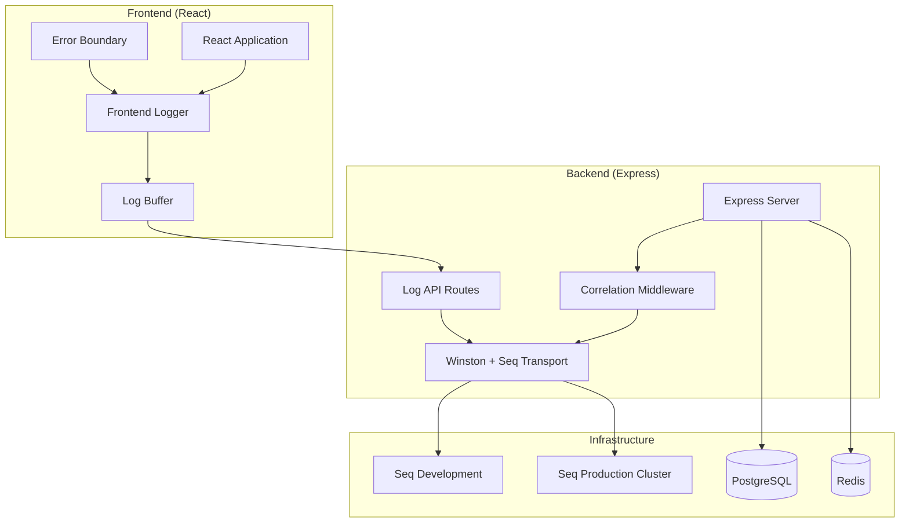
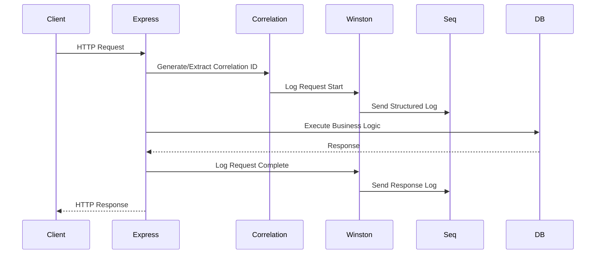
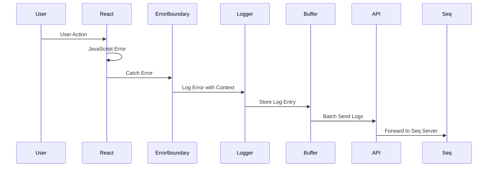

# Technical Requirements Document: Seq Structured Logging Integration

**Document Version**: 1.0  
**Date**: 2025-09-10  
**Author**: Technical Architecture Team  
**Project**: Monitoring Web Service Seq Integration  
**PRD Reference**: [docs/PRD/seq-integration-prd.md](../PRD/seq-integration-prd.md)

## System Context & Constraints

### Current Architecture

**Backend Stack:**
- Node.js 18+ with TypeScript 5.2+
- Express.js 4.18+ with middleware-based architecture
- Winston 3.11+ for existing logging infrastructure
- Prisma ORM with PostgreSQL database
- Redis for caching and session management
- Socket.io for real-time communication
- JWT authentication with multi-tenant support

**Frontend Stack:**
- React 18+ with TypeScript
- Vite build system
- Redux Toolkit for state management
- Axios for HTTP client
- React Router for navigation
- Socket.io-client for real-time features

**Infrastructure:**
- Docker containerization
- Environment-based configuration
- Health check endpoints
- Rate limiting and security middleware

### Technical Constraints

**Framework Requirements:**
- Must integrate with existing Winston logging infrastructure
- Cannot modify core Express.js middleware chain order
- Must maintain backward compatibility with existing log statements
- Frontend logging must work with Vite dev server and production builds

**Infrastructure Limitations:**
- Development: Single Seq instance acceptable
- Production: Seq must support clustering and high availability
- Log retention: 30 days default, configurable per environment
- Network: All log transmission must use TLS 1.3

**Security Policies:**
- No sensitive data (passwords, tokens, PII) in logs
- Access control via role-based permissions
- Audit trail for all administrative actions
- SOC 2 compliance for production logs

**Performance Requirements:**
- Backend: <5ms overhead per log entry (P95)
- Frontend: <1% impact on page load times
- Log ingestion: 10,000+ entries per minute
- Seq availability: 99.9% uptime SLA

## Architecture Overview

### High-Level Design



### Data Flow Diagrams

#### 1. Backend Request Logging Flow


#### 2. Frontend Error Logging Flow


### Integration Patterns

**Correlation ID Propagation:**
- Frontend generates UUID v4 for each user session
- Each API request includes correlation ID in headers
- Backend extracts and includes in all log entries
- Database operations tagged with correlation ID

**Log Level Mapping:**
- Frontend: Debug → Information, Error → Error, Fatal → Fatal
- Backend: All Winston levels map directly to Seq levels
- Automatic log level filtering based on environment

**Buffering Strategy:**
- Frontend: 100 entries or 30 seconds, whichever comes first
- Backend: Direct streaming with circuit breaker fallback
- Offline handling: LocalStorage buffer with 1MB limit

## Interfaces & Data Contracts

### API Specifications

#### Backend Log Ingestion Endpoint

**POST /api/v1/logs**

Request Schema:
```json
{
  "entries": [
    {
      "timestamp": "2025-09-10T15:30:00.000Z",
      "level": "Information|Warning|Error|Fatal",
      "message": "Human-readable message with {placeholders}",
      "messageTemplate": "User {UserId} performed {Action} in {Duration}ms",
      "properties": {
        "UserId": "string",
        "Action": "string", 
        "Duration": "number",
        "CorrelationId": "uuid",
        "SessionId": "uuid",
        "UserAgent": "string",
        "IPAddress": "string",
        "TenantId": "string"
      },
      "exception": {
        "type": "string",
        "message": "string",
        "stackTrace": "string"
      }
    }
  ]
}
```

Response Schema:
```json
{
  "success": true,
  "processed": 1,
  "failed": 0,
  "errors": []
}
```

#### Backend Health Check Extension

**GET /health**

Enhanced Response:
```json
{
  "status": "healthy",
  "timestamp": "2025-09-10T15:30:00.000Z",
  "uptime": 3600,
  "environment": "development",
  "version": "1.0.0",
  "services": {
    "database": "connected",
    "redis": "connected",
    "seq": {
      "status": "connected",
      "latency": "15ms",
      "url": "http://localhost:5341"
    }
  }
}
```

### Seq Configuration Schema

**Backend Winston Configuration:**
```typescript
interface SeqConfig {
  serverUrl: string;
  apiKey?: string;
  maxBatchingSize: number;
  batchingDelay: number;
  onError: (error: Error) => void;
  requestTimeout: number;
  compact: boolean;
}
```

**Frontend Logging Configuration:**
```typescript
interface FrontendLogConfig {
  endpoint: string;
  bufferSize: number;
  flushInterval: number;
  maxRetries: number;
  retryDelay: number;
  offlineStorage: boolean;
  enableDebugLogs: boolean;
}
```

### External Integrations

**Seq Server Integration:**
- HTTP API v5.1+ compatibility
- JSON-formatted log ingestion
- Query API for dashboard integration
- Signal-based alerting
- OIDC authentication for production

**Winston Transport Integration:**
- Custom Seq transport extends winston.Transport
- Automatic retry with exponential backoff
- Circuit breaker pattern for resilience
- Fallback to console/file logging

## Non-functional Requirements

### Performance

**Response Time Targets:**
- Backend log processing: P95 < 5ms, P99 < 10ms
- Frontend log buffering: < 1ms synchronous operations
- Seq ingestion: P95 < 100ms end-to-end
- Dashboard queries: P95 < 2 seconds

**Throughput Requirements:**
- Development: 1,000 logs per minute sustained
- Production: 10,000 logs per minute sustained
- Burst capacity: 50,000 logs per minute (5 minutes)
- Seq storage: 1TB for 30-day retention

**Scalability Considerations:**
- Horizontal scaling via multiple Seq instances
- Load balancing for high-availability deployment
- Database partitioning for log metadata
- CDN caching for static Seq dashboard assets

**Resource Utilization Limits:**
- Backend memory: +50MB maximum for logging overhead
- Frontend bundle: +25KB gzipped for logging client
- CPU overhead: <2% additional load under normal operations
- Network bandwidth: 1MB/hour per active user

### Security

**Authentication/Authorization:**
- Seq API key management via environment variables
- Frontend logs routed through authenticated backend API
- Role-based access control for Seq dashboard
- Service account authentication for production

**Data Protection:**
- TLS 1.3 encryption for all log transmission
- Automatic PII detection and redaction
- Secure storage of API keys in secret management
- Regular security scanning of log contents

**Input Validation:**
- Strict JSON schema validation for all log entries
- Rate limiting: 1000 requests per minute per IP
- Input sanitization to prevent log injection attacks
- Maximum log entry size: 64KB

**Security Scanning Requirements:**
- OWASP dependency scanning for seq-logging package
- Static analysis of logging code paths
- Regular penetration testing of log endpoints
- Compliance audit trail for all log access

### Reliability & Observability

**Uptime Targets:**
- Seq server availability: 99.9% (8.76 hours downtime/year)
- Log ingestion success rate: 99.99%
- Dashboard availability: 99.5%
- Search performance: <2 seconds for 1M entries

**Error Handling Strategy:**
- Circuit breaker for Seq connectivity issues
- Graceful degradation to local console logging
- Dead letter queue for failed log deliveries
- Automatic retry with exponential backoff

**Monitoring and Alerting:**
- Seq server health monitoring via /api/version endpoint
- Application performance monitoring for logging overhead
- Custom metrics for log ingestion rates and errors
- Slack/email alerting for critical logging failures

**Logging Requirements:**
- Self-monitoring: Log the logging system performance
- Correlation tracking across all system boundaries
- Structured metadata for all infrastructure components
- Audit trail for all administrative operations

**Disaster Recovery:**
- Daily automated backups of Seq data directory
- Cross-region replication for production logs
- Recovery time objective (RTO): 4 hours
- Recovery point objective (RPO): 1 hour

## Test Strategy

### Unit Testing

**Coverage Targets (≥80%):**
- Winston Seq transport configuration and initialization
- Correlation ID generation and propagation middleware
- Frontend logging client with mocked network calls
- Error boundary logging with simulated React errors
- Log entry validation and sanitization functions

**Testing Frameworks:**
- Backend: Jest with Supertest for API testing
- Frontend: Vitest with React Testing Library
- Mock strategy: Jest mocks for Winston transports
- Seq server mocking via nock for HTTP interception

**Key Test Scenarios:**
```typescript
// Example backend test structure
describe('Seq Integration', () => {
  describe('Winston Transport', () => {
    it('should send logs to Seq server successfully');
    it('should handle Seq server connection failures');
    it('should validate log entry schema');
    it('should include correlation ID in all logs');
  });
  
  describe('Frontend Logger', () => {
    it('should buffer logs until flush threshold');
    it('should handle offline scenarios gracefully');
    it('should send batched logs to backend API');
    it('should retry failed uploads with backoff');
  });
});
```

### Integration Testing

**API Contract Testing:**
- OpenAPI spec validation for /api/v1/logs endpoint
- Contract testing between frontend logger and backend API
- Seq HTTP API compatibility testing
- Authentication flow testing with JWT tokens

**Database Integration:**
- Prisma ORM compatibility with logging middleware
- Transaction rollback testing with log correlation
- Performance testing under concurrent database load
- Multi-tenant isolation validation

**External Service Mocking:**
- WireMock for Seq server API simulation
- Docker Compose with test Seq instance
- Redis mock for session correlation testing
- Mock authentication providers for SSO testing

**Coverage Targets (≥70%):**
- End-to-end log flow from frontend to Seq
- Error scenarios and fallback mechanisms
- Performance under load testing
- Security vulnerability testing

### End-to-End Testing

**User Journey Coverage:**
- Complete user session with correlated logs across frontend/backend
- Error scenarios triggering both client and server logging
- Dashboard usage with real-time log streaming
- Administrative tasks with audit trail verification

**Cross-browser Testing:**
- Chrome, Firefox, Safari compatibility for frontend logging
- Mobile browser testing for responsive dashboard
- Offline/online transition testing
- WebSocket connectivity testing for real-time features

**Performance Testing:**
- Load testing with 1000 concurrent users generating logs
- Stress testing with 10,000 logs per minute ingestion
- Memory leak testing for long-running sessions
- Network partition testing for resilience

**Accessibility Testing:**
- WCAG 2.1 AA compliance for Seq dashboard integration
- Screen reader compatibility for log viewing interfaces
- Keyboard navigation testing
- Color contrast validation for log severity indicators

## Sprint Planning & Implementation Tasks

### Sprint 1: Backend Foundation (Week 1)

#### Task 1.1: Seq Transport Setup (6 hours)
- [x] Install seq-logging npm package and types
- [x] Create SeqTransport class extending winston.Transport
- [x] Implement batch processing with configurable intervals
- [x] Add circuit breaker pattern for reliability
- [x] Configure environment-specific Seq server URLs
- [x] Write unit tests for transport configuration
- [x] Document configuration options and examples

#### Task 1.2: Winston Integration (4 hours)
- [x] Modify existing Winston logger configuration
- [x] Add Seq transport to logger instances
- [x] Implement structured logging helper functions
- [x] Ensure backward compatibility with existing logs
- [x] Add log level filtering based on environment
- [x] Test integration with existing codebase
- [x] Update logging documentation

#### Task 1.3: Correlation Middleware (6 hours)
- [x] Create correlation ID generation middleware
- [x] Implement request/response correlation tracking
- [x] Add correlation ID to all Winston log contexts
- [x] Create typed interfaces for log context
- [x] Handle correlation ID propagation from headers
- [x] Write comprehensive middleware tests
- [x] Add performance benchmarking

#### Task 1.4: Development Seq Server (4 hours)
- [x] Create Docker Compose configuration for Seq
- [x] Configure development environment variables
- [x] Set up basic Seq dashboard and queries
- [x] Create health check integration
- [x] Test log ingestion and search functionality
- [x] Document local development setup
- [x] Create troubleshooting guide

**Sprint 1 Acceptance Criteria:**
- [x] Backend logs successfully sent to Seq server
- [x] Correlation IDs tracked across all requests
- [x] Health check includes Seq connectivity status
- [x] Unit test coverage ≥80% for new components
- [x] Performance overhead <5ms per log entry

### Sprint 2: Frontend Integration (Week 2)

#### Task 2.1: Frontend Logger Client (8 hours)
- [ ] Create TypeScript logging client class
- [ ] Implement log buffering with configurable thresholds
- [ ] Add log level mapping (debug → info, etc.)
- [ ] Create structured log entry interfaces
- [ ] Implement correlation ID generation and tracking
- [ ] Add offline scenario handling with LocalStorage
- [ ] Write comprehensive unit tests with mocked dependencies

#### Task 2.2: Error Boundary Integration (4 hours)
- [ ] Enhance existing error boundaries with logging
- [ ] Capture React error details and stack traces
- [ ] Include user context and session information
- [ ] Add component tree information to error logs
- [ ] Implement error recovery and user notification
- [ ] Test error scenarios across different components
- [ ] Document error handling best practices

#### Task 2.3: Backend Log API (6 hours)
- [ ] Create /api/v1/logs endpoint with validation
- [ ] Implement JSON schema validation for log entries
- [ ] Add rate limiting and security middleware
- [ ] Forward logs to Winston/Seq pipeline
- [ ] Implement batch processing for multiple entries
- [ ] Add API documentation with OpenAPI spec
- [ ] Create integration tests with real Seq server

#### Task 2.4: User Action Tracking (6 hours)
- [ ] Implement navigation event logging
- [ ] Add user interaction tracking (clicks, form submissions)
- [ ] Capture performance timing data
- [ ] Include browser and device information
- [ ] Add privacy controls for sensitive actions
- [ ] Create configuration for tracking levels
- [ ] Test tracking across different user workflows

**Sprint 2 Acceptance Criteria:**
- Frontend errors automatically logged to Seq
- User actions tracked with privacy controls
- Log API handles 1000+ entries per minute
- Offline scenarios handled gracefully
- Integration test coverage ≥70%

### Sprint 3: Enhanced Observability (Week 3)

#### Task 3.1: End-to-End Correlation (6 hours)
- [ ] Implement correlation ID propagation from frontend to backend
- [ ] Add correlation tracking to database operations
- [ ] Create correlation visualization tools
- [ ] Implement distributed tracing helpers
- [ ] Add correlation-based log filtering
- [ ] Test complete user workflow correlation
- [ ] Document correlation best practices

#### Task 3.2: Performance Monitoring (6 hours)
- [ ] Add performance timing to all log entries
- [ ] Implement frontend Core Web Vitals logging
- [ ] Create backend operation timing middleware
- [ ] Add database query performance tracking
- [ ] Implement memory and CPU usage logging
- [ ] Create performance dashboards in Seq
- [ ] Set up performance alerting thresholds

#### Task 3.3: Structured Schema (4 hours)
- [ ] Define comprehensive log entry schema
- [ ] Create TypeScript interfaces for all log types
- [ ] Implement schema validation utilities
- [ ] Add schema versioning for future updates
- [ ] Create schema documentation and examples
- [ ] Test schema validation across all logging paths
- [ ] Add migration helpers for schema changes

#### Task 3.4: Seq Dashboards (8 hours)
- [ ] Create default Seq dashboard for application logs
- [ ] Build performance monitoring dashboard
- [ ] Add error rate and trend visualizations
- [ ] Create user activity analysis dashboard
- [ ] Implement real-time alerting rules
- [ ] Add dashboard export/import functionality
- [ ] Document dashboard setup and customization

**Sprint 3 Acceptance Criteria:**
- Complete workflow tracing via correlation IDs
- Performance metrics captured and visualized
- Structured schema enforced across all logs
- Seq dashboards provide actionable insights
- Real-time alerts for critical issues

### Sprint 4: Production Deployment (Week 4)

#### Task 4.1: Production Seq Setup (8 hours)
- [ ] Design high-availability Seq cluster architecture
- [ ] Create production Docker/Kubernetes manifests
- [ ] Configure SSL/TLS certificates and security
- [ ] Set up automated backup and retention policies
- [ ] Implement monitoring and alerting for Seq infrastructure
- [ ] Create deployment automation scripts
- [ ] Document production architecture and procedures

#### Task 4.2: Security Configuration (6 hours)
- [ ] Implement role-based access control for Seq
- [ ] Configure API key management and rotation
- [ ] Add PII detection and redaction rules
- [ ] Set up security scanning and vulnerability monitoring
- [ ] Implement audit logging for administrative actions
- [ ] Create security incident response procedures
- [ ] Conduct security review and penetration testing

#### Task 4.3: Alerting and Monitoring (6 hours)
- [ ] Configure Seq alerting rules for critical errors
- [ ] Set up integration with existing monitoring systems
- [ ] Create runbooks for common operational scenarios
- [ ] Implement log-based SLI/SLO monitoring
- [ ] Add capacity planning metrics and dashboards
- [ ] Create automated health check monitoring
- [ ] Document alerting procedures and escalation

#### Task 4.4: Documentation and Training (4 hours)
- [ ] Create comprehensive deployment documentation
- [ ] Write operational runbooks for production support
- [ ] Develop training materials for development teams
- [ ] Create troubleshooting guides and FAQs
- [ ] Document log query examples and best practices
- [ ] Create video tutorials for Seq dashboard usage
- [ ] Conduct team training sessions

**Sprint 4 Acceptance Criteria:**
- Production Seq environment deployed and secured
- All security controls implemented and tested
- Monitoring and alerting fully operational
- Complete documentation and training delivered
- Production readiness review passed

### Dependencies and Risk Mitigation

**Critical Dependencies:**
1. **Seq Server Infrastructure**: Development instance required by Sprint 1
   - Mitigation: Docker Compose setup in parallel with Task 1.1
   - Fallback: Local file-based logging during development

2. **Winston Compatibility**: seq-logging package must integrate cleanly
   - Mitigation: Early proof-of-concept in Task 1.1
   - Fallback: Custom HTTP transport implementation

3. **Frontend Build System**: Vite compatibility with logging client
   - Mitigation: Early testing in Task 2.1
   - Fallback: Vanilla JavaScript implementation without TypeScript

**Technical Risks:**
1. **Performance Impact**: Logging overhead exceeds 5ms target
   - Mitigation: Continuous benchmarking and optimization
   - Contingency: Async processing and reduced log detail

2. **Seq Server Capacity**: High log volume overwhelms infrastructure
   - Mitigation: Load testing and capacity planning
   - Contingency: Log sampling and tiered retention

3. **Network Reliability**: Log delivery failures in production
   - Mitigation: Circuit breaker and fallback mechanisms
   - Contingency: Local buffering and delayed delivery

## Deployment & Migration Notes

### Deployment Strategy

**Development Environment:**
1. **Phase 1**: Local Docker Compose Seq server
2. **Phase 2**: Backend integration with development logging
3. **Phase 3**: Frontend integration with local API
4. **Phase 4**: End-to-end testing and dashboard setup

**Staging Environment:**
1. **Phase 1**: Production-like Seq cluster deployment
2. **Phase 2**: Load testing with realistic data volumes
3. **Phase 3**: Security testing and penetration testing
4. **Phase 4**: User acceptance testing and training

**Production Rollout:**
1. **Week 1**: Backend logging deployment with feature flag (0% traffic)
2. **Week 2**: Gradual rollout to 25% of traffic with monitoring
3. **Week 3**: Full backend deployment (100% traffic)
4. **Week 4**: Frontend logging deployment with gradual rollout

### Database Migrations

**No Database Schema Changes Required:**
- Seq integration uses external logging infrastructure
- Existing PostgreSQL database unchanged
- Prisma schema remains compatible
- No data migration scripts needed

**Configuration Changes:**
```sql
-- Add Seq configuration to application settings
INSERT INTO application_settings (key, value, environment) VALUES
('seq.server_url', 'https://seq.production.company.com', 'production'),
('seq.api_key_encrypted', '<encrypted_api_key>', 'production'),
('seq.batch_size', '100', 'production'),
('seq.flush_interval', '30000', 'production');
```

### Infrastructure Requirements

**Development Environment:**
```yaml
# docker-compose.seq.yml
version: '3.8'
services:
  seq:
    image: datalust/seq:2024.1
    ports:
      - "5341:80"
    environment:
      ACCEPT_EULA: Y
    volumes:
      - seq-data:/data
volumes:
  seq-data:
```

**Production Environment:**
- **CPU**: 4 vCPUs minimum for Seq server
- **Memory**: 8GB RAM minimum for 30-day retention
- **Storage**: 1TB SSD for log storage and indexing
- **Network**: 1Gbps bandwidth for high log ingestion rates
- **Backup**: Daily automated backups to object storage

**Kubernetes Manifests:**
```yaml
apiVersion: apps/v1
kind: Deployment
metadata:
  name: seq-server
spec:
  replicas: 2
  selector:
    matchLabels:
      app: seq-server
  template:
    metadata:
      labels:
        app: seq-server
    spec:
      containers:
      - name: seq
        image: datalust/seq:2024.1
        ports:
        - containerPort: 80
        env:
        - name: ACCEPT_EULA
          value: "Y"
        - name: SEQ_FIRSTRUN_ADMINPASSWORDHASH
          valueFrom:
            secretKeyRef:
              name: seq-admin
              key: password-hash
        volumeMounts:
        - name: seq-data
          mountPath: /data
        resources:
          requests:
            memory: "2Gi"
            cpu: "1"
          limits:
            memory: "8Gi"
            cpu: "4"
```

### Configuration Management

**Environment Variables:**
```bash
# Development
SEQ_SERVER_URL=http://localhost:5341
SEQ_API_KEY=
SEQ_BATCH_SIZE=50
SEQ_FLUSH_INTERVAL=5000

# Production
SEQ_SERVER_URL=https://seq.production.company.com
SEQ_API_KEY=${SEQ_PRODUCTION_API_KEY}
SEQ_BATCH_SIZE=100
SEQ_FLUSH_INTERVAL=30000
SEQ_ENABLE_TLS=true
SEQ_REQUEST_TIMEOUT=10000
```

**Monitoring Configuration:**
```yaml
# monitoring/seq-alerts.yml
alerts:
  - name: "High Error Rate"
    condition: "count(level='Error') over 5 minutes > 100"
    actions:
      - slack: "#ops-alerts"
      - email: "oncall@company.com"
  
  - name: "Seq Server Down"
    condition: "seq_health_check = false"
    actions:
      - pagerduty: "seq-critical"
      - slack: "#ops-alerts"
```

---

**Document Status**: Ready for Implementation  
**Approval Required**: Technical Architecture Review  
**Next Steps**: Sprint 1 task assignment and team capacity planning  
**Implementation Command**: `/implement-trd docs/TRD/seq-integration-trd.md`