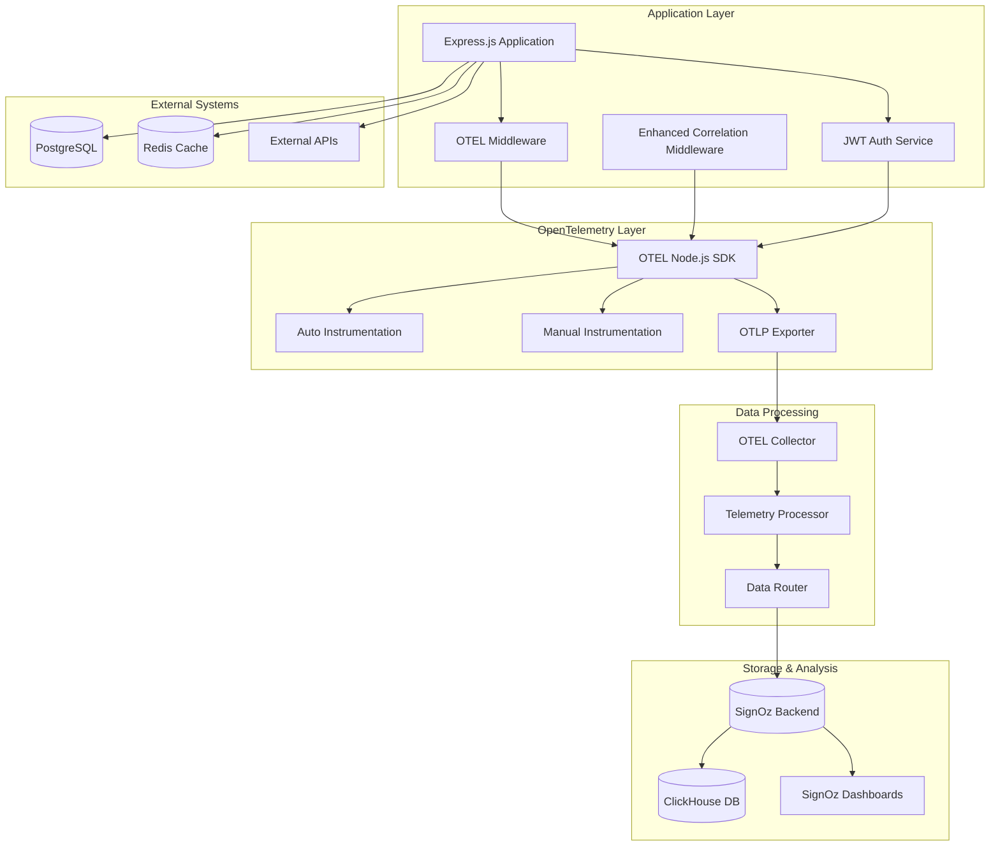
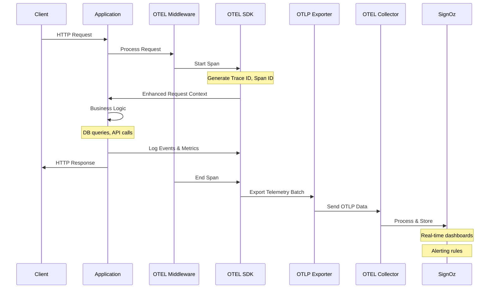
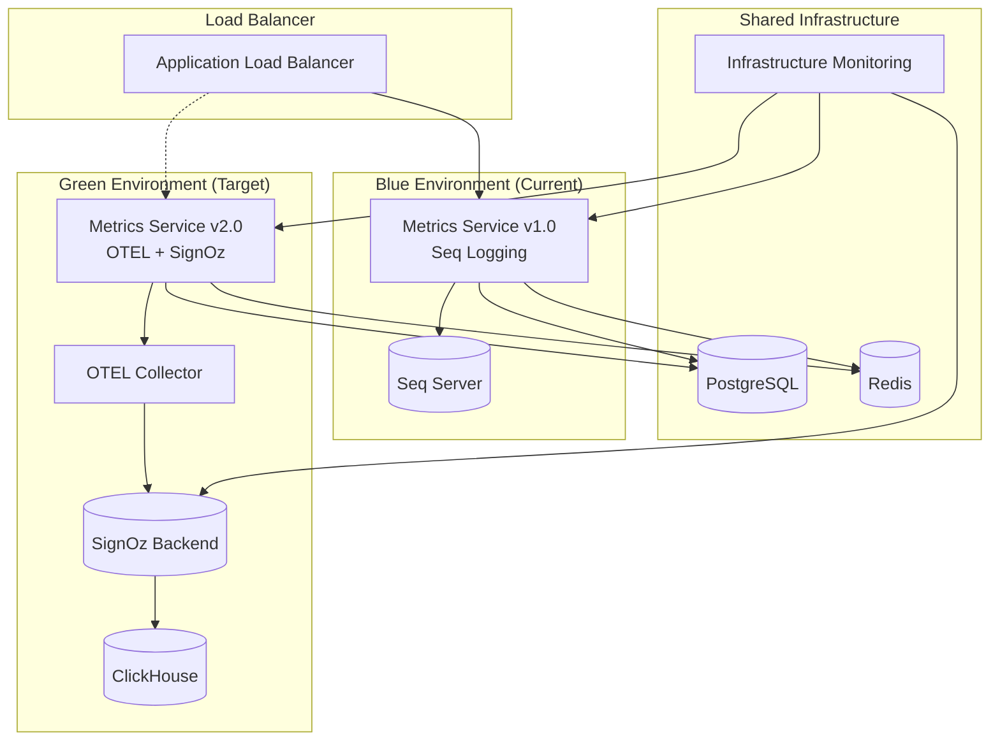

# Technical Requirements Document: Seq to OpenTelemetry + SignOz Migration

**Document ID**: TRD-2025-002  
**Version**: 1.0  
**Created**: 2025-01-09  
**Status**: Draft  
**Owner**: Technical Lead  
**Stakeholders**: Development Team, DevOps, Platform Engineering, SRE  
**Related PRD**: PRD-2025-001 - Seq to OpenTelemetry + SignOz Migration  

## 1. System Context & Constraints

### 1.1 Current Architecture Overview

The External Metrics Web Service currently implements sophisticated observability through:

**Current Seq-based Logging Stack:**
- **SeqTransport Class**: Custom Winston transport with circuit breaker, batch processing, performance optimization
- **Correlation Middleware**: Request correlation with UUID generation, span tracking, context propagation
- **Structured Logging**: JSON-formatted logs with rich contextual metadata
- **Performance Monitoring**: Built-in latency tracking, slow query detection, error rate monitoring
- **Health Monitoring**: Circuit breaker pattern, automatic failover, graceful degradation

**Current Infrastructure:**
- **Runtime**: Node.js 18+ with TypeScript, Express.js framework
- **Database**: PostgreSQL with TimescaleDB, Prisma ORM instrumentation
- **Cache**: Redis for session management and caching
- **Containerization**: Docker Compose with health checks and restart policies
- **Current Observability**: Seq server (datalust/seq:2024.3) with ingestion API

### 1.2 Target Architecture Overview

**OpenTelemetry + SignOz Stack:**
- **OTEL SDK**: Node.js OpenTelemetry SDK with automatic and manual instrumentation
- **Telemetry Collection**: Unified logs, metrics, and traces collection
- **SignOz Backend**: Open-source APM with distributed tracing, metrics correlation
- **OTEL Collector**: Centralized telemetry data processing and routing
- **Frontend Integration**: Browser-based OTEL SDK for client-side observability

### 1.3 Migration Constraints

**Technical Constraints:**
- **Zero Downtime**: Blue-green deployment strategy with rollback capability
- **Feature Parity**: Maintain all current Seq logging capabilities
- **Performance Requirements**: ≤5ms additional latency, ≤50MB memory overhead
- **Database Schema**: No breaking changes to existing data models
- **API Compatibility**: Preserve all current API contracts

**Infrastructure Constraints:**
- **Container Platform**: Docker/Kubernetes compatibility required
- **Network Security**: Private network access for SignOz backend
- **Storage Requirements**: Persistent storage for SignOz data and configuration
- **Resource Limits**: CPU and memory constraints for observability overhead

**Operational Constraints:**
- **Multi-Environment**: Development, staging, production deployment strategies
- **Data Retention**: Configurable retention policies for cost management
- **Compliance**: Data privacy and security compliance requirements
- **Backup/Recovery**: Configuration backup and disaster recovery procedures

## 2. Architecture Overview

### 2.1 Component Architecture



### 2.2 Data Flow Architecture



### 2.3 Integration Points

**Database Integration:**
- **Prisma ORM Instrumentation**: Automatic query tracing with performance metrics
- **Connection Pool Monitoring**: Pool size, active connections, wait times
- **Slow Query Detection**: Configurable thresholds with correlation context

**External API Integration:**
- **HTTP Client Instrumentation**: Request/response tracing with correlation
- **Circuit Breaker Integration**: Failure tracking with observability context
- **Timeout and Retry Monitoring**: Detailed timing and failure analysis

**Authentication Integration:**
- **JWT Service Tracing**: Token validation, refresh operations
- **Multi-tenant Context**: Tenant isolation in telemetry data
- **Security Event Logging**: Authentication failures, suspicious activities

## 3. Implementation Plan

### Sprint 1: Foundation & Planning (Weeks 1-2)

#### 3.1 Environment Setup and Architecture Validation

- [x] **Task 1.1: Development Environment Setup** (8h) ✅ **COMPLETED**
  - ✅ Install SignOz development instance with Docker Compose
  - ✅ Configure OTEL collector with basic pipelines
  - ✅ Validate SignOz dashboard access and basic functionality
  - ✅ Document environment setup procedures
  
- [x] **Task 1.2: OTEL SDK Integration Research** (6h) ✅ **COMPLETED**
  - ✅ Evaluate OTEL Node.js SDK versions and compatibility
  - ✅ Research auto-instrumentation capabilities for Express, Prisma, HTTP
  - ✅ Identify gaps requiring manual instrumentation
  - ✅ Create technical integration strategy document

- [x] **Task 1.3: Performance Baseline Establishment** (4h) ✅ **COMPLETED**
  - ✅ Run performance tests on current Seq implementation
  - ✅ Document baseline metrics: latency, throughput, memory usage
  - ✅ Establish acceptance criteria for OTEL implementation
  - ✅ Create performance monitoring test suite

- [x] **Task 1.4: Migration Strategy Definition** (6h) ✅ **COMPLETED**
  - ✅ Define blue-green deployment approach
  - ✅ Create rollback procedures and decision criteria
  - ✅ Plan parallel logging strategy during transition
  - ✅ Document risk mitigation procedures

### Sprint 2: Core OTEL Implementation (Weeks 3-5)

#### 3.2 OpenTelemetry SDK Integration

- [x] **Task 2.1: OTEL SDK Basic Configuration** (12h) ✅ **COMPLETED**
  - ✅ Install and configure @opentelemetry/sdk-node
  - ✅ Setup resource detection (service, container, environment metadata)
  - ✅ Configure OTLP exporter for SignOz backend
  - ✅ Implement basic error handling and circuit breaker patterns

- [x] **Task 2.2: Auto-Instrumentation Setup** (8h) ✅ **COMPLETED**
  - ✅ Enable HTTP instrumentation for Express.js requests
  - ✅ Configure Prisma/PostgreSQL database instrumentation
  - ✅ Setup Redis instrumentation for cache operations
  - ✅ Validate automatic span generation and correlation

- [x] **Task 2.3: Custom Business Logic Instrumentation** (10h) ✅ **COMPLETED**
  - ✅ Implement authentication & authorization flow tracing
  - ✅ Add metrics collection & processing pipeline instrumentation
  - ✅ Create database operations & caching with business context
  - ✅ Build external integrations with circuit breaker monitoring

- [x] **Task 2.4: Enhanced Correlation Middleware** (8h) ✅ **COMPLETED**
  - ✅ Replace existing correlation middleware with OTEL integration
  - ✅ Implement trace context propagation (W3C Trace Context)
  - ✅ Ensure correlation ID compatibility with existing patterns
  - ✅ Add OTEL span attributes for correlation metadata

#### 3.3 Logging Migration

- [x] **Task 3.1: OTEL Logging Transport Implementation** (16h) ✅ **COMPLETED**
  - ✅ Create OTELTransport class with SeqTransport feature parity
  - ✅ Implement batch processing with configurable intervals
  - ✅ Add circuit breaker pattern for reliability
  - ✅ Preserve all current log structure and metadata

- [x] **Task 3.2: Structured Logging Integration** (8h) ✅ **COMPLETED**
  - ✅ Integrate OTEL logging with Winston logger configuration
  - ✅ Map Seq log levels to OTEL severity levels
  - ✅ Ensure structured JSON format compatibility
  - ✅ Implement log correlation with traces and spans

- [x] **Task 3.3: Parallel Logging Validation Framework** (12h) ✅ **COMPLETED**
  - ✅ Implement log output comparison engine for Seq vs OTEL validation
  - ✅ Create real-time validation dashboard with performance monitoring
  - ✅ Add automated testing suite with failure scenario coverage
  - ✅ Build production readiness assessment framework

### Sprint 3: Advanced Features & SignOz Integration (Weeks 6-8)

#### 3.4 Custom Metrics Implementation

- [x] **Task 4.1: Business Metrics Integration** (12h) ✅ **COMPLETED**
  - ✅ Implement custom metrics for API endpoints (counter, histogram)
  - ✅ Add database query performance metrics (gauge, histogram)
  - ✅ Create tenant-specific metrics with proper labeling
  - ✅ Setup metrics export to SignOz backend

- [x] **Task 4.2: Application Performance Monitoring** (10h) ✅ **COMPLETED**
  - ✅ Add response time histograms for all endpoints
  - ✅ Implement error rate tracking by endpoint and tenant
  - ✅ Create memory usage and garbage collection metrics
  - ✅ Setup throughput and concurrency monitoring

- [x] **Task 4.3: Custom Trace Instrumentation Enhancement** (8h) ✅ **COMPLETED**
  - ✅ Add manual spans for critical business operations
  - ✅ Implement trace attributes for business context
  - ✅ Create span events for important application milestones
  - ✅ Setup intelligent sampling strategies for performance optimization

#### 3.5 SignOz Dashboard and Alerting

- [x] **Task 5.1: SignOz Dashboard Configuration** (14h) ✅ **COMPLETED**
  - ✅ Create application overview dashboard (latency, errors, throughput)
  - ✅ Build database performance dashboard with query insights
  - ✅ Design tenant-specific monitoring views
  - ✅ Create infrastructure monitoring dashboard

- [x] **Task 5.2: Alert Rules Configuration** (8h) ✅ **COMPLETED**
  - ✅ Setup critical system alerts (error rates, response times)
  - ✅ Configure database performance alerts (slow queries, connection issues)
  - ✅ Create business metric alerts (tenant activity anomalies)
  - ✅ Implement alert notification channels (email, Slack)

- [x] **Task 5.3: Advanced Analytics Setup** (6h) ✅ **COMPLETED**
  - ✅ Configure trace analysis views for request flow visualization
  - ✅ Setup performance trend analysis and anomaly detection
  - ✅ Create service dependency mapping
  - ✅ Implement custom query builders for business intelligence

### Sprint 4: Production Readiness & Migration (Weeks 9-11)

#### 3.7 Production Infrastructure

- [ ] **Task 4.1: Production SignOz Deployment** (16h)
  - Deploy SignOz with high availability configuration
  - Configure persistent storage with backup procedures
  - Setup network security and access controls
  - Implement monitoring for SignOz infrastructure health

- [ ] **Task 4.2: OTEL Collector Production Configuration** (12h)
  - Deploy OTEL collector with load balancing
  - Configure data processing pipelines for production scale
  - Setup data retention and storage policies
  - Implement collector health monitoring and alerting

- [ ] **Task 4.3: Security and Compliance Implementation** (10h)
  - Implement data privacy filters for PII redaction
  - Setup secure authentication for SignOz access
  - Configure encryption for telemetry data in transit
  - Implement audit logging for observability data access

#### 3.8 Migration Execution

- [ ] **Task 4.4: Parallel Logging Implementation** (8h)
  - Implement feature flag for OTEL vs Seq logging
  - Setup parallel data collection for validation
  - Create data consistency validation procedures
  - Implement automatic rollback triggers

- [ ] **Task 4.5: Production Migration Plan Execution** (12h)
  - Execute blue-green deployment strategy
  - Perform gradual traffic shifting with monitoring
  - Validate all acceptance criteria in production
  - Complete Seq system decommissioning

- [ ] **Task 4.6: Post-Migration Validation** (6h)
  - Run comprehensive performance and functionality tests
  - Validate all dashboard and alerting functionality
  - Confirm data retention and compliance requirements
  - Complete migration success criteria validation

### Sprint 5: Optimization & Documentation (Weeks 12-13)

#### 3.9 Performance Optimization

- [ ] **Task 5.1: Performance Tuning and Optimization** (10h)
  - Optimize OTEL configuration for production workloads
  - Fine-tune sampling rates and batch processing parameters
  - Implement adaptive rate limiting for telemetry data
  - Create performance monitoring automation

- [ ] **Task 5.2: Cost Optimization** (6h)
  - Implement intelligent data retention policies
  - Setup cost monitoring and alerting for SignOz infrastructure
  - Optimize storage usage with data compression strategies
  - Create cost reporting and analysis dashboards

#### 3.10 Documentation and Knowledge Transfer

- [ ] **Task 5.3: Technical Documentation** (12h)
  - Create comprehensive OTEL integration documentation
  - Document SignOz dashboard and alerting procedures
  - Write troubleshooting guides and runbooks
  - Create API reference for custom instrumentation

- [ ] **Task 5.4: Team Training and Knowledge Transfer** (8h)
  - Conduct team training sessions on OTEL and SignOz
  - Create developer onboarding materials
  - Document best practices for adding custom instrumentation
  - Setup internal knowledge base and FAQs

- [ ] **Task 5.5: Migration Assessment and Lessons Learned** (4h)
  - Conduct post-migration assessment against success criteria
  - Document lessons learned and improvement recommendations
  - Create template for future observability migrations
  - Present results to stakeholders and leadership

## 4. API & Interface Specifications

### 4.1 OpenTelemetry Configuration Interface

```typescript
interface OTELConfiguration {
  serviceName: string;
  serviceVersion: string;
  environment: string;
  
  // Exporter configuration
  otlpEndpoint: string;
  otlpHeaders?: Record<string, string>;
  otlpTimeout?: number;
  
  // Sampling configuration
  traceSampleRate: number;
  logSampleRate?: number;
  
  // Resource configuration
  resourceAttributes: Record<string, string>;
  
  // Instrumentation configuration
  instrumentations: {
    http: HttpInstrumentationConfig;
    express: ExpressInstrumentationConfig;
    prisma: PrismaInstrumentationConfig;
    redis: RedisInstrumentationConfig;
  };
}

interface HttpInstrumentationConfig {
  enabled: boolean;
  ignoreIncomingRequestHook?: (req: IncomingMessage) => boolean;
  ignoreOutgoingRequestHook?: (req: RequestOptions) => boolean;
  requestHook?: (span: Span, request: IncomingMessage) => void;
  responseHook?: (span: Span, response: IncomingMessage) => void;
}
```

### 4.2 Custom Metrics Interface

```typescript
interface MetricsCollector {
  // Counter metrics
  incrementApiRequest(endpoint: string, method: string, statusCode: number): void;
  incrementDatabaseQuery(operation: string, table: string): void;
  incrementCacheOperation(operation: string, hit: boolean): void;
  
  // Histogram metrics
  recordApiLatency(endpoint: string, duration: number): void;
  recordDatabaseQueryLatency(operation: string, duration: number): void;
  recordCacheLatency(operation: string, duration: number): void;
  
  // Gauge metrics
  setActiveConnections(count: number): void;
  setMemoryUsage(bytes: number): void;
  setCacheSize(bytes: number): void;
  
  // Custom business metrics
  recordTenantActivity(tenantId: string, activity: string, value: number): void;
  recordFeatureUsage(feature: string, userId: string): void;
}
```

### 4.3 Enhanced Correlation Context

```typescript
interface OTELCorrelationContext extends LogContext {
  // W3C Trace Context
  traceId: string;
  spanId: string;
  traceFlags: number;
  traceState?: string;
  
  // Parent span information
  parentSpanId?: string;
  rootSpanId?: string;
  
  // Business context
  operationName: string;
  operationType: 'http' | 'database' | 'cache' | 'external' | 'business';
  
  // Performance context
  startTime: number;
  expectedDuration?: number;
  
  // Custom attributes
  attributes: Record<string, string | number | boolean>;
}
```

### 4.4 SignOz Integration Interface

```typescript
interface SignOzClient {
  // Query interface
  query(query: SignOzQuery): Promise<SignOzQueryResult>;
  
  // Dashboard management
  createDashboard(dashboard: DashboardConfig): Promise<string>;
  updateDashboard(id: string, dashboard: DashboardConfig): Promise<void>;
  deleteDashboard(id: string): Promise<void>;
  
  // Alert management
  createAlert(alert: AlertRule): Promise<string>;
  updateAlert(id: string, alert: AlertRule): Promise<void>;
  deleteAlert(id: string): Promise<void>;
  
  // Health check
  healthCheck(): Promise<HealthStatus>;
}

interface SignOzQuery {
  queryType: 'traces' | 'metrics' | 'logs';
  timeRange: {
    start: Date;
    end: Date;
  };
  filters: Record<string, any>;
  aggregation?: AggregationConfig;
  groupBy?: string[];
  limit?: number;
}
```

## 5. Data Models & Schema Design

### 5.1 OTEL Resource Schema

```json
{
  "resource": {
    "attributes": {
      "service.name": "fortium-metrics-web-service",
      "service.version": "1.0.0",
      "service.environment": "production",
      "service.instance.id": "instance-uuid",
      "container.id": "container-uuid",
      "container.name": "metrics-api",
      "host.name": "kubernetes-node-01",
      "k8s.pod.name": "metrics-api-pod",
      "k8s.namespace.name": "fortium-prod",
      "tenant.id": "tenant-uuid",
      "deployment.version": "v1.2.3"
    }
  }
}
```

### 5.2 Trace Schema Structure

```json
{
  "traceId": "4bf92f3577b34da6a3ce929d0e0e4736",
  "spanId": "00f067aa0ba902b7",
  "parentSpanId": "83887e914bef4328",
  "operationName": "POST /api/metrics",
  "startTime": "2025-01-09T10:30:00.000Z",
  "endTime": "2025-01-09T10:30:00.125Z",
  "duration": 125000000,
  "status": {
    "code": "OK"
  },
  "attributes": {
    "http.method": "POST",
    "http.url": "/api/metrics",
    "http.status_code": 200,
    "user.id": "user-uuid",
    "tenant.id": "tenant-uuid",
    "correlation.id": "correlation-uuid",
    "db.query.count": 3,
    "cache.hit.count": 2
  },
  "events": [
    {
      "name": "database.query.start",
      "timestamp": "2025-01-09T10:30:00.010Z",
      "attributes": {
        "db.operation": "SELECT",
        "db.table": "metrics",
        "db.query.duration": 15
      }
    }
  ]
}
```

### 5.3 Metrics Schema Structure

```json
{
  "resourceMetrics": [
    {
      "resource": {
        "attributes": {
          "service.name": "fortium-metrics-web-service",
          "tenant.id": "tenant-uuid"
        }
      },
      "instrumentationLibraryMetrics": [
        {
          "instrumentationLibrary": {
            "name": "@opentelemetry/instrumentation-http",
            "version": "0.45.0"
          },
          "metrics": [
            {
              "name": "http_request_duration",
              "description": "HTTP request duration in milliseconds",
              "unit": "ms",
              "histogram": {
                "dataPoints": [
                  {
                    "startTimeUnixNano": 1704794400000000000,
                    "timeUnixNano": 1704794460000000000,
                    "count": 100,
                    "sum": 12500,
                    "bucketCounts": [10, 20, 30, 25, 15],
                    "explicitBounds": [10, 50, 100, 500, 1000],
                    "attributes": {
                      "http.method": "POST",
                      "http.route": "/api/metrics",
                      "tenant.id": "tenant-uuid"
                    }
                  }
                ]
              }
            }
          ]
        }
      ]
    }
  ]
}
```

### 5.4 Log Schema Structure

```json
{
  "resourceLogs": [
    {
      "resource": {
        "attributes": {
          "service.name": "fortium-metrics-web-service",
          "tenant.id": "tenant-uuid"
        }
      },
      "instrumentationLibraryLogs": [
        {
          "instrumentationLibrary": {
            "name": "winston",
            "version": "3.8.2"
          },
          "logs": [
            {
              "timeUnixNano": 1704794400000000000,
              "severityNumber": 9,
              "severityText": "INFO",
              "body": {
                "stringValue": "HTTP request completed successfully"
              },
              "attributes": {
                "correlation.id": "correlation-uuid",
                "trace.id": "4bf92f3577b34da6a3ce929d0e0e4736",
                "span.id": "00f067aa0ba902b7",
                "http.method": "POST",
                "http.url": "/api/metrics",
                "http.status_code": 200,
                "user.id": "user-uuid",
                "tenant.id": "tenant-uuid",
                "duration": 125,
                "event": "http.request.completed"
              }
            }
          ]
        }
      ]
    }
  ]
}
```

## 6. Testing Strategy & Quality Gates

### 6.1 Unit Testing Strategy

**OTEL Configuration Testing:**
- [ ] OTEL SDK initialization and configuration validation
- [ ] Resource detection and metadata attachment
- [ ] Instrumentation library loading and configuration
- [ ] Exporter configuration and connection testing

**Instrumentation Testing:**
- [ ] HTTP request/response instrumentation accuracy
- [ ] Database query tracing and performance metrics
- [ ] Cache operation instrumentation and hit/miss tracking
- [ ] External API call tracing and error handling

**Custom Metrics Testing:**
- [ ] Counter metrics increment and labeling accuracy
- [ ] Histogram metrics recording and bucket distribution
- [ ] Gauge metrics value updates and consistency
- [ ] Business metrics correlation with application events

### 6.2 Integration Testing Strategy

**End-to-End Telemetry Pipeline:**
- [ ] Application → OTEL SDK → Collector → SignOz data flow
- [ ] Trace correlation across service boundaries
- [ ] Metrics aggregation and dashboard visualization
- [ ] Log correlation with traces and spans

**Performance Integration Testing:**
- [ ] Latency impact measurement under load
- [ ] Memory usage monitoring during high throughput
- [ ] CPU overhead assessment with full instrumentation
- [ ] Network bandwidth impact of telemetry data

**Error Scenario Testing:**
- [ ] SignOz backend unavailability handling
- [ ] OTEL collector failure and recovery
- [ ] Circuit breaker activation and recovery
- [ ] Data loss prevention during network issues

### 6.3 Load and Performance Testing

**Baseline Performance Requirements:**
- [ ] ≤5ms additional latency for instrumented requests
- [ ] ≤50MB additional memory overhead per instance
- [ ] ≤5% additional CPU utilization under normal load
- [ ] Support 10,000 req/min without degradation

**Performance Test Scenarios:**
- [ ] Normal load testing (1,000 req/min sustained)
- [ ] Peak load testing (10,000 req/min burst)
- [ ] Stress testing (beyond normal capacity)
- [ ] Endurance testing (24-hour sustained load)

**Performance Metrics Validation:**
- [ ] Response time percentiles (P50, P95, P99)
- [ ] Throughput measurements (requests per second)
- [ ] Resource utilization monitoring (CPU, memory, network)
- [ ] Observability overhead impact assessment

### 6.4 Security and Compliance Testing

**Data Privacy Testing:**
- [ ] PII redaction in telemetry data
- [ ] Tenant data isolation verification
- [ ] Sensitive data filtering in logs and traces
- [ ] Configuration-driven data scrubbing validation

**Security Testing:**
- [ ] Encrypted communication validation (TLS 1.2+)
- [ ] Authentication and authorization testing
- [ ] Access control verification for observability data
- [ ] Security event logging accuracy

**Compliance Validation:**
- [ ] Data retention policy enforcement
- [ ] Audit trail completeness and accuracy
- [ ] Regulatory compliance requirement validation
- [ ] Privacy policy adherence verification

### 6.5 Quality Gates

**Pre-Deployment Quality Gates:**
- [ ] All unit tests pass (≥95% coverage)
- [ ] Integration tests pass (100% success rate)
- [ ] Performance tests meet baseline requirements
- [ ] Security tests pass without critical findings
- [ ] Code review approval with no high-severity issues

**Production Readiness Gates:**
- [ ] SignOz infrastructure health validation
- [ ] OTEL collector operational verification
- [ ] Dashboard and alerting functionality confirmation
- [ ] Rollback procedure validation and testing
- [ ] Team training completion and sign-off

## 7. Deployment Architecture & Migration Plan

### 7.1 Infrastructure Architecture



### 7.2 SignOz Production Deployment

**High Availability Configuration:**
```yaml
version: '3.8'
services:
  signoz-frontend:
    image: signoz/frontend:0.36.0
    deploy:
      replicas: 2
      restart_policy:
        condition: on-failure
    ports:
      - "3301:3301"
    environment:
      - SIGNOZ_BACKEND_URL=http://signoz-query-service:8080
    depends_on:
      - signoz-query-service

  signoz-query-service:
    image: signoz/query-service:0.36.0
    deploy:
      replicas: 3
      restart_policy:
        condition: on-failure
    environment:
      - ClickHouseUrl=tcp://clickhouse:9000
      - STORAGE=clickhouse
      - GODEBUG=netdns=go
    depends_on:
      - clickhouse

  clickhouse:
    image: clickhouse/clickhouse-server:22.8.8.3-alpine
    tty: true
    deploy:
      replicas: 1
      restart_policy:
        condition: on-failure
    volumes:
      - ./clickhouse-config.xml:/etc/clickhouse-server/config.xml:ro
      - ./clickhouse-users.xml:/etc/clickhouse-server/users.xml:ro
      - signoz-clickhouse-data:/var/lib/clickhouse/
    environment:
      - CLICKHOUSE_DB=signoz_traces
      - CLICKHOUSE_USER=signoz
      - CLICKHOUSE_PASSWORD=${CLICKHOUSE_PASSWORD}

  otel-collector:
    image: signoz/signoz-otel-collector:0.79.0-v1.0.2
    deploy:
      replicas: 2
      restart_policy:
        condition: on-failure
    command: ["--config=/etc/otel-collector-config.yaml"]
    volumes:
      - ./otel-collector-config.yaml:/etc/otel-collector-config.yaml:ro
    ports:
      - "4317:4317"   # OTLP gRPC
      - "4318:4318"   # OTLP HTTP
      - "8889:8889"   # Prometheus metrics
    depends_on:
      - signoz-query-service

volumes:
  signoz-clickhouse-data:
```

### 7.3 OTEL Collector Configuration

```yaml
# otel-collector-config.yaml
receivers:
  otlp:
    protocols:
      grpc:
        endpoint: 0.0.0.0:4317
      http:
        endpoint: 0.0.0.0:4318
  
  prometheus:
    config:
      scrape_configs:
        - job_name: 'otel-collector'
          static_configs:
            - targets: ['localhost:8889']

processors:
  batch:
    timeout: 5s
    send_batch_size: 1024
    send_batch_max_size: 2048
  
  memory_limiter:
    limit_mib: 512
    spike_limit_mib: 128
    check_interval: 2s
  
  resource:
    attributes:
      - key: deployment.environment
        value: ${DEPLOYMENT_ENVIRONMENT}
        action: upsert
      - key: service.namespace
        value: fortium-metrics
        action: upsert
  
  filter:
    traces:
      span:
        - attributes["http.target"] == "/health"
    logs:
      log_record:
        - attributes["event"] == "health.check"

exporters:
  clickhousetraces:
    datasource: tcp://clickhouse:9000/?database=signoz_traces&username=signoz&password=${CLICKHOUSE_PASSWORD}
    docker_multi_node_cluster: false
    low_cardinal_exception_grouping: false
  
  clickhousemetricswrite:
    endpoint: tcp://clickhouse:9000/?database=signoz_metrics&username=signoz&password=${CLICKHOUSE_PASSWORD}
  
  clickhouselogsexporter:
    dsn: tcp://clickhouse:9000/?database=signoz_logs&username=signoz&password=${CLICKHOUSE_PASSWORD}

service:
  pipelines:
    traces:
      receivers: [otlp]
      processors: [memory_limiter, batch, resource, filter]
      exporters: [clickhousetraces]
    
    metrics:
      receivers: [otlp, prometheus]
      processors: [memory_limiter, batch, resource]
      exporters: [clickhousemetricswrite]
    
    logs:
      receivers: [otlp]
      processors: [memory_limiter, batch, resource, filter]
      exporters: [clickhouselogsexporter]
  
  extensions: [health_check, pprof, zpages]
```

### 7.4 Migration Execution Plan

**Phase 1: Infrastructure Preparation (Week 9)**
1. **Day 1-2: SignOz Infrastructure Deployment**
   - Deploy SignOz production environment
   - Configure ClickHouse with persistence and backup
   - Setup OTEL collector with load balancing
   - Validate health checks and monitoring

2. **Day 3-4: Green Environment Setup**
   - Deploy application with OTEL instrumentation
   - Configure parallel logging (Seq + OTEL)
   - Setup feature flags for instrumentation control
   - Validate application health and functionality

3. **Day 5: Parallel Data Collection**
   - Enable OTEL instrumentation with 10% traffic
   - Compare data consistency between Seq and SignOz
   - Monitor performance impact and resource usage
   - Fine-tune OTEL configuration based on observations

**Phase 2: Gradual Migration (Week 10)**
1. **Day 1-2: 25% Traffic Migration**
   - Route 25% of traffic to green environment
   - Monitor error rates and performance metrics
   - Validate dashboard accuracy and alerting
   - Document any issues and resolutions

2. **Day 3-4: 50% Traffic Migration**
   - Increase traffic to 50% on green environment
   - Perform load testing on SignOz infrastructure
   - Validate data retention and query performance
   - Monitor cost impact and resource utilization

3. **Day 5: 75% Traffic Migration**
   - Route 75% of traffic to green environment
   - Conduct team training on SignOz dashboards
   - Validate all acceptance criteria
   - Prepare for final migration decision

**Phase 3: Complete Migration (Week 11)**
1. **Day 1-2: 100% Traffic Migration**
   - Route all traffic to green environment
   - Disable Seq logging after validation period
   - Monitor system stability and performance
   - Validate all business and technical requirements

2. **Day 3-4: Seq System Decommissioning**
   - Export historical data if required
   - Shutdown Seq infrastructure
   - Update monitoring and alerting systems
   - Clean up old configuration and dependencies

3. **Day 5: Post-Migration Validation**
   - Conduct comprehensive acceptance testing
   - Validate all success metrics and KPIs
   - Complete migration documentation
   - Announce successful migration to stakeholders

### 7.5 Rollback Procedures

**Rollback Triggers:**
- Application error rate >5% above baseline
- Response time P95 >200ms above baseline
- SignOz infrastructure unavailability >5 minutes
- Critical business functionality failure
- Data loss or corruption detection

**Rollback Execution (30-minute target):**
1. **Immediate Actions (0-5 minutes)**
   - Activate incident response team
   - Switch load balancer to blue environment
   - Enable Seq logging if disabled
   - Notify stakeholders of rollback initiation

2. **Validation Phase (5-15 minutes)**
   - Verify application functionality on blue environment
   - Confirm Seq logging operational
   - Validate critical business flows
   - Monitor error rates and performance metrics

3. **Stabilization Phase (15-30 minutes)**
   - Scale down green environment resources
   - Preserve SignOz data for analysis
   - Update monitoring dashboards
   - Conduct post-incident review planning

## 8. Operational Procedures & Monitoring

### 8.1 SignOz Operations

**Daily Operations Checklist:**
- [ ] Verify SignOz dashboard accessibility and performance
- [ ] Check ClickHouse database health and query performance
- [ ] Monitor OTEL collector metrics and error rates
- [ ] Validate data ingestion rates and storage growth
- [ ] Review alert notifications and false positive rates

**Weekly Operations Tasks:**
- [ ] Analyze storage usage trends and retention policy effectiveness
- [ ] Review dashboard usage analytics and optimization opportunities
- [ ] Conduct performance trend analysis and capacity planning
- [ ] Update alert thresholds based on operational experience
- [ ] Review and update data retention policies

**Monthly Operations Review:**
- [ ] Cost analysis and optimization recommendations
- [ ] Security audit and access review
- [ ] Performance benchmarking against baseline metrics
- [ ] Disaster recovery testing and procedure updates
- [ ] Team training and knowledge sharing sessions

### 8.2 Health Monitoring and Alerting

**SignOz Infrastructure Health:**
```yaml
# signoz-health-monitoring.yml
alerts:
  - name: signoz-frontend-down
    condition: up{job="signoz-frontend"} == 0
    for: 2m
    severity: critical
    description: "SignOz frontend is down"
    
  - name: clickhouse-high-cpu
    condition: cpu_usage{job="clickhouse"} > 80
    for: 5m
    severity: warning
    description: "ClickHouse CPU usage is high"
    
  - name: otel-collector-errors
    condition: rate(otelcol_processor_batch_batch_send_size_sum[5m]) > 100
    for: 2m
    severity: warning
    description: "OTEL Collector experiencing high error rates"
    
  - name: data-ingestion-stopped
    condition: rate(signoz_traces_total[10m]) == 0
    for: 5m
    severity: critical
    description: "No telemetry data being ingested"
```

**Application Performance Monitoring:**
```yaml
# application-performance-alerts.yml
alerts:
  - name: high-response-time
    condition: histogram_quantile(0.95, http_request_duration_seconds) > 0.5
    for: 3m
    severity: warning
    description: "95th percentile response time exceeding 500ms"
    
  - name: high-error-rate
    condition: rate(http_requests_total{status=~"5.."}[5m]) > 0.05
    for: 2m
    severity: critical
    description: "HTTP error rate exceeding 5%"
    
  - name: database-slow-queries
    condition: histogram_quantile(0.95, db_query_duration_seconds) > 1.0
    for: 3m
    severity: warning
    description: "Database queries taking longer than 1 second"
```

### 8.3 Troubleshooting Procedures

**Common Issues and Resolutions:**

**Issue: SignOz Dashboard Not Loading**
```bash
# Diagnosis steps
kubectl get pods -n signoz-namespace
kubectl logs -n signoz-namespace signoz-frontend-pod
kubectl describe service signoz-frontend

# Resolution steps
1. Check service health and restart if necessary
2. Verify ClickHouse connectivity
3. Check network policies and ingress configuration
4. Validate SSL certificates if using HTTPS
```

**Issue: Missing Traces or Metrics**
```bash
# Diagnosis steps
kubectl logs -n app-namespace otel-collector-pod
curl -X POST http://otel-collector:4318/v1/traces -d '{"test": "data"}'
kubectl exec -it clickhouse-pod -- clickhouse-client --query "SELECT count() FROM signoz_traces.distributed_signoz_index_v2"

# Resolution steps
1. Verify OTEL collector configuration
2. Check application instrumentation configuration
3. Validate network connectivity to collector
4. Review sampling and filtering settings
```

**Issue: High Memory Usage**
```bash
# Diagnosis steps
kubectl top pods -n signoz-namespace
kubectl logs -n signoz-namespace otel-collector-pod | grep "memory"
kubectl describe pod otel-collector-pod

# Resolution steps
1. Adjust memory limits in OTEL collector configuration
2. Tune batch processing parameters
3. Implement more aggressive sampling
4. Scale collector horizontally if needed
```

### 8.4 Disaster Recovery Procedures

**Data Backup Strategy:**
- **ClickHouse Data**: Daily incremental backups with weekly full backups
- **Configuration**: Git-based configuration management with versioning
- **Dashboard Definitions**: Automated export and version control
- **Alert Rules**: Configuration as code with automated deployment

**Recovery Procedures:**
1. **Complete Infrastructure Loss**
   - Deploy SignOz infrastructure from IaC templates
   - Restore ClickHouse data from latest backup
   - Import dashboard and alert configurations
   - Validate application connectivity and data flow

2. **ClickHouse Data Corruption**
   - Stop data ingestion to prevent further corruption
   - Restore from latest known good backup
   - Resume data ingestion with validation
   - Analyze and address root cause

3. **OTEL Collector Failure**
   - Deploy replacement collector instances
   - Configure load balancer for new instances
   - Validate telemetry data flow resumption
   - Monitor for data loss and implement recovery

**Recovery Time Objectives:**
- **SignOz Frontend**: RTO 15 minutes, RPO 1 hour
- **Data Ingestion**: RTO 30 minutes, RPO 5 minutes
- **Historical Data**: RTO 4 hours, RPO 24 hours
- **Configuration**: RTO 10 minutes, RPO 1 hour

## 9. Success Metrics & Validation

### 9.1 Technical Performance Metrics

**Application Performance Validation:**
- [ ] **Latency Impact**: P95 response time increase ≤5ms from baseline
- [ ] **Throughput Maintenance**: Support 10,000 req/min without degradation
- [ ] **Memory Overhead**: Additional memory usage ≤50MB per application instance
- [ ] **CPU Overhead**: Additional CPU utilization ≤5% under normal load
- [ ] **Network Impact**: Telemetry data transmission ≤1% of application bandwidth

**Observability System Performance:**
- [ ] **Data Ingestion**: Process 100,000 spans/minute without data loss
- [ ] **Query Performance**: Dashboard queries complete within 2 seconds
- [ ] **Storage Efficiency**: Achieve 20% improvement in observability data storage costs
- [ ] **System Availability**: Maintain 99.9% uptime for telemetry collection
- [ ] **Data Completeness**: Achieve ≥99% telemetry data collection success rate

### 9.2 Functional Validation Criteria

**Feature Parity Validation:**
- [ ] **Log Structure**: All current Seq log fields preserved in OTEL format
- [ ] **Correlation Context**: Request correlation maintained across all telemetry
- [ ] **Circuit Breaker**: Automatic failover when observability backend unavailable
- [ ] **Batch Processing**: Configurable batch intervals with performance optimization
- [ ] **Health Monitoring**: Built-in health checks and performance metrics

**Enhanced Capabilities Validation:**
- [ ] **Distributed Tracing**: End-to-end request tracing with complete context
- [ ] **Metrics Correlation**: Connect application metrics with logs and traces
- [ ] **Dashboard Integration**: Real-time application performance visualization
- [ ] **Advanced Alerting**: Smart alerting based on correlated telemetry data
- [ ] **Performance Insights**: Advanced performance monitoring and bottleneck identification

### 9.3 Operational Excellence Metrics

**Developer Experience Improvements:**
- [ ] **Mean Time to Detection**: Reduce from 15 minutes to 5 minutes for critical issues
- [ ] **Mean Time to Resolution**: Reduce from 45 minutes to 20 minutes for production incidents
- [ ] **Debug Efficiency**: Achieve 70% reduction in time spent correlating logs across systems
- [ ] **Developer Satisfaction**: Achieve ≥8/10 rating in post-migration developer survey
- [ ] **Dashboard Usage**: 100% of engineering team actively using SignOz dashboards

**Operational Reliability:**
- [ ] **Alert Quality**: Reduce false positive alerts by 60% through better correlation
- [ ] **Data Loss Prevention**: Achieve ≤0.1% telemetry data loss under normal conditions
- [ ] **Configuration Drift**: Zero manual configuration changes in production
- [ ] **Incident Response**: Improve incident response time through enhanced observability
- [ ] **System Knowledge**: 10+ internal presentations/docs created by early adopters

### 9.4 Business Impact Validation

**Cost Optimization:**
- [ ] **Infrastructure Costs**: Achieve 30% reduction in observability infrastructure costs
- [ ] **Total Cost of Ownership**: Document and validate TCO improvements
- [ ] **Resource Efficiency**: Optimize resource utilization through better monitoring
- [ ] **Operational Overhead**: Reduce operational overhead for observability maintenance

**Product Delivery Impact:**
- [ ] **Time to Market**: Achieve 25% faster issue resolution improving feature deployment velocity
- [ ] **Customer Experience**: 20% improvement in customer-reported issue resolution time
- [ ] **System Reliability**: Maintain or improve current 99.95% application uptime
- [ ] **Quality Improvements**: Reduce production issues through proactive monitoring

### 9.5 Migration Success Validation

**Pre-Production Validation:**
- [ ] All unit tests pass with ≥95% code coverage
- [ ] Integration tests demonstrate 100% feature parity
- [ ] Performance tests meet all baseline requirements
- [ ] Security tests pass without critical findings
- [ ] Load testing validates production readiness

**Production Validation:**
- [ ] Zero-downtime deployment successfully executed
- [ ] All acceptance criteria validated in production environment
- [ ] Rollback procedures tested and validated
- [ ] Team training completed with sign-off from all team members
- [ ] Documentation complete and validated by operations team

**Post-Migration Assessment:**
- [ ] Success metrics demonstrate achievement of all migration objectives
- [ ] Stakeholder satisfaction confirmed through surveys and feedback
- [ ] Lessons learned documented for future observability projects
- [ ] Knowledge transfer complete with sustainable operations procedures
- [ ] Cost benefits realized and validated through operational data

## 10. Conclusion

This Technical Requirements Document provides a comprehensive roadmap for migrating from the current Seq-based logging solution to a modern OpenTelemetry + SignOz observability stack. The migration will enhance the External Metrics Web Service with unified telemetry collection, distributed tracing capabilities, and advanced analytics while maintaining all current functionality and performance characteristics.

### Key Success Factors

1. **Phased Approach**: The 5-sprint implementation plan ensures systematic progress with validation at each stage
2. **Zero Downtime**: Blue-green deployment strategy eliminates service interruption during migration
3. **Performance Focus**: Strict performance requirements ensure no degradation in application performance
4. **Feature Parity**: Complete preservation of current logging and monitoring capabilities
5. **Team Enablement**: Comprehensive training and documentation ensure sustainable operations

### Expected Outcomes

Upon successful completion of this migration, the development and operations teams will have:

- **Enhanced Observability**: Unified logs, metrics, and traces providing complete system visibility
- **Improved Developer Experience**: Faster debugging and issue resolution through correlated telemetry
- **Cost Optimization**: Reduced observability infrastructure costs through open-source solutions
- **Future-Ready Architecture**: Standards-based observability stack supporting future growth
- **Operational Excellence**: Proactive monitoring and alerting improving system reliability

### Next Steps

1. **Stakeholder Review**: Present TRD to stakeholders for approval and resource allocation
2. **Team Assembly**: Assign dedicated team members with required expertise
3. **Sprint Planning**: Detailed task breakdown and timeline refinement
4. **Environment Setup**: Begin Sprint 1 foundation work immediately upon approval

This migration represents a strategic investment in modern observability capabilities that will provide lasting benefits for development productivity, operational excellence, and business outcomes.

---

**Document Approvals:**
- [ ] Technical Lead: _________________ Date: _________
- [ ] Development Team Lead: _________ Date: _________
- [ ] DevOps Manager: _______________ Date: _________
- [ ] Platform Engineering: __________ Date: _________

**Implementation Authorization:**
- [ ] Project Sponsor: ______________ Date: _________
- [ ] Budget Approval: ______________ Date: _________
- [ ] Resource Allocation: __________ Date: _________

*This TRD follows AgentOS standards and is ready for implementation upon stakeholder approval.*