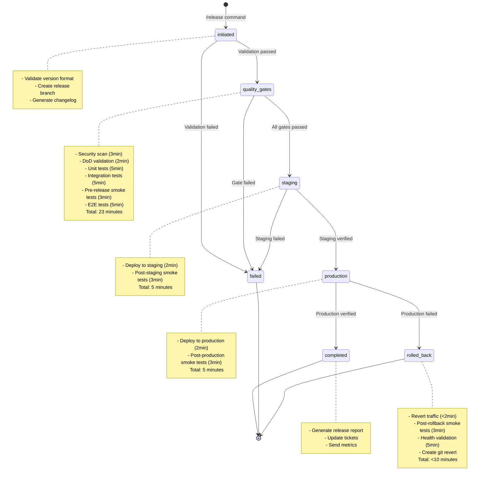
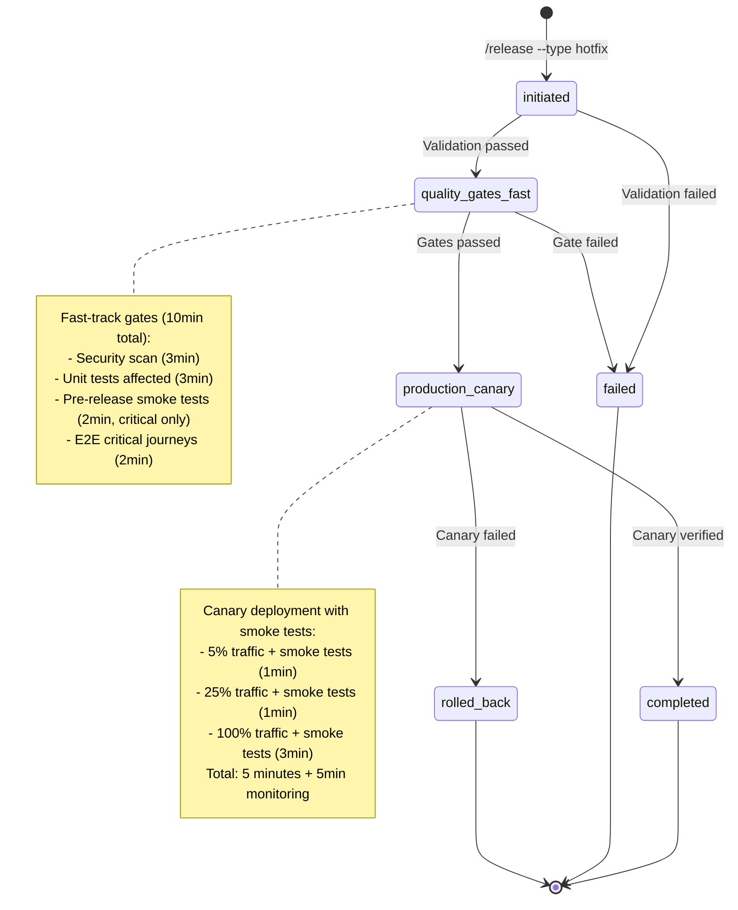
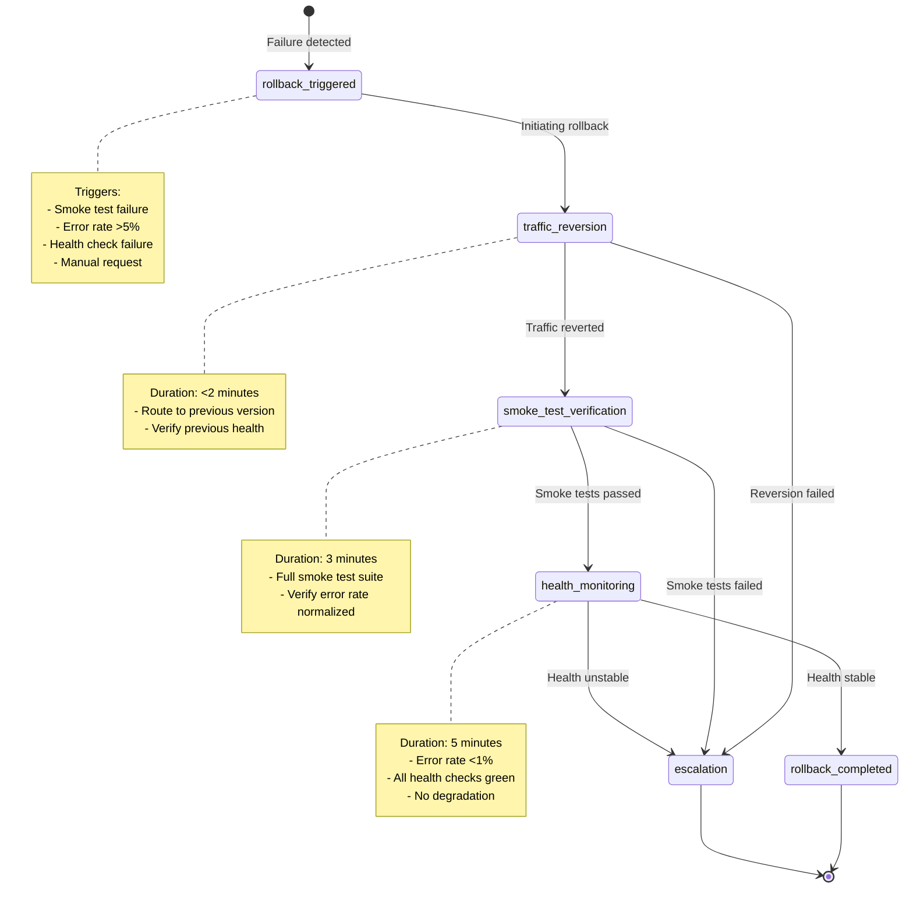

# Release Workflow State Machine

**Version**: 1.0.0
**Last Updated**: 2025-11-05
**Status**: Draft

## Overview

This document defines the state machine for the release workflow, including all states, transitions, guards, and actions. The state machine ensures safe, predictable progression through the release lifecycle with automated rollback capabilities.

## State Machine Diagram



## Detailed State Definitions

### State: initiated

**Entry Conditions:**
- `/release` command invoked with valid arguments
- User has release permissions

**State Actions:**
1. Validate semantic version format (X.Y.Z)
2. Check for version conflicts (tag/branch exists)
3. Create release branch via git-workflow
4. Generate changelog via changelog-generator skill
5. Initialize release audit log via audit-log-generator skill

**Exit Conditions:**
- **Success → quality_gates**: All validation passed, branch created
- **Failure → failed**: Validation failed, branch creation failed

**Timing:** ≤2 minutes

**Data Captured:**
```yaml
releaseVersion: "X.Y.Z"
releaseType: "standard" | "hotfix" | "rollback"
baseBranch: "main" | "develop" | "production"
targetBranch: "release/vX.Y.Z" | "hotfix/vX.Y.Z"
initiatedBy: "username"
initiatedAt: "ISO timestamp"
changelog: "Markdown formatted changelog"
```

---

### State: quality_gates

**Entry Conditions:**
- Release branch created successfully
- Changelog generated

**State Actions:**
Execute quality gates sequentially with early exit on failure:

1. **Security Scan** (code-reviewer, 3min target)
   - OWASP Top 10 vulnerability scanning
   - Fail on critical or high-severity issues
   - Generate security report

2. **DoD Validation** (code-reviewer, 2min target)
   - Validate all 8 DoD categories
   - Fail on any category failure
   - Generate DoD checklist report

3. **Unit Tests** (test-runner, 5min target)
   - Execute unit test suite
   - Require ≥80% coverage
   - Fail on test failures or coverage below threshold

4. **Integration Tests** (test-runner, 5min target)
   - Execute integration test suite
   - Require ≥70% coverage
   - Fail on test failures or coverage below threshold

5. **Pre-Release Smoke Tests** (smoke-test-runner skill, 3min target)
   - Execute 5-category smoke test suite:
     - API Health
     - Database connectivity
     - External services
     - Authentication
     - Critical paths
   - Fail on any smoke test failure

6. **E2E Tests** (playwright-tester, 5min target)
   - Execute critical user journey tests
   - Capture trace artifacts
   - Fail on any journey failure

**Exit Conditions:**
- **Success → staging**: All gates passed
- **Failure → failed**: Any gate failed, provide failure context

**Timing:** ≤23 minutes (3+2+5+5+3+5)

**Data Captured:**
```yaml
securityScan:
  status: "passed" | "failed"
  criticalIssues: number
  highIssues: number
  executionTime: "duration"
dodValidation:
  status: "passed" | "failed"
  categoriesPassed: number
  categoriesFailed: number
  executionTime: "duration"
unitTests:
  status: "passed" | "failed"
  coverage: number
  totalTests: number
  failedTests: number
  executionTime: "duration"
integrationTests:
  status: "passed" | "failed"
  coverage: number
  totalTests: number
  failedTests: number
  executionTime: "duration"
preReleaseSmokeTests:
  status: "passed" | "failed"
  categoriesPassed: number
  categoriesFailed: number
  executionTime: "duration"
e2eTests:
  status: "passed" | "failed"
  journeysPassed: number
  journeysFailed: number
  executionTime: "duration"
```

---

### State: staging

**Entry Conditions:**
- All quality gates passed
- Staging environment available

**State Actions:**
1. **Deploy to Staging** (deployment-orchestrator, 2min target)
   - Execute blue-green or rolling deployment
   - Verify health checks
   - Route traffic to new version

2. **Post-Staging Smoke Tests** (smoke-test-runner skill, 3min target)
   - Execute full 5-category smoke test suite
   - Use staging-specific configuration
   - Capture smoke test results

**Exit Conditions:**
- **Success → production**: Staging deployment verified, smoke tests passed
- **Failure → failed**: Deployment failed, smoke tests failed, health checks failed

**Timing:** ≤5 minutes (2+3)

**Data Captured:**
```yaml
stagingDeployment:
  status: "passed" | "failed"
  strategy: "blue-green" | "rolling"
  healthChecks: "passing" | "failing"
  deploymentDuration: "duration"
postStagingSmokeTests:
  status: "passed" | "failed"
  categoriesPassed: number
  categoriesFailed: number
  executionTime: "duration"
  failedTests: ["category1", "category2"]
```

---

### State: production

**Entry Conditions:**
- Staging deployment verified
- Post-staging smoke tests passed
- Production environment available

**State Actions:**
1. **Deploy to Production** (deployment-orchestrator, 2min target)
   - Execute canary deployment (5% → 25% → 100%)
   - Verify health checks at each canary stage
   - Execute canary smoke tests at each stage (smoke-test-runner skill)
   - Route traffic progressively

2. **Post-Production Smoke Tests** (smoke-test-runner skill, 3min target)
   - Execute full 5-category smoke test suite
   - Use production-specific configuration
   - Monitor for error rate spikes

**Exit Conditions:**
- **Success → completed**: Production deployment verified, smoke tests passed
- **Failure → rolled_back**: Deployment failed, smoke tests failed, error rate >5%

**Timing:** ≤5 minutes (2+3)

**Monitoring Triggers:**
- Smoke test failure → Automatic rollback
- Error rate >5% for 2 minutes → Automatic rollback
- Health check failure (3 consecutive) → Automatic rollback

**Data Captured:**
```yaml
productionDeployment:
  status: "passed" | "failed"
  strategy: "canary"
  canaryProgression:
    - percentage: 5
      smokeTests: "passed" | "failed"
      healthChecks: "passing" | "failing"
      duration: "duration"
    - percentage: 25
      smokeTests: "passed" | "failed"
      healthChecks: "passing" | "failing"
      duration: "duration"
    - percentage: 100
      smokeTests: "passed" | "failed"
      healthChecks: "passing" | "failing"
      duration: "duration"
  deploymentDuration: "duration"
postProductionSmokeTests:
  status: "passed" | "failed"
  categoriesPassed: number
  categoriesFailed: number
  executionTime: "duration"
  errorRate: number
```

---

### State: completed

**Entry Conditions:**
- Production deployment verified
- Post-production smoke tests passed
- Error rate <1% for 5 minutes

**State Actions:**
1. Generate release report (release-report-generator skill)
2. Append final audit log entry (audit-log-generator skill)
3. Create GitHub release (github-specialist)
4. Update Linear/Jira tickets with release artifacts
5. Send release metrics to manager-dashboard-agent

**Exit Conditions:**
- **Terminal state**: Release workflow complete

**Timing:** ≤3 minutes

**Data Captured:**
```yaml
releaseReport:
  totalDuration: "duration"
  qualityGatesDuration: "duration"
  stagingDuration: "duration"
  productionDuration: "duration"
  testExecutionSummary:
    securityScan: "passed"
    dodValidation: "passed"
    unitTests: "passed (coverage: X%)"
    integrationTests: "passed (coverage: Y%)"
    smokeTests: "passed"
    e2eTests: "passed"
  deploymentSummary:
    staging: "passed"
    production: "passed (canary strategy)"
  releaseUrl: "https://github.com/org/repo/releases/tag/vX.Y.Z"
  prUrl: "https://github.com/org/repo/pull/123"
```

---

### State: failed

**Entry Conditions:**
- Validation failed in initiated state
- Any quality gate failed
- Staging deployment or smoke tests failed

**State Actions:**
1. Capture failure context (which gate/test failed, error details)
2. Append failure audit log entry (audit-log-generator skill)
3. Update Linear/Jira tickets with failure reason
4. Alert release manager with actionable fix suggestions
5. Cleanup: Delete release branch (optional, configurable)

**Exit Conditions:**
- **Terminal state**: Release workflow failed

**Timing:** ≤2 minutes

**Data Captured:**
```yaml
failureContext:
  failedState: "initiated" | "quality_gates" | "staging"
  failedGate: "security-scan" | "dod-validation" | "unit-tests" | etc.
  failureReason: "Detailed error message"
  failureTime: "ISO timestamp"
  actionableFixSuggestions:
    - "Fix suggestion 1"
    - "Fix suggestion 2"
```

---

### State: rolled_back

**Entry Conditions:**
- Production smoke test failure detected
- Error rate >5% for 2 minutes
- Health check failure (3 consecutive checks)
- Manual rollback request

**State Actions:**
1. **Revert Traffic** (deployment-orchestrator, <2min target)
   - Route all traffic to previous version
   - Verify previous version health checks

2. **Post-Rollback Smoke Tests** (smoke-test-runner skill, 3min target)
   - Execute full 5-category smoke test suite
   - Verify error rate normalized
   - Confirm system stability

3. **Health Validation** (5min monitoring)
   - Monitor error rate (<1% target)
   - Verify all health checks passing
   - Confirm no degradation

4. **Create Git Revert** (git-workflow)
   - Create revert commit
   - Tag rollback version
   - Update changelog

5. **Alert & Report**
   - Alert on-call engineer with rollback details
   - Update Linear/Jira tickets with rollback reason
   - Append rollback audit log entry

**Exit Conditions:**
- **Terminal state**: Rollback complete, system stable
- **Escalation**: Post-rollback smoke tests fail → Critical alert

**Timing:** ≤10 minutes (2+3+5)

**Data Captured:**
```yaml
rollbackContext:
  trigger: "smoke-test-failure" | "error-rate-spike" | "health-check-failure" | "manual"
  rollbackReason: "Detailed failure reason"
  rollbackTime: "ISO timestamp"
  trafficReversion:
    status: "completed"
    duration: "duration"
  postRollbackSmokeTests:
    status: "passed" | "failed"
    categoriesPassed: number
    categoriesFailed: number
  healthValidation:
    errorRate: number
    healthChecks: "passing" | "failing"
    stabilizationDuration: "duration"
  gitRevert:
    revertCommit: "commit-sha"
    revertTag: "vX.Y.Z-rollback"
```

---

## State Transition Guards

### initiated → quality_gates
```yaml
guards:
  - versionFormatValid: "Semantic version X.Y.Z"
  - branchCreated: "Release branch exists"
  - changelogGenerated: "Changelog created"
  - noVersionConflict: "Tag/branch doesn't exist"
```

### quality_gates → staging
```yaml
guards:
  - securityScanPassed: "No critical/high severity issues"
  - dodValidationPassed: "All 8 categories pass"
  - unitTestsPassed: "≥80% coverage, 0 failures"
  - integrationTestsPassed: "≥70% coverage, 0 failures"
  - preReleaseSmokeTestsPassed: "All 5 categories pass"
  - e2eTestsPassed: "All journeys pass"
```

### staging → production
```yaml
guards:
  - stagingDeploymentSuccessful: "Deployment completed"
  - stagingHealthChecksPassing: "All health checks green"
  - postStagingSmokeTestsPassed: "All 5 categories pass"
  - stagingErrorRateNormal: "Error rate <1%"
```

### production → completed
```yaml
guards:
  - productionDeploymentSuccessful: "Canary progression completed"
  - productionHealthChecksPassing: "All health checks green"
  - postProductionSmokeTestsPassed: "All 5 categories pass"
  - productionErrorRateNormal: "Error rate <1% for 5 minutes"
```

### production → rolled_back
```yaml
triggers:
  - smokeTestFailed: "Any post-production smoke test failed"
  - errorRateSpike: "Error rate >5% for 2 minutes"
  - healthCheckFailure: "3 consecutive health check failures"
  - manualRollback: "On-call engineer initiated rollback"
```

---

## Hotfix Workflow Variant

For hotfix releases, the state machine is modified for faster progression:



**Hotfix State Modifications:**
- **quality_gates_fast**: Reduced gates (10min vs 23min standard)
- **production_canary**: Direct to production with canary strategy (skips staging)
- **Approval bypass**: P0/P1 incidents bypass approval workflow
- **Post-deployment review**: Mandatory review within 24h of hotfix

---

## Rollback Workflow Detail



---

## Timing Summary

| State | Target Duration | P95 | Timeout |
|-------|----------------|-----|---------|
| initiated | 2min | 3min | 5min |
| quality_gates (standard) | 23min | 28min | 35min |
| quality_gates (hotfix) | 10min | 12min | 15min |
| staging | 5min | 7min | 10min |
| production | 5min | 7min | 10min |
| completed | 3min | 4min | 5min |
| rolled_back | 10min | 12min | 15min |

**Total Standard Release**: 33 minutes (target), 42 minutes (P95)
**Total Hotfix Release**: 20 minutes (target), 25 minutes (P95)
**Total Rollback**: 10 minutes (target), 12 minutes (P95)

---

## Error Handling & Recovery

### Transient Failures
- **Network errors**: Retry with exponential backoff (max 3 attempts)
- **API rate limits**: Wait and retry
- **Health check flakiness**: Require 3 consecutive failures

### Permanent Failures
- **Security scan failure**: Block release, provide fix suggestions
- **Test failures**: Block release, provide intelligent triage
- **Deployment failure**: Rollback, escalate to on-call

### Rollback Failures
- **Traffic reversion failure**: Critical alert, manual intervention required
- **Post-rollback smoke test failure**: Critical alert, escalate to on-call + tech lead
- **Health check failure post-rollback**: Emergency page, war room

---

**Document Version**: 1.0.0
**Last Review**: 2025-11-05
**Next Review**: 2025-12-05 (Monthly)