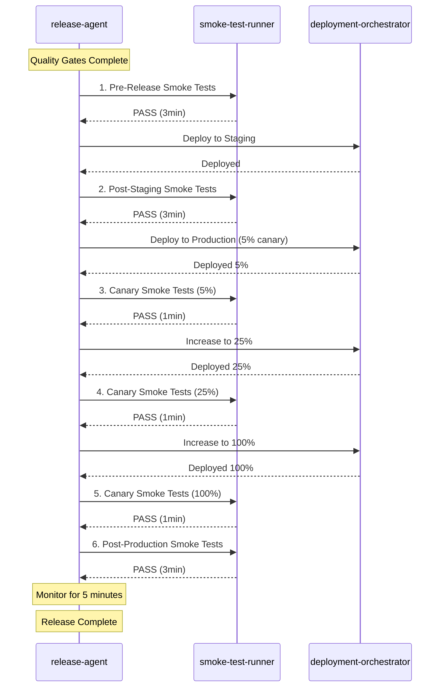
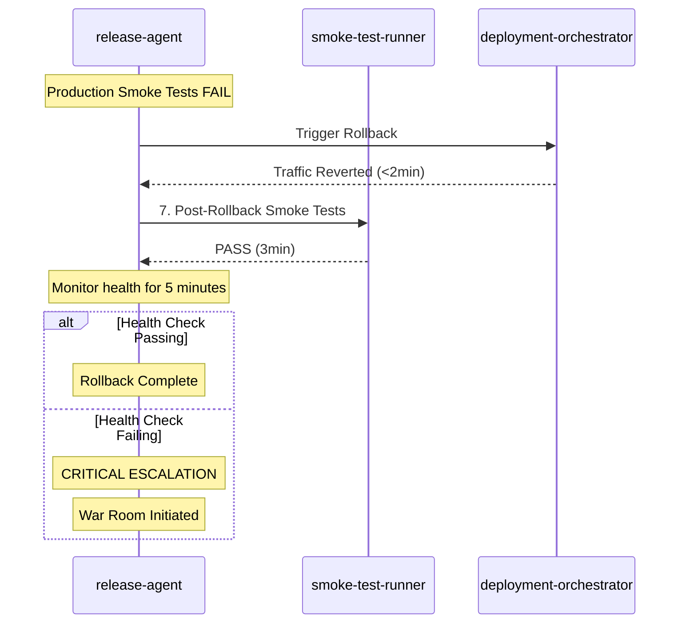

# Smoke Test Execution Matrix

**Version**: 1.0.0
**Last Updated**: 2025-11-05
**Status**: Draft

## Overview

This document defines the execution points for smoke tests throughout the release workflow, mapping each execution point to release workflow states, timing budgets, and skill invocation patterns.

## Execution Points Summary

| Execution Point | Release Phase | Environment | Scope | Timing | Purpose |
|----------------|---------------|-------------|-------|--------|---------|
| 1. Pre-Release | Quality Gates | pre-release | Full (5 categories) | 3min | Validate release readiness |
| 2. Post-Staging | Staging | staging | Full (5 categories) | 3min | Verify staging deployment |
| 3. Canary (5%) | Production | canary | Reduced (critical only) | 1min | Progressive rollout validation |
| 4. Canary (25%) | Production | canary | Reduced (critical only) | 1min | Progressive rollout validation |
| 5. Canary (100%) | Production | canary | Reduced (critical only) | 1min | Progressive rollout validation |
| 6. Post-Production | Production | production | Full (5 categories) | 3min | Final production verification |
| 7. Post-Rollback | Rollback | production | Full (5 categories) | 3min | Verify rollback success |

**Total Smoke Test Time (Standard Release)**: 9 minutes (3min pre-release + 3min staging + 3min production)

**Total Smoke Test Time (Hotfix Release)**: 8 minutes (2min pre-release + 3min canary + 3min post-production)

## Execution Point 1: Pre-Release Smoke Tests

### Context

**When**: After all quality gates pass (security, DoD, unit, integration, E2E), before staging deployment

**Release Workflow State**: quality_gates → staging transition

**Purpose**: Final validation of release readiness before any deployment occurs

### Configuration

```yaml
executionPoint: pre-release
environment: pre-release
baseUrl: https://localhost:3000
database: app_test
scope: full
categories:
  - api-health
  - database
  - external-services
  - authentication
  - critical-paths
timingBudget:
  target: 180s (3min)
  timeout: 360s (6min)
```

### Skill Invocation

```javascript
// From release-agent in quality_gates state
const preReleaseResult = await Skill('smoke-test-runner', {
  executionPoint: 'pre-release',
  environment: 'pre-release',
  scope: 'full',
  configPath: 'skills/smoke-test-runner/templates/smoke-test-config.yaml'
});

if (!preReleaseResult.passed) {
  transitionToState('failed');
  reportFailure({
    failedGate: 'pre-release-smoke-tests',
    failedCategory: preReleaseResult.failedCategory,
    reason: preReleaseResult.results
  });
}
```

### Pass Criteria

✅ All 5 categories pass
✅ Execution time ≤3min
✅ No timeouts or exceptions
✅ All environment-specific checks pass

### Failure Handling

❌ Block release workflow
❌ Transition to `failed` state
❌ Provide detailed failure context (category, test, error)
❌ Suggest fixes based on failed category

---

## Execution Point 2: Post-Staging Smoke Tests

### Context

**When**: After successful staging deployment, before production deployment

**Release Workflow State**: staging (after deployment completes)

**Purpose**: Verify staging deployment was successful and system is functioning correctly

### Configuration

```yaml
executionPoint: post-staging
environment: staging
baseUrl: https://staging.example.com
database: app_staging
scope: full
categories:
  - api-health
  - database
  - external-services
  - authentication
  - critical-paths
timingBudget:
  target: 180s (3min)
  timeout: 360s (6min)
```

### Skill Invocation

```javascript
// From release-agent in staging state, after deployment
const postStagingResult = await Skill('smoke-test-runner', {
  executionPoint: 'post-staging',
  environment: 'staging',
  scope: 'full',
  configPath: 'skills/smoke-test-runner/templates/smoke-test-config.yaml'
});

if (!postStagingResult.passed) {
  transitionToState('failed');
  reportFailure({
    failedGate: 'post-staging-smoke-tests',
    failedCategory: postStagingResult.failedCategory,
    reason: 'Staging deployment verification failed'
  });
}
```

### Pass Criteria

✅ All 5 categories pass
✅ Execution time ≤3min
✅ Staging-specific configuration validated
✅ No deployment-related issues detected

### Failure Handling

❌ Block production deployment
❌ Transition to `failed` state
❌ Rollback staging deployment (optional)
❌ Provide detailed failure context with staging-specific logs

---

## Execution Point 3: Canary Smoke Tests (5% Traffic)

### Context

**When**: After deploying to 5% canary infrastructure, before increasing traffic to 25%

**Release Workflow State**: production (canary deployment phase)

**Purpose**: Validate canary deployment is functioning correctly before increasing traffic

### Configuration

```yaml
executionPoint: canary-5
environment: canary
baseUrl: https://canary.example.com
database: app_production
scope: reduced  # Critical paths only
categories:
  - api-health (reduced: /health, /api/auth only)
  - database (reduced: connection pool only)
  - external-services (reduced: payment gateway only)
  - authentication (reduced: login/logout only)
  - critical-paths (reduced: 2 journeys only)
timingBudget:
  target: 60s (1min)
  timeout: 120s (2min)
```

### Skill Invocation

```javascript
// From release-agent in production state, canary 5%
const canary5Result = await Skill('smoke-test-runner', {
  executionPoint: 'canary-5',
  environment: 'canary',
  scope: 'reduced',
  criticalPathsOnly: true,
  configPath: 'skills/smoke-test-runner/templates/smoke-test-config.yaml'
});

if (!canary5Result.passed) {
  triggerRollback({
    reason: 'Canary 5% smoke tests failed',
    failedCategory: canary5Result.failedCategory
  });
}
```

### Pass Criteria

✅ Reduced scope tests pass
✅ Execution time ≤1min
✅ Canary infrastructure healthy
✅ 5% traffic functioning correctly

### Failure Handling

❌ **Trigger automated rollback**
❌ Transition to `rolled_back` state
❌ Alert on-call engineer
❌ Provide canary-specific failure context

---

## Execution Point 4: Canary Smoke Tests (25% Traffic)

### Context

**When**: After increasing traffic to 25%, before increasing to 100%

**Release Workflow State**: production (canary deployment phase)

**Purpose**: Validate 25% traffic is functioning correctly before full rollout

### Configuration

```yaml
executionPoint: canary-25
environment: canary
baseUrl: https://canary.example.com
database: app_production
scope: reduced  # Critical paths only
categories:
  - api-health (reduced)
  - database (reduced)
  - external-services (reduced)
  - authentication (reduced)
  - critical-paths (reduced: 2 journeys)
timingBudget:
  target: 60s (1min)
  timeout: 120s (2min)
```

### Skill Invocation

```javascript
// From release-agent in production state, canary 25%
const canary25Result = await Skill('smoke-test-runner', {
  executionPoint: 'canary-25',
  environment: 'canary',
  scope: 'reduced',
  criticalPathsOnly: true,
  configPath: 'skills/smoke-test-runner/templates/smoke-test-config.yaml'
});

if (!canary25Result.passed) {
  triggerRollback({
    reason: 'Canary 25% smoke tests failed',
    failedCategory: canary25Result.failedCategory
  });
}
```

### Pass Criteria

✅ Reduced scope tests pass
✅ Execution time ≤1min
✅ 25% traffic functioning correctly
✅ No error rate spike detected

### Failure Handling

❌ **Trigger automated rollback**
❌ Transition to `rolled_back` state
❌ Alert on-call engineer
❌ Provide 25% canary failure context

---

## Execution Point 5: Canary Smoke Tests (100% Traffic)

### Context

**When**: After routing 100% traffic to new version, before declaring production deployment complete

**Release Workflow State**: production (canary deployment phase, final stage)

**Purpose**: Validate full traffic is functioning correctly before completion

### Configuration

```yaml
executionPoint: canary-100
environment: canary
baseUrl: https://canary.example.com
database: app_production
scope: reduced  # Critical paths only
categories:
  - api-health (reduced)
  - database (reduced)
  - external-services (reduced)
  - authentication (reduced)
  - critical-paths (reduced: 2 journeys)
timingBudget:
  target: 60s (1min)
  timeout: 120s (2min)
```

### Skill Invocation

```javascript
// From release-agent in production state, canary 100%
const canary100Result = await Skill('smoke-test-runner', {
  executionPoint: 'canary-100',
  environment: 'canary',
  scope: 'reduced',
  criticalPathsOnly: true,
  configPath: 'skills/smoke-test-runner/templates/smoke-test-config.yaml'
});

if (!canary100Result.passed) {
  triggerRollback({
    reason: 'Canary 100% smoke tests failed',
    failedCategory: canary100Result.failedCategory
  });
}
```

### Pass Criteria

✅ Reduced scope tests pass
✅ Execution time ≤1min
✅ 100% traffic functioning correctly
✅ Error rate <1%

### Failure Handling

❌ **Trigger automated rollback**
❌ Transition to `rolled_back` state
❌ Alert on-call engineer
❌ Provide 100% canary failure context

---

## Execution Point 6: Post-Production Smoke Tests

### Context

**When**: After 100% production deployment complete, before monitoring period

**Release Workflow State**: production (after canary deployment completes)

**Purpose**: Final comprehensive verification of production deployment success

### Configuration

```yaml
executionPoint: post-production
environment: production
baseUrl: https://api.example.com
database: app_production
scope: full
categories:
  - api-health
  - database
  - external-services
  - authentication
  - critical-paths
timingBudget:
  target: 180s (3min)
  timeout: 360s (6min)
monitoringPeriod: 300s (5min)
```

### Skill Invocation

```javascript
// From release-agent in production state, after 100% deployment
const postProductionResult = await Skill('smoke-test-runner', {
  executionPoint: 'post-production',
  environment: 'production',
  scope: 'full',
  configPath: 'skills/smoke-test-runner/templates/smoke-test-config.yaml'
});

if (!postProductionResult.passed) {
  triggerRollback({
    reason: 'Post-production smoke tests failed',
    failedCategory: postProductionResult.failedCategory
  });
}

// Monitor error rate for 5 minutes after smoke tests pass
const monitoringResult = await monitorProductionHealth(300);
if (monitoringResult.errorRate > 0.01) {  // >1% error rate
  triggerRollback({
    reason: 'Production error rate spike detected',
    errorRate: monitoringResult.errorRate
  });
}
```

### Pass Criteria

✅ All 5 categories pass
✅ Execution time ≤3min
✅ Production-specific configuration validated
✅ Error rate <1% for 5 minutes after tests

### Failure Handling

❌ **Trigger automated rollback**
❌ Transition to `rolled_back` state
❌ Alert on-call engineer
❌ Provide production-specific failure context

---

## Execution Point 7: Post-Rollback Smoke Tests

### Context

**When**: After traffic reversion during rollback, before declaring rollback complete

**Release Workflow State**: rolled_back (after traffic reversion)

**Purpose**: Verify rollback was successful and system is stable

### Configuration

```yaml
executionPoint: post-rollback
environment: production
baseUrl: https://api.example.com
database: app_production
scope: full
categories:
  - api-health
  - database
  - external-services
  - authentication
  - critical-paths
timingBudget:
  target: 180s (3min)
  timeout: 360s (6min)
healthMonitoring: 300s (5min)
```

### Skill Invocation

```javascript
// From release-agent in rolled_back state, after traffic reversion
const postRollbackResult = await Skill('smoke-test-runner', {
  executionPoint: 'post-rollback',
  environment: 'production',
  scope: 'full',
  configPath: 'skills/smoke-test-runner/templates/smoke-test-config.yaml'
});

if (!postRollbackResult.passed) {
  // CRITICAL: Rollback smoke tests failed
  escalate({
    severity: 'critical',
    reason: 'Post-rollback smoke tests failed',
    failedCategory: postRollbackResult.failedCategory,
    action: 'Manual intervention required, war room initiated'
  });
}

// Monitor health for 5 minutes after rollback smoke tests pass
const healthResult = await monitorProductionHealth(300);
if (healthResult.errorRate > 0.01) {  // >1% error rate
  escalate({
    severity: 'high',
    reason: 'Error rate not normalized after rollback',
    errorRate: healthResult.errorRate
  });
}
```

### Pass Criteria

✅ All 5 categories pass
✅ Execution time ≤3min
✅ Error rate normalized (<1%)
✅ Health checks passing for 5 minutes

### Failure Handling

❌ **Critical escalation** (smoke tests failed post-rollback)
❌ War room initiated
❌ Manual intervention required
❌ On-call engineer + tech lead paged

---

## Execution Point Workflow Diagrams

### Standard Release Flow



### Rollback Flow



---

## Timing Budget Allocation

### Standard Release
```
Pre-Release Smoke Tests:     3min
Post-Staging Smoke Tests:    3min
Canary 5% Smoke Tests:       1min
Canary 25% Smoke Tests:      1min
Canary 100% Smoke Tests:     1min
Post-Production Smoke Tests: 3min
─────────────────────────────────
Total Smoke Test Time:       12min
```

### Hotfix Release
```
Pre-Release Smoke Tests (reduced): 2min
Canary 5% Smoke Tests:             1min
Canary 25% Smoke Tests:            1min
Canary 100% Smoke Tests:           1min
Post-Production Smoke Tests:       3min
─────────────────────────────────────
Total Smoke Test Time:             8min
```

### Rollback
```
Post-Rollback Smoke Tests: 3min
Health Monitoring:         5min
─────────────────────────────────
Total Rollback Time:       8min (additional to existing)
```

---

## Environment-Specific Configurations

### Pre-Release Environment
```yaml
baseUrl: https://localhost:3000
database: app_test
externalServices: mock  # Use mocked services
timeout: 5000ms
criticalPathsOnly: false
```

### Staging Environment
```yaml
baseUrl: https://staging.example.com
database: app_staging
externalServices: staging  # Staging-specific services
timeout: 5000ms
criticalPathsOnly: false
```

### Canary Environment
```yaml
baseUrl: https://canary.example.com
database: app_production  # Production database
externalServices: production  # Production services
timeout: 2000ms  # Stricter timeout
criticalPathsOnly: true  # Reduced scope
```

### Production Environment
```yaml
baseUrl: https://api.example.com
database: app_production
externalServices: production
timeout: 3000ms
criticalPathsOnly: false
```

---

## Success Metrics

| Execution Point | Target Pass Rate | Detection Rate | False Positive Rate |
|-----------------|------------------|----------------|---------------------|
| Pre-Release | ≥99% | ≥85% | ≤1% |
| Post-Staging | ≥99% | ≥90% | ≤1% |
| Canary (all stages) | ≥99% | ≥95% | ≤1% |
| Post-Production | ≥99% | ≥95% | ≤1% |
| Post-Rollback | 100% | 100% | 0% |

**Overall Smoke Test Effectiveness**: ≥90% of deployment issues caught before impacting customers

---

**Document Version**: 1.0.0
**Last Review**: 2025-11-05
**Next Review**: 2025-12-05 (Monthly)